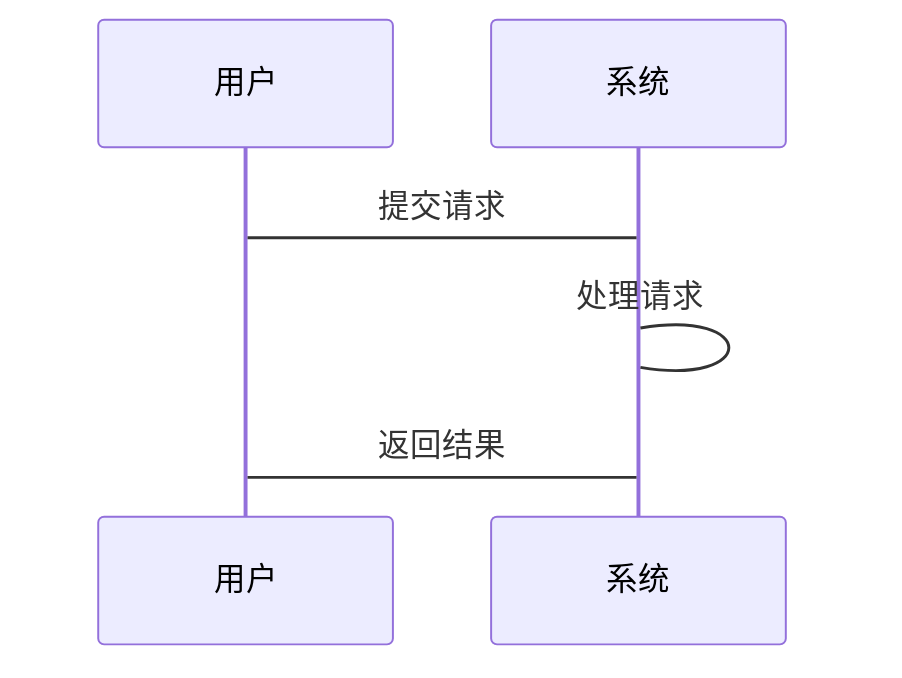

                 


# 《金融产品客户终身价值预测模型》

## 关键词：金融产品，客户终身价值，预测模型，机器学习，数据挖掘

## 摘要：本文将详细探讨如何构建一个金融产品客户终身价值预测模型，通过分析客户行为数据和市场数据，结合机器学习算法，实现对客户未来价值的精准预测。文章从模型背景、核心概念、算法原理、系统架构到项目实战，全面解析模型构建的全过程。

---

# 第1章: 金融客户终身价值预测的背景与基础

## 1.1 什么是客户终身价值

### 1.1.1 客户终身价值的定义
客户终身价值（Customer Lifetime Value，简称CLV或LTV）是指客户在未来生命周期内为企业带来的总收入减去相关成本的净现值。在金融行业，CLV的预测对于制定客户管理策略、优化资源配置具有重要意义。

### 1.1.2 金融行业中的客户终身价值
金融行业的产品具有高价值、长周期的特点，客户的选择和行为受到经济环境、个人财务状况等多种因素的影响。通过预测客户终身价值，金融机构可以更好地进行客户细分、产品推荐和风险管理。

### 1.1.3 客户终身价值预测的意义
- **精准营销**：识别高价值客户，制定个性化服务策略。
- **风险控制**：预测客户流失风险，提前采取挽留措施。
- **资源优化**：合理分配营销资源，提升投资回报率。

## 1.2 金融产品与客户关系管理

### 1.2.1 金融产品的基本类型
- **存款类产品**：活期存款、定期存款等。
- **贷款类产品**：个人贷款、企业贷款、信用卡贷款等。
- **投资类产品**：基金、股票、债券等。

### 1.2.2 客户关系管理的核心目标
- **提升客户满意度**：通过优质服务增强客户忠诚度。
- **提高客户活跃度**：鼓励客户频繁使用产品，增加交易频率。
- **降低客户流失率**：通过预测和干预减少客户流失。

### 1.2.3 金融产品客户生命周期的阶段划分
- **获取阶段**：新客户加入，初期接触和试用。
- **成长阶段**：客户逐渐增加产品使用频率，价值开始提升。
- **成熟阶段**：客户成为核心客户，贡献最大价值。
- **衰退阶段**：客户价值下降，可能流失。

## 1.3 数据驱动的客户价值分析

### 1.3.1 数据在金融客户分析中的作用
金融行业数据具有高价值性、多样性、实时性强的特点。通过分析客户的历史交易数据、行为数据、 demographic data（人口统计数据）等，可以挖掘客户的潜在价值。

### 1.3.2 数据采集与处理的基本流程
1. 数据采集：通过CRM系统、交易系统等渠道获取客户数据。
2. 数据清洗：去除重复数据、处理缺失值、剔除异常值。
3. 数据转换：将数据转换为适合建模的格式，如数值化处理。
4. 数据存储：将处理后的数据存储到数据库中，便于后续分析。

### 1.3.3 数据安全与隐私保护
金融数据涉及客户隐私，必须严格遵守相关法律法规，确保数据的安全存储和传输。常见的数据保护措施包括加密技术、访问控制、数据脱敏等。

---

# 第2章: 客户终身价值预测的核心概念与联系

## 2.1 客户终身价值预测的原理

### 2.1.1 生命周期价值模型
生命周期价值模型（Customer Lifetime Value Model）通过预测客户在生命周期内为企业带来的总收入和成本，计算客户的价值。其基本公式为：
$$ CLV = \frac{R - C}{1 - \delta} $$
其中，R为客户的年收入，C为客户的年成本，δ为客户生命周期的贴现率。

### 2.1.2 购买行为预测模型
购买行为预测模型用于预测客户在未来一段时间内购买某种金融产品的概率。常用的模型包括逻辑回归、随机森林等。

### 2.1.3 客户流失预测模型
客户流失预测模型通过分析客户的行为特征，预测客户在未来可能流失的概率。常用的方法包括生存分析、XGBoost等。

## 2.2 核心概念的ER实体关系图

```mermaid
er
    customer(CUSTOMER_ID, NAME, GENDER, AGE, INCOME)
    product(PRODUCT_ID, PRODUCT_NAME, PRODUCT_TYPE)
    transaction(TRANSACTION_ID, CUSTOMER_ID, PRODUCT_ID, AMOUNT, DATE)
    churn_prediction(CHURN_PREDICTION_ID, CUSTOMER_ID, PREDICTION_DATE, CHURN_PREDICT)
```

## 2.3 核心概念的属性特征对比

| 概念 | 属性 | 特征 |
|------|------|------|
| 生命周期价值 | 时间范围 | 长期预测 |
| 购买行为 | 频率 | 高频/低频 |
| 流失风险 | 指标 | Churn概率 |

---

# 第3章: 客户终身价值预测的算法原理

## 3.1 线性回归模型

### 3.1.1 线性回归的基本原理
线性回归是一种统计学方法，用于建立自变量和因变量之间的线性关系。在客户终身价值预测中，可以通过线性回归模型预测客户在未来一段时间内的收入或成本。

### 3.1.2 线性回归的数学模型
线性回归的数学模型可以表示为：
$$ y = \beta_0 + \beta_1x_1 + \beta_2x_2 + ... + \beta_nx_n + \epsilon $$
其中，$\beta_0$是截距，$\beta_i$是回归系数，$x_i$是自变量，$\epsilon$是误差项。

### 3.1.3 线性回归的应用场景
- 数据呈现线性关系
- 变量数量较少
- 模型解释性要求较高

## 3.2 随机森林模型

### 3.2.1 随机森林的基本原理
随机森林是一种基于树的集成学习方法，通过构建多棵决策树并进行投票或平均，提高模型的准确性和稳定性。

### 3.2.2 随机森林的数学模型
随机森林的数学模型可以表示为：
$$ y = \text{median}(\{f_i(x)\}_{i=1}^n) $$
其中，$f_i(x)$是第$i$棵决策树的预测结果，median是中位数。

### 3.2.3 随机森林的应用场景
- 数据呈现非线性关系
- 变量数量较多
- 模型的准确率要求较高

---

# 第4章: 客户终身价值预测的系统架构设计

## 4.1 项目介绍

### 4.1.1 项目目标
通过构建客户终身价值预测模型，帮助金融机构实现精准营销和风险管理。

### 4.1.2 项目范围
- 数据采集与处理
- 模型训练与优化
- 结果分析与应用

## 4.2 系统功能设计

### 4.2.1 数据处理模块
- 数据清洗
- 数据转换
- 数据存储

### 4.2.2 模型训练模块
- 数据预处理
- 模型训练
- 模型评估

### 4.2.3 结果分析模块
- 结果可视化
- 结果解读
- 模型优化

## 4.3 系统架构设计

### 4.3.1 数据层
- 数据源：CRM系统、交易系统等。
- 数据存储：数据库、数据仓库。

### 4.3.2 服务层
- 数据处理服务
- 模型训练服务
- 结果分析服务

### 4.3.3 接口层
- API接口
- 用户界面

## 4.4 系统接口设计

### 4.4.1 数据接口
- 数据输入接口
- 数据输出接口

### 4.4.2 模型接口
- 模型训练接口
- 模型预测接口

## 4.5 系统交互设计

### 4.5.1 用户与系统的交互流程
1. 用户提交请求
2. 系统接收请求
3. 系统处理请求
4. 系统返回结果

### 4.5.2 交互流程图



---

# 第5章: 客户终身价值预测的项目实战

## 5.1 环境安装

### 5.1.1 安装Python
```bash
# 安装Python
sudo apt-get install python3 python3-pip
```

### 5.1.2 安装依赖库
```bash
pip install numpy pandas scikit-learn matplotlib
```

## 5.2 系统核心实现源代码

### 5.2.1 数据预处理代码
```python
import pandas as pd
import numpy as np

# 加载数据
data = pd.read_csv('customer.csv')

# 处理缺失值
data = data.dropna()

# 数据转换
data['AGE'] = data['AGE'].astype(int)
```

### 5.2.2 模型训练代码
```python
from sklearn.model_selection import train_test_split
from sklearn.ensemble import RandomForestRegressor
from sklearn.metrics import mean_squared_error

# 分割数据
X = data[['INCOME', 'AGE', 'GENDER']]
y = data['CLV']

X_train, X_test, y_train, y_test = train_test_split(X, y, test_size=0.2, random_state=42)

# 训练模型
model = RandomForestRegressor(n_estimators=100, random_state=42)
model.fit(X_train, y_train)

# 评估模型
y_pred = model.predict(X_test)
print('均方误差:', mean_squared_error(y_test, y_pred))
```

### 5.2.3 结果分析代码
```python
import matplotlib.pyplot as plt

# 可视化结果
plt.scatter(y_test, y_pred)
plt.xlabel('真实值')
plt.ylabel('预测值')
plt.title('随机森林回归结果')
plt.show()
```

## 5.3 项目小结

### 5.3.1 项目总结
通过本项目，我们成功构建了一个客户终身价值预测模型，能够帮助金融机构实现精准营销和风险管理。

### 5.3.2 注意事项
- 数据质量：确保数据的完整性和准确性。
- 模型选择：根据具体场景选择合适的模型。
- 模型部署：确保模型在生产环境中的稳定运行。

---

# 第6章: 总结与展望

## 6.1 总结

### 6.1.1 核心知识点回顾
- 客户终身价值的定义与计算
- 机器学习算法在客户价值预测中的应用
- 系统架构设计与实现

## 6.2 未来研究方向

### 6.2.1 模型优化
- 引入深度学习模型，如LSTM、Transformer等。
- 结合时间序列分析，提升模型的预测精度。

### 6.2.2 动态预测
- 实时更新模型参数，提升预测的及时性。
- 结合市场动态，动态调整预测结果。

### 6.2.3 可解释性增强
- 提升模型的可解释性，帮助业务人员更好地理解预测结果。

---

# 结语

通过本文的详细讲解，读者可以全面了解客户终身价值预测模型的构建过程。从数据采集到模型训练，从系统设计到项目实战，每一步都至关重要。未来，随着人工智能技术的不断发展，客户价值预测模型将更加精准和智能，为金融行业的数字化转型提供更有力的支持。

