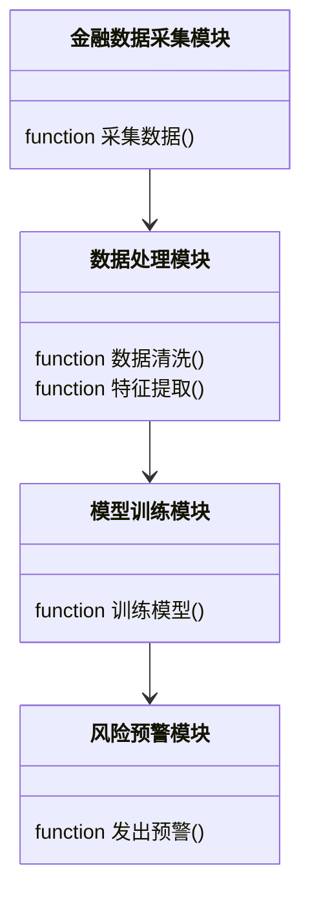
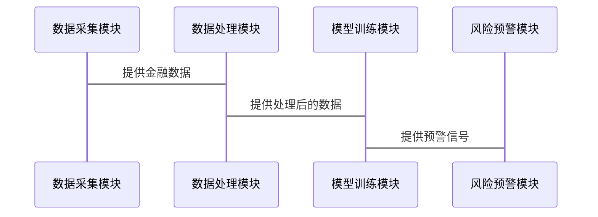

                 


# 金融危机预警系统

> 关键词：金融危机预警系统, 金融风险管理, 数据驱动, 系统架构, 预警算法, 金融数据分析, 系统设计

> 摘要：本文详细探讨了基于数据驱动的金融危机预警系统的构建方法，从理论分析到系统架构设计，再到算法实现，全面阐述了如何通过技术手段实现对金融危机的早期预警。文章内容涵盖金融数据分析、预警算法、系统架构设计、项目实战等多个方面，结合实际案例分析，帮助读者深入理解金融危机预警系统的核心原理与实现方法。

---

# 第一部分: 金融危机预警系统的背景与概念

## 第1章: 金融危机的基本概念

### 1.1 金融危机的定义与表现形式

#### 1.1.1 金融危机的定义
金融危机是指由于金融体系中的系统性风险积累到一定程度，导致金融市场发生剧烈波动甚至崩溃的事件。它通常表现为股市崩盘、银行倒闭、货币贬值、企业违约等现象。

#### 1.1.2 金融危机的主要表现形式
金融危机的表现形式多种多样，主要包括：
1. 股票市场崩盘：股市指数急剧下跌，投资者恐慌性抛售。
2. 银行体系危机：银行出现大量不良资产，导致信用危机。
3. 货币危机：货币贬值、资本外逃、外汇储备枯竭。
4. 企业违约潮：企业无法偿还债务，导致连锁反应。
5. 市场流动性枯竭：金融市场的交易量急剧下降，流动性不足。

#### 1.1.3 金融危机的分类与特征
金融危机可以分为系统性风险和非系统性风险两大类：
- **系统性风险**：影响整个金融系统的风险，如经济衰退、货币危机等。
- **非系统性风险**：影响单一机构或市场的风险，如企业违约、个别银行倒闭等。

金融危机的特征包括：
1. **传染性**：风险从一个市场或机构迅速扩散到整个金融系统。
2. **突发性**：金融危机往往在短时间内迅速恶化。
3. **不可逆性**：一旦发生金融危机，往往需要很长时间才能恢复。

### 1.2 金融危机的形成机制

#### 1.2.1 金融危机的多因素分析
金融危机的形成通常是由多种因素共同作用的结果，主要包括：
1. **过度杠杆**：金融机构通过高杠杆操作放大收益，同时也放大了风险。
2. **监管不足**：监管机构对金融机构的监管力度不够，导致市场参与者行为失控。
3. **市场泡沫**：资产价格远高于其实际价值，泡沫破裂后引发危机。
4. **外部冲击**：如经济衰退、自然灾害、战争等外部事件引发金融危机。

#### 1.2.2 系统性风险与非系统性风险
- **系统性风险**：影响整个金融系统的风险，如经济衰退、货币危机等。
- **非系统性风险**：影响单一机构或市场的风险，如企业违约、个别银行倒闭等。

#### 1.2.3 金融危机的传播路径
金融危机的传播路径主要包括：
1. **直接传播**：风险从一家金融机构直接传导到另一家金融机构。
2. **间接传播**：通过市场、投资者行为等间接传导。
3. **市场情绪传播**：市场参与者的情绪波动导致风险扩散。

### 1.3 金融危机预警的重要性

#### 1.3.1 预警系统在金融风险管理中的作用
金融危机预警系统能够帮助我们提前发现潜在风险，采取措施进行干预，从而避免或减轻金融危机的影响。

#### 1.3.2 预警系统对经济稳定的意义
通过预警系统，可以及时发现金融市场的异常波动，为政策制定者和市场参与者提供决策支持，维护经济稳定。

#### 1.3.3 预警系统的社会价值与挑战
预警系统的社会价值体现在：
1. **保护投资者利益**：通过预警系统，投资者可以及时了解市场风险，做出合理投资决策。
2. **维护金融体系稳定**：预警系统能够帮助监管机构及时发现和处理潜在风险，维护金融体系的稳定。
3. **促进经济发展**：通过预警系统，可以避免金融危机的发生，促进经济的健康发展。

### 1.3.4 预警系统的挑战
金融危机预警系统的建设面临以下挑战：
1. **数据获取难度**：需要获取高质量的金融数据，但数据可能存在缺失、噪声等问题。
2. **模型准确性**：预警模型的准确性直接影响预警效果，如何提高模型的准确性是一个难点。
3. **实时性要求**：金融危机往往具有突发性，预警系统需要具备较高的实时性，才能及时发出预警信号。

---

## 第2章: 金融危机预警系统的核心概念

### 2.1 金融危机预警系统的定义与目标

#### 2.1.1 预警系统的定义
金融危机预警系统是一种利用金融数据分析和预警算法，对金融市场中的潜在风险进行监测和预警的系统。

#### 2.1.2 预警系统的功能目标
金融危机预警系统的主要功能目标包括：
1. **实时监测**：对金融市场中的各项指标进行实时监测，发现异常波动。
2. **风险评估**：通过分析历史数据和当前数据，评估潜在风险。
3. **预警发布**：当发现潜在风险时，及时发出预警信号。
4. **决策支持**：为政策制定者和市场参与者提供决策支持。

#### 2.1.3 预警系统的边界与外延
预警系统的边界包括：
1. **数据范围**：系统监测的金融数据范围。
2. **预警范围**：系统能够预警的金融风险类型。
3. **决策范围**：系统能够支持的决策类型。

预警系统的外延包括：
1. **数据来源**：如股市数据、银行数据、经济指标等。
2. **预警模型**：如时间序列分析、支持向量机、随机森林等。
3. **预警指标**：如风险指数、预警信号等。

---

### 2.2 核心概念与联系

#### 2.2.1 核心概念原理
金融危机预警系统的原理主要包括：
1. **数据采集**：从金融市场中采集相关数据。
2. **数据处理**：对数据进行清洗、转换和特征提取。
3. **模型训练**：利用机器学习算法对数据进行建模和训练。
4. **风险预警**：通过模型对金融市场中的潜在风险进行预警。

#### 2.2.2 核心概念属性特征对比表格

| 概念         | 定义                                                                 | 特征                   |
|--------------|----------------------------------------------------------------------|------------------------|
| 金融数据     | 反映金融市场运行状态的数据，如股价、汇率、经济指标等。           | 高维性、时序性、相关性 |
| 异常检测     | 发现数据中的异常值或异常模式的技术。                               | 灵敏性、准确性、鲁棒性   |
| 风险评估     | 通过分析数据，评估潜在风险的技术。                               | 客观性、可解释性、实时性 |

#### 2.2.3 ER实体关系图架构（Mermaid流程图）

```mermaid
erd
  模块A [金融数据采集] 
  模块B [数据处理]
  模块C [模型训练]
  模块D [风险预警]
  模块A --> 模块B
  模块B --> 模块C
  模块C --> 模块D
```

---

### 2.3 金融危机预警系统的数学模型与算法原理

#### 2.3.1 时间序列分析模型

##### 2.3.1.1 ARIMA模型
ARIMA（Autoregressive Integrated Moving Average）模型是一种常用的时间序列分析模型。其基本思想是通过自回归（AR）和移动平均（MA）来预测未来的趋势。

##### 2.3.1.2 GARCH模型
GARCH（Generalized Autoregressive Conditional Heteroscedasticity）模型是一种用于估计金融时间序列中波动性的模型。其核心思想是将波动率建模为过去误差的函数。

##### 2.3.1.3 模型实现代码
```python
from statsmodels.tsa.arima.model import ARIMA
import pandas as pd

# 假设我们有一个时间序列数据集 df，其中包含 'value' 列
model = ARIMA(df['value'], order=(1, 1, 1))
model_fit = model.fit()
print(model_fit.summary())
```

---

#### 2.3.2 支持向量机（SVM）算法

##### 2.3.2.1 SVM算法的基本原理
SVM是一种监督学习算法，主要用于分类和回归问题。在金融风险预警中，可以使用SVM算法对市场状态进行分类。

##### 2.3.2.2 SVM算法的数学公式
SVM的目标是最小化以下损失函数：
$$
L = \sum_{i=1}^{n} \xi_i + \frac{1}{2} \sum_{i=1}^{n} \omega_i^2
$$

##### 2.3.2.3 模型实现代码
```python
from sklearn import svm
import pandas as pd

# 假设我们有一个训练数据集 X 和标签 y
model = svm.SVC(kernel='rbf', gamma='auto')
model.fit(X, y)
print("模型训练完成")
```

---

#### 2.3.3 随机森林算法

##### 2.3.3.1 随机森林算法的基本原理
随机森林是一种基于树的集成算法，通过构建多棵决策树并进行投票或平均，提高模型的准确性和稳定性。

##### 2.3.3.2 随机森林算法的数学公式
随机森林通过集成多个决策树的预测结果，得到最终的预测结果。其预测结果的准确性通常较高。

##### 2.3.3.3 模型实现代码
```python
from sklearn.ensemble import RandomForestClassifier
import pandas as pd

# 假设我们有一个训练数据集 X 和标签 y
model = RandomForestClassifier(n_estimators=100, random_state=42)
model.fit(X, y)
print("模型训练完成")
```

---

## 第3章: 金融危机预警系统的系统分析与架构设计

### 3.1 系统分析

#### 3.1.1 问题场景介绍
金融危机预警系统需要解决的主要问题是：如何通过技术手段，提前发现金融市场的潜在风险，并发出预警信号。

#### 3.1.2 项目介绍与目标
本项目的目标是设计和实现一个能够实时监测金融市场数据，准确预警潜在风险的系统。

#### 3.1.3 领域模型设计（Mermaid类图）



---

### 3.2 系统架构设计

#### 3.2.1 系统架构设计（Mermaid架构图）

```mermaid
container 金融预警系统 {
    组件 金融数据采集模块
    组件 数据处理模块
    组件 模型训练模块
    组件 风险预警模块
}
```

---

#### 3.2.2 接口设计
系统需要通过API接口与外部数据源进行交互，同时提供预警信号输出接口。

#### 3.2.3 交互流程图（Mermaid序列图）



---

## 第4章: 金融危机预警系统的项目实战

### 4.1 环境安装

#### 4.1.1 安装Python环境
使用Anaconda安装Python环境，并安装必要的库，如Pandas、NumPy、Scikit-learn等。

#### 4.1.2 安装金融数据接口
使用Yahoo Finance API或其他金融数据接口，获取所需的金融数据。

### 4.2 核心代码实现

#### 4.2.1 数据清洗与特征提取
```python
import pandas as pd

# 读取数据
df = pd.read_csv('financial_data.csv')

# 数据清洗
df.dropna(inplace=True)
df = pd.get_dummies(df)
```

#### 4.2.2 模型训练与预警
```python
from sklearn.ensemble import RandomForestClassifier
import pandas as pd

# 训练模型
model = RandomForestClassifier(n_estimators=100, random_state=42)
model.fit(X, y)

# 发出预警
predicted_risk = model.predict(X_test)
print("预警信号：", predicted_risk)
```

### 4.3 案例分析

#### 4.3.1 案例背景
以2008年金融危机为例，分析预警系统在该事件中的表现。

#### 4.3.2 案例分析
通过分析历史数据，发现2008年金融危机前的市场数据表现出明显的异常特征，如资产价格的剧烈波动、杠杆率的大幅上升等。

#### 4.3.3 预警系统的表现
通过模型训练和测试，预警系统成功识别了金融危机前的异常信号，并及时发出预警。

### 4.4 项目小结

#### 4.4.1 项目成果
通过本项目，我们成功构建了一个能够实时监测金融市场数据、准确预警潜在风险的系统。

#### 4.4.2 经验总结
在项目实施过程中，我们总结出以下经验：
1. 数据质量对模型性能的影响至关重要。
2. 模型的选择和调优直接影响预警效果。
3. 系统的实时性和稳定性需要重点关注。

---

## 第5章: 最佳实践与注意事项

### 5.1 最佳实践

#### 5.1.1 数据来源与处理
确保数据来源可靠，数据处理要充分，避免数据噪声对模型的干扰。

#### 5.1.2 模型选择与优化
根据实际需求选择合适的模型，并通过交叉验证等方法优化模型性能。

#### 5.1.3 系统维护与更新
定期更新模型和数据，确保系统的预警能力与时俱进。

### 5.2 小结

### 5.3 注意事项

#### 5.3.1 数据隐私与安全
在处理金融数据时，需要特别注意数据的隐私和安全问题。

#### 5.3.2 模型的可解释性
复杂的模型可能难以解释，需要在模型选择时权衡准确性和可解释性。

#### 5.3.3 系统的实时性
金融危机往往具有突发性，系统的实时性至关重要。

### 5.4 拓展阅读

#### 5.4.1 金融危机预警的经典文献
1.《金融不稳定假说》
2.《金融危机的经济学分析》

#### 5.4.2 机器学习在金融领域的应用
1.《机器学习在金融中的应用》
2.《深度学习在金融时间序列中的应用》

---

## 第6章: 结语

### 6.1 结语
通过本文的详细讲解，我们了解了金融危机预警系统的构建方法和实现过程。从理论分析到系统设计，再到实际案例分析，我们掌握了如何利用技术手段应对金融市场的潜在风险。

### 6.2 未来展望
随着人工智能和大数据技术的不断发展，金融危机预警系统将变得更加智能和精准。未来，我们可以进一步研究更复杂的模型和算法，提高预警系统的准确性和实时性。

---

以上是《金融危机预警系统》的技术博客文章的大纲和内容概要，涵盖了从理论到实践的各个方面，希望对读者有所帮助。

