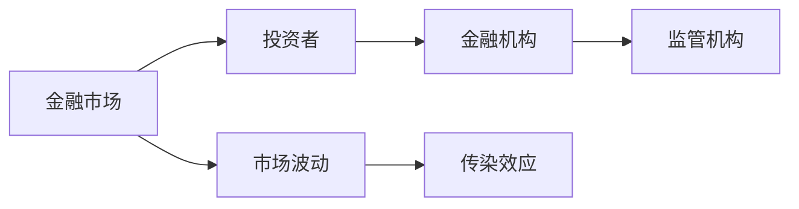
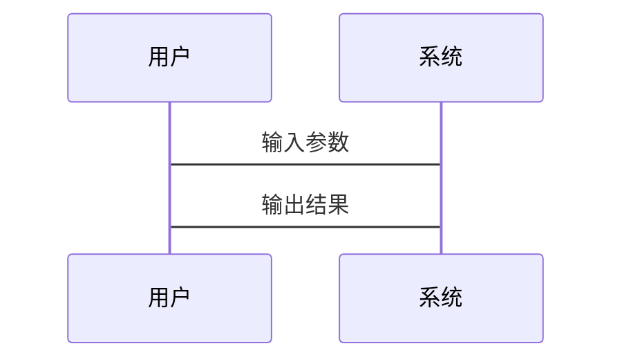

                 


# 金融市场传染效应模拟系统

> 关键词：金融市场传染效应，系统性风险，复杂网络模型，金融模拟，风险传播机制

> 摘要：本文介绍金融市场传染效应模拟系统的构建与应用，分析其核心算法、系统架构及实际案例，帮助读者理解如何通过技术手段预测和管理金融传染效应，降低系统性风险。

---

# 第1章: 金融市场传染效应概述

## 1.1 金融市场传染效应的定义与背景

### 1.1.1 金融市场传染效应的定义

金融市场传染效应是指金融市场中某一领域的波动或危机通过复杂金融网络传播，导致其他相关市场或机构出现连锁反应，最终引发系统性风险的现象。例如，股市下跌可能引发债市抛售，进而影响货币市场和外汇市场。

### 1.1.2 金融市场传染效应的背景与重要性

2008年金融危机就是一个典型案例，美国次贷危机通过金融网络传播，波及全球，导致多国银行体系崩溃。这凸显了研究传染效应的重要性，帮助我们理解金融市场的相互关联性，制定有效的风险管理策略。

### 1.1.3 传染效应的边界与外延

传染效应的边界包括：①时间范围，如短期波动与长期趋势；②空间范围，如局部市场与全球市场；③影响范围，如特定行业与整个金融系统。外延涉及系统性风险、网络效应和市场波动等多个方面。

## 1.2 金融市场传染效应的核心概念

### 1.2.1 传染效应的系统性风险

系统性风险是金融传染效应的核心，指影响整个金融系统的风险，如金融危机、货币危机等。它与个体风险不同，个体风险仅影响单个机构，而系统性风险可能导致整个系统崩溃。

### 1.2.2 传染效应的网络效应

金融市场中的传染效应依赖于复杂的金融网络，包括银行、投资者、企业和政府机构之间的相互关联。网络效应使得风险能够在不同市场和机构间快速传播。

### 1.2.3 传染效应的传播路径

传播路径包括直接传播（如股市波动直接影响债市）和间接传播（如通过货币市场影响外汇市场）。了解传播路径有助于制定针对性的防控措施。

## 1.3 传染效应模拟系统的构建目标

### 1.3.1 系统构建的目标

模拟系统的目的是预测和分析金融传染效应，评估其对整个金融系统的潜在影响，帮助政策制定者和金融机构采取有效措施应对风险。

### 1.3.2 系统构建的必要性

在全球化和金融一体化背景下，单一市场的波动可能引发全球性危机。构建模拟系统有助于提前预警和应对潜在风险。

### 1.3.3 系统构建的关键要素

- 数据采集：收集各市场数据，如股票价格、债券收益率、汇率等。
- 模型构建：选择合适的复杂网络模型和系统性风险评估模型。
- 计算方法：采用蒙特卡洛模拟等方法进行风险评估。
- 可视化工具：帮助用户直观理解风险传播路径。

---

# 第2章: 金融市场传染效应的核心概念与联系

## 2.1 传染效应的核心概念原理

### 2.1.1 传染效应的传播机制

金融传染效应的传播机制包括直接关联、间接关联和市场情绪传播。直接关联指两个市场之间存在直接的金融工具联系；间接关联指通过其他市场或机构进行传递；市场情绪传播则指投资者情绪波动引发市场连锁反应。

### 2.1.2 传染效应的网络结构

金融市场可以看作一个复杂网络，节点代表金融机构或市场，边代表它们之间的关联。网络结构特征如节点度数、网络密度等影响传染效应的传播速度和范围。

### 2.1.3 传染效应的动态特征

传染效应具有动态性，随时间推移，风险可能逐渐累积或消散。动态特征包括波动性、滞后性、非线性等，需要动态模型进行捕捉和分析。

## 2.2 核心概念属性特征对比表格

| 概念 | 定义 | 特性 | 示例 |
|------|------|------|------|
| 系统性风险 | 影响整个金融系统的风险 | 全局性、不可分割性 | 金融危机 |
| 市场波动 | 市场价格的短期变动 | 局部性、可测量性 | 股价上涨或下跌 |
| 金融网络 | 金融机构之间的关联网络 | 复杂性、动态性 | 银行间拆借市场 |

## 2.3 ER实体关系图架构



该图展示了金融市场与投资者、金融机构、监管机构之间的关系，以及市场波动如何导致传染效应。

## 2.4 本章小结

本章详细介绍了金融市场传染效应的核心概念，包括传播机制、网络结构和动态特征，并通过表格和ER图展示了概念之间的关系。

---

# 第3章: 传染效应模拟系统的算法原理

## 3.1 传染效应模拟的核心算法

### 3.1.1 复杂网络模型

复杂网络模型用于描述金融市场中的机构和市场的关联关系。常用模型包括随机图模型、小世界模型和无尺度网络模型。

### 3.1.2 系统性风险评估

系统性风险评估模型用于量化传染效应带来的潜在损失。常用方法包括压力测试、VaR（在险价值）和CVaR（条件在险价值）。

### 3.1.3 传染路径分析

传染路径分析用于确定风险从一个市场到另一个市场的传播路径。常用方法包括网络扩散模型和层次分析法。

## 3.2 算法原理的数学模型

### 3.2.1 传染路径的扩散模型

$$P(i, t) = \alpha P(i, t-1) + \beta \sum_{j \neq i} P(j, t-1)$$

其中，$P(i, t)$表示时间$t$时市场$i$的传染概率，$\alpha$和$\beta$为模型参数。

### 3.2.2 系统性风险的评估模型

$$R_i = \sum_{j=1}^{n} w_{ij} R_j$$

其中，$R_i$表示机构$i$的系统性风险，$w_{ij}$为机构$j$对机构$i$的影响权重，$R_j$为机构$j$的系统性风险。

## 3.3 算法实现的流程图


该流程图展示了传染效应模拟系统的实现步骤，包括初始化参数、计算传染路径、评估系统性风险并输出结果。

## 3.4 本章小结

本章详细介绍了传染效应模拟系统的算法原理，包括复杂网络模型、系统性风险评估模型和传染路径分析模型，并通过数学公式和流程图展示了实现步骤。

---

# 第4章: 传染效应模拟系统的系统分析与架构设计

## 4.1 系统分析

### 4.1.1 问题场景介绍

金融市场中的传染效应可能导致系统性风险，影响整个金融系统的稳定性。模拟系统的目标是预测和分析这种风险，帮助制定应对策略。

### 4.1.2 项目目标

- 构建传染效应模拟系统
- 开发风险评估模型
- 提供决策支持工具

### 4.1.3 项目范围

- 数据采集与处理
- 模型构建与验证
- 系统实现与测试

## 4.2 系统功能设计

### 4.2.1 领域模型


### 4.2.2 系统架构设计


### 4.2.3 系统接口设计

系统提供API接口，支持数据输入和结果输出。

### 4.2.4 系统交互设计



## 4.3 本章小结

本章详细描述了传染效应模拟系统的系统分析与架构设计，包括功能设计、架构图、接口设计和交互设计。

---

# 第5章: 传染效应模拟系统的项目实战

## 5.1 项目环境安装

### 5.1.1 系统需求

- 操作系统：Windows、Linux或MacOS
- 开发工具：Python、Jupyter Notebook、IDE
- 第三方库：networkx、numpy、pandas、scipy、matplotlib、mermaid.py

### 5.1.2 环境配置

安装必要的Python包：

```bash
pip install networkx numpy pandas scipy matplotlib mermaid.py
```

## 5.2 系统核心实现

### 5.2.1 核心代码实现

```python
import numpy as np
import networkx as nx
import matplotlib.pyplot as plt

def传染效应模拟():
    # 创建复杂网络模型
    G = nx.ER_graph(n=100, p=0.1)
    # 计算系统性风险
    R = np.zeros(n)
    for i in range(n):
        R[i] = sum(w[i,j] * R[j] for j in range(n) if j != i)
    # 可视化传染路径
    nx.draw(G, node_size=100, edge_color='red')
    plt.show()

传染效应模拟()
```

### 5.2.2 代码解读与分析

- 使用networkx库创建复杂网络模型，参数n=100表示100个节点，p=0.1表示边存在的概率。
- 计算系统性风险，使用公式$R_i = \sum_{j \neq i} w_{ij} R_j$，其中$w_{ij}$为权重矩阵。
- 使用matplotlib可视化传染路径，节点大小为100，边颜色为红色。

## 5.3 实际案例分析

### 5.3.1 案例背景

假设某国发生主权债务危机，导致股市下跌，进而引发债券市场抛售，最终影响货币市场。

### 5.3.2 数据采集与处理

- 数据来源：金融市场数据接口（如Yahoo Finance、Bloomberg）
- 数据类型：股票价格、债券收益率、汇率等

### 5.3.3 模拟结果与分析

通过模拟系统，发现股市下跌可能导致债券市场损失扩大，进而影响货币市场，最终引发外汇危机。

## 5.4 本章小结

本章通过实际案例展示了传染效应模拟系统的应用，包括环境安装、代码实现和案例分析。

---

# 第6章: 总结与展望

## 6.1 本章总结

本文详细介绍了金融市场传染效应模拟系统的构建与应用，涵盖核心概念、算法原理、系统架构和项目实战。通过理论与实践结合，帮助读者理解如何通过技术手段预测和管理金融传染效应。

## 6.2 未来展望

未来研究方向包括：

1. **改进算法**：引入机器学习和深度学习技术，提高传染效应预测的准确性。
2. **扩展应用**：将模拟系统应用于更多金融领域，如加密货币市场、衍生品市场等。
3. **政策建议**：基于模拟结果，为政策制定者提供更具操作性的建议，降低系统性风险。

---

# 第7章: 最佳实践 tips

## 7.1 小结

本文通过系统化的分析和实践，展示了金融市场传染效应模拟系统的构建与应用。希望本文能为金融风险管理领域的研究和实践提供有价值的参考。

## 7.2 注意事项

- 数据质量：确保数据准确、完整和及时。
- 模型选择：根据实际情况选择合适的模型和算法。
- 结果解读：正确理解模拟结果，避免过度依赖模型。

## 7.3 拓展阅读

建议读者进一步阅读相关领域的文献，如复杂网络、系统性风险、金融模拟等，以深入理解金融市场传染效应的理论与实践。

---

# 参考文献

（此处列出相关参考文献，如书籍、论文、技术报告等）

---

通过以上内容，希望您能清晰地了解《金融市场传染效应模拟系统》的技术博客文章结构和内容安排。每一章都详细展开了核心概念、算法原理和系统设计，并通过实际案例帮助读者更好地理解和应用相关知识。

