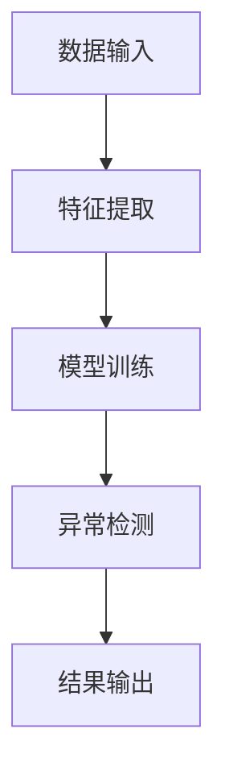
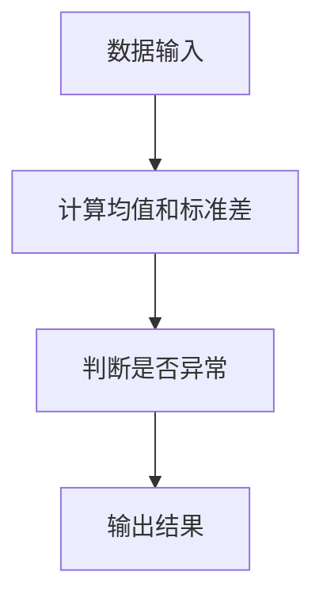
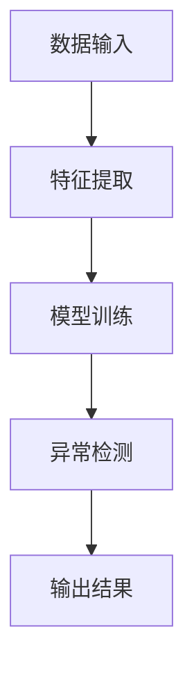
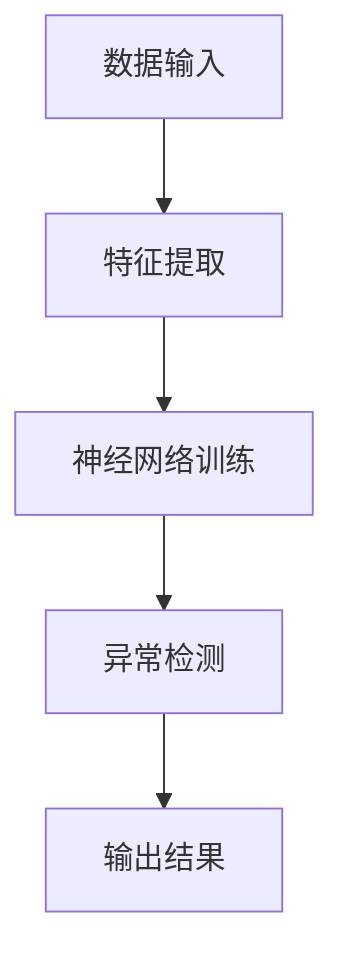
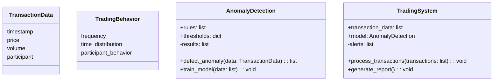
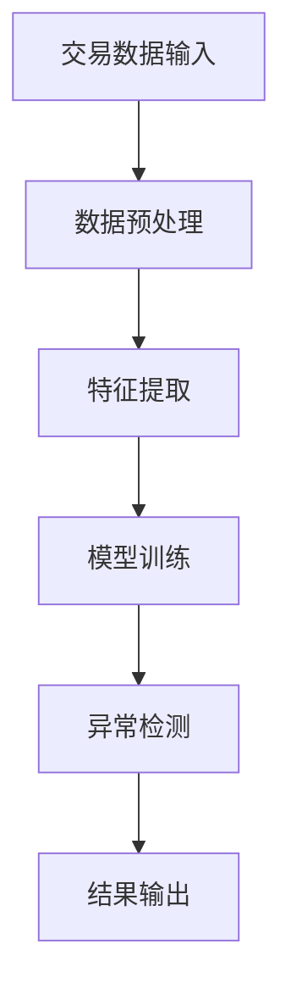
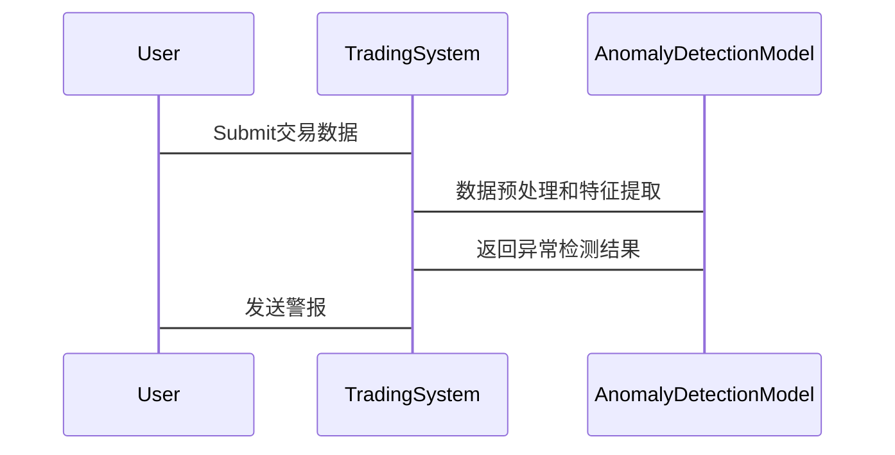

                 


# 金融市场异常交易检测系统

## 关键词：金融市场，异常交易，检测系统，算法，数据分析，系统架构

## 摘要：金融市场异常交易检测系统通过对交易数据的深度分析和算法应用，识别潜在的异常交易行为，保障市场公平性和投资者权益。本文从背景、算法原理、系统架构设计、项目实战到最佳实践等方面，全面解析异常交易检测的核心技术和实现方法。

---

## 第1章: 异常交易检测的背景与意义

### 1.1 异常交易的定义与分类
#### 1.1.1 什么是异常交易
异常交易是指在金融市场中，某些交易行为或交易数据与正常市场行为显著不同的情况。这些行为可能包括操纵市场、内幕交易、高频交易异常等。

#### 1.1.2 异常交易的分类
- **市场操纵**：通过虚假交易、散布虚假信息等手段，操纵市场价格。
- **内幕交易**：利用未公开信息进行交易，违反市场公平性。
- **高频交易异常**：高频交易系统出现故障或异常，导致市场波动。
- **异常波动**：短时间内价格剧烈波动，可能是异常交易的结果。

#### 1.1.3 异常交易的特征
- 数据特征：交易数据的分布、波动性、关联性显著偏离正常水平。
- 行为特征：交易行为表现出非正常的时间、频率或金额特征。

### 1.2 异常交易检测的重要性
#### 1.2.1 市场公平性的保障
异常交易破坏市场公平性，影响投资者信心，损害市场健康发展。

#### 1.2.2 投资者权益的保护
通过检测异常交易，保护普通投资者免受不法行为的侵害。

#### 1.2.3 金融监管的必要性
金融监管机构需要及时发现并处理异常交易，维护市场秩序。

### 1.3 异常交易检测的挑战与机遇
#### 1.3.1 数据量与复杂性
金融市场数据量大、类型多样，异常交易行为复杂，增加了检测的难度。

#### 1.3.2 技术手段的局限性
传统统计方法在处理复杂异常行为时效果有限，需要引入更先进的技术手段。

#### 1.3.3 人工智能在检测中的应用
人工智能技术（如机器学习、深度学习）能够有效处理复杂数据，提高检测精度。

### 1.4 本书的结构与目标
#### 1.4.1 本书的核心目标
系统性地介绍金融市场异常交易检测的理论、算法、系统架构和实践方法。

#### 1.4.2 本书的章节安排
从背景、算法原理、系统设计到项目实战，全面覆盖异常交易检测的各个方面。

#### 1.4.3 本书的适用读者
适合金融从业者、数据科学家、软件架构师及相关领域的研究人员阅读。

---

## 第2章: 异常交易检测的核心概念与联系

### 2.1 异常交易检测的核心概念
#### 2.1.1 数据特征分析
- 数据的分布特征：均值、标准差、偏度、峰度等。
- 数据的时间序列特征：趋势、周期性、突变点。

#### 2.1.2 模型特征提取
- 统计特征：如波动率、交易量、成交额等。
- 行为特征：如交易频率、交易时间分布、参与者行为模式。

#### 2.1.3 异常行为识别
- 基于统计的异常识别：如Z-score、箱线图方法。
- 基于机器学习的异常识别：如Isolation Forest、One-Class SVM。

### 2.2 异常交易检测的实体关系图


### 2.3 异常交易检测的算法原理


---

## 第3章: 异常交易检测的算法原理

### 3.1 统计学方法
#### 3.1.1 基于均值和标准差的异常检测
- **算法流程图**


- **Python代码示例**
```python
import numpy as np

def detect_anomaly(data):
    mean = np.mean(data)
    std = np.std(data)
    threshold = mean + 3 * std
    anomalies = [x for x in data if x > threshold]
    return anomalies

# 示例数据
data = [1, 2, 3, 4, 100, 5, 6, 7]
print(detect_anomaly(data))
```

### 3.2 机器学习方法
#### 3.2.1 基于监督学习的异常检测
- **算法流程图**


- **Python代码示例**
```python
from sklearn.ensemble import IsolationForest

def isolation_forest_anomaly_detection(X_train, X_test):
    model = IsolationForest(n_estimators=100, random_state=42)
    model.fit(X_train)
    y_pred = model.predict(X_test)
    anomalies = [i for i, pred in enumerate(y_pred) if pred == -1]
    return anomalies

# 示例数据
X_train = np.random.randn(100, 10)
X_test = np.random.randn(50, 10)
print(isolation_forest_anomaly_detection(X_train, X_test))
```

### 3.3 深度学习方法
#### 3.3.1 基于神经网络的异常检测
- **算法流程图**


- **Python代码示例**
```python
import tensorflow as tf
from tensorflow.keras import layers

def build_autoencoder(input_dim):
    inputs = layers.Input(shape=(input_dim,))
    encoded = layers.Dense(64, activation='relu')(inputs)
    decoded = layers.Dense(input_dim, activation='sigmoid')(encoded)
    model = tf.keras.Model(inputs=inputs, outputs=decoded)
    return model

def autoencoder_anomaly_detection(X_train, X_test):
    model = build_autoencoder(X_train.shape[1])
    model.compile(optimizer='adam', loss='binary_crossentropy')
    model.fit(X_train, X_train, epochs=10, batch_size=32)
    reconstructed = model.predict(X_test)
    error = np.mean(np.abs(reconstructed - X_test), axis=1)
    threshold = np.percentile(error, 95)
    anomalies = [i for i, e in enumerate(error) if e > threshold]
    return anomalies

# 示例数据
X_train = np.random.randn(100, 10)
X_test = np.random.randn(50, 10)
print(autoencoder_anomaly_detection(X_train, X_test))
```

---

## 第4章: 异常交易检测的系统架构设计

### 4.1 问题场景介绍
异常交易检测系统需要实时监控交易数据，快速识别并预警异常行为，确保交易的合规性和市场的稳定。

### 4.2 系统功能设计
- **领域模型类图**


### 4.3 系统架构设计
- **系统架构图**


### 4.4 系统接口设计
- **API接口**
```http
GET /api/anomaly_detection?start=2023-01-01&end=2023-12-31
POST /api/train_model
GET /api/alerts
```

### 4.5 系统交互流程


---

## 第5章: 异常交易检测的项目实战

### 5.1 环境搭建
- **Python环境**
  - 安装必要的库：numpy, pandas, scikit-learn, tensorflow, mermaid, matplotlib。
- **数据源**
  - 示例数据：生成模拟交易数据，包括正常和异常交易行为。

### 5.2 系统核心实现
- **异常检测模块**
  ```python
  import numpy as np
  from sklearn.ensemble import IsolationForest

  class AnomalyDetector:
      def __init__(self):
          self.model = IsolationForest(n_estimators=100, random_state=42)

      def train(self, X_train):
          self.model.fit(X_train)

      def detect(self, X_test):
          y_pred = self.model.predict(X_test)
          anomalies = [i for i, pred in enumerate(y_pred) if pred == -1]
          return anomalies
  ```

- **交易数据处理模块**
  ```python
  import pandas as pd

  class TransactionDataHandler:
      def __init__(self, data_path):
          self.data = pd.read_csv(data_path)

      def preprocess(self):
          # 数据清洗和特征提取
          self.data['log_volume'] = np.log(self.data['volume'])
          self.data['price_diff'] = self.data['price'].diff()
          return self.data
  ```

### 5.3 案例分析
- **数据准备**
  ```python
  import numpy as np
  import pandas as pd

  # 生成模拟数据
  np.random.seed(42)
  n_samples = 1000
  data = pd.DataFrame({
      'timestamp': pd.date_range('2023-01-01', periods=n_samples),
      'price': np.random.normal(100, 10, n_samples),
      'volume': np.random.lognormal(0, 1, n_samples),
      'participant': ['A', 'B', 'C'] * (n_samples // 3)
  })

  # 添加异常交易
  data.iloc[100:110, 1] = 200
  ```

- **异常检测**
  ```python
  from sklearn.ensemble import IsolationForest

  X = data[['price', 'volume']].values
  model = IsolationForest(n_estimators=100, random_state=42)
  model.fit(X)
  y_pred = model.predict(X)
  anomalies = [i for i, pred in enumerate(y_pred) if pred == -1]

  print("Anomalies detected at indices:", anomalies)
  ```

### 5.4 项目总结
- **总结与优化**
  - 异常检测模型的性能需要不断优化，特别是在数据量和复杂性增加的情况下。
  - 系统的实时性需要进一步提升，确保能够快速响应市场变化。
  - 异常交易检测需要结合多种算法和特征，提高检测的准确性和鲁棒性。

---

## 第6章: 异常交易检测的最佳实践

### 6.1 最佳实践 Tips
- **数据预处理**：确保数据的完整性和准确性，去除噪声数据。
- **模型选择**：根据具体场景选择合适的算法，如统计方法、机器学习或深度学习。
- **实时性优化**：采用流数据处理技术，确保系统的实时性。

### 6.2 小结
异常交易检测是一个复杂但重要的任务，需要结合理论、算法和实际应用进行综合考虑。

### 6.3 注意事项
- 定期更新模型，适应市场变化。
- 保护数据隐私，确保交易数据的安全性。
- 结合人工审核，避免误报和漏报。

### 6.4 拓展阅读
- 《金融数据分析与建模》
- 《机器学习实战》
- 《深度学习权威指南》

---

通过以上章节的详细讲解和实战分析，我们希望能够为读者提供一个全面理解金融市场异常交易检测系统的方法，帮助他们在实际应用中更好地实现和优化异常交易检测系统。

