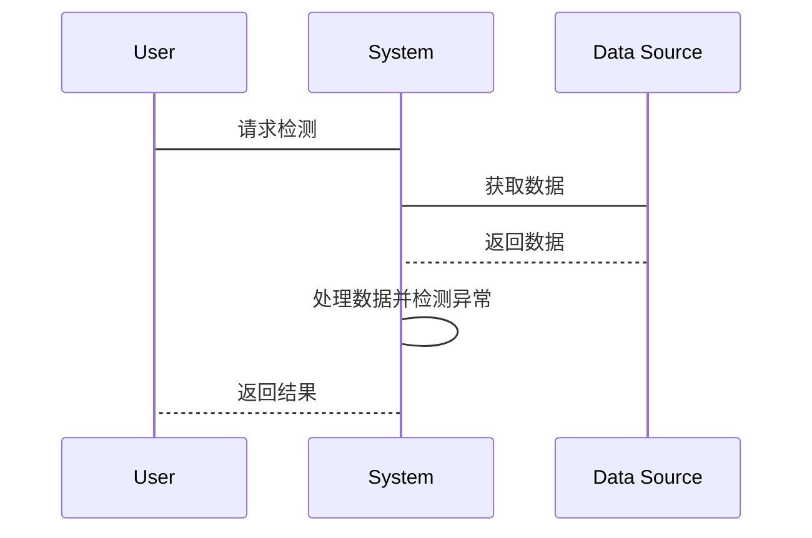

                 


# 《金融市场异常检测系统》

---

## 关键词：金融市场、异常检测、统计学方法、机器学习、深度学习、数据特征分析

---

## 摘要：  
金融市场异常检测系统通过分析交易数据和市场行为，识别异常现象，如市场操纵和欺诈交易。本文从背景、核心概念、算法原理、系统架构到实战应用，全面解析该系统的构建与实现，帮助读者掌握金融市场异常检测的关键技术与实践方法。

---

## 第1章: 金融市场异常检测的背景与问题

### 1.1 问题背景

#### 1.1.1 金融市场中的异常现象
在金融市场中，异常现象通常指那些偏离正常市场行为或价格波动的事件。这些现象可能包括：
- **市场操纵**：某些主体通过虚假交易或散布信息，影响股票价格。
- **欺诈交易**：利用虚假账户或 insider information 进行非法交易。
- **突变事件**：如重大新闻或突发事件引发的价格异常波动。

#### 1.1.2 异常检测的必要性
- **保护投资者**：及时发现异常，避免投资者损失。
- **维护市场稳定**：防止操纵和欺诈行为，确保市场公平。
- **提升交易效率**：自动化检测减少人为干预，提高效率。

#### 1.1.3 异常检测的边界与外延
- **边界**：仅关注异常交易或价格波动，不涉及正常市场波动。
- **外延**：与其他金融技术领域（如风险管理、量化交易）密切相关。

### 1.2 问题描述
- **异常行为识别**：检测异常交易模式。
- **风险预警**：提前预警潜在的市场风险。

### 1.3 问题解决
- **解决方案**：采用统计学、机器学习等方法构建检测模型。
- **技术路线**：数据采集、特征提取、模型训练、结果展示。
- **系统架构**：设计分层架构，包括数据采集层、特征提取层、模型训练层和结果展示层。

### 1.4 核心概念与联系
- **核心要素**：数据源、特征提取、检测算法、结果输出。
- **实体关系图（ER图）**：展示数据表之间的关系，如交易数据表与用户表的关系。
- **流程图（Mermaid）**：展示从数据采集到结果输出的整体流程。

---

## 第2章: 异常检测的核心概念

### 2.1 异常检测的基本概念
- **异常的定义与分类**：异常可以是孤立点、群组异常或混合异常。
- **异常检测的特征分析**：分析数据的分布、趋势和关联性。
- **异常检测的指标与评价**：使用准确率、召回率和F1分数等指标评价检测效果。

### 2.2 异常检测的核心原理
- **统计学方法**：如Z-score、LOF（局部outlier factor）等。
- **机器学习方法**：如Isolation Forest、One-Class SVM等。
- **深度学习方法**：如AE（自动编码器）、LSTM（长短期记忆网络）等。

### 2.3 异常检测的技术对比
- **统计学方法 vs 机器学习方法**：统计方法适用于简单分布，机器学习方法适用于复杂场景。
- **无监督学习 vs 监督学习**：无监督适用于无标签数据，监督学习需要标注数据。
- **基于规则的检测 vs 基于模型的检测**：规则检测简单但不够灵活，模型检测更准确但需要大量数据。

### 2.4 异常检测的数据特征分析
- **数据特征的层次结构**：从时间、价格、交易量等基本特征到高级特征如波动率、相关性。
- **数据特征的可视化**：通过图表展示异常点的位置和分布。
- **数据特征的关联分析**：分析不同特征之间的相互影响。

---

## 第3章: 异常检测算法原理

### 3.1 统计学方法
- **Z-score**：计算每个数据点的标准化分数，分数超过一定阈值即为异常。
  $$ z = \frac{x - \mu}{\sigma} $$
  其中，$\mu$ 是均值，$\sigma$ 是标准差。

- **LOF（局部outlier factor）**：通过计算局部密度来判断异常点。
  $$ LOF = \frac{d_{k}(x)}{d_{k}(x_{\text{neighbor}})} $$
  其中，$d_{k}(x)$ 是点 $x$ 的k近邻密度，$d_{k}(x_{\text{neighbor}})$ 是其邻居的k近邻密度。

### 3.2 机器学习方法
- **Isolation Forest**：通过构建随机森林，将数据点隔离成孤立点。
  ```python
  import sklearn.ensemble as sk
  model = sk.IsolationForest(n_estimators=100, random_state=42)
  model.fit(X)
  ```

- **One-Class SVM**：用于无监督异常检测，将数据点分为正常和异常。
  ```python
  from sklearn.svm import OneClassSVM
  model = OneClassSVM(gamma='auto', nu=0.05)
  model.fit(X)
  ```

### 3.3 深度学习方法
- **自动编码器（AE）**：通过神经网络重构输入数据，重构误差大的数据点为异常。
  ```python
  import tensorflow as tf
  model = tf.keras.Sequential([
      tf.keras.layers.Dense(32, activation='relu', input_shape=(n_features,)),
      tf.keras.layers.Dense(n_features, activation='sigmoid')
  ])
  model.compile(optimizer='adam', loss='binary_crossentropy')
  model.fit(X, X, epochs=10)
  ```

- **LSTM**：用于时间序列异常检测，捕捉数据中的长时依赖关系。
  ```python
  model = tf.keras.Sequential([
      tf.keras.layers.LSTM(64, return_sequences=True),
      tf.keras.layers.LSTM(32),
      tf.keras.layers.Dense(1, activation='sigmoid')
  ])
  model.compile(optimizer='adam', loss='binary_crossentropy')
  model.fit(X_train, y_train, epochs=10)
  ```

---

## 第4章: 系统分析与架构设计

### 4.1 系统功能设计
- **数据采集**：实时采集股票价格、交易量等数据。
- **特征提取**：提取如波动率、交易量突增等特征。
- **模型训练**：使用训练好的模型进行异常检测。
- **结果展示**：以可视化形式展示异常点和预警信息。

### 4.2 系统架构设计
- **分层架构**：
  1. 数据采集层：负责数据的采集和预处理。
  2. 特征提取层：提取关键特征并进行标准化处理。
  3. 模型训练层：训练异常检测模型并部署。
  4. 结果展示层：展示检测结果和预警信息。

### 4.3 接口设计
- **数据接口**：与数据源（如股票交易所API）对接。
- **模型接口**：提供API供其他系统调用检测结果。
- **用户接口**：提供可视化界面供用户查看结果。

### 4.4 交互流程图
通过Mermaid序列图展示系统交互流程：


---

## 第5章: 项目实战

### 5.1 环境安装
- **安装Python**：3.6以上版本。
- **安装库**：如pandas、scikit-learn、tensorflow、Plotly等。

### 5.2 核心代码实现
#### 数据预处理
```python
import pandas as pd
import numpy as np

# 加载数据
data = pd.read_csv('stock_data.csv')

# 删除缺失值
data = data.dropna()

# 标准化处理
from sklearn.preprocessing import StandardScaler
scaler = StandardScaler()
data_scaled = scaler.fit_transform(data)
```

#### 特征提取
```python
from sklearn.decomposition import PCA

pca = PCA(n_components=32)
features = pca.fit_transform(data_scaled)
```

#### 模型训练
```python
from sklearn.ensemble import IsolationForest

model = IsolationForest(n_estimators=100, random_state=42)
model.fit(features)

# 预测异常点
y_pred = model.predict(features)
```

#### 结果可视化
```python
import plotly.express as px

fig = px.scatter(x=features[:, 0], y=features[:, 1], color=y_pred.astype(str))
fig.show()
```

### 5.3 案例分析
以某股票交易数据为例，展示如何通过上述代码实现异常检测，并分析检测结果。

---

## 第6章: 最佳实践与小结

### 6.1 最佳实践
- **数据质量**：确保数据的完整性和准确性。
- **模型调优**：根据实际场景调整模型参数。
- **实时性优化**：优化系统性能，确保实时检测。

### 6.2 小结
本文详细讲解了金融市场异常检测系统的构建过程，从理论到实践，帮助读者掌握相关技术。

### 6.3 注意事项
- **数据隐私**：注意保护用户数据隐私。
- **模型鲁棒性**：确保模型在不同市场条件下的稳定性。

### 6.4 拓展阅读
- 推荐阅读《机器学习实战》、《深度学习》等书籍，深入学习相关技术。

---

# 结语
金融市场异常检测系统是一个复杂但极具挑战性的任务，通过结合统计学、机器学习和深度学习方法，我们可以构建高效可靠的检测系统，为金融市场稳定保驾护航。

