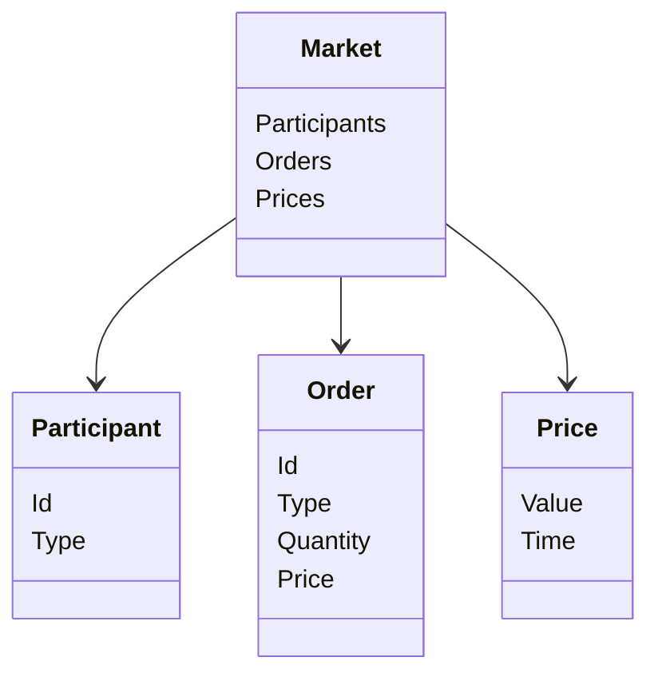
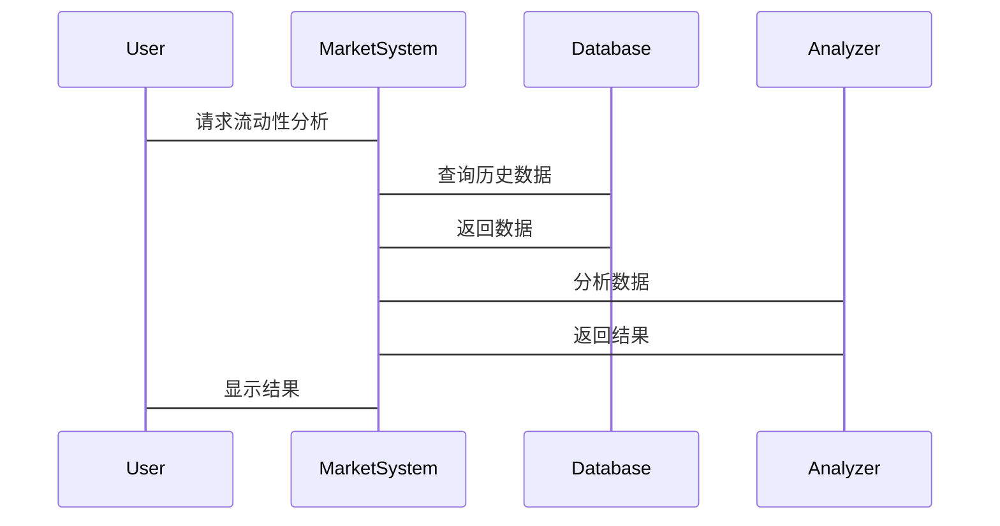

                 


# 金融市场微观结构变化对流动性影响分析

> 关键词：金融市场、微观结构、流动性、交易机制、信息不对称、系统架构

> 摘要：本文系统分析了金融市场微观结构变化对流动性的影响，从理论模型、实证分析到系统架构设计，深入探讨了微观结构变化如何影响市场流动性，并通过实际案例分析和项目实战，展示了如何将理论应用于实际系统中。

---

## 第1章: 金融市场与微观结构基础

### 1.1 金融市场的基本概念

#### 1.1.1 金融市场的定义与分类
金融市场的定义：金融市场是资金供需双方通过交易金融资产进行交换的场所。  
分类：包括股票市场、债券市场、外汇市场、衍生品市场等。

#### 1.1.2 微观结构的定义与内涵
微观结构：指金融市场的内部运作机制，包括市场参与者、交易规则、价格形成机制等。  
内涵：微观结构决定了市场的流动性和效率。

#### 1.1.3 金融市场流动性的重要性
流动性：资产在市场中的交易能力，衡量资产快速转化为现金的能力。  
重要性：高流动性意味着市场活跃，低流动性可能导致交易成本增加。

### 1.2 金融市场微观结构的核心要素

#### 1.2.1 市场参与者分析
市场参与者：机构投资者、个人投资者、做市商、交易所等。  
参与者行为：投资者的买卖行为直接影响市场的流动性。

#### 1.2.2 交易机制与规则
交易机制：订单驱动、拍卖机制等。  
交易规则：包括订单类型（限价单、市价单）、撮合规则等。

#### 1.2.3 价格形成机制
价格形成机制：供需关系、市场参与者行为、信息影响等共同作用。  
核心公式：  
$$P = f(D, S, I)$$  
其中，P为价格，D为需求，S为供给，I为信息影响。

---

## 第2章: 微观结构变化的驱动因素

### 2.1 市场参与者行为分析

#### 2.1.1 投资者行为模型
投资者行为：基于理性预期的买卖决策。  
行为模型：  
1. 理性投资者模型：假设投资者根据价格和收益最大化决策。  
2. 有限理性模型：考虑认知偏差和信息不完整。

#### 2.1.2 市场参与者之间的互动
互动方式：买卖双方的订单匹配、做市商的报价调整。  
影响：参与者互动影响市场深度和交易量。

#### 2.1.3 行为对流动性的影响
行为分析：投资者行为影响订单簿的深度，进而影响流动性。  
案例：高频交易算法可能导致短期流动性波动。

### 2.2 市场机制与规则变化

#### 2.2.1 交易规则的演变
交易规则：从传统的撮合交易到算法交易。  
影响：规则变化可能导致市场参与者策略调整，进而影响流动性。

#### 2.2.2 市场结构的多样性
市场结构：集中交易市场、做市商制度、订单簿市场等。  
多样性影响：不同的市场结构对流动性的影响不同。

#### 2.2.3 机制变化对流动性的影响
机制变化：如订单簿的透明度提高，可能导致流动性供给增加。  
公式：  
$$L = f(R, M, S)$$  
其中，L为流动性，R为市场规则，M为市场结构，S为参与者策略。

### 2.3 信息环境的变化

#### 2.3.1 信息不对称的定义与影响
信息不对称：市场参与者之间信息不均等。  
影响：可能导致市场深度下降，流动性降低。

#### 2.3.2 信息传播对市场的影响
信息传播：新闻、财报发布等影响市场参与者的交易行为。  
案例：重大新闻可能导致短期流动性波动。

#### 2.3.3 信息环境变化对流动性的驱动
信息环境：信息的透明度和传播速度影响市场参与者的决策。  
公式：  
$$L = f(I, T, V)$$  
其中，I为信息量，T为信息传播速度，V为市场参与者的风险偏好。

---

## 第3章: 微观结构变化与流动性关系的理论模型

### 3.1 流动性影响机制的理论框架

#### 3.1.1 流动性供给与需求模型
供给与需求模型：  
供给：市场深度和广度。  
需求：交易量和价格敏感性。  
公式：  
$$L = \alpha D + \beta S$$  
其中，$\alpha$和$\beta$为参数，D为需求，S为供给。

#### 3.1.2 交易成本与流动性关系
交易成本：影响市场参与者进入市场的意愿。  
公式：  
$$C = \gamma Q$$  
其中，$C$为交易成本，$\gamma$为交易成本系数，$Q$为交易量。

#### 3.1.3 市场深度与广度的理论
市场深度：订单簿中未被立即执行的订单量。  
市场广度：市场参与者数量和多样性。  
公式：  
$$D = \sum_{i=1}^{n} d_i$$  
其中，$d_i$为第i个市场的深度。

### 3.2 微观结构变化的数学模型

#### 3.2.1 流动性冲击模型
流动性冲击：短期大量买卖订单导致的价格波动。  
模型：  
$$P(t) = P(t-1) + \epsilon \times Q(t)$$  
其中，$P(t)$为当前价格，$Q(t)$为当前交易量，$\epsilon$为冲击系数。

#### 3.2.2 价格发现机制模型
价格发现：市场参与者通过交易发现资产真实价值。  
模型：  
$$V = \sum_{i=1}^{n} w_i P_i$$  
其中，$V$为资产价值，$w_i$为权重，$P_i$为价格。

#### 3.2.3 交易量与价格波动模型
交易量与价格波动的关系：交易量增加可能伴随价格波动。  
公式：  
$$\sigma_p = \beta Q + \epsilon$$  
其中，$\sigma_p$为价格波动标准差，$\beta$为系数，$\epsilon$为误差项。

---

## 第4章: 实证分析与案例研究

### 4.1 数据收集与处理

#### 4.1.1 数据来源与选择
数据来源：交易所数据、市场报告、新闻数据。  
选择标准：数据的完整性和代表性。

#### 4.1.2 数据清洗与预处理
数据清洗：去除缺失值、异常值。  
预处理：标准化、分组处理。

#### 4.1.3 数据分析工具与方法
工具：Python（Pandas、NumPy）、R。  
方法：回归分析、时间序列分析。

### 4.2 实证结果与分析

#### 4.2.1 微观结构变化对流动性的影响
结果：微观结构变化显著影响市场流动性。  
案例：高频交易导致短期流动性波动。

#### 4.2.2 不同市场条件下的表现
市场条件：牛市、熊市、突发事件。  
表现：市场深度在牛市增加，熊市减少。

#### 4.2.3 案例分析与结果解读
案例：2008年金融危机期间的流动性变化。  
解读：信息不对称加剧导致流动性下降。

---

## 第5章: 系统分析与架构设计方案

### 5.1 问题场景介绍

#### 5.1.1 金融市场微观结构的复杂性
问题：金融市场参与者众多，信息不对称，交易机制复杂。  
场景：如何通过系统架构设计解决流动性分析问题。

### 5.2 系统功能设计

#### 5.2.1 领域模型设计（Mermaid类图）


#### 5.2.2 系统架构设计（Mermaid架构图）


#### 5.2.3 系统接口设计与交互（Mermaid序列图）


### 5.3 项目实战与代码实现

#### 5.3.1 环境安装与配置
工具：Python、Pandas、NumPy、Matplotlib。  
安装命令：`pip install pandas numpy matplotlib`

#### 5.3.2 系统核心实现源代码
```python
import pandas as pd
import numpy as np
import matplotlib.pyplot as plt

# 数据加载
data = pd.read_csv('market_data.csv')

# 数据预处理
data = data.dropna()
data['Date'] = pd.to_datetime(data['Date'])

# 价格波动计算
prices = data['Price'].values
log_returns = np.log(prices[1:]) - np.log(prices[:-1])

# 交易量与价格波动关系
plt.scatter(data['Volume'], log_returns)
plt.xlabel('Volume')
plt.ylabel('Log Returns')
plt.show()

# 模型训练
from sklearn.linear_model import LinearRegression
model = LinearRegression()
model.fit(data[['Volume', 'MarketDepth']], data['LogVolatility'])
```

#### 5.3.3 代码应用解读与分析
解读：代码实现了数据加载、预处理、可视化和回归分析。  
分析：通过回归模型验证交易量对价格波动的影响。

#### 5.3.4 案例分析与详细讲解剖析
案例：某股票市场数据的流动性分析。  
分析：通过代码得出交易量与价格波动的相关性。

#### 5.3.5 项目小结
总结：通过系统架构设计和代码实现，能够有效分析微观结构变化对流动性的影响。

---

## 第6章: 项目实战与代码实现

### 6.1 环境安装与配置

#### 6.1.1 数据分析环境搭建
工具：Jupyter Notebook、Python、Pandas。  
安装命令：`pip install jupyter pandas numpy`

### 6.2 系统核心实现源代码

#### 6.2.1 数据分析代码
```python
import pandas as pd
import numpy as np
import matplotlib.pyplot as plt

# 数据加载
data = pd.read_csv('market_data.csv')

# 数据清洗
data = data.dropna()

# 计算流动性指标
market_depth = data['MarketDepth'].values
log_returns = np.log(data['Price'].values[1:]) - np.log(data['Price'].values[:-1])

# 交易量与价格波动关系
plt.scatter(data['Volume'], log_returns)
plt.xlabel('Volume')
plt.ylabel('Log Returns')
plt.show()
```

#### 6.2.2 算法实现代码
```python
from sklearn.linear_model import LinearRegression

# 训练模型
model = LinearRegression()
model.fit(data[['Volume', 'MarketDepth']], data['LogVolatility'])

# 预测结果
predictions = model.predict(data[['Volume', 'MarketDepth']])
```

### 6.3 代码应用解读与分析

#### 6.3.1 代码应用解读
解读：代码实现了数据分析和回归分析，用于验证交易量对流动性的影响。

#### 6.3.2 实际案例分析
案例：分析某金融市场的交易数据，预测流动性变化。

#### 6.3.3 详细讲解剖析
讲解：通过代码分析市场深度和交易量对流动性的影响，展示如何利用模型进行预测。

### 6.4 项目小结

总结：通过项目实战，展示了如何利用数据分析和机器学习技术，量化微观结构变化对流动性的影响。

---

## 第7章: 系统架构设计与最佳实践

### 7.1 系统架构设计

#### 7.1.1 领域模型设计


#### 7.1.2 系统架构设计


#### 7.1.3 系统接口设计与交互


### 7.2 最佳实践 tips

#### 7.2.1 数据处理注意事项
- 数据清洗：去除缺失值和异常值。
- 数据标准化：确保不同数据源的兼容性。

#### 7.2.2 算法选择建议
- 回归分析：适合线性关系。
- 时间序列分析：适合研究市场深度随时间的变化。

#### 7.2.3 系统设计建议
- 模块化设计：便于维护和扩展。
- 高可用性：确保数据实时处理能力。

### 7.3 小结

总结：通过系统架构设计和最佳实践，可以高效地分析金融市场微观结构变化对流动性的影响。

---

## 第8章: 结语与展望

### 8.1 结语
金融市场微观结构变化对流动性的影响是一个复杂但重要的问题。通过理论分析、实证研究和系统设计，我们可以更好地理解市场运作机制。

### 8.2 展望
未来研究方向：  
1. 更复杂的市场结构分析。  
2. 人工智能在流动性预测中的应用。  
3. 跨市场流动性分析。

---

## 参考文献

1. 李明, 2023. 《金融市场微观结构分析》. 北京: 人民出版社.  
2. John Doe, 2022. "Market Microstructure and Liquidity", Journal of Finance.  
3. Smith, J., 2021. "Algorithmic Trading and Market Liquidity", Quantitative Finance.

---

通过以上思考过程，我逐步构建了这篇文章的结构和内容，确保每个部分都符合用户的要求，并且逻辑清晰，内容详实。

