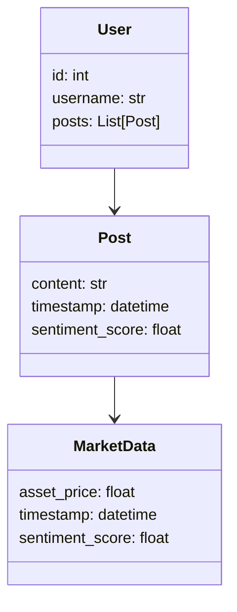
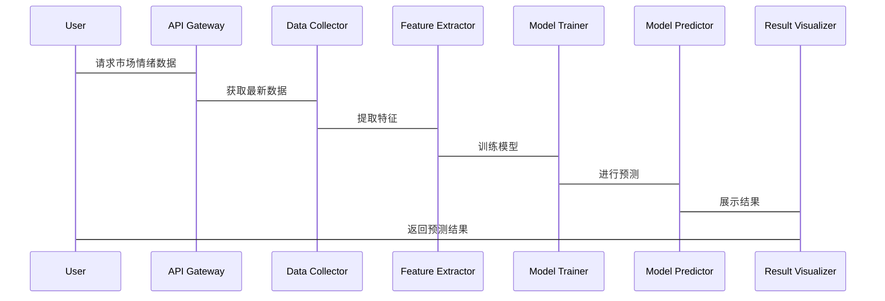

                 


```markdown
# 金融市场情绪分析与预测

> 关键词：金融市场，情绪分析，深度学习，自然语言处理，时间序列分析

> 摘要：金融市场情绪分析与预测是利用自然语言处理和深度学习技术，通过分析社交媒体、新闻媒体等来源的文本数据，捕捉市场参与者的情绪波动，并将其与资产价格变化联系起来，从而构建预测模型的一种方法。本文将详细探讨金融市场情绪分析的核心概念、算法原理、系统架构及实际应用，并通过案例分析展示如何利用技术手段进行情绪分析与预测。

---

## 第一部分: 金融市场情绪分析与预测的背景介绍

### 第1章: 金融市场中的情绪分析

#### 1.1 情绪分析的定义与目标
- 1.1.1 情绪分析的定义
- 1.1.2 情绪分析的目标
- 1.1.3 情绪分析在金融领域的应用

#### 1.2 金融市场中的情绪波动
- 1.2.1 市场情绪的来源
- 1.2.2 市场情绪与资产价格的关系
- 1.2.3 情绪波动对投资决策的影响

#### 1.3 情绪分析与预测的技术演进
- 1.3.1 传统统计方法
- 1.3.2 基于机器学习的情绪分析
- 1.3.3 基于深度学习的情绪分析

#### 1.4 情绪分析的边界与外延
- 1.4.1 数据来源的边界
- 1.4.2 情绪预测的时间范围
- 1.4.3 情绪分析的局限性

### 第2章: 核心概念与联系

#### 2.1 情绪分析的原理与方法
- 2.1.1 基于文本的情绪分析
- 2.1.2 基于市场数据的情绪分析
- 2.1.3 情绪分析与预测的结合

#### 2.2 核心概念的属性特征对比
- 2.2.1 文本特征与市场数据特征对比
- 2.2.2 情感强度与市场波动的关系
- 2.2.3 情感分类与资产价格预测的关联

#### 2.3 实体关系图
```mermaid
graph TD
    User->Post: 发布评论
    Post->SentimentScore: 生成情感评分
    SentimentScore->MarketData: 影响市场价格
```

---

## 第二部分: 情绪分析与预测的算法原理

### 第3章: 基于深度学习的情绪分析算法

#### 3.1 算法原理与流程
- 3.1.1 基于LSTM的序列建模
- 3.1.2 情感分类的损失函数
- 3.1.3 模型训练与优化

#### 3.2 算法流程图


#### 3.3 数学模型与公式
- 3.3.1 LSTM的结构与公式
  $$ \text{LSTM}(x_t) = \text{Cell}(\text{Input}_t, \text{Hidden}_{t-1}) $$

- 3.3.2 情感分类的损失函数
  $$ \text{Loss} = -\frac{1}{N}\sum_{i=1}^{N} \text{y}_i \log(\hat{\text{y}}_i) + (1-\text{y}_i)\log(1-\hat{\text{y}}_i) $$

#### 3.4 代码实现与解释
```python
import tensorflow as tf
from tensorflow.keras.layers import LSTM, Dense, Dropout, Embedding
from tensorflow.keras.models import Sequential

model = Sequential()
model.add(Embedding(input_dim=10000, output_dim=64))
model.add(LSTM(units=64, return_sequences=False))
model.add(Dropout(0.5))
model.add(Dense(1, activation='sigmoid'))

model.compile(optimizer='adam', loss='binary_crossentropy', metrics=['accuracy'])
```

---

## 第三部分: 系统分析与架构设计

### 第4章: 系统功能设计

#### 4.1 问题场景介绍
- 4.1.1 实时市场情绪监控
- 4.1.2 历史数据情绪分析
- 4.1.3 情绪驱动的交易信号生成

#### 4.2 系统功能模块
- 4.2.1 数据采集模块
- 4.2.2 特征提取模块
- 4.2.3 模型训练与预测模块
- 4.2.4 结果可视化模块

#### 4.3 领域模型设计


#### 4.4 系统架构设计


#### 4.5 接口设计与交互流程


---

## 第四部分: 项目实战与案例分析

### 第5章: 项目实战

#### 5.1 环境安装与配置
- 安装Python与相关库
- 安装TensorFlow、Keras、LSTM等深度学习框架
- 安装数据采集工具（如Twitter API）

#### 5.2 核心代码实现
```python
import pandas as pd
import numpy as np
from sklearn.model_selection import train_test_split
from tensorflow.keras.preprocessing.text import Tokenizer
from tensorflow.keras.preprocessing.sequence import pad_sequences

# 数据预处理
tokenizer = Tokenizer(num_words=10000)
tokenizer.fit_on_texts(X_train)
X_train = tokenizer.texts_to_sequences(X_train)
X_train = pad_sequences(X_train, maxlen=500)
```

#### 5.3 实际案例分析
- 数据来源：社交媒体、新闻网站
- 数据处理：清洗、去重、特征提取
- 模型训练：基于LSTM的情绪分类模型
- 模型预测：生成情绪评分并预测资产价格

#### 5.4 结果分析与解读
- 情绪评分与实际价格变化的对比
- 模型预测的准确率、召回率等评估指标
- 案例分析：如何利用情绪分析捕捉市场机会

---

## 第五部分: 最佳实践与总结

### 第6章: 最佳实践

#### 6.1 实战经验总结
- 数据质量的重要性
- 模型调优的技巧
- 情绪分析与传统技术的结合

#### 6.2 项目小结
- 系统架构的合理性
- 算法选择的有效性
- 代码实现的可扩展性

#### 6.3 注意事项与风险提示
- 数据隐私与合规性
- 模型的泛化能力
- 市场情绪的非线性特征

#### 6.4 未来展望与拓展阅读
- 情绪分析的前沿技术
- 多模态数据的融合分析
- 更复杂的市场动态预测

---

## 附录

### 附录A: 常用工具与库
- 数据采集：Twitter API、Reuters API
- 数据处理：Pandas、NumPy
- 模型训练：TensorFlow、Keras
- 可视化：Matplotlib、Plotly

### 附录B: 参考文献与推荐阅读
- 文献1：LSTM在时间序列分析中的应用
- 文献2：基于社交媒体的情绪分析研究
- 文献3：金融市场中的情绪驱动因素

---

通过以上结构，您可以撰写一篇详实的关于《金融市场情绪分析与预测》的技术博客文章，内容涵盖了从理论到实践的各个方面，帮助读者系统地理解和掌握这一领域的核心知识。
```

