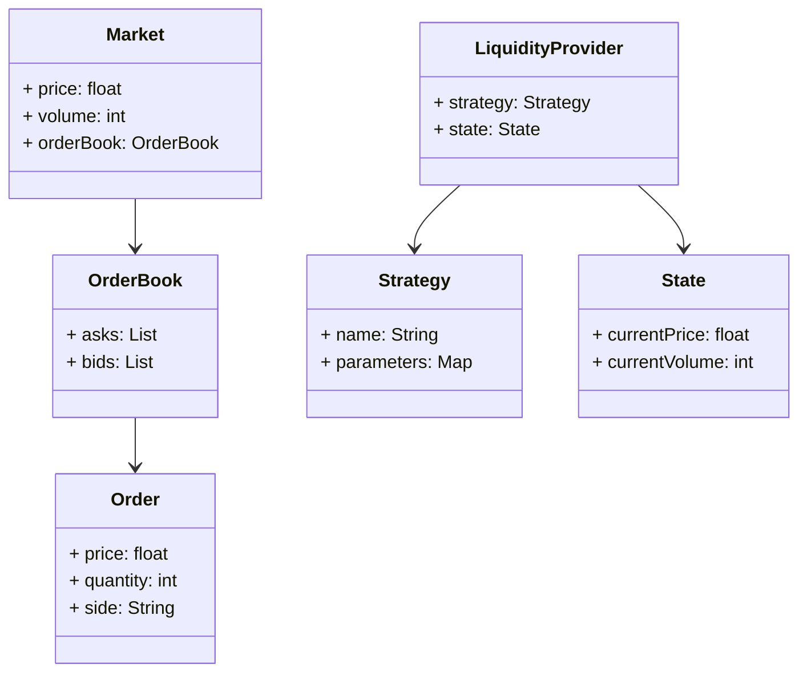

                 


---

# 金融市场流动性提供策略优化

> 关键词：金融市场、流动性提供、策略优化、风险管理、算法交易、系统架构

> 摘要：本文深入探讨金融市场中流动性提供策略的优化问题，分析其核心概念、算法原理、系统架构，并通过案例分析提供实践指导。文章旨在帮助读者理解流动性提供策略的优化方法，掌握其实现细节，并在实际应用中提升市场流动性效率。

---

## 第一部分: 金融市场流动性提供策略优化背景介绍

### 第1章: 金融市场流动性概述

#### 1.1 金融市场的流动性概念

##### 1.1.1 金融市场的基本概念
金融市场是资金流动和资产交易的主要场所，参与者包括投资者、机构、企业和政府。金融市场通过股票、债券、期货、外汇等工具，实现资金的有效配置和风险管理。

##### 1.1.2 流动性的定义与特征
流动性是指资产在金融市场中快速转化为现金的能力。高流动性意味着资产易于买卖，价格波动小；低流动性则意味着交易困难，可能面临较大的买卖价差和价格冲击。

##### 1.1.3 流动性在金融市场中的重要性
流动性是金融市场的基石，直接影响市场的稳定性和效率。高流动性有助于降低交易成本，提高市场参与度，促进价格发现。

#### 1.2 金融市场流动性问题的背景

##### 1.2.1 传统金融市场流动性问题
传统金融市场中，流动性问题主要集中在交易量低的资产或时段，可能导致买卖价差扩大，交易执行困难。

##### 1.2.2 现代金融市场流动性问题的演变
随着电子交易和算法交易的普及，流动性问题变得更加复杂。高频交易和算法交易可能导致市场波动加剧，尤其是在市场波动加剧时，流动性迅速下降，引发价格崩盘。

##### 1.2.3 流动性问题的复杂性与挑战
现代金融市场中的流动性问题涉及多个因素，包括市场结构变化、交易技术进步、投资者行为变化等。这些问题使得流动性管理更加复杂，需要综合考虑市场微观结构、交易策略和风险管理。

#### 1.3 流动性提供策略的必要性

##### 1.3.1 流动性提供策略的定义
流动性提供策略是指通过特定的交易策略和市场操作，主动增加市场流动性，降低买卖价差，提高市场效率。

##### 1.3.2 流动性提供策略的目标
流动性提供策略的主要目标是：
- 提高市场流动性，降低交易成本。
- 稳定市场价格，减少波动性。
- 增强市场深度和广度，吸引更多参与者。

##### 1.3.3 流动性提供策略的边界与外延
流动性提供策略的边界包括：
- 仅适用于特定市场或资产类别。
- 受市场结构和监管政策限制。
- 需要考虑市场参与者的行为和策略。

#### 1.4 流动性提供策略的核心要素

##### 1.4.1 市场参与者角色
流动性提供者包括做市商、高频交易商和机构投资者，他们在市场中扮演关键角色，通过买卖订单提供流动性。

##### 1.4.2 流动性提供机制
流动性提供机制包括订单簿维护、价差优化和市场深度管理，确保市场在不同条件下保持足够的流动性。

##### 1.4.3 流动性风险与收益平衡
流动性提供者需要在风险和收益之间找到平衡，避免过度承担风险，同时确保提供足够的流动性。

---

### 第2章: 流动性提供策略的核心概念与联系

#### 2.1 流动性提供策略的原理

##### 2.1.1 流动性提供策略的基本原理
流动性提供策略通过主动管理订单和价格，优化市场微观结构，提高流动性。常用策略包括宽价差、窄价差和中性价差策略，分别适用于不同的市场环境。

##### 2.1.2 流动性提供策略的核心机制
流动性提供策略的核心机制包括订单簿维护、价格敏感性调整和交易时机选择，确保在市场波动中保持流动性。

##### 2.1.3 流动性提供策略的数学模型
基于订单簿模型的流动性预测，使用马尔可夫链模型分析价格变化的概率，帮助制定流动性提供策略。

#### 2.2 流动性提供策略的特征对比

##### 2.2.1 不同流动性提供策略的特征分析
比较宽价差、窄价差和中性价差策略的特征，包括执行成本、风险敞口和市场影响。

##### 2.2.2 流动性提供策略的优缺点对比
宽价差策略风险较低，但收益有限；窄价差策略收益高，但风险较大；中性价差策略平衡风险和收益。

##### 2.2.3 流动性提供策略的适用场景
根据市场波动性、参与者行为和监管环境选择合适的策略，例如在高波动市场中使用宽价差策略，降低风险。

#### 2.3 流动性提供策略的ER实体关系图

```mermaid
er
actor: 流动性提供者
strategy: 流动性提供策略
market: 金融市场
order: 订单
liquidity: 流动性
risk: 风险
reward: 收益
```

---

## 第二部分: 流动性提供策略的算法原理

### 第3章: 流动性提供策略的算法实现

#### 3.1 流动性预测算法

##### 3.1.1 基于时间序列的流动性预测模型
使用ARIMA模型预测未来流动性，分析历史订单数据，捕捉趋势和周期性。

##### 3.1.2 基于机器学习的流动性预测方法
利用LSTM网络捕捉非线性特征，提高预测准确性。

##### 3.1.3 基于统计学的流动性预测模型
通过历史数据分析，识别影响流动性的关键因素，构建回归模型。

#### 3.2 流动性优化算法

##### 3.2.1 基于动态规划的流动性优化算法
通过状态转移方程，优化订单簿中的买卖价差，提高流动性。

##### 3.2.2 基于遗传算法的流动性优化策略
模拟自然选择过程，优化订单簿结构，降低交易成本。

##### 3.2.3 基于强化学习的流动性优化方法
使用Q-learning算法，根据市场反馈调整策略，实现动态优化。

#### 3.3 流动性风险控制算法

##### 3.3.1 基于VaR模型的风险控制算法
计算潜在损失，设定风险价值，限制流动性提供者的风险敞口。

##### 3.3.2 

---

### 第4章: 流动性提供策略的系统架构设计

#### 4.1 系统功能设计

##### 4.1.1 领域模型


---

通过以上内容，文章详细介绍了金融市场流动性提供策略优化的背景、核心概念和算法原理，后续章节将深入探讨系统架构设计和项目实战，为读者提供全面的知识和实践指导。

