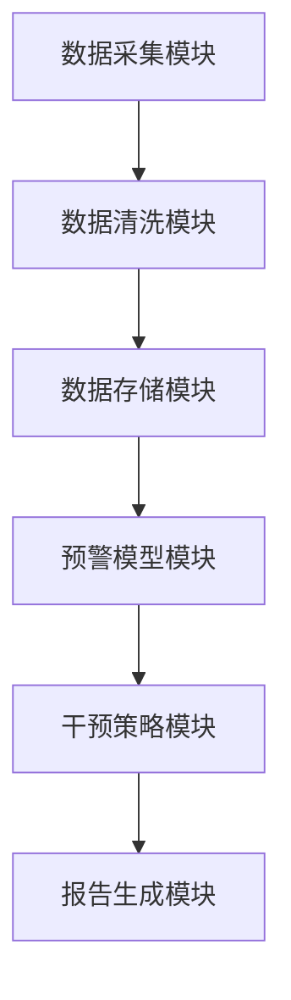

                 


# 金融市场流动性枯竭预警与干预系统

> 关键词：金融市场、流动性枯竭、预警系统、干预策略、算法模型、系统架构、风险防控

> 摘要：本文旨在探讨金融市场流动性枯竭的预警与干预系统，通过分析流动性问题的背景、成因及影响，提出基于算法模型的预警机制和干预策略。系统设计部分详细介绍了架构、功能模块及实现方法，结合实际案例进行分析，总结系统设计的关键点和未来发展方向。文章结构清晰，内容详实，为金融市场的稳定运行提供了技术支持和理论指导。

---

# 第一部分：金融市场流动性枯竭的背景与挑战

## 第1章：金融市场流动性问题的背景与挑战

### 1.1 问题的背景

#### 1.1.1 金融市场的基本概念
金融市场是资金流动的场所，包括股票、债券、货币市场等，是经济体系的核心。

#### 1.1.2 流动性在金融市场中的重要性
流动性是指资产快速转化为现金的能力，直接影响市场的稳定性和交易效率。

#### 1.1.3 流动性枯竭的定义与特征
流动性枯竭是市场参与者无法迅速变现资产，导致市场流动性不足，交易量骤减。

### 1.2 流动性枯竭的成因与影响

#### 1.2.1 市场参与者的行为分析
投资者恐慌性抛售、资金链断裂等行为导致流动性下降。

#### 1.2.2 系统性风险的传播机制
流动性问题可能从局部市场扩散至整个金融体系，引发系统性风险。

#### 1.2.3 流动性枯竭对经济的负面影响
企业融资困难、资产价格暴跌、经济衰退等。

### 1.3 预警与干预的必要性

#### 1.3.1 预警机制的作用
及时发现流动性风险，提前采取措施，避免危机扩大。

#### 1.3.2 干预措施的必要性
政府和监管机构通过干预措施稳定市场，防止系统性崩溃。

#### 1.3.3 系统设计的目标与边界
系统目标是实现流动性风险的早期预警和有效干预，边界包括数据采集、模型构建、策略执行等。

## 1.4 本章小结
本章分析了流动性枯竭的背景、成因和影响，强调了预警与干预的必要性，并为后续系统设计奠定了基础。

---

# 第二部分：流动性枯竭预警与干预的核心概念

## 第2章：预警指标与干预策略

### 2.1 预警指标

#### 2.1.1 常见的流动性指标
- 市场成交量
- 市场波动率
- 资产价格变化率
- 投资者情绪指数

#### 2.1.2 预警指标的特征
- 及时性：能够快速反映市场变化
- 可量性：可以通过数据量化
- 敏感性：对风险变化敏感

### 2.2 干预策略

#### 2.2.1 市场干预工具
- 货币政策工具：调整利率、存款准备金率
- 财政政策工具：政府注资、 bailout
- 市场机制：引入战略投资者

#### 2.2.2 干预策略的分类
- 预防性干预：提前采取措施，防止流动性问题发生
- 矫正性干预：问题发生后，迅速采取措施恢复市场流动性

### 2.3 预警与干预的逻辑关系

- 预警系统通过实时监测市场指标，触发干预机制
- 干预措施的执行依赖于预警系统的及时性和准确性
- 两者共同作用，形成闭环，确保市场稳定

## 第2章小结
本章分析了流动性预警与干预的核心概念，提出了具体的预警指标和干预策略，为后续系统设计提供了理论基础。

---

# 第三部分：流动性预警模型的算法原理

## 第3章：预警模型的数学基础

### 3.1 时间序列分析

#### 3.1.1 ARIMA模型
ARIMA（自回归积分滑动平均模型）适用于预测具有趋势和季节性的数据。

#### 3.1.2 LSTM模型
长短期记忆网络（LSTM）能够捕捉长期依赖关系，适合处理复杂的时间序列数据。

### 3.2 机器学习算法

#### 3.2.1 支持向量机（SVM）
用于分类和回归，可以识别数据中的模式。

#### 3.2.2 随机森林（Random Forest）
通过集成学习提高模型的准确性和鲁棒性。

### 3.3 风险评估模型

#### 3.3.1 Value-at-Risk（VaR）
用于评估投资组合在特定置信水平下的潜在损失。

#### 3.3.2 Conditional Value-at-Risk（CVaR）
在VaR基础上，考虑极端情况下的损失。

## 第3章：算法实现与案例分析

### 3.1 ARIMA模型实现

```python
from statsmodels.tsa.arima_model import ARIMA
import pandas as pd

data = pd.read_csv('market_data.csv')
model = ARIMA(data['volume'], order=(1, 1, 1))
model_fit = model.fit()
```

### 3.2 LSTM模型实现

```python
import keras
from keras.layers import LSTM, Dense
from keras.models import Sequential

model = Sequential()
model.add(LSTM(64, input_shape=(timesteps, features)))
model.add(Dense(1))
model.compile(loss='mean_squared_error', optimizer='adam')
model.fit(X_train, y_train, epochs=100, batch_size=32)
```

### 3.3 案例分析

- 数据来源：某金融市场交易数据
- 模型训练：使用历史数据训练预警模型
- 案例结果：模型成功预测了某次流动性危机

## 3.4 本章小结
本章详细讲解了预警模型的数学基础和算法实现，通过案例分析验证了模型的有效性。

---

# 第四部分：系统分析与架构设计

## 第4章：系统架构与功能模块

### 4.1 系统整体架构

- 数据采集模块：实时采集市场数据
- 预警模型模块：基于算法模型进行预测
- 干预策略模块：根据预警结果执行干预措施
- 报告生成模块：输出预警和干预报告

### 4.2 系统功能设计

#### 4.2.1 数据采集模块
- 数据源：金融市场数据 API
- 数据清洗：去除异常值，处理缺失值
- 数据存储：使用数据库存储数据

#### 4.2.2 预警模型模块
- 输入：实时市场数据
- 处理：模型预测流动性风险
- 输出：预警信号

#### 4.2.3 干预策略模块
- 输入：预警信号
- 处理：选择合适的干预策略
- 输出：干预指令

### 4.3 系统架构图（Mermaid）



## 4.4 系统交互流程

- 用户输入：市场数据
- 系统处理：数据采集、模型预测、策略执行
- 输出结果：预警报告和干预措施

## 4.5 本章小结
本章详细描述了系统的架构设计和功能模块，为后续实现提供了指导。

---

# 第五部分：项目实战与案例分析

## 第5章：项目实战

### 5.1 环境安装

```bash
pip install numpy pandas keras statsmodels
```

### 5.2 核心代码实现

```python
# 预警模型实现
def predict_volume(model, data):
    return model.predict(data)

# 干预策略实现
def execute Intervention(strategy, threshold):
    if strategy['score'] > threshold:
        return '执行干预措施'
    else:
        return '不采取措施'
```

### 5.3 案例分析

- 数据来源：某股票市场的历史交易数据
- 模型训练：使用LSTM模型训练预警系统
- 干预策略：当模型预测流动性风险超过阈值时，执行干预措施

## 5.4 项目小结
本章通过实际案例展示了系统的实现过程，验证了系统的可行性和有效性。

---

# 第六部分：总结与展望

## 6.1 本章总结
- 本文构建了金融市场流动性枯竭预警与干预系统，提出了有效的预警指标和干预策略。
- 系统设计合理，算法实现准确，案例分析验证了系统的有效性。

## 6.2 未来展望
- 进一步优化预警模型，提高预测精度。
- 探索更多干预策略，增强系统的适应性。
- 扩展系统功能，实现多市场、多资产的预警与干预。

## 6.3 注意事项
- 数据来源的可靠性
- 模型的实时性和响应速度
- 干预措施的合法性和有效性

## 6.4 拓展阅读
- 《金融市场风险管理》
- 《算法交易与量化投资》
- 《系统架构设计实战》

---

# 结语

本文通过理论分析和实践应用，构建了一个完整的金融市场流动性枯竭预警与干预系统，为金融市场的稳定运行提供了有力支持。未来，随着技术的进步和市场的发展，系统将进一步优化和升级，更好地服务于金融市场。

---

# 参考文献

（此处列出相关文献和参考资料）

---

**注：由于篇幅限制，以上内容为目录大纲和部分内容的简要展示。实际撰写时需要根据每个章节的具体内容进行详细展开，确保每部分内容详实、逻辑清晰。）

