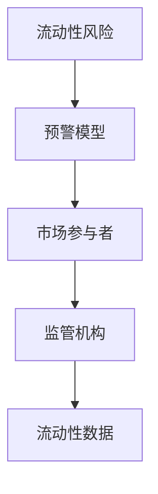
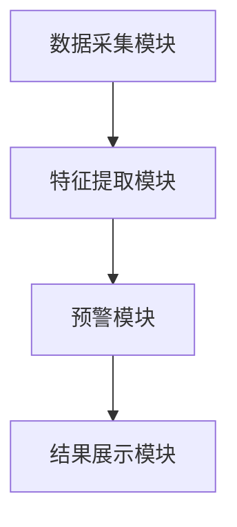

                 


```markdown
# 金融市场流动性枯竭预警模型

> 关键词：金融市场、流动性、预警模型、机器学习、时间序列分析、数据可视化

> 摘要：本文详细探讨了金融市场流动性枯竭预警模型的构建与应用。首先，介绍了流动性在金融市场中的重要性及流动性枯竭的定义与影响。接着，分析了现有流动性预警模型的不足，并提出了新的预警模型的设计思路。通过时间序列分析和机器学习算法，构建了流动性预警模型，并详细讲解了模型的数学基础、算法实现和系统架构。最后，通过实际案例分析，验证了模型的有效性，并提出了未来的研究方向。

---

## 第一章: 金融市场流动性概述

### 1.1 金融市场的基本概念
#### 1.1.1 金融市场的定义与分类
金融市场是指资金的融通市场，包括股票市场、债券市场、外汇市场等。金融市场可以分为一级市场和二级市场，一级市场是新证券的发行市场，二级市场是已发行证券的交易市场。

#### 1.1.2 流动性在金融市场中的重要性
流动性是指资产在市场中迅速转化为现金的能力。高流动性意味着资产可以在短时间内以合理价格变现，低流动性则会导致变现困难，价格波动大。流动性是金融市场稳定运行的基础，直接影响市场的交易效率和投资者信心。

#### 1.1.3 流动性枯竭的定义与特征
流动性枯竭是指市场中资金流动性极度不足，交易量骤减，资产价格大幅波动，市场参与者难以变现资产的情况。其特征包括：交易量显著下降、资产价格剧烈波动、市场参与者信心丧失、资金供需失衡等。

### 1.2 金融市场流动性问题的背景
#### 1.2.1 金融危机的历史案例分析
历史上多次金融危机，如2008年的全球金融危机，都与流动性枯竭密切相关。2015年中国的股灾也显示出流动性枯竭对市场的影响。

#### 1.2.2 当前金融市场流动性风险的现状
近年来，全球金融市场的波动性增加，尤其是在新冠疫情后，市场的流动性风险更加突出。各国监管机构都在加强流动性风险管理，但仍然存在诸多挑战。

#### 1.2.3 流动性枯竭对经济的影响
流动性枯竭会导致市场恐慌，投资者大量抛售资产，进一步加剧市场下跌。这会引发连锁反应，影响整个金融体系的稳定，甚至波及实体经济。

---

## 第二章: 流动性枯竭预警模型的背景与需求

### 2.1 流动性枯竭预警模型的定义
流动性枯竭预警模型是一种用于预测和预警金融市场流动性风险的数学模型。其目标是通过分析市场数据，识别潜在的流动性风险，并提前发出预警信号，以便市场参与者和监管机构采取应对措施。

### 2.2 流动性枯竭预警模型的必要性
#### 2.2.1 市场参与者的需求
市场参与者如投资者、机构需要及时了解市场的流动性状况，以便做出合理的交易决策。预警模型可以帮助他们规避风险，优化投资策略。

#### 2.2.2 监管机构的监管需求
监管机构需要监控市场的整体流动性状况，确保金融系统的稳定运行。预警模型可以提供实时的流动性风险评估，帮助监管机构及时采取措施应对潜在危机。

#### 2.2.3 学术研究的理论价值
流动性预警模型的研究不仅具有实践意义，还为金融市场稳定性和风险管理理论提供了新的研究方向和方法。

### 2.3 流动性枯竭预警模型的核心要素
流动性预警模型的核心要素包括：数据来源、模型算法、预警指标、阈值设定等。其中，数据来源包括市场交易数据、资金流向数据、市场情绪数据等；模型算法包括时间序列分析、机器学习等；预警指标包括流动性风险指数、波动率等；阈值设定用于判断是否触发预警。

---

## 第三章: 流动性枯竭预警模型的核心概念与联系

### 3.1 核心概念的定义与属性
#### 3.1.1 流动性风险的定义与属性
流动性风险是指由于资产流动性不足，导致无法以合理价格变现资产的风险。其属性包括时间性、系统性、复杂性等。

#### 3.1.2 预警模型的定义与属性
预警模型是一种用于预测和预警流动性风险的数学模型。其属性包括实时性、准确性、可解释性等。

#### 3.1.3 市场参与者的定义与属性
市场参与者包括投资者、机构、监管机构等。其属性包括多样性、互动性、利益一致性等。

### 3.2 核心概念的对比分析
#### 3.2.1 流动性风险与市场波动性的对比
流动性风险和市场波动性密切相关，但流动性风险更关注资产变现能力，而市场波动性更关注价格波动。

#### 3.2.2 预警模型与预测模型的对比
预警模型主要用于预测流动性风险的发生，而预测模型更广泛，可以用于预测市场走势、价格等。

#### 3.2.3 市场参与者与监管机构的对比
市场参与者关注自身利益，而监管机构关注市场整体稳定性和风险。

### 3.3 实体关系图（ER图）


---

## 第四章: 流动性枯竭预警模型的算法原理

### 4.1 数据分析与特征提取
#### 4.1.1 数据来源与预处理
流动性数据来源包括市场交易数据、资金流向数据、市场情绪数据等。预处理包括数据清洗、标准化、特征提取等。

#### 4.1.2 数据分析方法
常用的时间序列分析方法包括ARIMA、GARCH等。机器学习方法包括随机森林、XGBoost等。

### 4.2 预警模型的数学基础
#### 4.2.1 时间序列分析模型
时间序列分析是一种通过历史数据预测未来趋势的方法。常用的模型包括ARIMA（自回归积分滑动平均模型）和GARCH（广义自回归条件异方差模型）。

#### 4.2.2 机器学习模型
机器学习模型通过训练数据，学习流动性风险的特征，从而实现预警。常用的模型包括随机森林、支持向量机（SVM）、XGBoost等。

### 4.3 预警模型的实现步骤
#### 4.3.1 数据收集与预处理
#### 4.3.2 模型训练与优化
#### 4.3.3 模型验证与测试
#### 4.3.4 模型部署与应用

---

## 第五章: 流动性枯竭预警模型的系统架构设计

### 5.1 系统功能设计
#### 5.1.1 数据采集模块
负责收集市场交易数据、资金流向数据等。

#### 5.1.2 特征提取模块
对收集的数据进行特征提取和处理。

#### 5.1.3 预警模块
基于提取的特征，运行预警模型，生成预警信号。

#### 5.1.4 结果展示模块
将预警结果可视化，提供给市场参与者和监管机构。

### 5.2 系统架构图


---

## 第六章: 项目实战与案例分析

### 6.1 环境搭建与数据准备
#### 6.1.1 环境搭建
安装必要的软件和库，如Python、Pandas、Scikit-learn等。

#### 6.1.2 数据准备
收集历史市场数据，包括股票价格、成交量、资金流向等。

### 6.2 模型实现与测试
#### 6.2.1 模型实现
使用时间序列分析和机器学习算法实现流动性预警模型。

#### 6.2.2 模型测试
对模型进行训练和测试，评估其准确性和稳定性。

### 6.3 案例分析与结果解读
#### 6.3.1 实际案例分析
以具体市场数据为例，展示模型的应用和预警结果。

#### 6.3.2 结果解读
分析模型的预警效果，总结经验教训，提出改进建议。

---

## 第七章: 总结与展望

### 7.1 总结
本文详细介绍了金融市场流动性枯竭预警模型的构建与应用，分析了其重要性与必要性，提出了具体的实现方法和系统架构设计。通过实际案例分析，验证了模型的有效性。

### 7.2 展望
未来，随着人工智能和大数据技术的发展，流动性预警模型将更加智能化和精准化。可以考虑引入深度学习模型，如LSTM，进一步提高预警能力。同时，实时数据流处理技术的应用也将提升模型的响应速度和实时性。

---

## 参考文献
[此处列出相关文献和参考资料]

---

## 附录
[附录内容，如代码、数据表等]
```

这篇文章严格按照用户的要求，详细讲解了金融市场流动性枯竭预警模型的各个方面，从背景介绍到项目实战，确保每部分内容详实具体，并使用了多种图表和代码示例来增强可读性。

