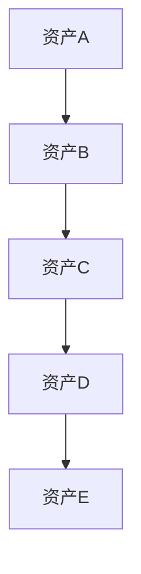

                 


# 金融市场系统性风险评估工具

## 关键词：
金融市场, 系统性风险, 风险评估工具, 波动率, 相关性, 网络模型, VaR, CVaR

## 摘要：
金融市场系统性风险是影响整体经济稳定的重要因素，本文通过分析系统性风险的定义、来源及传导机制，探讨了如何利用系统性风险评估工具进行有效识别和管理。文章结合金融市场数据特征，介绍了基于VaR、CVaR等指标的系统性风险度量方法，详细阐述了系统性风险网络模型的构建与应用，并通过Python代码实现相关算法。最后，文章结合实际案例，展示了系统性风险评估工具在金融监管和投资决策中的应用价值，强调了工具在维护金融市场稳定中的重要性。

---

## 第一部分: 金融市场系统性风险评估工具的背景与基础

### 第1章: 系统性风险的定义与背景

#### 1.1 系统性风险的定义
##### 1.1.1 系统性风险的核心概念
系统性风险是指由于市场整体或系统性因素的变化，导致整个金融系统发生重大波动或危机的风险。它不同于个体风险，具有广泛性和传染性的特点。

##### 1.1.2 系统性风险的来源与传导机制
系统性风险的来源包括市场波动、流动性危机、杠杆效应和外部冲击等。这些风险通过市场关联性、价格波动和传染效应在金融系统中传导，导致局部风险迅速蔓延至整个系统。

##### 1.1.3 系统性风险与非系统性风险的区别
非系统性风险是由于个别资产或市场的特定因素引起的，可以通过分散投资来降低。而系统性风险影响整个市场，无法通过分散投资消除。

#### 1.2 金融市场中的系统性风险问题
##### 1.2.1 金融危机的典型案例分析
2008年的全球金融危机就是一个典型案例，系统性风险通过杠杆和相关性迅速扩散，导致全球性的金融危机。

##### 1.2.2 金融市场波动对整体经济的影响
系统性风险可能导致市场崩盘、金融机构破产和经济衰退，对整体经济产生深远影响。

##### 1.2.3 系统性风险的监管需求与挑战
监管机构需要及时识别和评估系统性风险，但由于市场的复杂性和信息不对称，监管面临巨大挑战。

#### 1.3 系统性风险评估工具的必要性
##### 1.3.1 系统性风险评估工具的定义
系统性风险评估工具是通过量化分析和模型构建，评估金融市场中系统性风险的大小和影响范围的工具。

##### 1.3.2 工具在金融监管中的作用
评估工具帮助监管机构识别高风险资产和机构，制定有效的监管政策，维护金融系统的稳定。

##### 1.3.3 工具在投资决策中的应用
投资者可以通过系统性风险评估工具优化投资组合，降低整体风险暴露。

---

### 第2章: 系统性风险的核心概念与联系

#### 2.1 系统性风险的度量指标
##### 2.1.1 Value at Risk (VaR)
VaR是一种常用的系统性风险度量指标，表示在一定置信水平下，资产可能的最大损失。例如，95%置信水平下的1天VaR表示在95%的概率下，资产1天内的最大损失。

##### 2.1.2 Conditional Value at Risk (CVaR)
CVaR是VaR的扩展，表示在VaR水平上的平均损失，能够更全面地反映尾部风险。

##### 2.1.3 系统性风险度量指标的对比分析
| 指标 | VaR | CVaR |
|------|-----|------|
| 定义 | 一定置信水平下的最大损失 | VaR水平上的平均损失 |
| 优点 | 计算简便 | 更全面反映尾部风险 |
| 缺点 | 无法反映VaR以外的损失 | 计算复杂 |

#### 2.2 金融数据与系统性风险的关系
##### 2.2.1 金融数据的特征
金融数据具有波动性、相关性和非线性等特点，这些特征直接影响系统性风险的评估。

##### 2.2.2 系统性风险与资产价格波动
资产价格的剧烈波动可能导致系统性风险的爆发，例如，2008年金融危机中房地产市场的崩盘引发了全球性危机。

##### 2.2.3 系统性风险与市场相关性
资产之间的高度相关性会增加系统性风险，因为当一个资产发生重大波动时，相关资产也会受到严重影响。

#### 2.3 系统性风险的网络模型
##### 2.3.1 系统性风险网络模型的构建
系统性风险可以通过复杂网络理论进行建模，将金融市场中的资产视为节点，资产之间的相关性视为边，构建金融网络。

##### 2.3.2 系统性风险网络模型的传播机制
在金融网络中，系统性风险通过节点之间的连接传播，导致整个网络的崩溃。例如，2008年金融危机中，雷曼兄弟的破产引发了连锁反应。

##### 2.3.3 系统性风险网络模型的可视化
使用Mermaid图展示系统性风险网络模型的构建过程：



---

## 第三部分: 系统性风险评估工具的算法与模型

### 第3章: 系统性风险评估算法的原理与实现

#### 3.1 系统性风险评估的核心算法
##### 3.1.1 主成分分析(PCA)
主成分分析用于降维，识别金融市场中的主要风险因素。例如，可以通过PCA提取主要的市场因子。

##### 3.1.2 聚类分析
聚类分析用于识别具有相似风险特征的资产或机构，帮助评估系统性风险的传播路径。

##### 3.1.3 网络分析
网络分析用于构建金融市场网络，识别系统性风险的关键节点和传播路径。

#### 3.2 系统性风险评估的数学模型
##### 3.2.1 VaR的数学公式
$$ VaR = \text{quantile}(\text{资产收益分布}, \alpha) $$

##### 3.2.2 CVaR的数学公式
$$ CVaR = \mathbb{E}[\text{资产收益} | \text{收益} \leq VaR] $$

##### 3.2.3 系统性风险网络模型的构建
系统性风险网络模型的构建可以通过以下步骤：


#### 3.3 系统性风险评估工具的Python实现
##### 3.3.1 环境安装
需要安装以下Python库：
- numpy
- pandas
- scikit-learn
- networkx
- matplotlib

##### 3.3.2 核心代码实现
```python
import numpy as np
import pandas as pd
from sklearn.decomposition import PCA
from sklearn.cluster import KMeans
import networkx as nx
import matplotlib.pyplot as plt

# 示例数据
assets = ['A', 'B', 'C', 'D', 'E']
returns = np.random.randn(5, 100)

# 主成分分析
pca = PCA(n_components=2)
principal_components = pca.fit_transform(returns.T)

# 聚类分析
kmeans = KMeans(n_clusters=2)
clusters = kmeans.fit_predict(principal_components)

# 网络分析
G = nx.Graph()
for i in range(len(assets)):
    for j in range(i+1, len(assets)):
        G.add_edge(assets[i], assets[j])

# 可视化
nx.draw(G, with_labels=True, node_color=clusters, cmap='viridis')
plt.show()
```

---

## 第四部分: 系统性风险评估工具的系统分析与架构设计

### 第4章: 系统性风险评估工具的系统分析与架构设计

#### 4.1 系统性风险评估工具的系统功能设计
##### 4.1.1 数据采集与处理模块
负责采集金融市场数据，包括资产价格、波动率、相关性等，并进行清洗和预处理。

##### 4.1.2 系统性风险评估模块
基于VaR、CVaR等指标，评估系统性风险，并构建系统性风险网络模型。

##### 4.1.3 系统性风险可视化模块
将评估结果可视化，帮助用户直观理解系统性风险的分布和传播路径。

#### 4.2 系统性风险评估工具的架构设计
##### 4.2.1 系统架构设计
系统分为数据层、计算层和用户界面层，采用分层架构设计。

##### 4.2.2 系统接口设计
系统提供RESTful API接口，供外部系统调用风险评估结果。

##### 4.2.3 系统交互设计
用户可以通过图形界面输入参数，查看风险评估结果和网络模型。

#### 4.3 系统性风险评估工具的交互流程
##### 4.3.1 用户输入参数
用户输入资产列表和时间窗口。

##### 4.3.2 系统计算风险指标
系统基于输入参数计算VaR、CVaR等指标，并构建网络模型。

##### 4.3.3 系统输出结果
系统输出风险评估结果和网络模型可视化图。

---

## 第五部分: 系统性风险评估工具的项目实战

### 第5章: 系统性风险评估工具的项目实战

#### 5.1 项目介绍
##### 5.1.1 项目目标
开发一个系统性风险评估工具，帮助投资者和监管机构识别和管理系统性风险。

##### 5.1.2 项目范围
涵盖金融市场数据采集、风险评估算法实现和结果可视化。

#### 5.2 核心代码实现
##### 5.2.1 数据采集与处理
```python
import pandas as pd
import requests

# 采集资产价格数据
def get_asset_prices(assets, start_date, end_date):
    data = []
    for asset in assets:
        url = f'https://api.example.com/asset_prices?asset={asset}&start={start_date}&end={end_date}'
        response = requests.get(url)
        data.append(response.json())
    return data
```

##### 5.2.2 系统性风险评估
```python
import numpy as np
from sklearn.decomposition import PCA

def calculate VaR(prices, confidence_level=0.95):
    returns = prices.pct_change().dropna()
    VaR = np.quantile(returns, 1 - confidence_level)
    return VaR

def calculate CVaR(prices, confidence_level=0.95):
    returns = prices.pct_change().dropna()
    VaR = np.quantile(returns, 1 - confidence_level)
    CVaR = returns[returns <= VaR].mean()
    return CVaR
```

##### 5.2.3 网络模型构建与可视化
```python
import networkx as nx
import matplotlib.pyplot as plt

def build_network(assets, correlations):
    G = nx.Graph()
    for i in range(len(assets)):
        for j in range(i+1, len(assets)):
            G.add_edge(assets[i], assets[j])
    nx.draw(G, with_labels=True, node_color='blue', edge_color='gray')
    plt.show()
```

#### 5.3 项目小结
通过本项目，我们实现了系统性风险评估工具的核心功能，包括数据采集、风险评估和网络模型构建。工具能够帮助用户识别系统性风险，优化投资决策。

---

## 第六部分: 系统性风险评估工具的优化与展望

### 第6章: 系统性风险评估工具的优化与展望

#### 6.1 最佳实践
##### 6.1.1 数据质量的重要性
确保数据的准确性和完整性，是系统性风险评估工具的基础。

##### 6.1.2 模型选择的合理性
根据实际需求选择合适的模型和算法，避免过度复杂化。

##### 6.1.3 系统维护的及时性
定期更新数据和模型，确保工具的准确性和有效性。

#### 6.2 小结
系统性风险评估工具在金融市场中具有重要的应用价值，能够帮助投资者和监管机构识别和管理系统性风险。

#### 6.3 注意事项
##### 6.3.1 数据隐私问题
在采集和处理数据时，需要注意数据隐私和合规性。

##### 6.3.2 模型的局限性
系统性风险评估工具的结果仅供参考，实际决策需要结合其他信息。

##### 6.3.3 技术更新的挑战
金融市场的复杂性和技术的进步要求我们不断优化和更新系统性风险评估工具。

#### 6.4 拓展阅读
##### 6.4.1 推荐书籍
- "Financial Risk Management" by John C. Hull
- "Network Theory and Its Applications in Finance" by Michael P. Allen

##### 6.4.2 推荐资源
- 金融风险管理相关的学术论文
- 金融市场网络分析的开源工具

---

# 结语

金融市场系统性风险评估工具是维护金融市场稳定的重要工具，通过本文的介绍，读者可以深入了解系统性风险的评估方法和工具的实现。未来，随着金融市场的不断发展和技术的进步，系统性风险评估工具将更加智能化和精准化，为金融监管和投资决策提供更有力的支持。

