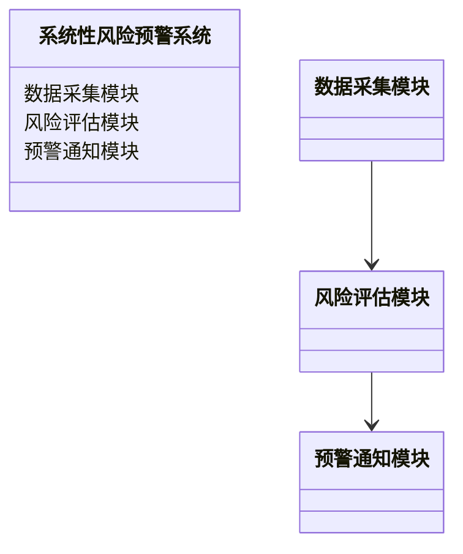
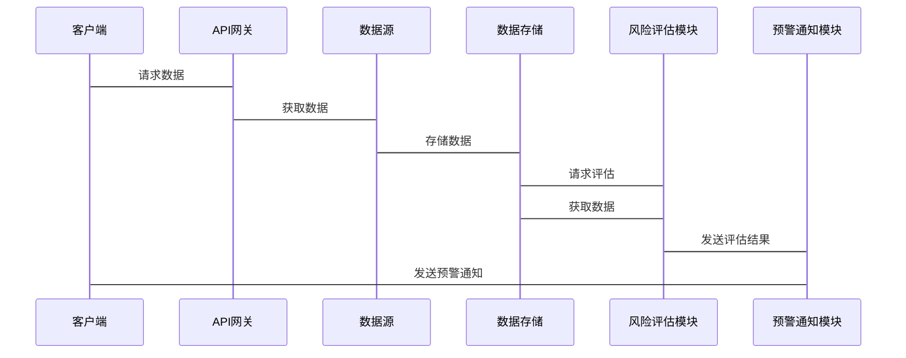

                 


# 金融市场系统性风险预警模型

> 关键词：系统性风险、预警模型、金融市场、数据驱动、风险管理

> 摘要：本文系统性地探讨了金融市场系统性风险预警模型的构建与应用，从理论基础到实际操作，详细阐述了模型的设计思路、核心算法、系统架构和项目实战，旨在为金融从业者和数据科学家提供一套高效的风险预警解决方案。

---

## 第一部分: 金融市场系统性风险预警模型概述

### 第1章: 系统性风险的基本概念

#### 1.1 系统性风险的定义与特征
- **1.1.1 系统性风险的定义**
  - 系统性风险是指影响整个金融系统或市场的风险，而非特定于某个资产或个体。
  - 例如，2008年的全球金融危机就是一个典型的系统性风险事件。

- **1.1.2 系统性风险的特征**
  - **普遍性**：影响范围广泛，涉及多个市场和机构。
  - **传染性**：风险可能在不同市场和机构之间迅速传播。
  - **不可分散性**：无法通过资产多样化完全规避。

- **1.1.3 系统性风险与非系统性风险的对比**
  - 非系统性风险：特定于某个资产或个体，可以通过分散化投资规避。
  - 系统性风险：影响整个市场，无法通过分散化规避。

#### 1.2 系统性风险的来源与影响
- **1.2.1 系统性风险的主要来源**
  - 市场流动性风险：市场参与者大量抛售资产导致流动性不足。
  - 金融机构的脆弱性：金融机构之间的高度关联性导致风险传染。
  - 宏观经济波动：经济衰退、政策变化等宏观因素影响整个市场。

- **1.2.2 系统性风险对金融市场的冲击**
  - 市场波动加剧，资产价格大幅波动。
  - 金融机构的信用风险增加，可能导致连锁反应。

- **1.2.3 系统性风险对经济的影响**
  - 经济衰退，企业倒闭，失业率上升。
  - 投资者信心下降，影响整体经济活动。

#### 1.3 系统性风险预警的重要性
- **1.3.1 系统性风险预警的必要性**
  - 提前识别潜在风险，采取措施降低风险。
  - 避免系统性风险的蔓延，维护金融稳定。

- **1.3.2 系统性风险预警的实现目标**
  - 及时发现潜在风险，评估风险的严重程度。
  - 提供预警信号，指导金融机构和监管机构采取应对措施。

- **1.3.3 系统性风险预警的边界与外延**
  - 边界：仅关注系统性风险，不包括非系统性风险。
  - 外延：涵盖金融市场的多个方面，包括宏观经济、机构间关联性等。

---

### 第2章: 系统性风险预警模型的核心概念

#### 2.1 系统性风险预警模型的构成要素
- **2.1.1 数据源的选择与处理**
  - 数据来源：金融市场数据（股票价格、债券收益率）、宏观经济指标（GDP、通货膨胀率）、机构间关联性数据等。
  - 数据处理：数据清洗、标准化、特征提取。

- **2.1.2 风险指标的构建与筛选**
  - 常用风险指标：波动率、VaR（在险价值）、信用违约风险等。
  - 指标筛选：基于统计显著性和理论意义选择关键指标。

- **2.1.3 预警阈值的设定与优化**
  - 预警阈值：根据历史数据和风险容忍度设定。
  - 优化方法：使用历史回测和压力测试调整阈值。

#### 2.2 系统性风险预警模型的数学基础
- **2.2.1 概率论与统计学基础**
  - 概率论：用于评估事件发生的可能性。
  - 统计学：用于数据分析和模型构建。

- **2.2.2 时间序列分析方法**
  - ARIMA模型：用于预测时间序列数据。
  - GARCH模型：用于捕捉波动率的变化。

- **2.2.3 马科夫链与隐马尔可夫模型**
  - 马科夫链：用于描述系统的状态转移。
  - 隐马尔可夫模型：用于处理隐藏状态和观测数据的关系。

#### 2.3 系统性风险预警模型的算法原理
- **2.3.1 主成分分析（PCA）**
  - 算法步骤：
    1. 数据标准化。
    2. 计算协方差矩阵。
    3. 计算特征值和特征向量。
    4. 选择前几个主成分。
  - 代码示例：
    ```python
    import numpy as np
    from sklearn.decomposition import PCA
    
    # 假设X是数据矩阵
    pca = PCA(n_components=2)
    principal_components = pca.fit_transform(X)
    ```

- **2.3.2 聚类分析（Clustering）**
  - 常用算法：K-means、层次聚类。
  - 代码示例：
    ```python
    from sklearn.cluster import KMeans
    
    kmeans = KMeans(n_clusters=3)
    kmeans.fit(X)
    clusters = kmeans.labels_
    ```

- **2.3.3 支持向量机（SVM）**
  - 算法步骤：
    1. 数据映射到高维空间。
    2. 找到超平面分割数据。
    3. 回归或分类任务。
  - 代码示例：
    ```python
    from sklearn.svm import SVC
    
    svm = SVC(kernel='rbf')
    svm.fit(X, y)
    ```

- **2.3.4 随机森林（Random Forest）**
  - 算法步骤：
    1. 生成多个决策树。
    2. 训练时随机选择特征和样本。
    3. 集成预测结果。
  - 代码示例：
    ```python
    from sklearn.ensemble import RandomForestClassifier
    
    rf = RandomForestClassifier(n_estimators=100)
    rf.fit(X, y)
    ```

---

### 第3章: 系统性风险预警模型的构建与实现

#### 3.1 数据预处理与特征提取
- **3.1.1 数据清洗与标准化**
  - 数据清洗：处理缺失值、异常值。
  - 标准化：将数据标准化到同一尺度。

- **3.1.2 特征选择与降维**
  - 特征选择：使用相关性分析、Lasso回归等方法选择重要特征。
  - 降维：使用PCA等方法降低数据维度。

- **3.1.3 时间序列数据的特征提取**
  - 滑动窗口统计量：均值、标准差、最大值、最小值等。
  - 增量特征：收益率、波动率、相关系数等。

#### 3.2 系统性风险预警模型的训练与优化
- **3.2.1 模型训练流程**
  1. 数据分割：训练集、验证集、测试集。
  2. 模型训练：使用训练数据训练模型。
  3. 模型验证：使用验证数据调整参数。
  4. 模型测试：使用测试数据评估性能。

- **3.2.2 超参数优化与调参**
  - 使用网格搜索、随机搜索等方法优化模型参数。
  - 例如，使用网格搜索优化随机森林的n_estimators和max_depth参数。

- **3.2.3 模型评估与验证**
  - 评估指标：准确率、召回率、F1分数、AUC值等。
  - 交叉验证：使用k折交叉验证评估模型的泛化能力。

#### 3.3 系统性风险预警模型的部署与应用
- **3.3.1 模型的实时监控与更新**
  - 实时数据流处理：持续更新模型，捕捉最新风险信号。
  - 在线学习：使用流数据更新模型。

- **3.3.2 模型的可解释性分析**
  - 特征重要性分析：确定哪些特征对风险预警影响最大。
  - 使用SHAP值等方法解释模型预测结果。

- **3.3.3 模型的鲁棒性与稳定性测试**
  - 稳定性测试：在不同市场条件下测试模型的稳定性。
  - 鲁棒性测试：测试模型在数据分布变化情况下的表现。

---

### 第4章: 系统性风险预警模型的系统架构设计

#### 4.1 系统需求分析
- **4.1.1 系统目标**
  - 实时监测金融市场风险。
  - 提供风险预警信号。
  - 支持决策者制定风险管理策略。

- **4.1.2 系统功能需求**
  - 数据采集：实时采集金融市场数据。
  - 风险评估：基于模型评估系统性风险。
  - 预警通知：当风险超过阈值时，发送预警通知。

#### 4.2 系统功能设计（领域模型）


#### 4.3 系统架构设计


#### 4.4 系统接口设计
- **接口1：数据采集接口**
  - 输入：时间戳、市场数据。
  - 输出：数据存储到数据库。

- **接口2：风险评估接口**
  - 输入：市场数据。
  - 输出：风险评估结果。

- **接口3：预警通知接口**
  - 输入：风险评估结果。
  - 输出：发送预警通知。

#### 4.5 系统交互设计


---

### 第5章: 项目实战

#### 5.1 环境配置
- **5.1.1 安装Python**
  - 使用Anaconda或虚拟环境管理Python版本。
- **5.1.2 安装依赖库**
  - 使用pip安装numpy、pandas、scikit-learn、xgboost等库。

#### 5.2 系统核心实现
- **5.2.1 数据预处理**
  ```python
  import pandas as pd
  import numpy as np

  # 读取数据
  df = pd.read_csv('market_data.csv')
  # 数据清洗
  df.dropna(inplace=True)
  # 标准化
  from sklearn.preprocessing import StandardScaler
  scaler = StandardScaler()
  X_scaled = scaler.fit_transform(df.drop('label', axis=1))
  ```

- **5.2.2 特征提取与选择**
  ```python
  from sklearn.feature_selection import SelectKBest, f_classif

  selector = SelectKBest(score_func=f_classif, k=5)
  X_selected = selector.fit_transform(X_scaled, df['label'])
  ```

- **5.2.3 模型训练与优化**
  ```python
  from sklearn.ensemble import RandomForestClassifier
  from sklearn.model_selection import GridSearchCV

  # 参数网格搜索
  param_grid = {'n_estimators': [100, 200], 'max_depth': [None, 10]}
  grid_search = GridSearchCV(RandomForestClassifier(), param_grid, cv=5)
  grid_search.fit(X_selected, df['label'])
  best_model = grid_search.best_estimator_
  ```

- **5.2.4 模型评估**
  ```python
  from sklearn.metrics import classification_report

  y_pred = best_model.predict(X_selected)
  print(classification_report(df['label'], y_pred))
  ```

- **5.2.5 模型部署**
  ```python
  import joblib

  # 保存模型
  joblib.dump(best_model, 'risk预警模型.pkl')
  # 加载模型
  loaded_model = joblib.load('risk预警模型.pkl')
  ```

#### 5.3 项目小结
- **5.3.1 核心实现总结**
  - 数据预处理：清洗、标准化、特征选择。
  - 模型训练：随机森林模型优化。
  - 模型部署：保存模型并部署到生产环境。

- **5.3.2 案例分析**
  - 使用实际金融市场数据进行案例分析，展示模型在实际中的应用。
  - 例如，使用历史数据预测某次金融危机的风险。

- **5.3.3 项目总结**
  - 项目的成功之处。
  - 存在的问题及改进建议。

---

### 第6章: 总结与展望

#### 6.1 总结
- 本文详细介绍了金融市场系统性风险预警模型的构建与应用。
- 从理论基础到实际操作，全面阐述了系统的各个组成部分。

#### 6.2 展望
- **算法优化**：引入深度学习、强化学习等新技术。
- **数据源扩展**：引入更多维度的数据，如社交媒体情绪数据。
- **系统优化**：提升系统的实时性和可扩展性。

#### 6.3 最佳实践 tips
- **数据质量**：确保数据的准确性和完整性。
- **模型选择**：根据实际需求选择合适的算法。
- **实时性**：在实际应用中，需关注模型的实时性和响应速度。

#### 6.4 注意事项
- 风险模型的复杂性与准确性之间需要平衡。
- 模型的解释性在实际应用中非常重要。

#### 6.5 拓展阅读
- 推荐阅读相关领域的书籍和论文，如《金融风险管理》、《时间序列分析》等。

---

通过本文的系统性讲解，读者可以全面掌握金融市场系统性风险预警模型的构建方法和实际应用，为金融风险管理提供有力支持。

