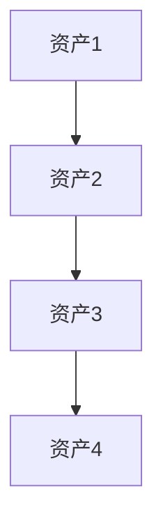
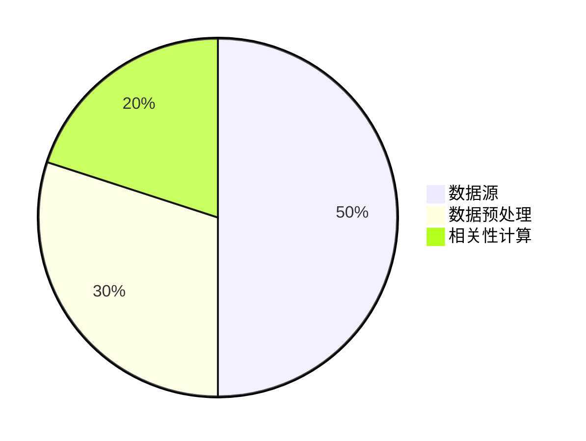

                 


# 金融市场跨资产相关性网络分析工具

## 关键词：金融市场，跨资产相关性，网络分析，风险管理，投资组合优化

## 摘要：  
金融市场跨资产相关性网络分析工具是一种通过构建资产相关性网络来分析和优化投资组合的工具。本文详细介绍了相关性网络分析的核心概念、算法原理、系统架构以及实际应用，帮助投资者更好地理解资产之间的相互关系，从而做出更科学的投资决策。

---

# 正文

## 第一章：背景与概述

### 1.1 问题背景与定义

金融市场中的资产价格受多种因素影响，包括宏观经济指标、行业动态和市场情绪等。为了更好地理解资产之间的相互关系，投资者需要分析它们的相关性。跨资产相关性网络分析通过构建资产相关性网络，将复杂的市场关系可视化，帮助投资者识别潜在的风险和机会。

**相关性网络分析的定义**：  
跨资产相关性网络分析是通过计算多个资产之间的相关性，构建一个网络图，其中节点代表资产，边的权重代表资产之间的相关性强度。

### 1.2 相关性网络分析的重要性

1. **风险管理**：通过识别高度相关的资产，投资者可以降低投资组合的系统性风险。
2. **投资组合优化**：相关性网络分析帮助投资者发现低相关的资产，从而优化资产配置。
3. **市场结构分析**：网络分析揭示市场中的关键资产和潜在的市场联动效应。

### 1.3 与其他金融工具的区别

与其他相关性分析方法相比，跨资产相关性网络分析具有以下独特优势：

1. **网络结构**：通过构建网络图，直观展示资产之间的关系。
2. **非线性关系**：网络分析可以捕捉非线性相关性，而传统的相关性分析仅考虑线性关系。

---

## 第二章：核心概念与原理

### 2.1 相关性网络分析的原理

相关性网络分析的核心在于计算资产之间的相关性，并构建网络结构。以下是其实现步骤：

1. **数据采集**：获取多个资产的历史价格数据。
2. **相关性计算**：使用相关系数（如皮尔逊相关系数）计算资产之间的相关性。
3. **网络构建**：基于相关性矩阵构建网络图，选择合适的算法（如Kruskal算法）确定网络结构。

**皮尔逊相关系数公式**：  
$$ r_{xy} = \frac{\sum (x_i - \bar{x})(y_i - \bar{y})}{\sqrt{\sum (x_i - \bar{x})^2 \sum (y_i - \bar{y})^2}} $$

### 2.2 相关性网络分析的关键属性

1. **网络密度**：网络中边的数量与可能边数的比率，反映市场的整体相关性程度。
2. **网络聚类系数**：衡量网络中资产的集群程度，反映市场中的行业或板块联动效应。
3. **网络中心性**：识别网络中的关键资产，这些资产在市场中具有重要影响力。

### 2.3 实体关系图

以下是一个简单的资产相关性网络图示：



---

## 第三章：算法原理

### 3.1 相关性计算的数学模型

1. **皮尔逊相关系数**：用于衡量两个资产之间的线性相关性。
2. **斯皮尔曼相关系数**：用于衡量两个资产之间的秩相关性。

**斯皮尔曼相关系数公式**：  
$$ \rho = \frac{\sum_{i=1}^{n} (x_i - \bar{x})(y_i - \bar{y})}{\sqrt{\sum_{i=1}^{n} (x_i - \bar{x})^2 \sum_{i=1}^{n} (y_i - \bar{y})^2}} $$

### 3.2 网络构建算法

1. **Kruskal算法**：用于构建最小生成树，选择相关性最强的边。
2. **谱聚类算法**：基于资产的相关性矩阵进行聚类分析。

**Kruskal算法步骤**：  
1. 计算所有资产对的相关性。  
2. 按相关性从高到低排序，选择权重最高的边，逐步构建网络。

---

## 第四章：系统架构与设计

### 4.1 系统功能设计

1. **数据采集模块**：获取资产价格数据，支持多种数据源。
2. **相关性计算模块**：计算资产之间的相关性矩阵。
3. **网络构建模块**：基于相关性矩阵构建资产相关性网络。
4. **网络可视化模块**：将网络结构以图形形式展示。

### 4.2 系统架构设计

以下是一个系统的架构图：



---

## 第五章：项目实战

### 5.1 环境搭建

1. **安装Python库**：numpy、pandas、networkx、matplotlib。
2. **数据获取**：使用Yahoo Finance获取股票数据。

### 5.2 核心代码实现

```python
import numpy as np
import pandas as pd
from sklearn.metrics import pairwise_distances

# 示例数据：假设我们有三支股票的数据
data = {
    '股票A': [10, 20, 30, 40, 50],
    '股票B': [15, 25, 35, 45, 55],
    '股票C': [25, 15, 25, 35, 45]
}
df = pd.DataFrame(data)

# 计算相关性矩阵
correlation_matrix = df.corr()

print(correlation_matrix)
```

### 5.3 案例分析

1. **数据采集**：获取三支股票的历史价格数据。
2. **相关性计算**：计算相关性矩阵。
3. **网络构建**：基于相关性矩阵构建网络图。

---

## 第六章：最佳实践与总结

### 6.1 总结与经验分享

跨资产相关性网络分析是一种强大的工具，能够帮助投资者更好地理解市场结构，优化投资组合。在实际应用中，需要注意数据的质量和算法的适用性。

### 6.2 注意事项

1. **数据质量**：确保数据的完整性和准确性。
2. **算法选择**：根据具体需求选择合适的算法。
3. **结果解释**：避免过度依赖模型，结合市场实际情况进行分析。

### 6.3 未来展望

随着人工智能和大数据技术的发展，跨资产相关性网络分析将更加智能化和个性化，为投资者提供更精准的决策支持。

---

通过以上步骤，我们可以构建一个强大的跨资产相关性网络分析工具，帮助投资者在复杂多变的金融市场中做出更明智的投资决策。

