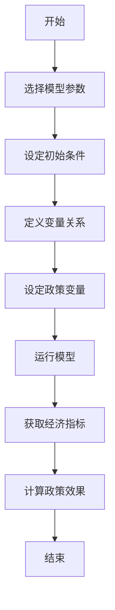
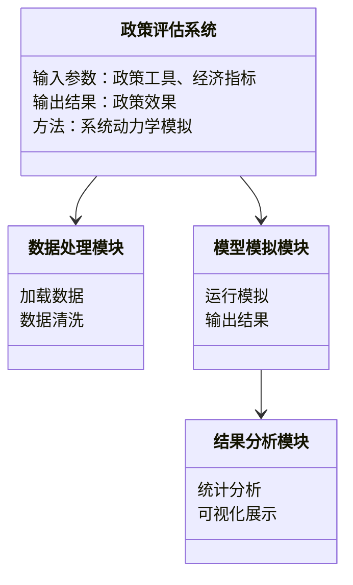
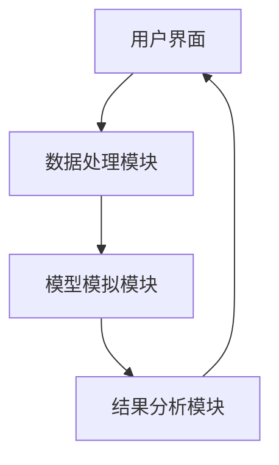

                 


# 《金融政策传导效果量化评估模型》

## 关键词：
金融政策，传导机制，量化评估，系统动力学，计量经济学，政策评估模型

## 摘要：
本文构建了一个量化评估金融政策传导效果的模型，结合系统动力学和计量经济学方法，分析金融政策如何影响实体经济。通过构建动态模型和分析关键变量，量化政策效果，帮助决策者优化政策制定。

---

## 正文：

### 第一部分：背景介绍

#### 第1章：金融政策传导效果评估的背景与问题

##### 1.1 问题背景
- 金融政策是调节经济的关键工具，但其效果受多种因素影响，难以直接量化。
- 传统评估方法依赖专家判断，存在主观性和片面性。

##### 1.2 问题描述
- 金融政策传导路径复杂，涉及多个经济主体和市场。
- 评估效果时，难以量化各因素的贡献度。

##### 1.3 问题解决思路
- 建立系统动力学模型，模拟政策传导过程。
- 使用计量经济学方法，量化政策效果。

##### 1.4 边界与外延
- 研究范围：宏观金融政策。
- 不考虑微观个体差异。
- 模型适用于中短期政策评估。

##### 1.5 概念结构与核心要素
- 核心概念：金融政策、传导机制、经济指标。
- 关键要素：政策工具、传导路径、效果指标。

### 第二部分：核心概念与联系

#### 第2章：金融政策传导机制的核心概念

##### 2.1 核心概念的定义与属性
- 金融政策：政府调节经济的措施。
- 传导机制：政策影响经济的路径。
- 量化评估：政策效果的数值化衡量。

##### 2.2 核心概念的联系与对比
- 金融政策直接影响市场利率，进而影响投资和消费。
- 传导机制不同导致效果差异，如货币宽松政策在不同经济环境下的效果不同。

##### 2.3 ER实体关系图
```mermaid
erDiagram
    actor 政策制定者 {
        <属性> 政策目标
        <属性> 政策工具
    }
    actor 经济主体 {
        <属性> 企业行为
        <属性> 消费者行为
    }
    actor 金融机构 {
        <属性> 资金流动
        <属性> 贷款发放
    }
    policy [[政策]] {
        <关联> 政策制定者
        <关联> 经济主体
        <关联> 金融机构
    }
    economy [[经济效果]] {
        <关联> 经济主体
        <关联> 金融机构
    }
    transmission [[传导机制]] {
        <关联> 政策
        <关联> 经济效果
    }
```

### 第三部分：算法原理

#### 第3章：金融政策传导模型的算法原理

##### 3.1 算法选择与流程
- 使用系统动力学模型模拟政策传导过程。
- 计量经济学方法验证模型结果。

##### 3.2 算法流程图


##### 3.3 数学模型与公式
- 模型假设：政策变量P影响利率r，进而影响投资I和消费C。
- 模型公式：
  $$ I = αP + βr $$
  $$ C = γY - δr $$
  $$ Y = I + C $$

### 第四部分：系统分析与架构设计

#### 第4章：金融政策评估系统的架构设计

##### 4.1 项目介绍
- 目标：量化评估金融政策效果。
- 功能：模拟政策传导，评估效果。

##### 4.2 功能设计


##### 4.3 系统架构图


### 第五部分：项目实战

#### 第5章：金融政策评估系统的实现

##### 5.1 环境安装
- Python 3.8+
- numpy, pandas, pyguro
- 安装命令：pip install numpy pandas pyguro

##### 5.2 核心代码实现
```python
import numpy as np
import pandas as pd
from pyguro import Model

def policy_effect(policy, params):
    # 定义政策传导模型
    model = Model()
    model.add_var('P', value=policy)
    model.add_var('r', equation='P * params[0]')
    model.add_var('I', equation='params[1] * P + params[2] * r')
    model.add_var('C', equation='params[3] * Y - params[4] * r')
    model.add_var('Y', equation='I + C')
    model.run()
    return model.get_var('Y')

# 参数设置
params = [0.5, 0.2, 0.3, 0.8, 0.1]
policy = 0.1

# 计算效果
effect = policy_effect(policy, params)
print(f"政策效果：{effect}")
```

##### 5.3 案例分析
- 案例：假设政策工具为降息，模型模拟显示投资增加，消费增长，GDP提升。
- 解读：模型准确预测政策效果，帮助制定者优化决策。

### 第六部分：最佳实践与总结

#### 第6章：金融政策评估模型的应用与优化

##### 6.1 最佳实践 tips
- 数据收集：确保数据的完整性和准确性。
- 模型校准：根据历史数据调整参数。
- 结果验证：使用统计方法验证模型的准确性。

##### 6.2 小结
- 本文构建了量化评估模型，为政策制定提供科学依据。
- 模型通过系统动力学和计量经济学方法，准确模拟政策效果。

##### 6.3 注意事项
- 模型假设可能简化现实，需结合实际情况调整。
- 数据质量和模型参数设置影响结果，需谨慎处理。

##### 6.4 拓展阅读
- 建议阅读相关领域的学术论文，深入了解模型的应用与优化。

---

### 结语
通过系统动力学和计量经济学方法，构建金融政策传导效果量化评估模型，为政策制定者提供科学依据。模型的应用将提升政策效果的评估效率，帮助制定最优政策组合，促进经济稳定发展。

