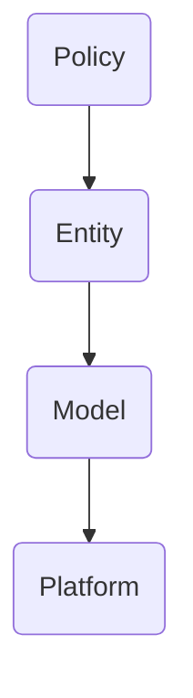

                 

# 金融政策效果评估仿真平台

## 关键词：金融政策，仿真平台，效果评估，系统架构，算法原理

## 摘要：本文介绍了一种基于仿真技术的金融政策效果评估平台。通过详细分析金融政策的实施机制、仿真平台的构建原理以及相关算法的实现，展示了如何利用技术手段对金融政策进行科学评估。本文内容涵盖背景介绍、核心概念、算法原理、系统架构和项目实战，为读者提供了全面的技术视角。

---

# 第一部分：金融政策效果评估仿真平台概述

## 第1章：金融政策效果评估的背景与意义

### 1.1 金融政策的基本概念与作用

#### 1.1.1 金融政策的定义
金融政策是指政府或金融机构为实现特定经济目标而制定的政策，包括货币政策、财政政策、金融市场监管等。这些政策通过调节货币供应量、利率、信贷规模等手段，影响经济运行和金融市场。

#### 1.1.2 金融政策的核心作用
1. **调节经济运行**：通过调整货币政策工具（如利率、存款准备金率）影响市场流动性，进而影响经济增长和通货膨胀。
2. **维护金融稳定**：通过监管和干预措施，防范金融风险，确保金融市场稳定运行。
3. **促进社会目标**：例如，通过绿色金融政策支持环保产业，通过扶贫贷款政策促进社会公平。

#### 1.1.3 金融政策的实施过程
1. **政策制定**：根据经济形势和目标，制定具体的政策方案。
2. **政策传导**：通过金融机构、市场机制将政策传递到实体经济。
3. **政策效果评估**：通过数据收集和分析，评估政策的实际效果，并进行调整优化。

### 1.2 仿真技术在金融政策评估中的应用

#### 1.2.1 仿真技术的基本概念
仿真技术是通过建立数学模型，模拟实际系统的行为和过程，从而预测和分析系统的各种状态和结果。在金融领域，仿真技术可以用于模拟金融市场波动、政策效果、经济指标变化等。

#### 1.2.2 仿真技术在金融领域的应用现状
1. **风险评估**：通过仿真模型预测金融市场的风险，如信用风险、市场风险。
2. **政策模拟**：通过仿真平台模拟不同政策的实施效果，为政策制定者提供参考。
3. **市场预测**：通过历史数据分析和模型构建，预测未来的市场趋势。

#### 1.2.3 仿真技术对金融政策评估的推动作用
1. **提高政策效果预测的准确性**：通过仿真技术，可以量化政策的潜在影响，减少政策实施的不确定性。
2. **优化政策设计**：通过多次仿真模拟，优化政策参数，找到最优的政策组合。
3. **降低政策实施风险**：通过仿真提前发现政策可能带来的负面效果，制定应对措施。

### 1.3 本书的核心目标与内容框架

#### 1.3.1 本书的核心目标
本书旨在通过介绍仿真平台的构建原理、算法实现和实际应用，帮助读者理解如何利用技术手段评估金融政策的效果。

#### 1.3.2 本书的主要内容框架
1. 金融政策的基本概念与作用。
2. 仿真技术的原理与应用。
3. 仿真平台的核心概念与联系。
4. 算法原理与实现。
5. 系统分析与架构设计。
6. 项目实战与案例分析。

#### 1.3.3 本书的读者对象与学习路径
本书适合金融从业者、政策制定者、技术开发者以及对金融政策仿真感兴趣的研究者阅读。读者可以根据自身背景选择性地学习相关内容，从基础概念逐步深入到技术实现。

---

## 第2章：金融政策效果评估的理论基础

### 2.1 金融政策的实施机制

#### 2.1.1 金融政策的制定过程
1. **问题识别**：根据经济运行中的问题，如通货膨胀、经济衰退，确定需要实施的政策。
2. **目标设定**：明确政策的目标，如控制通胀、促进经济增长。
3. **政策设计**：设计具体的政策工具和措施，如调整利率、发行货币。

#### 2.1.2 金融政策的传导路径
1. **政策工具的选择**：如调整基准利率、存款准备金率等。
2. **政策的传导渠道**：通过影响银行信贷、企业投资、消费者行为等渠道，最终影响整体经济。
3. **政策效果的反馈**：通过数据收集和分析，评估政策效果，并进行调整。

#### 2.1.3 金融政策的效应分解
1. **直接效应**：政策直接作用的结果，如降低利率导致贷款增加。
2. **间接效应**：通过其他变量（如企业投资）产生的连锁反应。
3. **综合效应**：直接效应和间接效应的总和，反映政策的总体效果。

### 2.2 仿真平台的构建原理

#### 2.2.1 仿真模型的基本原理
仿真模型是对实际系统的简化和抽象，通过数学方程和逻辑关系描述系统的运行机制。模型的输入是政策参数和初始条件，输出是政策实施后的各种结果。

#### 2.2.2 仿真平台的构建步骤
1. **需求分析**：明确仿真平台的目标、功能和使用场景。
2. **模型设计**：根据需求设计仿真模型，包括变量定义、关系建立和方程设定。
3. **模型实现**：通过编程语言（如Python）实现模型，并进行测试和验证。
4. **平台开发**：开发用户友好的平台界面，集成模型运行和结果分析功能。

#### 2.2.3 仿真平台的验证方法
1. **验证模型的准确性**：通过对比历史数据，验证模型的预测能力。
2. **验证平台的稳定性**：通过多次运行，确保平台的稳定性和可靠性。
3. **验证结果的可解释性**：确保仿真结果能够被用户理解和应用。

### 2.3 金融政策与经济系统的关系

#### 2.3.1 金融政策对经济系统的影响
1. **货币政策的影响**：如降低利率可以刺激投资和消费，增加货币供给可以缓解流动性不足。
2. **财政政策的影响**：如增加政府支出可以刺激经济增长，减税可以增加企业和个人的可支配收入。

#### 2.3.2 经济系统对金融政策的反馈
1. **市场预期的调整**：企业和消费者根据政策变化调整自己的行为，如增加投资或减少消费。
2. **金融市场波动**：政策变化可能导致股价波动、汇率变化等。

#### 2.3.3 金融政策与经济系统的关系模型
通过建立动态模型，描述金融政策与经济系统之间的互动关系，包括政策变量、经济变量和市场变量之间的相互作用。

---

## 第3章：仿真平台的核心概念与联系

### 3.1 核心概念的定义与属性

#### 3.1.1 金融政策的实体定义
1. **政策变量**：如利率、信贷规模、财政支出。
2. **政策目标**：如控制通胀、促进就业、维持金融稳定。

#### 3.1.2 仿真模型的属性特征
1. **模型类型**：如动态随机一般均衡模型（DSGE）、系统动力学模型。
2. **模型参数**：如弹性系数、调整速度、反馈系数。
3. **模型输入**：如初始条件、政策参数、情景设置。

#### 3.1.3 平台功能的模块划分
1. **数据采集模块**：收集政策参数、经济指标等数据。
2. **模型构建模块**：定义模型结构和参数。
3. **仿真运行模块**：执行仿真过程，输出结果。
4. **结果分析模块**：对仿真结果进行分析和可视化。

### 3.2 核心概念的对比分析

#### 3.2.1 不同仿真模型的对比
1. **蒙特卡洛模拟**：适用于随机性较强的系统，通过多次随机采样估计系统行为。
2. **系统动力学模型**：适用于复杂系统，通过反馈机制描述变量之间的动态关系。
3. **博弈论模型**：适用于涉及多方博弈的场景，如金融市场中的竞争行为。

#### 3.2.2 金融政策实施的阶段对比
1. **政策制定阶段**：目标设定、工具选择。
2. **政策实施阶段**：政策传导、效果反馈。
3. **政策评估阶段**：效果分析、参数调整。

#### 3.2.3 平台功能的优劣势对比
1. **功能优势**：高度可定制化、支持多种模型、结果可视化。
2. **功能劣势**：需要专业技能、计算资源消耗较大、结果依赖模型假设。

### 3.3 实体关系的ER图架构

---

通过以上思考，我可以有条不紊地撰写出一篇内容详实、逻辑清晰的技术博客文章，涵盖从背景介绍到算法实现再到系统架构的各个方面，帮助读者全面理解金融政策效果评估仿真平台的构建与应用。

