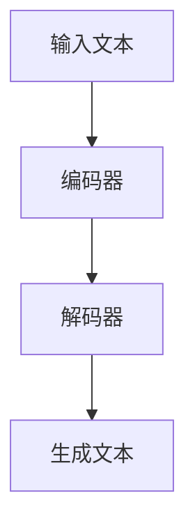
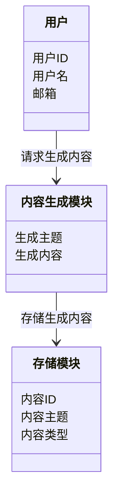

                 


# 金融教育内容生成

## 关键词：金融教育，内容生成，自然语言处理，机器学习，教育技术

## 摘要：  
金融教育内容生成是指利用自然语言处理和机器学习等技术，自动生成与金融相关的教育内容。本文从金融教育的重要性出发，详细探讨了金融教育内容生成的核心概念、算法原理、系统架构设计以及实际项目实现。通过分析生成模型的类型、训练优化方法，结合系统架构设计和实际案例，本文为读者提供了全面的技术指导和实践参考。

---

# 第一部分: 金融教育内容生成的背景与重要性

## 第1章: 金融教育内容生成的背景与重要性

### 1.1 金融教育的重要性
#### 1.1.1 金融素养的定义与内涵
- 金融素养是指个体在金融知识、技能和态度方面的能力，包括理解金融产品、风险管理、投资决策等。
- 金融素养是个人财务管理的基础，也是参与经济活动的前提条件。

#### 1.1.2 金融教育的目标与意义
- 金融教育的目标是提高个人和群体的金融素养，帮助他们做出明智的金融决策。
- 金融教育的意义在于促进金融市场的健康发展，减少金融诈骗和不合理借贷。

#### 1.1.3 金融教育在社会中的作用
- 金融教育是社会经济稳定的重要保障。
- 金融教育有助于缩小贫富差距，促进社会公平。

### 1.2 内容生成技术的发展
#### 1.2.1 自然语言处理技术的进展
- 自然语言处理（NLP）技术的进步为内容生成提供了强大的工具，例如文本摘要、对话生成和文本翻译。
- 基于深度学习的NLP模型（如BERT、GPT）在内容生成领域取得了显著成果。

#### 1.2.2 机器学习在内容生成中的应用
- 机器学习算法（如循环神经网络RNN、Transformer）被广泛应用于文本生成任务。
- 生成对抗网络（GAN）和变体自编码器（VAE）也在内容生成中得到了应用。

#### 1.2.3 金融教育内容生成的必要性
- 金融教育内容生成可以提高教育效率，降低人工成本。
- 通过自动化生成内容，可以快速应对金融市场的变化，提供实时的金融知识。

---

## 第2章: 金融教育内容生成的核心概念

### 2.1 核心概念的定义与特点
#### 2.1.1 金融教育内容生成的定义
- 金融教育内容生成是指利用技术手段自动生成与金融相关的教育内容，包括文章、课程、案例等。

#### 2.1.2 生成内容的类型与特点
- 文章：基于特定主题生成金融相关的文章。
- 课程：生成结构化的课程内容，包括知识点和练习题。
- 案例：生成实际的金融案例，帮助学习者理解理论知识。

#### 2.1.3 与其他内容生成领域的区别
- 金融教育内容生成具有专业性、实时性和准确性要求高的特点。

### 2.2 核心概念的联系与对比
#### 2.2.1 核心概念属性特征对比表格

| 属性         | 金融教育内容生成 | 其他内容生成领域 |
|--------------|------------------|------------------|
| 内容类型      | 文章、课程、案例 | 文章、广告、新闻 |
| 专业性        | 高              | 中低             |
| 实时性        | 高              | 中              |
| 目标用户      | 学习者、投资者   | 消费者、企业     |

#### 2.2.2 ER实体关系图架构

```mermaid
erDiagram
    actor 学习者 {
        <属性> 用户ID
        <属性> 用户名
        <属性> 邮箱
    }
    actor 投资者 {
        <属性> 用户ID
        <属性> 用户名
        <属性> 邮箱
    }
    actor 教育机构 {
        <属性> 机构ID
        <属性> 机构名称
    }
    content 金融教育内容 {
        <属性> 内容ID
        <属性> 内容类型
        <属性> 内容主题
    }
    学习者 --> 金融教育内容 : 学习
    投资者 --> 金融教育内容 : 学习
    教育机构 --> 金融教育内容 : 提供
```

---

# 第二部分: 金融教育内容生成的技术实现

## 第3章: 金融教育内容生成的算法原理

### 3.1 算法原理概述
#### 3.1.1 生成模型的类型与选择
- 基于规则的生成模型：通过预定义的规则生成内容。
- 基于机器学习的生成模型：使用深度学习模型生成内容，如RNN、Transformer、GAN等。

#### 3.1.2 算法流程图的详细解读
- 下面是一个基于Transformer的生成模型的算法流程图：



#### 3.1.3 算法实现的数学模型与公式
- Transformer模型的核心公式：
  - 编码器部分：$$\text{pos\_encoding}(i, j) = \sin(i + \frac{10000j}{10000})$$
  - 解码器部分：$$P_{i,j} = \text{softmax}(Q_i K_j^T / \sqrt{d_k})$$

### 3.2 算法实现的数学模型与公式
- 生成模型的损失函数：
  $$\mathcal{L} = -\sum_{i=1}^{n} \log p(x_i | x_{<i})$$
- 优化算法：使用Adam优化器，$$\theta_{t+1} = \theta_t - \eta \nabla_\theta \mathcal{L}$$

---

## 第4章: 金融教育内容生成的系统架构设计

### 4.1 系统分析与设计
#### 4.1.1 问题场景介绍
- 系统目标：生成高质量的金融教育内容，满足用户需求。
- 问题场景：用户输入主题关键词，系统自动生成相关金融内容。

#### 4.1.2 系统功能设计（领域模型类图）


#### 4.1.3 系统架构设计（架构图）


#### 4.1.4 系统接口设计和交互流程
- 用户通过前端提交请求，后端接收并调用生成模块生成内容，最后将内容存储到数据库中。

---

# 第三部分: 金融教育内容生成的项目实战

## 第5章: 金融教育内容生成的项目实施

### 5.1 项目环境与工具安装
#### 5.1.1 开发环境的搭建
- 使用Python 3.8及以上版本。
- 安装必要的库：TensorFlow、Keras、NLTK、jieba。

#### 5.1.2 必要工具的安装与配置
- 安装TensorFlow：```bash
  pip install tensorflow
  ```

### 5.2 金融教育内容生成的系统核心实现
#### 5.2.1 生成模块的核心代码
```python
import tensorflow as tf
from tensorflow.keras.layers import Input, Dense, LSTM, Dropout
from tensorflow.keras.models import Model

# 定义生成模型
input_layer = Input(shape=(max_sequence_length,))
lstm_layer = LSTM(128, return_sequences=True)(input_layer)
dropout_layer = Dropout(0.5)(lstm_layer)
dense_layer = Dense(vocabulary_size, activation='softmax')(dropout_layer)

model = Model(inputs=input_layer, outputs=dense_layer)
model.compile(optimizer='adam', loss='sparse_categorical_crossentropy', metrics=['accuracy'])
```

#### 5.2.2 生成模块的训练与优化
- 训练数据的预处理：
  ```python
  def preprocess_data(data):
      # 数据清洗和分词
      pass
  ```
- 模型训练：
  ```python
  model.fit(train_data, train_labels, epochs=10, batch_size=64, validation_data=(test_data, test_labels))
  ```

#### 5.2.3 生成模块的实际案例分析
- 案例主题：股票投资入门
- 生成内容示例：
  ```
  股票投资入门：如何选择优质股票？
  
  1. 确定投资目标
  2. 分析公司基本面
  3. 关注行业趋势
  4. 做好风险管理
  ```

### 5.3 项目实战总结
- 项目实现了金融教育内容的自动生成，提高了效率。
- 在实际应用中，需要不断优化模型，提高生成内容的质量。

---

## 第6章: 金融教育内容生成的未来展望与注意事项

### 6.1 未来展望
- 更加智能化的内容生成：结合AI技术，实现更精准的内容生成。
- 多模态内容生成：结合图像、视频等多种形式，提供更丰富的教育内容。

### 6.2 注意事项
- 数据安全：确保用户数据的安全性。
- 内容准确性：生成内容需要经过严格审核，避免错误信息。

---

## 第7章: 小结与拓展阅读

### 7.1 小结
- 金融教育内容生成是一项具有重要意义的技术，结合自然语言处理和机器学习，可以为金融教育提供高效、个性化的解决方案。

### 7.2 拓展阅读
- 推荐阅读《深度学习》（Ian Goodfellow著）
- 关注领域内最新的研究成果和技术动态。

---

通过以上内容，我们可以看到，金融教育内容生成是一个结合技术与教育的复杂任务，需要综合运用自然语言处理、机器学习等技术手段，才能实现高质量的内容生成。希望本文能够为读者提供清晰的技术指导和实践参考。

