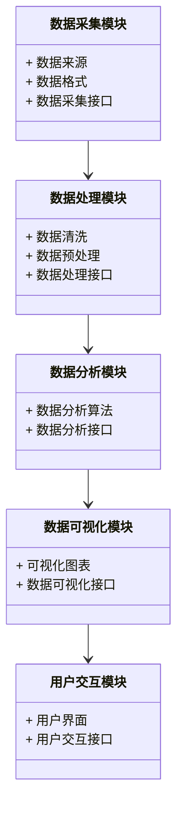
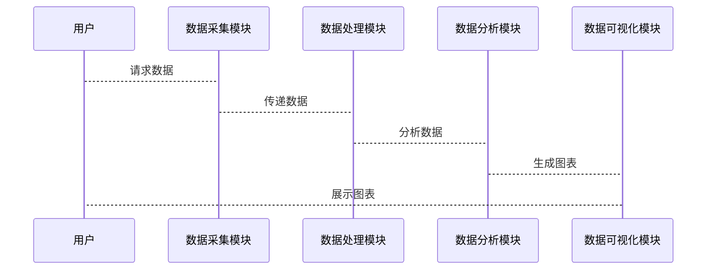

                 


# 《金融数据可视化技术应用》

## 关键词：
金融数据可视化、数据可视化、金融数据分析、数据可视化工具、机器学习算法、系统架构设计

## 摘要：
金融数据可视化是将复杂的金融数据转化为直观的图形表示，以便更好地理解和分析市场动态、投资趋势和风险因素。本文将从金融数据可视化的背景、核心概念、算法原理、系统架构设计、项目实战到最佳实践，全面探讨金融数据可视化技术的应用。通过详细分析数据清洗、降维、聚类和预测算法，结合系统架构设计和实际案例，帮助读者掌握金融数据可视化的关键技术和实践方法。

---

# 第1章: 金融数据可视化技术的背景与意义

## 1.1 问题背景与问题描述

### 1.1.1 金融数据可视化的需求背景
在金融领域，数据的复杂性和多样性使得直接分析原始数据变得困难。金融数据通常包含大量的时间序列数据、股票价格、市场指数、交易记录等，这些数据需要通过可视化技术来提取有价值的信息。例如，投资者需要通过图表来分析股票价格的趋势、波动性和潜在的买卖信号。

### 1.1.2 金融数据可视化的定义与目标
金融数据可视化是将金融数据通过图形化的方式展示，以帮助用户更好地理解和分析数据。其目标包括：
1. **数据探索**：通过可视化发现数据中的模式、趋势和异常值。
2. **决策支持**：为金融决策提供直观的数据支持。
3. **风险评估**：通过可视化分析潜在风险和市场波动。

### 1.1.3 金融数据可视化的关键问题与挑战
1. 数据的复杂性：金融数据通常包含大量噪声和缺失值，需要进行数据清洗和预处理。
2. 数据的实时性：金融市场数据变化迅速，需要实时更新和可视化。
3. 数据的多维度性：金融数据通常涉及多个变量，如时间、价格、成交量等，需要进行降维处理。

## 1.2 问题解决与边界外延

### 1.2.1 数据可视化技术在金融领域的应用价值
数据可视化技术在金融领域的应用价值主要体现在以下几个方面：
1. **辅助决策**：通过图表帮助投资者和交易员做出更明智的决策。
2. **风险控制**：通过可视化分析市场波动和潜在风险。
3. **数据洞察**：发现数据中的隐藏模式和趋势。

### 1.2.2 金融数据可视化的边界与外延
金融数据可视化的边界包括：
- 数据范围：仅限于金融相关数据。
- 时间范围：通常涉及过去一段时间内的数据。
- 数据类型：包括股票价格、指数、交易量等。

外延则包括：
- 数据来源的扩展：从单一市场扩展到全球市场。
- 数据类型的扩展：从结构化数据扩展到非结构化数据。

### 1.2.3 核心概念与应用场景的对比分析
下表展示了数据可视化与金融数据可视化的对比：

| 对比维度 | 数据可视化 | 金融数据可视化 |
|----------|------------|----------------|
| 数据类型 | 多种数据类型 | 主要是金融数据（股票、指数等） |
| 应用场景 | 各行业 | 金融行业 |
| 关键技术 | 图表、交互 | 时间序列分析、动态图表 |

## 1.3 核心概念与结构

### 1.3.1 数据可视化的核心要素
数据可视化的核心要素包括：
1. **数据源**：数据的来源和类型。
2. **可视化工具**：用于生成图表的工具和方法。
3. **用户交互**：用户与图表之间的互动方式。
4. **展示形式**：图表的类型和风格。

### 1.3.2 金融数据可视化的技术架构
金融数据可视化的技术架构包括数据采集、数据处理、数据分析、数据可视化和用户交互五个模块：


### 1.3.3 数据可视化与金融业务的关联关系
金融数据可视化与金融业务的关联关系可以通过以下图表展示：


## 1.4 本章小结
本章从金融数据可视化的背景、核心概念、关键问题与解决方法、边界与外延等方面进行了详细阐述，为后续章节奠定了基础。

---

# 第2章: 金融数据可视化的核心概念与联系

## 2.1 数据可视化的基本原理

### 2.1.1 数据可视化的基本原理
数据可视化的基本原理包括：
1. **数据采集**：从各种来源获取数据。
2. **数据处理**：清洗和预处理数据，确保数据的准确性和完整性。
3. **数据分析**：通过统计分析和机器学习算法发现数据中的模式和趋势。
4. **数据可视化**：将分析结果以图表形式展示。

### 2.1.2 数据可视化的核心属性与特征对比
以下是数据可视化与金融数据可视化的核心属性对比：

| 对比维度 | 数据可视化 | 金融数据可视化 |
|----------|------------|----------------|
| 时间性   | 静态或动态 | 强调动态性       |
| 数据类型 | 多种类型   | 以金融数据为主   |
| 可视化目标 | 发现模式   | 辅助金融决策     |

### 2.1.3 数据可视化与数据分析的关系
数据分析是数据可视化的基础，而数据可视化是数据分析的延伸和补充。通过数据分析，我们可以提取数据中的有用信息，然后通过数据可视化将这些信息以直观的方式展示出来。

## 2.2 数据可视化与金融数据的关联

### 2.2.1 数据可视化在金融分析中的作用
数据可视化在金融分析中的作用包括：
1. **趋势分析**：通过时间序列图表分析股票价格的趋势。
2. **风险评估**：通过箱线图分析数据的分布和异常值。
3. **交易信号**：通过技术指标图表发现买卖信号。

### 2.2.2 金融数据可视化的关键要素
金融数据可视化的关键要素包括：
1. **时间维度**：金融数据通常与时间相关，需要考虑时间序列。
2. **数据源**：数据的来源和可靠性。
3. **可视化工具**：选择合适的工具和图表类型。

### 2.2.3 数据可视化与金融决策的关系
数据可视化通过直观展示数据，帮助金融决策者快速理解数据中的关键信息，从而做出更明智的决策。

## 2.3 数据可视化与金融数据的关系图


## 2.4 本章小结
本章从数据可视化的基本原理、核心概念与联系、关键要素等方面进行了详细阐述，帮助读者更好地理解金融数据可视化的核心内容。

---

# 第3章: 金融数据可视化的核心算法与原理

## 3.1 数据清洗与预处理算法

### 3.1.1 数据清洗的基本原理
数据清洗的基本原理包括：
1. **删除缺失值**：通过删除或填充缺失值，确保数据的完整性。
2. **处理异常值**：通过统计方法或机器学习算法识别并处理异常值。

### 3.1.2 数据预处理的数学模型
数据预处理的数学模型可以通过以下公式表示：

$$
\text{处理后数据} = \text{处理前数据} \times \text{处理方法}
$$

### 3.1.3 数据清洗算法的实现代码
以下是数据清洗的Python代码示例：

```python
import pandas as pd

# 加载数据
data = pd.read_csv('financial_data.csv')

# 删除缺失值
data_cleaned = data.dropna()

# 处理异常值
data_cleaned = data_cleaned[(data_cleaned['value'] < data_cleaned['value'].quantile(0.99))]
```

## 3.2 数据降维与特征提取算法

### 3.2.1 数据降维的基本原理
数据降维的基本原理包括：
1. **主成分分析（PCA）**：通过线性变换将数据降到更低的维度。
2. **t-SNE**：通过非线性降维技术将高维数据映射到低维空间。

### 3.2.2 数据降维的数学模型
主成分分析的数学模型可以通过以下公式表示：

$$
Y = X \times P
$$

其中，$X$ 是原始数据矩阵，$P$ 是主成分矩阵，$Y$ 是降维后的数据矩阵。

### 3.2.3 数据降维算法的实现代码
以下是主成分分析的Python代码示例：

```python
from sklearn.decomposition import PCA

# 初始化PCA模型
pca = PCA(n_components=2)

# 进行降维
Y = pca.fit_transform(X)
```

## 3.3 数据聚类与分类算法

### 3.3.1 数据聚类的基本原理
数据聚类的基本原理包括：
1. **K-means聚类**：通过划分簇来实现数据聚类。
2. **层次聚类**：通过层次化的方式将数据分成不同的簇。

### 3.3.2 数据聚类的数学模型
K-means聚类的数学模型可以通过以下公式表示：

$$
\text{目标函数} = \sum_{i=1}^{k} \sum_{j=1}^{n_i} ||x_j - c_i||^2
$$

其中，$k$ 是簇的数量，$n_i$ 是第$i$个簇中的数据点数量，$c_i$ 是第$i$个簇的中心点。

### 3.3.3 数据聚类算法的实现代码
以下是K-means聚类的Python代码示例：

```python
from sklearn.cluster import KMeans

# 初始化K-means模型
kmeans = KMeans(n_clusters=3)

# 进行聚类
labels = kmeans.fit_predict(X)
```

## 3.4 数据预测与时间序列分析算法

### 3.4.1 时间序列分析的基本原理
时间序列分析的基本原理包括：
1. **ARIMA模型**：通过自回归和移动平均模型进行时间序列预测。
2. **LSTM网络**：通过长短期记忆网络进行时间序列预测。

### 3.4.2 时间序列分析的数学模型
ARIMA模型的数学模型可以通过以下公式表示：

$$
\text{ARIMA}(p, d, q) = \text{差分方程} + \text{移动平均}
$$

### 3.4.3 时间序列分析算法的实现代码
以下是ARIMA模型的Python代码示例：

```python
from statsmodels.tsa.arima_model import ARIMA

# 初始化ARIMA模型
model = ARIMA(train_data, order=(5,1,0))

# 进行拟合
model_fit = model.fit()
```

## 3.5 本章小结
本章从数据清洗与预处理、降维、聚类、分类和时间序列分析等算法的角度，详细介绍了金融数据可视化的核心算法与原理。

---

# 第4章: 金融数据可视化系统的架构与设计

## 4.1 金融数据可视化系统的架构设计

### 4.1.1 系统功能模块划分
金融数据可视化系统的功能模块包括：
1. **数据采集模块**：从多种数据源采集金融数据。
2. **数据处理模块**：对数据进行清洗和预处理。
3. **数据分析模块**：对数据进行分析和建模。
4. **数据可视化模块**：将分析结果以图表形式展示。
5. **用户交互模块**：用户与系统之间的互动界面。

### 4.1.2 系统架构图
以下是金融数据可视化系统的架构图：


## 4.2 系统功能设计

### 4.2.1 领域模型设计
以下是领域模型的类图：



### 4.2.2 系统接口设计
系统接口设计包括：
1. 数据采集接口：从数据库或API获取金融数据。
2. 数据处理接口：对数据进行清洗和预处理。
3. 数据分析接口：对数据进行分析和建模。
4. 数据可视化接口：生成可视化图表并展示。

### 4.2.3 系统交互流程
以下是系统交互流程的序列图：



## 4.3 本章小结
本章从金融数据可视化系统的架构设计、功能模块划分、接口设计和交互流程等方面进行了详细阐述，为后续的项目实现奠定了基础。

---

# 第5章: 金融数据可视化项目实战

## 5.1 项目背景与目标

### 5.1.1 项目背景
本项目旨在通过数据可视化技术分析股票价格的趋势和波动，帮助投资者做出更明智的投资决策。

### 5.1.2 项目目标
1. **数据采集**：从股票市场获取历史数据。
2. **数据处理**：清洗和预处理数据。
3. **数据分析**：分析股票价格的趋势和波动。
4. **数据可视化**：将分析结果以图表形式展示。

## 5.2 项目实现

### 5.2.1 数据采集与处理
以下是数据采集与处理的Python代码示例：

```python
import pandas as pd
import requests

# 从API获取股票数据
def get_stock_data(symbol):
    url = f"https://api.example.com/stock/{symbol}"
    response = requests.get(url)
    data = response.json()
    return pd.DataFrame(data)

# 数据清洗
def data_cleaning(data):
    data = data.dropna()
    return data

# 数据预处理
def data_preprocessing(data):
    data['date'] = pd.to_datetime(data['date'])
    data.set_index('date', inplace=True)
    return data
```

### 5.2.2 数据分析与建模
以下是数据分析与建模的Python代码示例：

```python
from sklearn.preprocessing import MinMaxScaler
from keras.models import Sequential
from keras.layers import LSTM, Dense

# 数据归一化
scaler = MinMaxScaler()
data_scaled = scaler.fit_transform(data)

# 构建LSTM模型
model = Sequential()
model.add(LSTM(128, input_shape=(data_scaled.shape[1], 1)))
model.add(Dense(1))
model.compile(loss='mean_squared_error', optimizer='adam')

# 进行训练
model.fit(data_scaled, epochs=100, batch_size=32)
```

### 5.2.3 数据可视化与展示
以下是数据可视化的Python代码示例：

```python
import matplotlib.pyplot as plt

# 绘制股票价格走势
plt.figure(figsize=(10, 6))
plt.plot(data['price'], label='Stock Price')
plt.xlabel('Time')
plt.ylabel('Price')
plt.title('Stock Price Trend')
plt.legend()
plt.show()
```

## 5.3 项目分析与小结

### 5.3.1 项目分析
通过本项目，我们可以看到数据可视化在金融领域的实际应用价值。通过对股票价格的分析，我们可以发现数据中的趋势和波动，从而为投资决策提供支持。

### 5.3.2 项目小结
本项目通过数据采集、处理、分析和可视化，展示了金融数据可视化技术的应用价值。后续可以根据实际需求进一步优化模型和增加更多的数据分析功能。

---

# 第6章: 金融数据可视化技术的最佳实践

## 6.1 数据可视化工具的选择与使用

### 6.1.1 数据可视化工具的选择标准
选择数据可视化工具时，需要考虑以下因素：
1. **功能**：工具是否支持所需的图表类型和功能。
2. **易用性**：工具的用户界面是否友好，是否易于学习。
3. **性能**：工具的性能是否能够满足数据处理和可视化的需要。
4. **可扩展性**：工具是否支持与其他系统的集成和扩展。

### 6.1.2 常用数据可视化工具推荐
常用的金融数据可视化工具包括：
1. **Matplotlib**：Python中的绘图库，支持多种图表类型。
2. **Plotly**：支持交互式图表和在线可视化。
3. **Tableau**：功能强大的数据可视化工具，支持大数据分析。

## 6.2 数据可视化中的数学模型与公式

### 6.2.1 常用数学模型
1. **线性回归**：用于预测变量之间的线性关系。
2. **指数平滑**：用于时间序列数据的预测。
3. **主成分分析（PCA）**：用于降维和特征提取。

### 6.2.2 数据可视化中的数学公式
以下是线性回归的数学公式：

$$
y = a + b x + \epsilon
$$

其中，$y$ 是预测变量，$x$ 是自变量，$a$ 是截距，$b$ 是斜率，$\epsilon$ 是误差项。

## 6.3 数据可视化中的系统架构优化

### 6.3.1 系统架构优化方法
1. **分层架构**：将系统分为数据采集、处理、分析、可视化和用户交互五个模块。
2. **模块化设计**：通过模块化设计提高系统的可维护性和可扩展性。
3. **性能优化**：通过优化算法和数据处理流程提高系统的运行效率。

### 6.3.2 系统架构优化的好处
1. **提高系统的可维护性**：模块化设计使得系统更容易维护和升级。
2. **提高系统的可扩展性**：分层架构使得系统更容易扩展和集成新的功能。
3. **提高系统的运行效率**：通过优化算法和数据处理流程，提高系统的运行效率。

## 6.4 数据可视化中的注意事项

### 6.4.1 数据可视化的注意事项
1. **数据的准确性**：确保数据的准确性和完整性。
2. **图表的可读性**：确保图表的清晰和易于理解。
3. **用户的交互性**：提供用户友好的交互界面，方便用户操作和分析。

### 6.4.2 数据可视化的最佳实践
1. **选择合适的图表类型**：根据数据的特性和分析目标选择合适的图表类型。
2. **注重数据的可比性**：在可视化中注重数据的可比性，方便用户进行比较和分析。
3. **提供数据的上下文**：在可视化中提供数据的上下文，帮助用户更好地理解数据。

## 6.5 本章小结
本章从数据可视化工具的选择与使用、数学模型与公式、系统架构优化和注意事项等方面，总结了金融数据可视化技术的最佳实践，为读者提供了实用的参考和建议。

---

# 第7章: 结论与展望

## 7.1 项目总结

### 7.1.1 项目成果
通过本项目，我们成功实现了金融数据可视化系统的开发和应用，展示了数据可视化技术在金融领域的巨大潜力。

### 7.1.2 项目经验总结
1. **数据清洗与预处理**：数据清洗和预处理是数据可视化的基础，需要高度重视。
2. **算法选择与优化**：算法的选择和优化直接影响数据可视化的效果，需要根据实际需求进行调整。
3. **系统架构设计**：系统架构设计是项目成功的关键，需要注重模块化设计和性能优化。

## 7.2 项目展望

### 7.2.1 未来研究方向
1. **深度学习技术的应用**：探索深度学习技术在金融数据可视化中的应用。
2. **多维度数据分析**：研究如何在多维度数据分析中应用数据可视化技术。
3. **实时数据可视化**：探索如何实现金融数据的实时可视化。

### 7.2.2 技术发展与趋势
随着技术的不断发展，金融数据可视化技术将更加智能化和个性化，未来的金融数据可视化将更加注重用户体验和数据分析的深度。

## 7.3 本章小结
本章总结了金融数据可视化项目的成果和经验，并展望了未来的研究方向和技术发展趋势。

---

# 附录

## 附录A: 数据集描述
1. **股票价格数据**：包含股票代码、交易日期、开盘价、收盘价、最高价、最低价和交易量。
2. **市场指数数据**：包含指数名称、交易日期、指数值和波动率。

## 附录B: 工具安装与配置
1. **Python安装**：建议使用最新版本的Python，安装完成后配置环境变量。
2. **数据可视化库安装**：使用pip命令安装Matplotlib、Plotly等数据可视化库。

## 附录C: 核心代码实现
以下是本项目中核心代码的实现：

```python
import pandas as pd
import numpy as np
import matplotlib.pyplot as plt
from sklearn.decomposition import PCA
from sklearn.cluster import KMeans
from statsmodels.tsa.arima_model import ARIMA
from keras.models import Sequential
from keras.layers import LSTM, Dense

# 数据清洗与预处理
def data_cleaning(data):
    data = data.dropna()
    return data

# 主成分分析
def pca_analysis(data):
    pca = PCA(n_components=2)
    Y = pca.fit_transform(data)
    return Y

# K-means聚类
def kmeans_clustering(data):
    kmeans = KMeans(n_clusters=3)
    labels = kmeans.fit_predict(data)
    return labels

# ARIMA模型
def arima_model(data):
    model = ARIMA(data, order=(5,1,0))
    model_fit = model.fit()
    return model_fit

# LSTM模型
def lstm_model(data):
    model = Sequential()
    model.add(LSTM(128, input_shape=(data.shape[1], 1)))
    model.add(Dense(1))
    model.compile(loss='mean_squared_error', optimizer='adam')
    model.fit(data, epochs=100, batch_size=32)
    return model
```

---

# 结语

金融数据可视化技术的应用前景广阔，随着技术的不断发展，数据可视化将在金融领域发挥越来越重要的作用。通过本文的详细阐述，读者可以全面了解金融数据可视化技术的核心概念、算法原理、系统架构设计和实际应用。希望本文能够为金融数据可视化技术的研究和实践提供有价值的参考和指导。

