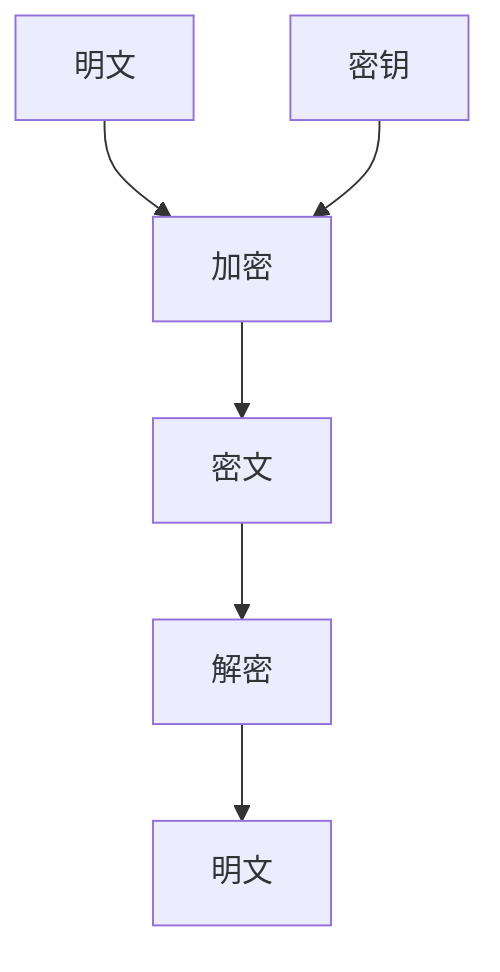
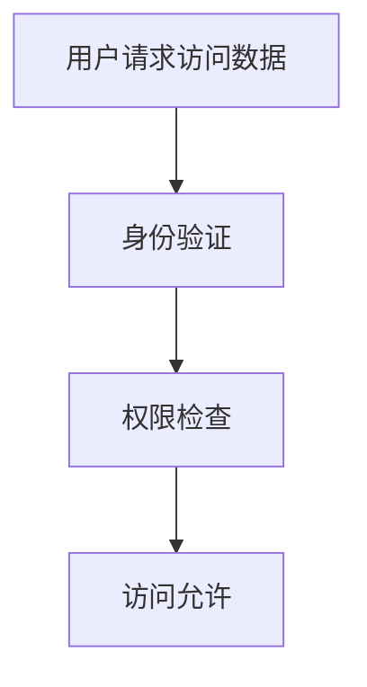

                 


# 第2章: 数据隐私保护的核心概念与技术框架

## 2.1 数据隐私保护的核心概念

### 2.1.1 数据隐私的定义与属性

数据隐私是指在数据的收集、存储、处理和共享过程中，确保数据不被未经授权的个人、组织或计算机系统访问或使用。数据隐私的核心属性包括：

- **机密性（Confidentiality）**：确保只有授权的用户或系统能够访问数据。
- **完整性（Integrity）**：确保数据在存储和传输过程中不被篡改。
- **可用性（Availability）**：确保授权用户能够访问和使用数据。
- **可追溯性（Accountability）**：能够追溯数据的使用和操作记录。

数据隐私的实现依赖于多种技术手段，包括数据加密、访问控制、匿名化处理等。

### 2.1.2 数据隐私保护的目标与原则

#### 目标：
- 保护个人隐私，防止未经授权的访问和数据滥用。
- 确保金融机构的合规性，符合相关法律法规要求。
- 提供透明的数据使用政策，增强用户信任。

#### 原则：
- **最小化原则**：只收集和处理实现目的所需的最少数据。
- **目的限制原则**：数据只能用于特定目的，不得超出授权范围。
- **数据生命周期管理**：从数据生成、存储、处理到销毁，确保每个阶段的安全性。

### 2.1.3 数据隐私保护的边界与外延

数据隐私保护的边界是指数据在哪些场景下需要保护，以及保护的范围。例如：

- **边界**：
  - 个人隐私：如用户的身份证号、银行卡号等。
  - 企业隐私：如交易记录、财务数据等。
- **外延**：
  - 数据加密存储和传输。
  - 数据匿名化处理，如脱敏技术。
  - 数据访问权限控制。

通过明确数据隐私保护的边界和外延，可以更有效地制定和实施数据保护策略。

---

## 2.2 数据隐私保护的技术框架

数据隐私保护的技术框架是一个多层次的体系，涵盖了从数据生成到数据销毁的全生命周期管理。以下是技术框架的主要组成部分：

### 2.2.1 数据加密技术

数据加密是保护数据隐私的核心技术之一。加密技术可以分为对称加密和非对称加密两种类型。

#### 对称加密：
- **算法**：AES（高级加密标准）。
- **特点**：加密和解密使用相同的密钥，速度快，适合大量数据加密。
- **应用场景**：数据存储加密。

#### 非对称加密：
- **算法**：RSA（ Rivest-Shamir-Adleman）。
- **特点**：加密和解密使用不同的密钥，安全性高，适合数据传输加密。

#### 加密过程示例：


### 2.2.2 数据匿名化技术

数据匿名化是指通过技术手段将数据中的敏感信息去除或变形，使其无法直接关联到具体个人。常用技术包括数据脱敏和数据去标识化。

#### 数据脱敏：
- **方法**：对敏感字段进行哈希处理或替换。
- **示例**：将身份证号的后四位替换为“****”。
- **代码示例**：
  ```python
  import hashlib

  def hash_id(id):
      return hashlib.md5(id.encode()).hexdigest()[:8]
  ```

#### 数据去标识化：
- **方法**：去除或加密数据中的唯一标识符。
- **示例**：去除交易记录中的“交易方账户”信息。

### 2.2.3 数据访问控制技术

数据访问控制技术确保只有授权的用户或系统能够访问数据。常用技术包括基于角色的访问控制（RBAC）和基于属性的访问控制（ABAC）。

#### RBAC（基于角色的访问控制）：
- **特点**：根据用户角色分配权限。
- **示例**：普通员工只能查看自己的数据，管理层可以访问所有数据。

#### ABAC（基于属性的访问控制）：
- **特点**：根据用户属性（如地理位置、时间）动态分配权限。
- **示例**：在特定时间段内，用户只能访问特定区域的数据。

#### 访问控制流程：


---

## 2.3 核心概念的ER实体关系图

为了更好地理解数据隐私保护的核心概念，我们可以通过ER实体关系图来展示用户、交易记录和权限之间的关系。

```mermaid
er
    entity 用户 {
        key 用户ID
        attribute 姓名
        attribute 身份证号
        attribute 银行卡号
    }
    entity 交易记录 {
        key 交易ID
        attribute 交易金额
        attribute 交易时间
        attribute 对方账户
    }
    entity 用户权限 {
        key 权限ID
        attribute 访问权限
        attribute 数据类型
    }
    用户 -> 用户权限 : 拥有
    用户 -> 交易记录 : 发起
    用户 -> 交易记录 : 参与
```

---

## 2.4 核心概念对比分析

以下是数据隐私保护的核心技术对比表：

| 技术 | 特点 | 适用场景 | 优缺点 |
|------|------|----------|--------|
| 数据加密 | 保护数据机密性 | 数据存储和传输 | 加密强度高，但计算开销大 |
| 数据匿名化 | 隐藏敏感信息 | 数据共享和分析 | 无法完全恢复原始数据 |
| 数据访问控制 | 限制数据访问权限 | 数据使用和管理 | 需要复杂的权限管理 |

---

## 2.5 本章小结

本章详细介绍了数据隐私保护的核心概念，包括数据隐私的定义、目标和原则，以及数据加密、数据匿名化和数据访问控制等技术框架。通过对比分析和ER实体关系图，帮助读者更好地理解数据隐私保护的实现方式和系统架构。

