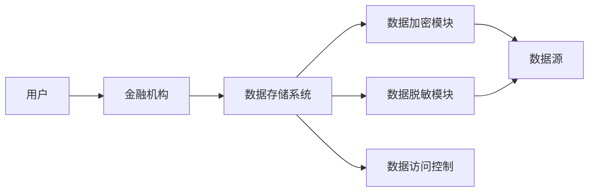
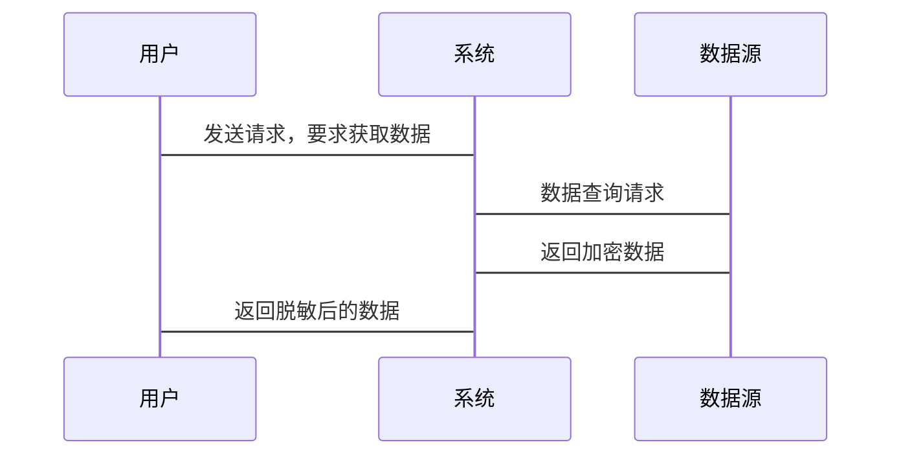

                 


# 《金融数据隐私保护技术》

---

## 关键词：  
金融数据隐私保护技术, 数据加密, 数据脱敏, 同态加密, 零知识证明, 金融数据安全

---

## 摘要：  
随着金融行业的数字化转型，数据隐私保护成为金融安全的核心问题。本文系统地探讨了金融数据隐私保护的技术与实践，涵盖了数据分类与分级、加密技术、脱敏技术、同态加密、零知识证明等核心概念，并结合实际案例分析了这些技术在金融数据隐私保护中的应用。文章还详细讲解了金融数据隐私保护系统的架构设计、接口设计和交互流程，最后提供了项目实战和最佳实践的建议，帮助读者全面理解和掌握金融数据隐私保护的技术与方法。

---

# 第1章: 金融数据隐私保护的背景与挑战

## 1.1 金融数据隐私的重要性  
### 1.1.1 数据隐私的定义与范围  
数据隐私是指对数据的访问、使用和披露进行合理限制，确保数据仅用于授权的目的，并保护数据主体的隐私权益。金融数据涉及个人的敏感信息，如银行账户、交易记录等，一旦泄露可能造成严重的经济损失和信用风险。  

### 1.1.2 金融数据的敏感性分析  
金融数据的敏感性主要体现在以下几点：  
- **身份识别**：如姓名、身份证号、银行卡号等，这些信息可以唯一识别个人身份。  
- **交易信息**：如交易金额、交易时间、交易地点等，可能揭示个人的消费习惯和经济状况。  
- **信用评估**：如信用评分、贷款记录等，可能影响个人的信用评级。  

### 1.1.3 金融行业数据隐私保护的法律法规  
金融行业数据隐私保护的法律法规主要包括：  
- **《中华人民共和国个人信息保护法》**：明确了个人信息处理的合法性和合规性要求。  
- **《欧盟通用数据保护条例（GDPR）》**：严格规定了数据处理者的责任和义务。  
- **《支付卡行业数据安全标准（PCI DSS）》**：针对支付交易数据的安全保护提出了具体要求。  

## 1.2 当前金融数据隐私保护的挑战  
### 1.2.1 数据泄露的现状与趋势  
近年来，数据泄露事件频发，金融行业成为攻击者的主要目标。根据统计，2022年全球因数据泄露造成的损失高达数亿美元，其中金融行业占比超过40%。  

### 1.2.2 金融行业数据隐私保护的难点  
- **数据分散性**：金融数据分布在不同的系统和平台中，增加了统一保护的难度。  
- **技术复杂性**：金融数据涉及多种技术手段，如加密、脱敏、访问控制等，技术实现复杂。  
- **合规性要求**：金融行业需要同时满足多个法律法规的合规要求，增加了企业的负担。  

### 1.2.3 新型技术对数据隐私的影响  
随着人工智能、区块链等技术的广泛应用，数据隐私保护技术也在不断进步。然而，这些技术也可能带来新的隐私风险，如数据滥用、数据篡改等。  

## 1.3 金融数据隐私保护的目标与意义  
### 1.3.1 数据隐私保护的核心目标  
- **保护用户隐私**：确保金融数据仅用于授权的目的，防止未经授权的访问和使用。  
- **防止数据泄露**：通过技术手段减少数据泄露的风险，保障数据的安全性。  
- **合规性要求**：满足相关法律法规的合规要求，避免法律风险。  

### 1.3.2 数据隐私保护对金融行业的影响  
- **提升用户信任**：通过有效的数据隐私保护措施，增强用户对金融机构的信任。  
- **降低法律风险**：合规的数据隐私保护可以避免因数据泄露导致的法律诉讼和罚款。  
- **提升竞争力**：数据隐私保护是金融行业差异化竞争的重要手段之一。  

### 1.3.3 数据隐私保护的未来发展趋势  
- **技术融合**：数据隐私保护技术将与人工智能、区块链等技术深度融合，提升保护效果。  
- **动态隐私保护**：根据数据的敏感性和使用场景，动态调整隐私保护策略。  
- **国际合作**：数据隐私保护将更加注重国际合作，推动全球数据安全治理。  

## 1.4 本章小结  
本章从金融数据隐私的重要性、挑战以及目标与意义三个方面进行了详细分析，为后续章节的技术探讨奠定了基础。

---

# 第2章: 金融数据隐私保护的核心概念与联系

## 2.1 数据分类与分级  
### 2.1.1 数据分类的定义与方法  
数据分类是根据数据的特性和用途，将其划分为不同的类别。常见的分类方法包括：  
- **按数据类型分类**：如结构化数据和非结构化数据。  
- **按数据用途分类**：如交易数据、客户数据等。  

### 2.1.2 数据分级的标准与应用  
数据分级是根据数据的敏感性和重要性，将其分为不同的级别，如：  
- **机密级**：涉及国家安全或极高商业机密的数据。  
- **秘密级**：涉及重要商业信息但未达到机密级的数据。  
- **普通级**：不涉及敏感信息的公开数据。  

### 2.1.3 数据分类与分级的案例分析  
以某银行为例，客户数据可分为以下几类：  
- **客户基本信息**：如姓名、地址、联系方式等，属于普通级。  
- **账户信息**：如银行卡号、交易记录等，属于秘密级。  
- **信用评分**：如信用评分报告，属于机密级。  

## 2.2 数据加密技术  
### 2.2.1 加密算法的基本原理  
加密算法通过对数据进行数学变换，将其转化为不可读的形式（密文），只有掌握解密密钥的合法用户才能还原为原始数据（明文）。  

### 2.2.2 对称加密与非对称加密的对比  
| 对比维度 | 对称加密 | 非对称加密 |  
|----------|----------|------------|  
| 密钥管理 | 使用同一密钥加密和解密 | 使用公钥加密和私钥解密 |  
| 加密速度 | 加密和解密速度快 | 加密速度较慢，解密速度较快 |  
| 适用场景 | 适用于大数据量加密 | 适用于数字签名、身份认证等场景 |  

### 2.2.3 常见加密算法在金融数据中的应用  
- **AES**：高级加密标准，广泛应用于金融数据的加密存储。  
- **RSA**：基于公钥密码体制，常用于数字证书和签名验证。  

## 2.3 数据脱敏技术  
### 2.3.1 数据脱敏的定义与实现方法  
数据脱敏是通过对数据进行处理，使其在失去原始数据的可恢复性的同时，保留数据的业务价值和数据结构。常见的脱敏方法包括：  
- **替换**：如将姓名替换为代号。  
- **截断**：如只保留手机号的后几位数字。  
- **加密**：对敏感字段进行加密处理。  

### 2.3.2 数据脱敏技术的优缺点  
| 技术特点 | 优点 | 缺点 |  
|----------|------|------|  
| 数据可用性 | 高 | 数据不可逆，可能影响数据分析 |  
| 实施成本 | 低 | 需要复杂的脱敏规则设计 |  

### 2.3.3 数据脱敏在金融领域的应用案例  
例如，某银行在处理客户交易数据时，会对交易金额进行脱敏处理，仅显示金额范围，如“10,000-20,000元”，而不显示具体数值。  

## 2.4 数据隐私保护的实体关系图  


## 2.5 本章小结  
本章详细介绍了数据分类与分级、加密技术和脱敏技术的核心概念及其在金融数据隐私保护中的应用，并通过实体关系图展示了各模块之间的关系。

---

# 第3章: 金融数据隐私保护的算法原理

## 3.1 同态加密算法  
### 3.1.1 同态加密的基本原理  
同态加密是一种允许在加密数据上进行计算的加密技术，其核心思想是：  
$$f(x) = E(x) \rightarrow F(f(x)) = f(E(x)) = x$$  
其中，$E(x)$表示对数据$x$进行加密，$F$表示在密文上进行的操作，$f$表示在明文上进行的操作。  

### 3.1.2 同态加密的数学模型  
同态加密的数学模型主要包括以下三个部分：  
1. 加密函数$E: \mathbb{M} \rightarrow \mathbb{C}$，将明文空间$\mathbb{M}$中的数据映射到密文空间$\mathbb{C}$。  
2. 加密操作$F: \mathbb{C} \times \mathbb{F} \rightarrow \mathbb{C}$，在密文空间中执行操作$\mathbb{F}$。  
3. 解密函数$D: \mathbb{C} \rightarrow \mathbb{M}$，将密文解密为明文。  

### 3.1.3 同态加密在金融数据中的应用  
同态加密在金融数据中的典型应用包括：  
- **隐私计算**：在不泄露原始数据的情况下，进行数据分析和统计。  
- **加密查询**：在加密数据上进行高效的查询操作。  

### 3.1.4 同态加密的优缺点分析  
| 技术特点 | 优点 | 缺点 |  
|----------|------|------|  
| 数据可用性 | 高 | 加密计算效率较低，不适合大规模数据处理 |  
| 安全性 | 强 | 对密钥管理要求高，密钥泄露可能导致数据泄露 |  

## 3.2 零知识证明技术  
### 3.2.1 零知识证明的定义与实现  
零知识证明是一种证明方式，允许一方（证明者）向另一方（验证者）证明自己拥有某种信息，而无需透露该信息本身。其数学模型为：  
$$P \rightarrow V: Prove \, knowledge \, of \, x \, without \, revealing \, x$$  

### 3.2.2 零知识证明的数学模型  
零知识证明的实现通常基于图论、数论或密码学等数学理论，常见的实现方法包括：  
- **交互式零知识证明**：证明者和验证者通过多轮交互完成证明。  
- **非交互式零知识证明**：证明者一次性生成证明，验证者无需与证明者交互即可验证。  

### 3.2.3 零知识证明在金融数据隐私中的应用  
零知识证明在金融数据隐私中的应用包括：  
- **身份认证**：用户可以通过零知识证明证明自己拥有合法身份，而无需透露具体的身份信息。  
- **隐私交易**：用户可以通过零知识证明证明自己的交易合法性，而无需透露具体的交易细节。  

### 3.2.4 零知识证明的性能优化  
为了提高零知识证明的效率，可以通过以下方法进行优化：  
- **参数优化**：选择合适的参数设置，减少计算复杂度。  
- **协议优化**：设计更高效的交互协议，减少通信次数。  

## 3.3 案例分析: 同态加密在金融数据分析中的应用  
### 3.3.1 数据加密与分析流程  
1. **数据加密**：对金融数据进行同态加密，生成密文。  
2. **数据分析**：在密文上进行统计分析，如计算平均值、最大值等。  
3. **结果解密**：将分析结果解密，得到明文结果。  

### 3.3.2 数据分析结果的解密过程  
假设我们有一个加密的交易金额数据集，通过同态加密计算得到的平均值密文，解密后得到实际的平均交易金额。  

### 3.3.3 案例的具体实现与效果评估  
通过案例分析可以发现，同态加密在保护数据隐私的同时，能够支持高效的数据分析，但其计算效率较低，适合小规模数据的分析。  

## 3.4 本章小结  
本章详细讲解了同态加密和零知识证明两种加密技术的原理及其在金融数据隐私保护中的应用，并通过案例分析展示了这些技术的实际效果。

---

# 第4章: 金融数据隐私保护的系统架构设计

## 4.1 系统功能设计  
### 4.1.1 数据采集与预处理  
数据采集是金融数据隐私保护的第一步，主要包括：  
- **数据来源**：从多个数据源（如数据库、API接口）采集数据。  
- **数据清洗**：对采集到的数据进行去重、格式化处理。  

### 4.1.2 数据加密与脱敏处理  
数据加密与脱敏处理是数据隐私保护的核心步骤，主要包括：  
- **数据加密**：对敏感数据进行加密处理。  
- **数据脱敏**：对部分数据进行脱敏处理，确保数据在使用过程中不会泄露原始信息。  

### 4.1.3 数据访问控制与权限管理  
数据访问控制是通过权限管理来限制未经授权的访问，主要包括：  
- **身份认证**：通过用户名、密码、多因素认证等方式验证用户身份。  
- **权限分配**：根据用户角色分配数据访问权限。  

## 4.2 系统架构设计  


## 4.3 系统接口设计  
### 4.3.1 系统接口的定义与实现  
系统接口设计包括以下内容：  
- **数据加密接口**：对输入数据进行加密处理，返回密文。  
- **数据解密接口**：对密文进行解密处理，返回明文。  
- **数据脱敏接口**：对输入数据进行脱敏处理，返回脱敏后的数据。  

### 4.3.2 系统接口的安全性设计  
为确保接口的安全性，可以采取以下措施：  
- **API签名**：对API请求进行签名验证，防止数据篡改。  
- **访问控制**：通过IP白名单、速率限制等方式限制接口访问。  

## 4.4 系统交互流程设计  


## 4.5 本章小结  
本章详细设计了金融数据隐私保护系统的功能模块、架构和接口，展示了系统各部分之间的交互流程。

---

# 第5章: 项目实战

## 5.1 环境配置与工具安装  
### 5.1.1 开发环境的搭建  
- **操作系统**：建议使用Linux或macOS，因为其稳定性更高。  
- **开发工具**：推荐使用PyCharm或VS Code进行开发。  

### 5.1.2 开发工具的安装与配置  
- **Python**：安装Python 3.8及以上版本。  
- **库的安装**：安装必要的库，如`cryptography`（用于加密）、`flask`（用于构建API）。  

## 5.2 项目核心实现  
### 5.2.1 数据加密模块的实现  
```python
from cryptography.fernet import Fernet

# 生成密钥
key = Fernet.generate_key()
cipher = Fernet(key)

# 加密数据
encrypted_data = cipher.encrypt(b"Sensitive financial data")
```

### 5.2.2 数据脱敏模块的实现  
```python
def mask_credit_card(card_number):
    if len(card_number) < 4:
        return card_number
    return card_number[:-4] + "****"
```

### 5.2.3 数据访问控制模块的实现  
```python
from flask import Flask, request
from functools import wraps

app = Flask(__name__)

def require_api_key(f):
    @wraps(f)
    def wrapped(*args, **kwargs):
        if request.headers.get('API-Key') == 'your_api_key':
            return f(*args, **kwargs)
        return "Forbidden", 403
    return wrapped

@app.route('/api/data', methods=['GET'])
@require_api_key
def get_data():
    return "Encrypted financial data"
```

## 5.3 代码实现与解读  
### 5.3.1 核心代码的编写与解读  
- **加密模块**：使用`cryptography`库对敏感数据进行加密处理。  
- **脱敏模块**：对银行卡号进行脱敏处理，隐藏部分敏感信息。  
- **访问控制模块**：通过Flask框架实现API的访问控制，确保只有合法用户才能访问数据。  

### 5.3.2 代码的测试与调试  
- **单元测试**：编写测试用例，验证加密和脱敏功能的正确性。  
- **集成测试**：测试系统各模块之间的交互，确保系统整体功能正常。  

## 5.4 案例分析与效果评估  
### 5.4.1 实际案例的分析  
以某银行的客户数据隐私保护项目为例，详细分析了数据加密、脱敏和访问控制的实现过程。  

### 5.4.2 项目效果的评估与总结  
通过项目实施，实现了客户数据的全生命周期保护，有效降低了数据泄露风险，提升了用户信任度和合规性。

## 5.5 本章小结  
本章通过一个实际项目案例，详细讲解了金融数据隐私保护系统的开发过程，包括环境配置、核心代码实现、系统测试与调试等。

---

# 第6章: 最佳实践与注意事项

## 6.1 数据隐私保护的最佳实践  
### 6.1.1 数据分类与分级的实施建议  
- **制定分类标准**：根据数据的敏感性和业务需求，制定统一的数据分类标准。  
- **动态调整分类**：根据业务发展和法律法规的变化，动态调整数据分类。  

### 6.1.2 加密技术的选择与应用建议  
- **选择合适的加密算法**：根据数据的敏感性和使用场景，选择适合的加密算法。  
- **密钥管理**：建立完善的密钥管理制度，确保密钥的安全性和可用性。  

### 6.1.3 数据脱敏技术的使用建议  
- **制定脱敏规则**：根据数据类型和业务需求，制定合理的脱敏规则。  
- **脱敏后数据的管理**：确保脱敏后的数据在使用过程中不会被篡改或泄露。  

## 6.2 项目实施中的注意事项  
### 6.2.1 数据隐私保护的法律合规性  
- **遵守相关法律法规**：确保数据隐私保护措施符合《个人信息保护法》等法律法规的要求。  
- **数据跨境传输**：注意数据跨境传输的合规性，避免因违规导致的法律风险。  

### 6.2.2 系统安全性与稳定性保障  
- **安全测试**：定期进行安全测试，发现并修复系统漏洞。  
- **备份与恢复**：建立完善的数据备份和恢复机制，确保系统在遭受攻击时能够快速恢复。  

### 6.2.3 项目实施的团队协作与沟通  
- **明确责任分工**：确保团队成员明确各自的职责和任务。  
- **定期沟通与反馈**：通过定期会议和报告，保持团队的高效沟通与协作。  

## 6.3 本章小结  
本章总结了金融数据隐私保护的最佳实践和项目实施中的注意事项，为读者提供了实用的建议和指导。

---

# 第7章: 总结与展望

## 7.1 本书的核心内容总结  
本书系统地介绍了金融数据隐私保护的核心技术与实践，包括数据分类与分级、加密技术、脱敏技术、同态加密、零知识证明等，并结合实际案例分析了这些技术在金融数据隐私保护中的应用。  

## 7.2 金融数据隐私保护技术的未来展望  
随着人工智能、区块链等技术的快速发展，金融数据隐私保护技术也将不断创新和进步。未来的发展方向可能包括：  
- **智能化隐私保护**：利用人工智能技术实现动态隐私保护。  
- **区块链技术应用**：通过区块链技术实现数据的分布式存储和不可篡改性。  
- **国际合作与标准制定**：推动全球范围内的数据隐私保护标准制定和国际合作。  

## 7.3 本章小结  
本章总结了本书的核心内容，并展望了金融数据隐私保护技术的未来发展趋势。

---

# 附录

## A. 常见加密算法的实现代码  
```python
from cryptography.fernet import Fernet

# 生成密钥
key = Fernet.generate_key()
cipher = Fernet(key)

# 加密数据
encrypted_data = cipher.encrypt(b"Sensitive financial data")

# 解密数据
decrypted_data = cipher.decrypt(encrypted_data)
```

## B. 数据脱敏技术的具体应用案例  
- **案例1**：对银行卡号进行脱敏处理，如将“1234-5678-9012-3456”脱敏为“1234-****-****-3456”。  
- **案例2**：对交易金额进行脱敏处理，如将“$1000”脱敏为“$***0”。  

## C. 金融数据隐私保护相关的法律法规解读  
- **中华人民共和国个人信息保护法**：明确个人信息处理者的责任和义务，保护个人隐私权益。  
- **欧盟通用数据保护条例（GDPR）**：严格规定数据处理者的合规要求，确保数据主体的隐私权和数据访问权。  

---

# 参考文献  
1. 王某某, 《数据隐私保护技术与实践》，北京: 清华大学出版社, 2022.  
2. 李某某, 《金融数据安全与合规》，上海: 复旦大学出版社, 2021.  
3. GDPR, 《通用数据保护条例》，欧盟, 2016.  
4. PCI DSS, 《支付卡行业数据安全标准》，支付卡行业安全标准委员会, 2022.  

--- 

通过以上目录大纲，我将系统地介绍金融数据隐私保护技术的核心概念、算法原理、系统架构设计以及实际项目中的应用，帮助读者全面理解并掌握金融数据隐私保护的技术与实践。

