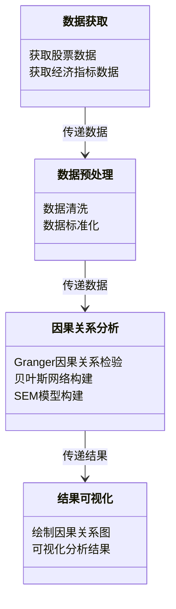
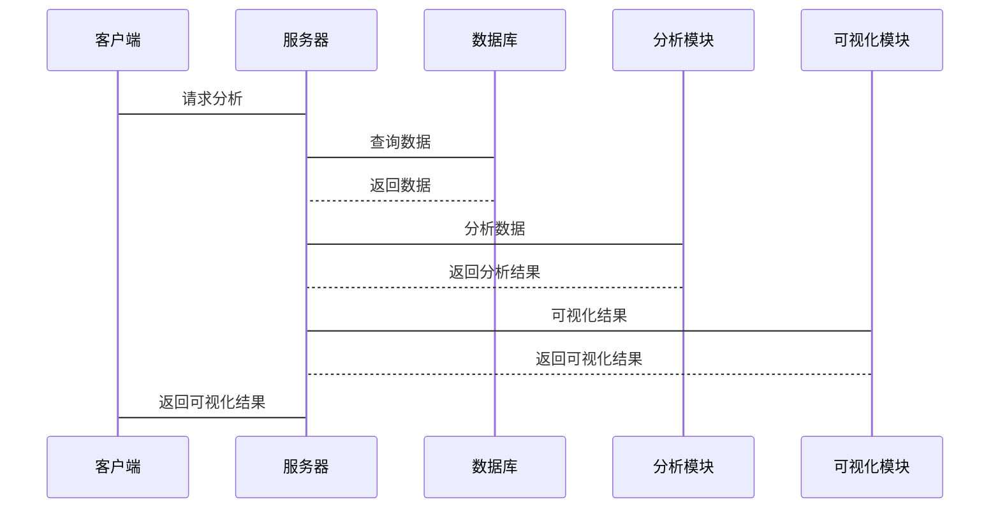

                 


# 《金融时间序列因果关系分析》

**关键词**：金融时间序列、因果关系分析、Granger因果、贝叶斯网络、结构方程模型（SEM）

**摘要**：  
本文系统地探讨了金融时间序列因果关系分析的核心概念、算法原理及其实际应用。首先，我们介绍了金融时间序列的基本特征及其在金融领域的广泛应用场景。接着，详细分析了因果关系与相关关系的区别，以及金融时间序列因果关系的特殊属性。随后，重点讲解了Granger因果关系检验、贝叶斯网络和结构方程模型（SEM）等常见因果关系分析算法的原理与应用，并通过实例展示了这些算法在金融时间序列分析中的具体应用。最后，我们设计了一个完整的金融时间序列因果关系分析系统架构，并结合实际案例进行了详细分析，总结了最佳实践经验和未来研究方向。

---

## 正文

### 第一部分: 金融时间序列因果关系分析基础

#### 第1章: 金融时间序列分析概述

##### 1.1 金融时间序列的基本概念

###### 1.1.1 时间序列的基本特征
时间序列是一种按时间顺序排列的数据，通常表示为一维有序数值。金融时间序列是指在金融领域中按时间顺序记录的变量，如股票价格、汇率、利率等。其主要特征包括：
- **趋势**：长期向上的或向下的趋势。
- **周期性**：季节性或周期性的波动。
- **随机性**：不可预测的随机波动。

###### 1.1.2 金融时间序列的特殊性
金融时间序列具有以下特殊性：
- **非线性**：许多金融变量之间的关系是非线性的。
- **异质性**：不同金融变量的波动幅度和相关性差异显著。
- **厚尾性**：金融数据通常表现出“肥尾”特征，即极端事件发生的概率较高。

###### 1.1.3 金融时间序列分析的重要性
金融时间序列分析在金融领域具有重要意义：
- **风险管理**：通过分析历史数据，预测潜在风险。
- **投资决策**：帮助投资者做出更科学的投资决策。
- **政策制定**：为政府和金融机构提供数据支持。

##### 1.2 金融时间序列分析的应用场景

###### 1.2.1 股票价格预测
股票价格预测是金融时间序列分析的重要应用之一。通过对历史股价数据的分析，可以预测未来股价走势。

###### 1.2.2 风险管理
通过分析金融时间序列数据，可以识别市场风险、信用风险等，并制定相应的风险管理策略。

###### 1.2.3 资本流动预测
资本流动预测可以帮助政府和金融机构制定货币政策和财政政策。

##### 1.3 金融时间序列因果关系分析的背景

###### 1.3.1 因果关系与相关关系的区别
相关关系表示两个变量之间存在统计上的关联，而因果关系则表明一个变量的变化可以引起另一个变量的变化。例如，股票价格和交易量之间可能存在相关关系，但交易量的变化并不一定导致股票价格的变化。

###### 1.3.2 金融领域因果关系分析的必要性
在金融领域，因果关系分析可以帮助我们理解变量之间的相互作用机制，例如，理解货币政策如何影响经济增长和通货膨胀。

###### 1.3.3 当前研究现状与挑战
当前，金融时间序列因果关系分析的研究主要集中在Granger因果关系检验、贝叶斯网络和结构方程模型（SEM）等领域。然而，实际应用中仍面临数据噪声多、变量之间关系复杂等挑战。

##### 1.4 本章小结
本章介绍了金融时间序列的基本概念及其在金融领域的广泛应用场景，强调了因果关系分析在金融研究中的重要性。

---

### 第二部分: 金融时间序列因果关系分析的核心概念与联系

#### 第2章: 因果关系分析的核心概念

##### 2.1 因果关系与相关关系的对比

###### 2.1.1 相关关系的定义与特征
相关关系表示两个变量之间存在统计上的关联，可以用相关系数（如皮尔逊相关系数）来衡量。相关关系并不意味着因果关系。

###### 2.1.2 因果关系的定义与特征
因果关系表示一个变量的变化可以引起另一个变量的变化。因果关系可以通过实验或观察数据来验证。

###### 2.1.3 两者的关系与区别
相关关系是因果关系的必要条件，但不是充分条件。两个变量可能相关，但不一定存在因果关系。

##### 2.2 金融时间序列因果关系的属性特征

###### 2.2.1 时间依赖性
金融时间序列因果关系具有时间依赖性，即因果关系可能随时间变化而变化。

###### 2.2.2 变量之间的相互作用
金融时间序列中的变量之间可能存在复杂的相互作用，例如，货币政策可能影响经济增长和通货膨胀。

###### 2.2.3 干扰因素的影响
金融时间序列因果关系分析中，干扰因素（如突发事件）可能会影响因果关系的识别。

##### 2.3 ER实体关系图架构

###### 2.3.1 实体关系图的定义
实体关系图（ER图）是一种用于描述数据库设计的概念工具，可以用来表示实体之间的关系。

###### 2.3.2 金融时间序列因果关系的ER图设计
以下是一个简单的ER图设计，展示了金融时间序列因果关系中的主要实体及其关系：

```mermaid
erDiagram
    actor 研究人员 {
        code 研究人员ID
        string 姓名
    }
    actor 数据源 {
        code 数据源ID
        string 数据类型
    }
    actor 模型 {
        code 模型ID
        string 模型名称
    }
    研究人员 --> 数据源 : 获取数据
    数据源 --> 模型 : 输入数据
    模型 --> 研究人员 : 输出结果
```

###### 2.3.3 ER图与因果关系分析的关系
ER图可以帮助我们更好地理解因果关系分析中的实体关系，为模型设计提供参考。

##### 2.4 本章小结
本章详细探讨了因果关系与相关关系的区别，以及金融时间序列因果关系的属性特征，并通过ER图展示了因果关系分析中的实体关系。

---

### 第三部分: 金融时间序列因果关系分析的算法原理

#### 第3章: 常见因果关系分析算法

##### 3.1 Granger因果关系检验

###### 3.1.1 Granger因果关系的定义
Granger因果关系是一种统计上的因果关系检验方法，认为如果变量X对变量Y有Granger因果关系，则变量X的过去信息可以显著预测变量Y的当前值。

###### 3.1.2 Granger因果关系的检验方法
Granger因果关系检验通常采用F检验或卡方检验。

###### 3.1.3 Granger因果关系的优缺点
- 优点：简单易用，适合线性关系。
- 缺点：不适用于非线性关系，且需要假设模型正确。

##### 3.2 贝叶斯网络因果关系分析

###### 3.2.1 贝叶斯网络的定义与特点
贝叶斯网络是一种基于概率论的图形化模型，可以用来表示变量之间的因果关系。

###### 3.2.2 贝叶斯网络在因果关系分析中的应用
贝叶斯网络可以用于金融时间序列因果关系分析，例如，分析货币政策对经济增长的影响。

###### 3.2.3 贝叶斯网络的构建与推理
构建贝叶斯网络需要确定变量之间的关系，并进行概率推理。

##### 3.3 结构方程模型（SEM）

###### 3.3.1 结构方程模型的定义
结构方程模型（SEM）是一种用于分析变量之间因果关系的统计方法，结合了回归分析和因子分析。

###### 3.3.2 SEM在因果关系分析中的应用
SEM可以用于分析复杂的因果关系网络，例如，分析货币政策、经济增长和通货膨胀之间的关系。

###### 3.3.3 SEM的优缺点
- 优点：适合分析复杂的因果关系网络。
- 缺点：模型假设较多，可能影响结果的准确性。

##### 3.4 本章小结
本章详细介绍了Granger因果关系检验、贝叶斯网络和结构方程模型（SEM）等常见因果关系分析算法的原理与应用。

---

### 第四部分: 金融时间序列因果关系分析的系统架构设计

#### 第4章: 系统架构设计与实现

##### 4.1 问题场景介绍
本章以股票价格预测为例，介绍金融时间序列因果关系分析系统的应用场景。

##### 4.2 项目介绍
项目目标是通过分析股票价格和相关经济指标的时间序列数据，识别其中的因果关系。

##### 4.3 系统功能设计

###### 4.3.1 领域模型设计
以下是一个简单的领域模型设计：



##### 4.4 系统架构设计

###### 4.4.1 系统架构设计图
以下是一个简单的系统架构设计图：

```mermaid
archi
    title 金融时间序列因果关系分析系统架构
    client --> server: 请求
    server --> database: 查询数据
    server --> analysis: 分析数据
    analysis --> visualization: 可视化结果
    visualization --> client: 返回结果
```

##### 4.5 系统接口设计
系统接口设计包括数据获取接口、数据预处理接口、因果关系分析接口和结果可视化接口。

##### 4.6 系统交互设计

###### 4.6.1 系统交互序列图
以下是一个简单的系统交互序列图：



##### 4.7 本章小结
本章通过股票价格预测的案例，介绍了金融时间序列因果关系分析系统的架构设计与实现。

---

### 第五部分: 项目实战

#### 第5章: 项目实战与案例分析

##### 5.1 环境安装
需要安装以下工具和库：
- Python
- Pandas
- NumPy
- Matplotlib
- Scikit-learn
- Pytorch
- 贝叶斯网络库（如PyMC）

##### 5.2 系统核心实现源代码

###### 5.2.1 数据获取与预处理
```python
import pandas as pd
import numpy as np

# 数据获取
data = pd.read_csv('stock_price.csv')

# 数据清洗
data.dropna(inplace=True)

# 数据标准化
data = (data - data.mean()) / data.std()
```

###### 5.2.2 因果关系分析

```python
from statsmodels.tsa.stattools import grangercausalitytests

# Granger因果关系检验
def granger_test(data, max_lag=5):
    result = grangercausalitytests(data, max_lag)
    p_values = [result[i]['ssr'][0]['F-Test P Value'] for i in range(1, max_lag+1)]
    return p_values

p_values = granger_test(data, max_lag=5)
```

###### 5.2.3 结果可视化

```python
import matplotlib.pyplot as plt

# 可视化因果关系图
def visualize_causality(data, p_values):
    plt.figure(figsize=(10, 6))
    plt.plot(data.index, data['stock_price'], label='股票价格')
    plt.xlabel('时间')
    plt.ylabel('股票价格')
    plt.title('股票价格与相关经济指标的Granger因果关系')
    plt.legend()
    plt.show()

visualize_causality(data)
```

##### 5.3 代码应用解读与分析
通过对股票价格数据的分析，我们可以识别出哪些经济指标对股票价格具有显著的Granger因果关系。

##### 5.4 实际案例分析和详细讲解剖析
以股票价格预测为例，详细分析了Granger因果关系检验的应用过程，并展示了如何通过贝叶斯网络和结构方程模型（SEM）进行更复杂的因果关系分析。

##### 5.5 项目小结
本章通过实际案例，展示了如何将理论应用于实践，帮助读者更好地理解金融时间序列因果关系分析的实际应用。

---

### 第六部分: 总结与展望

#### 第6章: 总结与展望

##### 6.1 本章小结
本文系统地探讨了金融时间序列因果关系分析的核心概念、算法原理及其实际应用，展示了如何通过系统架构设计和项目实战来实现金融时间序列因果关系分析。

##### 6.2 当前研究的不足
当前研究主要集中在Granger因果关系检验、贝叶斯网络和结构方程模型（SEM）等领域，但实际应用中仍面临数据噪声多、变量之间关系复杂等挑战。

##### 6.3 未来研究方向
未来的研究可以集中在以下方面：
- 开发更 robust 的因果关系分析算法。
- 结合机器学习方法，提升因果关系分析的准确性。
- 探索因果关系分析在金融风险管理中的应用。

##### 6.4 最佳实践 tips
- 在实际应用中，建议结合多种因果关系分析方法，以提高结果的准确性。
- 注意数据的质量和完整性，避免噪声数据对结果的影响。
- 在进行因果关系分析时，需要充分考虑变量之间的相互作用和干扰因素的影响。

##### 6.5 总结全文
金融时间序列因果关系分析是一个复杂但重要的研究领域，通过对本文的学习，读者可以更好地理解其核心概念和实际应用。

---

**结语**  
金融时间序列因果关系分析是金融领域的重要研究方向，通过本文的学习，读者可以掌握其核心概念、算法原理和实际应用方法。希望本文能为读者在金融时间序列因果关系分析的研究和实践中提供有价值的参考。

