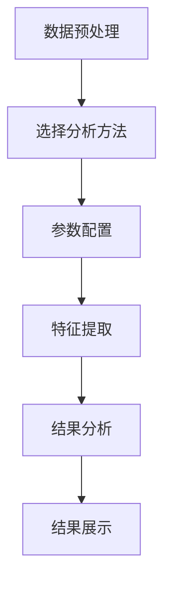

                 


# 《金融时间序列多尺度分析平台》

---

## 关键词：
金融时间序列、多尺度分析、系统架构、算法原理、项目实战、技术实现

---

## 摘要：
本文旨在介绍金融时间序列多尺度分析平台的设计与实现。通过分析金融时间序列数据的特点，提出多尺度分析的需求，并详细阐述其核心概念、算法原理和系统架构设计。结合实际案例，展示该平台在金融数据分析中的应用价值，并总结其优势与未来发展方向。

---

## 目录

### 第一部分: 金融时间序列多尺度分析平台背景与概念

#### 第1章: 金融时间序列分析的背景与挑战

##### 1.1 金融时间序列分析的背景

- 1.1.1 金融数据分析的重要性  
  - 数据驱动的决策在金融领域的核心作用。  
  - 时间序列数据在金融预测中的重要性。  

- 1.1.2 时间序列数据的特点  
  - 连续性、时序性、波动性、周期性。  

- 1.1.3 多尺度分析的必要性  
  - 不同时间粒度数据的分析需求。  
  - 细粒度数据的高频交易与长周期数据的宏观分析。  

##### 1.2 问题背景与问题描述

- 1.2.1 传统金融分析的局限性  
  - 线性回归与简单统计模型的局限性。  
  - 单一时间粒度分析的不足。  

- 1.2.2 时间序列多尺度分析的定义  
  - 在不同时间粒度上进行数据特征提取与分析。  

- 1.2.3 问题解决的核心目标  
  - 提供跨时间粒度的金融数据分析能力。  
  - 支持高频交易、风险管理与市场趋势预测。  

##### 1.3 多尺度分析的边界与外延

- 1.3.1 分析范围的界定  
  - 确定最小和最大时间粒度。  

- 1.3.2 相关领域的联系  
  - 与时间序列预测、机器学习、大数据分析的关系。  

- 1.3.3 应用场景的扩展  
  - 从股票市场到外汇市场的多领域应用。  

##### 1.4 核心概念与组成要素

- 1.4.1 数据源的多样性  
  - 交易数据、市场指数、新闻数据、社交媒体数据。  

- 1.4.2 分析方法的层次性  
  - 基于统计的方法、机器学习方法、深度学习方法。  

- 1.4.3 结果应用的多样性  
  - 交易信号生成、风险评估、市场趋势预测。  

---

### 第二部分: 多尺度分析平台的系统架构与实现

#### 第2章: 核心概念与联系

##### 2.1 多尺度分析的核心原理

- 2.1.1 多尺度分析的基本原理  
  - 不同时间粒度的数据特征提取与关联分析。  

- 2.1.2 不同尺度的特征提取  
  - 高频交易中的分钟级数据与日级别数据的对比。  

- 2.1.3 多尺度分析的优势与劣势  
  - 优势：捕捉多层次市场信息；劣势：计算复杂度高。  

##### 2.2 核心概念对比分析

- 2.2.1 不同分析方法的对比  
  | 方法         | 优点                       | 缺点                       |
  |--------------|---------------------------|---------------------------|
  | 移动平均法    | 简单易实现                 | 无法捕捉复杂趋势           |
  | 自回归模型    | 能捕捉时间依赖性           | 对非线性关系表现不佳       |
  | 小波分析      | 多尺度分解能力强           | 参数选择敏感               |

- 2.2.2 各种方法的优缺点  
  - 移动平均法适合平滑数据，但难以捕捉趋势。  
  - 自回归模型适合线性关系，但对非线性数据效果有限。  
  - 小波分析能够有效捕捉不同频率的信号变化。  

- 2.2.3 方法之间的联系与区别  
  - 移动平均与自回归模型：均属于线性方法，但关注的维度不同。  
  - 小波分析：基于非线性变换，适用于多尺度特征提取。  

##### 2.3 ER实体关系图架构

```mermaid
erDiagram
  actor 用户 {
    string 用户ID
    string 用户名
    integer 密码
  }
  actor 数据源 {
    string 数据源ID
    string 数据源名称
    string 数据类型
  }
  actor 分析方法 {
    string 方法ID
    string 方法名称
    string 方法类型
  }
  actor 结果展示 {
    string 结果ID
    string 结果类型
    string 时间戳
  }
  用户 --> 数据源 : 提供数据源
  数据源 --> 分析方法 : 分析数据
  分析方法 --> 结果展示 : 展示结果
```

---

#### 第3章: 算法原理与实现

##### 3.1 基本数学模型

- 3.1.1 时间序列的基本模型  
  - ARIMA模型：用于线性时间序列预测。  
  - LSTM模型：用于非线性时间序列预测。  

- 3.1.2 多尺度分析的数学表达  
  - 小波变换：$W(t) = \sum_{k} a_k \psi(t - k)$  

- 3.1.3 常见的数学公式  
  - 均值：$\mu = \frac{1}{n}\sum_{i=1}^{n} x_i$  
  - 方差：$\sigma^2 = \frac{1}{n-1}\sum_{i=1}^{n} (x_i - \mu)^2$  

##### 3.2 算法原理与流程图



##### 3.3 详细公式与实例说明

- 3.3.1 公式推导的详细步骤  
  - 小波变换的正交性：$ \int_{-\infty}^{\infty} \psi(t) \psi(t') dt = \delta(t - t') $  

- 3.3.2 公式的实际应用案例  
  - 使用小波分析提取高频交易信号。  

- 3.3.3 公式的通俗解释  
  - 小波变换可以看作是将信号分解成不同频率的“音调”。  

---

### 第三部分: 项目实战与结果分析

#### 第4章: 项目实战

##### 4.1 环境安装与配置

- 安装Python环境：`pip install numpy pandas matplotlib`  
- 安装机器学习库：`pip install scikit-learn tensorflow`  
- 安装数据处理工具：`pip install pytz requests`

##### 4.2 核心功能实现

```python
import numpy as np
import pandas as pd
from sklearn.metrics import mean_squared_error
from tensorflow.keras.models import Sequential
from tensorflow.keras.layers import LSTM, Dense

# 数据预处理
def preprocess(data):
    data['date'] = pd.to_datetime(data['date'])
    data.set_index('date', inplace=True)
    return data

# 多尺度分析
def multiscale_analysis(data):
    scales = [5, 10, 20]
    results = []
    for scale in scales:
        window = data['close'].rolling(scale)
        mean = window.mean()
        std = window.std()
        results.append({'scale': scale, 'mean': mean, 'std': std})
    return results

# LSTM模型训练
def train_lstm_model(train_data):
    model = Sequential()
    model.add(LSTM(50, input_shape=(None, 1)))
    model.add(Dense(1))
    model.compile(loss='mean_squared_error', optimizer='adam')
    model.fit(train_data, epochs=50, batch_size=32)
    return model

# 预测与评估
def evaluate_model(model, test_data):
    prediction = model.predict(test_data)
    mse = mean_squared_error(test_data, prediction)
    return mse
```

##### 4.3 案例分析与结果展示

```python
data = pd.read_csv('stock_data.csv')
preprocessed_data = preprocess(data)
results = multiscale_analysis(preprocessed_data)
model = train

