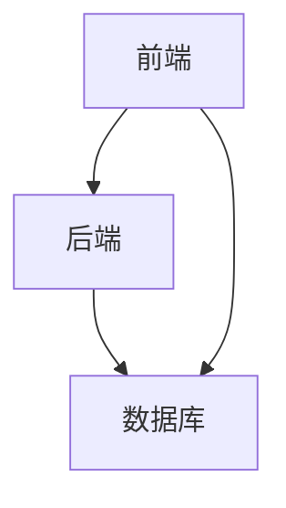
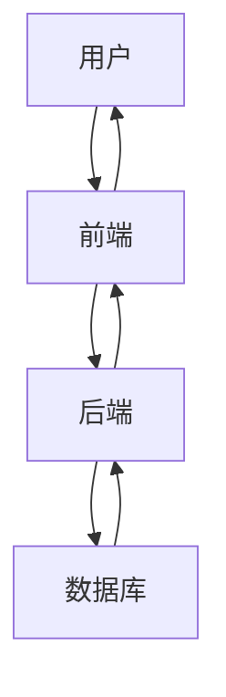

                 


# 《金融时间序列异常检测与修复系统》

---

## 关键词：  
- 金融时间序列  
- 异常检测  
- 系统修复  
- 数据分析  
- 机器学习  

---

## 摘要：  
金融时间序列数据是金融市场中至关重要的信息载体，其波动性、复杂性和潜在的异常行为对金融机构的决策和风险管理具有重要影响。本文深入探讨了金融时间序列异常检测与修复系统的核心原理、算法实现和系统设计。通过分析时间序列数据的特点，结合统计学、机器学习和深度学习的方法，提出了一套完整的异常检测与修复解决方案。文章还详细介绍了系统的架构设计、项目实战和优化策略，为金融机构提供了有效的技术参考。

---

# 第1章: 金融时间序列异常检测与修复系统背景  

## 1.1 金融时间序列数据概述  

### 1.1.1 金融时间序列数据的定义与特点  
金融时间序列数据是指按照时间顺序记录的金融市场相关数据，如股票价格、交易量、汇率、指数等。其特点包括：  
1. **连续性**：数据按时间顺序连续记录。  
2. **波动性**：金融市场的波动性较高，数据呈现周期性或随机性。  
3. **复杂性**：受多种因素（如市场情绪、政策变化、经济指标等）影响。  
4. **异常性**：可能出现突变点、市场操纵或其他异常行为。  

### 1.1.2 金融时间序列数据的应用场景  
- **股票交易**：实时监测股价波动，识别异常交易行为。  
- **风险管理**：及时发现潜在风险，防止损失扩大。  
- **市场分析**：通过异常数据揭示市场趋势和潜在问题。  

### 1.1.3 异常检测在金融领域的意义  
- **风险控制**：识别异常交易行为，防止金融欺诈。  
- **市场监控**：及时发现市场操纵或其他违规行为。  
- **数据质量**：修复异常数据，确保分析结果的准确性。  

---

## 1.2 异常检测与修复系统的重要性  

### 1.2.1 金融市场的异常现象分析  
- **突变点**：价格短时间内急剧上涨或下跌。  
- **市场操纵**：通过虚假交易影响市场价格。  
- **数据错误**：数据采集或传输过程中的错误。  

### 1.2.2 异常检测在金融风险管理中的作用  
- **实时监控**：及时发现异常行为，采取应对措施。  
- **减少损失**：通过异常检测，提前识别潜在风险。  

### 1.2.3 异常修复系统的目标与价值  
- **数据修复**：自动修复因异常行为或数据错误导致的问题。  
- **系统稳定性**：确保金融系统的稳定运行。  

---

## 1.3 本章小结  
本章介绍了金融时间序列数据的定义、特点及应用场景，并强调了异常检测与修复系统在金融风险管理中的重要性。接下来，我们将深入探讨异常检测的核心概念与算法原理。

---

# 第2章: 金融时间序列异常检测的核心概念  

## 2.1 时间序列分析的基本原理  

### 2.1.1 时间序列的组成要素  
时间序列通常由以下几个要素组成：  
1. **趋势**：长期向上的或向下的趋势。  
2. **周期性**：数据呈现周期性波动。  
3. **季节性**：数据在特定时间段内呈现规律性变化。  
4. **随机性**：不可预测的随机波动。  

### 2.1.2 时间序列的平稳性与分解方法  
- **平稳性**：时间序列的统计特性在时间推移中保持不变。  
- **分解方法**：将时间序列分解为趋势、周期性、季节性和随机性成分。  

### 2.1.3 时间序列预测的基本原理  
时间序列预测是通过历史数据预测未来值的过程。常用的模型包括ARIMA、LSTM等。  

---

## 2.2 异常检测的分类与方法  

### 2.2.1 基于统计的方法  
- **Z-score**：通过标准化数据计算异常值。  
- **LOF（局部异常因子）**：基于局部密度的异常检测方法。  

### 2.2.2 基于机器学习的方法  
- **Isolation Forest**：通过随机森林算法识别异常值。  
- **K-Means**：通过聚类分析发现异常样本。  

### 2.2.3 基于深度学习的方法  
- **LSTM**：通过长短期记忆网络捕捉时间序列的长期依赖关系。  
- **CNN**：通过卷积神经网络提取时间序列的局部特征。  

---

## 2.3 异常修复的基本原理  

### 2.3.1 异常修复的目标与策略  
- **目标**：修复异常数据，使其符合正常数据的分布。  
- **策略**：基于异常检测结果，采用插值、平滑或其他修复方法。  

### 2.3.2 异常修复的数学模型  
- **线性插值**：通过相邻正常数据点插值修复异常值。  
- **ARIMA修复**：利用ARIMA模型预测正常值并替换异常值。  

---

## 2.4 本章小结  
本章详细介绍了时间序列分析的基本原理、异常检测的分类与方法，以及异常修复的基本原理。接下来，我们将深入探讨异常检测与修复的具体算法实现。

---

# 第3章: 异常检测与修复的算法原理  

## 3.1 常见的时间序列异常检测算法  

### 3.1.1 基于统计的异常检测算法  

#### Z-score异常检测  
Z-score是一种常用的统计方法，公式如下：  
$$ Z = \frac{X - \mu}{\sigma} $$  
其中，$\mu$ 是均值，$\sigma$ 是标准差。若 $|Z| > 3$，则认为数据点为异常值。  

#### LOF异常检测  
LOF（局部异常因子）通过计算数据点的局部密度与全局密度的比值，判断数据点是否为异常值。  

### 3.1.2 基于机器学习的异常检测算法  

#### Isolation Forest异常检测  
Isolation Forest是一种无监督的异常检测算法，通过构建随机森林，将数据点隔离到叶子节点，从而判断其是否为异常值。  

### 3.1.3 基于深度学习的异常检测算法  

#### LSTM异常检测  
LSTM（长短期记忆网络）通过捕捉时间序列的长短期依赖关系，识别异常行为。  

---

## 3.2 异常检测算法的数学模型  

### 3.2.1 基于ARIMA模型的异常检测  
ARIMA（自回归积分滑动平均模型）适用于平稳时间序列的预测。其数学模型如下：  
$$ ARIMA(p, d, q) $$  
其中，$p$ 是自回归阶数，$d$ 是差分阶数，$q$ 是滑动平均阶数。  

### 3.2.2 基于LSTM模型的异常检测  
LSTM模型的结构包括输入门、遗忘门和输出门，公式如下：  
$$ f_t = \sigma(W_f \cdot [h_{t-1}, x_t] + b_f) $$  
$$ i_t = \sigma(W_i \cdot [h_{t-1}, x_t] + b_i) $$  
$$ o_t = \sigma(W_o \cdot [h_{t-1}, x_t] + b_o) $$  
$$ h_t = f_t \cdot c_{t-1} + i_t \cdot x_t $$  
$$ c_t = f_t \cdot c_{t-1} + i_t \cdot x_t $$  
$$ h_t = o_t \cdot h_t $$  

---

## 3.3 异常修复算法的数学模型  

### 3.3.1 基于线性回归的异常修复  
线性回归通过拟合正常数据点，预测正常值并替换异常值。其数学模型如下：  
$$ y = a x + b $$  
其中，$a$ 和 $b$ 是回归系数。  

### 3.3.2 基于ARIMA模型的异常修复  
利用ARIMA模型预测正常值并替换异常值。其数学模型与异常检测相同。  

---

## 3.4 本章小结  
本章详细介绍了几种常见的异常检测与修复算法，并通过数学公式和流程图展示了其工作原理。接下来，我们将从系统设计的角度，探讨异常检测与修复系统的实现方案。

---

# 第4章: 金融时间序列异常检测与修复系统的系统设计  

## 4.1 系统分析  

### 4.1.1 项目介绍  
本系统旨在通过异常检测与修复技术，帮助金融机构实时监测和修复金融时间序列数据。  

### 4.1.2 系统功能设计  
- **数据采集**：从金融数据源获取时间序列数据。  
- **异常检测**：基于算法实现异常检测。  
- **异常修复**：根据检测结果修复异常数据。  

### 4.1.3 系统架构设计  
- **前端**：用户界面，展示检测结果和修复建议。  
- **后端**：算法实现，包括数据处理和模型训练。  
- **数据库**：存储原始数据和检测结果。  

---

## 4.2 系统架构设计  

### 4.2.1 系统架构图  


### 4.2.2 系统接口设计  
- **数据接口**：提供RESTful API，供前端调用。  
- **修复接口**：提供修复功能的API。  

### 4.2.3 系统交互流程图  


---

## 4.3 系统优化与扩展  

### 4.3.1 性能优化  
- **分布式架构**：通过分布式计算提高处理速度。  
- **缓存优化**：通过缓存技术减少重复计算。  

### 4.3.2 系统扩展  
- **多数据源支持**：支持多种金融数据源的接入。  
- **多模型支持**：支持多种异常检测算法的集成。  

---

## 4.4 本章小结  
本章从系统设计的角度，详细介绍了金融时间序列异常检测与修复系统的功能模块、架构设计和优化策略。接下来，我们将通过一个实际案例，展示系统的实现过程。

---

# 第5章: 项目实战  

## 5.1 环境搭建  

### 5.1.1 开发工具安装  
- **Python**：安装Python 3.8及以上版本。  
- **框架安装**：安装Flask、TensorFlow等框架。  

### 5.1.2 数据集准备  
选择一个金融时间序列数据集，例如股票价格数据。  

---

## 5.2 核心代码实现  

### 5.2.1 数据采集代码  
```python
import pandas as pd
import requests

url = "https://api.example.com/stock_price"
data = requests.get(url).json()
df = pd.DataFrame(data)
```

### 5.2.2 异常检测代码  
```python
from sklearn.ensemble import IsolationForest

model = IsolationForest(n_estimators=100, random_state=42)
model.fit(X)
outliers = model.predict(X)
```

### 5.2.3 异常修复代码  
```python
from sklearn.linear_model import LinearRegression

model = LinearRegression()
model.fit(X_normal, y_normal)
y_repair = model.predict(X_outliers)
```

---

## 5.3 案例分析  

### 5.3.1 数据可视化  
使用Matplotlib绘制时间序列数据及其异常点。  

### 5.3.2 检测结果展示  
展示异常检测结果，并分析其准确性。  

### 5.3.3 修复效果评估  
评估修复后的数据是否符合正常分布。  

---

## 5.4 本章小结  
本章通过实际案例展示了金融时间序列异常检测与修复系统的实现过程。接下来，我们将总结系统的优化策略，并展望未来的研究方向。

---

# 第6章: 系统优化与扩展  

## 6.1 性能优化策略  

### 6.1.1 分布式架构设计  
通过分布式计算提高系统的处理能力。  

### 6.1.2 系统扩展策略  
支持更大规模的数据处理和多种算法的集成。  

---

## 6.2 系统扩展  

### 6.2.1 多数据源支持  
支持多种金融数据源的接入，例如股票、债券、外汇等。  

### 6.2.2 多模型支持  
集成多种异常检测算法，提高系统的鲁棒性。  

---

## 6.3 本章小结  
本章讨论了系统的优化策略和扩展方向，为未来的研究提供了参考。

---

# 第7章: 总结与展望  

## 7.1 总结  

### 7.1.1 核心内容回顾  
- 异常检测与修复的核心算法。  
- 系统设计与实现方案。  
- 项目实战与优化策略。  

### 7.1.2 本章小结  
本章总结了金融时间序列异常检测与修复系统的实现过程和关键点。

---

## 7.2 展望  

### 7.2.1 未来研究方向  
- 研究更高效的异常检测算法。  
- 探讨深度学习在时间序列分析中的应用。  

### 7.2.2 系统优化建议  
- 提高系统的实时性与准确性。  
- 加强系统的可扩展性和可维护性。  

---

## 7.3 本章小结  
本章总结了全文的核心内容，并展望了未来的研究方向。  

---

# 附录: 工具与数据集  

## 附录A: 数据集  
- 数据来源：金融时间序列数据集（例如股票价格数据）。  

## 附录B: 工具包  
- Python库：pandas、numpy、scikit-learn、TensorFlow、Keras。  

## 附录C: 参考文献  
- 引用的相关文献和资料。  

---

# END

