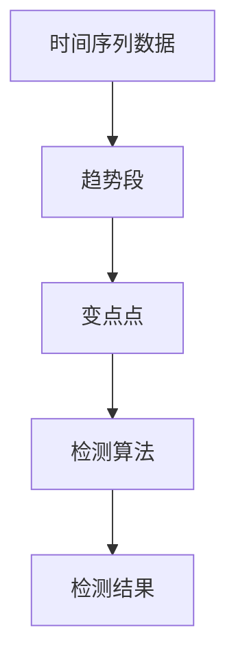
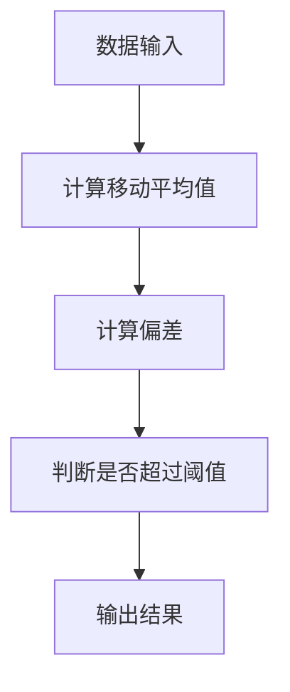

                 


# 《金融时间序列趋势变点检测》

## 关键词：
- 金融时间序列
- 趋势变点检测
- 数据分析
- 算法实现
- 系统架构
- 项目实战

## 摘要：
金融时间序列数据的波动性和复杂性使得趋势变点检测成为金融分析中的重要任务。本文系统地介绍了趋势变点检测的核心概念、常见算法及其数学模型，并通过实际案例展示了系统设计与项目实战。从背景到算法，从系统架构到项目实现，层层深入，帮助读者全面掌握金融时间序列趋势变点检测的方法与应用。

---

# 第一部分: 金融时间序列趋势变点检测基础

## 第1章: 金融时间序列趋势变点检测概述

### 1.1 问题背景
#### 1.1.1 金融时间序列数据的特点
金融时间序列数据具有以下特点：
- **连续性**：数据按时间顺序排列，通常具有连续性。
- **波动性**：价格或指数波动较大，受多种因素影响。
- **趋势性**：数据可能存在长期趋势。
- **周期性**：数据可能表现出季节性或周期性波动。

#### 1.1.2 趋势变点检测的定义与问题描述
趋势变点检测是指在时间序列数据中识别趋势发生显著变化的点。例如，股票价格从上升趋势突然变为下降趋势时的转折点。

#### 1.1.3 趋势变点检测的重要性
趋势变点检测在金融领域具有重要意义：
- **投资决策**：帮助投资者及时发现趋势变化，调整投资策略。
- **风险管理**：识别市场拐点，规避风险。
- **信号预警**：提前预警市场变化，辅助决策。

#### 1.1.4 趋势变点检测的应用场景
- 股票价格预测
- 汇率波动分析
- 金融指数监控

### 1.2 核心概念与联系
#### 1.2.1 时间序列与趋势变点的定义
- **时间序列**：按时间顺序排列的数据序列，如股票价格、汇率等。
- **趋势变点**：时间序列中趋势发生变化的点，称为变点。

#### 1.2.2 趋势变点的属性特征对比表
| 特性         | 趋势段       | 变点点       |
|--------------|--------------|--------------|
| 时间位置     | 连续时间段    | 单点时间      |
| 数据特征     | 数据呈现一致趋势 | 数据趋势发生突变 |
| 变化幅度     | 平缓变化     | 突然变化      |

#### 1.2.3 趋势变点检测的ER实体关系图


---

## 第2章: 时间序列趋势变点检测的核心算法

### 2.1 常见的变点检测算法
#### 2.1.1 移动平均法
- 通过计算滑动窗口内的平均值，识别趋势变化。
- 适用于数据平稳，波动较小的情况。

#### 2.1.2 指数平滑法
- 使用加权平均的方法，赋予近期数据更大权重。
- 适用于数据具有较强趋势性的情况。

#### 2.1.3 马尔可夫链模型
- 将趋势变化视为状态转移问题。
- 适用于数据具有明显状态变化的情况。

### 2.2 算法原理与流程图
#### 2.2.1 移动平均法的流程图


### 2.3 算法的数学模型
#### 2.3.1 移动平均法的数学公式
$$ MA_t = \frac{1}{n}\sum_{i=1}^{n}x_{t-i} $$

#### 2.3.2 指数平滑法的数学公式
$$ S_t = \alpha x_{t-1} + (1-\alpha)S_{t-1} $$

### 2.4 算法实现与对比
- **移动平均法**：简单易实现，但对突变点的敏感性较低。
- **指数平滑法**：能够较好捕捉趋势变化，但对参数α的敏感性较高。
- **马尔可夫链模型**：能够捕捉数据的状态变化，但实现复杂度较高。

---

## 第3章: 时间序列趋势变点检测的系统

### 3.1 系统功能设计
- 数据采集模块：从数据库中获取金融时间序列数据。
- 数据预处理模块：对数据进行清洗和平滑处理。
- 变点检测模块：应用多种算法进行变点检测。
- 结果展示模块：可视化检测结果。

### 3.2 系统架构设计


### 3.3 系统接口设计
- 数据输入接口：接收金融时间序列数据。
- 算法调用接口：调用变点检测算法。
- 结果输出接口：输出检测结果。

### 3.4 系统交互流程


---

## 第4章: 项目实战

### 4.1 环境配置
- 安装Python、NumPy、Pandas、Matplotlib。

### 4.2 核心代码实现
```python
import numpy as np
import matplotlib.pyplot as plt

# 移动平均法实现
def moving_average(data, window_size):
    ma = np.zeros(len(data))
    for i in range(len(data)):
        if i < window_size:
            ma[i] = np.mean(data[:i+1])
        else:
            ma[i] = np.mean(data[i-window_size:i+1])
    return ma

# 变点检测
def detect_change_points(data, threshold):
    ma = moving_average(data, 5)
    change_points = []
    for i in range(1, len(data)):
        diff = abs(data[i] - ma[i])
        if diff > threshold:
            change_points.append(i)
    return change_points

# 示例数据
data = np.random.normal(0, 1, 100) + np.linspace(0, 1, 100)
threshold = 0.5
change_points = detect_change_points(data, threshold)
```

### 4.3 实际案例分析
- 使用股票价格数据进行变点检测，识别市场拐点。

### 4.4 项目总结
- 移动平均法简单易实现，但在复杂场景下表现有限。
- 需结合多种算法提升检测准确性。

---

## 第5章: 总结与展望

### 5.1 总结
- 趋势变点检测是金融数据分析的重要任务。
- 移动平均法、指数平滑法和马尔可夫链模型各有优缺点。
- 系统设计与项目实战帮助我们更好地理解算法实现。

### 5.2 未来研究方向
- 结合深度学习模型提升检测精度。
- 研究多变量时间序列的变点检测方法。

### 5.3 最佳实践 tips
- 数据预处理是关键，需对数据进行充分清洗。
- 算法选择需根据数据特点进行调整。
- 结果验证是确保检测准确性的重要步骤。

---

通过本文的系统介绍，读者可以全面掌握金融时间序列趋势变点检测的核心概念、算法实现和系统设计方法，并能在实际项目中灵活应用这些知识。

