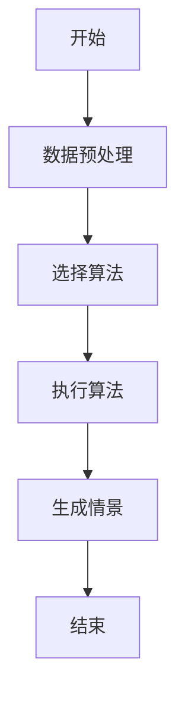
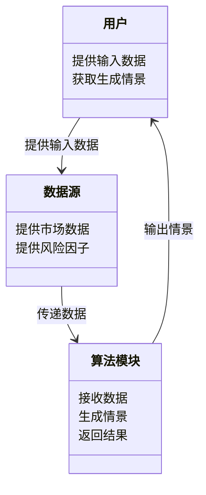
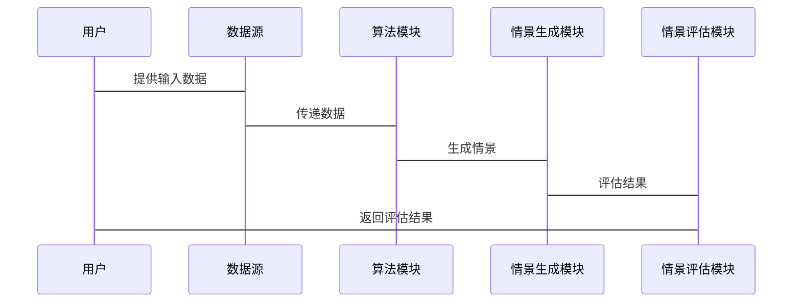

                 


# 金融机构压力测试情景生成器

## 关键词
- 压力测试
- 情景生成器
- 金融机构
- 算法设计
- 系统架构

## 摘要
本文详细介绍金融机构压力测试情景生成器的设计与实现，涵盖背景介绍、核心概念、算法原理、系统架构、项目实战以及最佳实践。通过系统化的分析，帮助读者理解如何利用技术手段生成有效的压力测试情景，评估金融机构的风险承受能力。

---

# 第一部分：背景介绍

## 第1章：压力测试的定义与重要性

### 1.1 压力测试的定义
压力测试是一种评估金融机构在极端市场条件下的风险承受能力的方法，通过模拟各种不利情景，识别潜在风险点。

### 1.2 金融机构压力测试的重要性
- **风险管理**：识别潜在风险，评估资本充足性。
- **监管合规**：满足监管机构对金融机构的风险评估要求。
- **策略制定**：帮助机构制定应对极端情况的策略。

### 1.3 压力测试的情景生成器
情景生成器是压力测试的核心工具，通过算法生成各种极端市场情景，模拟金融机构在这些情景下的表现。

---

## 第2章：压力测试情景生成器的必要性

### 2.1 情景生成的挑战
- **复杂性**：市场变量多，情景生成需考虑多种因素。
- **动态性**：市场环境变化快，需动态调整情景生成模型。
- **准确性**：生成的情景需贴近实际市场情况，避免偏差。

### 2.2 情景生成器的作用
- **提高效率**：自动化生成情景，减少人工干预。
- **增强准确性**：通过算法优化，生成更准确的情景。
- **支持决策**：为压力测试提供可靠的情景数据。

### 2.3 情景生成器的核心要素
- **数据输入**：市场数据、风险因子。
- **算法选择**：蒙特卡洛模拟、遗传算法、时间序列分析。
- **情景评估**：评估生成的情景是否符合预期。

---

# 第二部分：核心概念

## 第3章：压力测试情景生成器的核心概念

### 3.1 情景生成器的原理与机制
- **数据预处理**：清洗和整合市场数据。
- **算法选择**：根据需求选择合适的生成算法。
- **情景生成**：应用算法生成极端市场情景。

### 3.2 情景生成器的属性特征对比
| 属性 | 情景生成方法 |
|------|--------------|
| 数据需求 | 高         | 高         |
| 计算复杂度 | 中         | 高         |
| 应用场景 | 通用        | 优化特定风险 |

### 3.3 ER实体关系图
```mermaid
erDiagram
    actor 用户 {
        <属性> 情景需求
        <属性> 压力测试目标
    }
    actor 数据源 {
        <属性> 市场数据
        <属性> 风险因子
    }
    actor 算法模块 {
        <属性> 生成情景
        <属性> 情景评估
    }
    用户 --> 数据源 : 提供输入数据
    数据源 --> 算法模块 : 传递数据
    算法模块 --> 用户 : 输出情景
```

---

# 第三部分：算法原理

## 第4章：压力测试情景生成器的算法设计

### 4.1 基于蒙特卡洛方法的场景生成
- **原理**：通过随机抽样生成大量情景，计算风险指标。
- **应用**：适用于复杂市场模型的模拟。
- **优缺点**：计算量大，但结果准确。

### 4.2 基于遗传算法的场景优化
- **原理**：通过模拟进化过程优化情景。
- **应用**：优化特定风险点的情景生成。
- **优缺点**：计算效率高，但需设计合理的适应度函数。

### 4.3 基于时间序列分析的场景预测
- **原理**：利用历史数据预测未来市场走势。
- **应用**：生成未来可能的极端市场情景。
- **优缺点**：依赖历史数据，预测准确性受限。

### 4.4 算法流程图


---

## 第5章：数学模型与公式

### 5.1 基于概率分布的情景生成
- **正态分布模型**：
  $$ X \sim N(\mu, \sigma^2) $$
- **t分布模型**：
  $$ X \sim t(\nu, \mu, \sigma) $$

### 5.2 基于风险价值（VaR）的模型
- **VaR计算公式**：
  $$ VaR = \alpha \times \sigma $$

---

# 第四部分：系统架构

## 第6章：压力测试情景生成器的系统设计

### 6.1 系统功能模块
- **数据采集模块**：收集市场数据和风险因子。
- **情景生成模块**：应用算法生成情景。
- **情景评估模块**：评估生成的情景。

### 6.2 系统类图


### 6.3 系统架构图


---

## 第7章：系统接口与交互设计

### 7.1 系统接口设计
- **输入接口**：接收市场数据和风险因子。
- **输出接口**：返回生成的情景和评估结果。

### 7.2 系统交互流程


---

# 第五部分：项目实战

## 第8章：压力测试情景生成器的实现

### 8.1 环境安装
- **Python环境**：安装Python 3.x。
- **依赖库**：安装numpy、pandas、scipy、matplotlib。

### 8.2 核心代码实现

```python
import numpy as np
import matplotlib.pyplot as plt

def generate_scenario(n=1000, mu=0, sigma=1):
    np.random.seed(42)
    scenarios = np.random.normal(mu, sigma, n)
    return scenarios

def plot_scenarios(scenarios):
    plt.hist(scenarios, bins=30, alpha=0.5)
    plt.xlabel('Value')
    plt.ylabel('Frequency')
    plt.title('Scenario Distribution')
    plt.show()

if __name__ == "__main__":
    scenarios = generate_scenario()
    plot_scenarios(scenarios)
```

### 8.3 代码解读
- **generate_scenario**：生成n个随机数，均值为mu，标准差为sigma。
- **plot_scenarios**：绘制生成情景的分布图。

### 8.4 案例分析
通过生成和分析极端市场情景，评估金融机构的风险承受能力。

---

## 第9章：项目小结与注意事项

### 9.1 项目小结
- **核心成果**：实现了一个基础的压力测试情景生成器。
- **经验总结**：选择合适的算法和优化参数对生成准确的情景至关重要。

### 9.2 注意事项
- **数据质量**：确保输入数据的准确性和完整性。
- **算法选择**：根据具体需求选择合适的算法。
- **结果验证**：对生成的情景进行验证，确保其合理性和准确性。

### 9.3 拓展阅读
- **推荐书籍**：《压力测试方法与应用》。
- **推荐文章**：关于蒙特卡洛方法和遗传算法的深入探讨。

---

# 结语

通过系统化的学习和实践，读者可以掌握金融机构压力测试情景生成器的设计与实现，为金融机构的风险管理提供有力支持。未来，随着技术的发展，情景生成器将更加智能化和高效化，为金融行业的稳定发展保驾护航。

