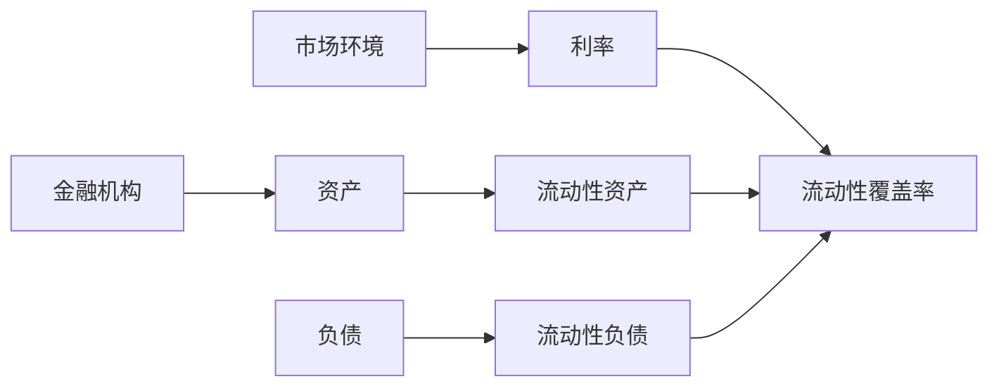
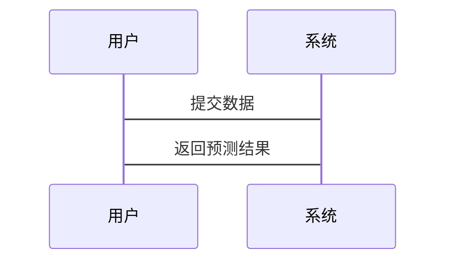

                 


# 金融机构流动性覆盖率预测

> **关键词**：流动性覆盖率、预测模型、金融机构、算法原理、系统设计、案例分析、监管要求

> **摘要**：  
本文深入探讨了金融机构流动性覆盖率的预测方法，结合实际应用场景，分析了流动性覆盖率的核心概念、预测模型的选择与实现、系统架构设计，以及实际案例的详细解读。文章从背景介绍、核心概念、算法原理、系统设计到项目实战，层层展开，帮助读者全面理解流动性覆盖率预测的理论与实践。

---

## 第一部分：金融机构流动性覆盖率预测的背景与概念

### 第1章：流动性覆盖率的定义与重要性

#### 1.1 金融机构流动性管理概述

- **1.1.1 金融机构流动性管理的定义**  
  流动性管理是指金融机构通过调整资产和负债结构，确保在需要时能够迅速获得足够的流动性来满足支付需求。

- **1.1.2 流动性管理的重要性**  
  流动性管理是金融机构稳健运营的核心，直接关系到机构的生存能力和市场信誉。流动性不足可能导致支付危机，而流动性过剩则可能降低资产回报率。

- **1.1.3 流动性覆盖率的监管要求**  
  全球金融危机后，监管机构要求金融机构必须满足一定的流动性覆盖率（LCR），以确保其在短期压力下的流动性安全。

#### 1.2 流动性覆盖率的核心概念

- **1.2.1 流动性覆盖率的定义**  
  流动性覆盖率（LCR）是衡量金融机构短期流动性的重要指标，定义为合格的流动性资产与未来30天内到期的流动性负债之比。

- **1.2.2 流动性覆盖率的计算公式**  
  $$ LCR = \frac{\text{合格的流动性资产}}{\text{未来30天内到期的流动性负债}} $$

- **1.2.3 流动性覆盖率的监管标准**  
  根据巴塞尔协议，金融机构的流动性覆盖率必须至少达到100%。

#### 1.3 流动性覆盖率的适用范围与边界

- **1.3.1 适用的金融机构类型**  
  所有存款类金融机构，包括银行、信用合作社等。

- **1.3.2 不适用的金融机构类型**  
  非存款类金融机构，如证券公司、保险公司等。

- **1.3.3 流动性覆盖率的局限性**  
  流动性覆盖率仅衡量短期流动性，无法反映长期流动性风险。

#### 1.4 本章小结

本章介绍了流动性覆盖率的基本概念、计算方法和监管要求，为后续分析奠定了基础。

---

## 第二部分：流动性覆盖率预测的核心概念与联系

### 第2章：流动性覆盖率预测的核心要素

#### 2.1 流动性覆盖率预测的基本原理

- **2.1.1 预测的基本概念**  
  流动性覆盖率预测是通过分析历史数据和市场环境，预测未来一定时期内流动性覆盖率的变化趋势。

- **2.1.2 预测的数学模型**  
  流动性覆盖率预测模型通常基于时间序列分析或机器学习算法。

- **2.1.3 预测的核心要素**  
  包括资产负债结构、市场环境、宏观经济指标等因素。

#### 2.2 流动性覆盖率预测的关键因素

- **2.2.1 资产负债结构的影响**  
  资产负债的期限错配是影响流动性覆盖率的核心因素。

- **2.2.2 市场环境的影响**  
  市场波动、利率变化等外部因素会显著影响流动性覆盖率。

- **2.2.3 宏观经济指标的影响**  
  经济周期、货币政策等宏观经济因素也会对流动性覆盖率产生影响。

#### 2.3 流动性覆盖率预测的实体关系图



---

## 第三部分：流动性覆盖率预测的算法原理

### 第3章：常见的流动性覆盖率预测算法

#### 3.1 时间序列分析模型

- **3.1.1 ARIMA模型**  
  ARIMA（自回归积分滑动平均模型）适用于具有趋势和季节性的数据。

- **3.1.2 滑动平均模型**  
  简单的滑动平均模型用于平滑短期波动。

- **3.1.3 指数平滑模型**  
  加权指数平滑模型适用于对近期数据更敏感的场景。

#### 3.2 机器学习算法

- **3.2.1 线性回归模型**  
  适用于线性关系的预测。

- **3.2.2 支持向量机模型**  
  适用于非线性关系的预测。

- **3.2.3 随机森林模型**  
  适用于复杂关系的预测。

#### 3.3 深度学习算法

- **3.3.1 LSTM网络**  
  长短期记忆网络适用于时间序列预测。

- **3.3.2 Transformer网络**  
  基于注意力机制的模型，适用于长序列预测。

- **3.3.3 CNN网络**  
  卷积神经网络适用于局部特征提取。

#### 3.4 算法选择与比较

- **3.4.1 不同算法的优缺点**  
  | 算法 | 优点 | 缺点 |
  |------|------|------|
  | ARIMA | 简单易用 | 不适合复杂非线性关系 |
  | LSTM | 能处理长期依赖 | 训练时间长 |
  | 随机森林 | 高精度 | 解释性差 |

- **3.4.2 算法性能的对比分析**  
  不同算法在不同数据集上的表现差异。

- **3.4.3 算法适用场景的分析**  
  根据数据特性和预测目标选择合适的算法。

#### 3.5 本章小结

本章分析了多种流动性覆盖率预测算法的优缺点，并提出了算法选择的建议。

---

## 第四部分：流动性覆盖率预测的系统架构与设计

### 第4章：系统分析与架构设计

#### 4.1 系统需求分析

- **4.1.1 项目背景**  
  流动性覆盖率预测系统旨在帮助金融机构实时监控和预测流动性风险。

- **4.1.2 系统功能需求**  
  数据采集、模型训练、预测展示。

#### 4.2 系统功能设计

- **4.2.1 数据采集模块**  
  从金融机构的资产负债表中提取数据。

- **4.2.2 模型训练模块**  
  使用机器学习模型进行训练。

- **4.2.3 预测展示模块**  
  可视化展示预测结果。

#### 4.3 系统架构设计


#### 4.4 系统接口设计

- **4.4.1 数据接口**  
  RESTful API用于数据传输。

- **4.4.2 模型接口**  
  API用于模型调用。

#### 4.5 系统交互设计



---

## 第五部分：流动性覆盖率预测的项目实战

### 第5章：项目实战与案例分析

#### 5.1 环境安装

- **5.1.1 安装Python**  
  下载并安装Python 3.x。

- **5.1.2 安装依赖库**  
  使用pip安装numpy、pandas、scikit-learn等库。

#### 5.2 核心代码实现

```python
import pandas as pd
from sklearn.model_selection import train_test_split
from sklearn.linear_model import LinearRegression
from sklearn.metrics import mean_absolute_error

# 数据加载
data = pd.read_csv('lcr.csv')

# 数据预处理
X = data[['流动资产', '流动负债']]
y = data['流动性覆盖率']

# 划分训练集和测试集
X_train, X_test, y_train, y_test = train_test_split(X, y, test_size=0.2)

# 模型训练
model = LinearRegression()
model.fit(X_train, y_train)

# 模型预测
y_pred = model.predict(X_test)

# 模型评估
print(mean_absolute_error(y_test, y_pred))
```

#### 5.3 案例分析

- **5.3.1 数据分析**  
  使用实际数据进行建模和预测。

- **5.3.2 模型优化**  
  调整模型参数，提高预测精度。

- **5.3.3 结果解读**  
  解释预测结果的意义。

#### 5.4 本章小结

本章通过实际案例展示了流动性覆盖率预测系统的实现过程。

---

## 第六部分：总结与展望

### 第6章：总结与展望

#### 6.1 本章总结

本文全面介绍了流动性覆盖率预测的核心概念、算法原理和系统设计，并通过案例分析展示了实际应用。

#### 6.2 未来展望

未来可以进一步研究更复杂的模型，如深度学习算法，并结合实时数据流进行预测。

#### 6.3 最佳实践 tips

- 数据质量是预测准确性的重要保障。
- 模型调优是提高预测精度的关键。
- 及时更新数据和模型是保持预测能力的核心。

---

## 结语

通过本文的分析，读者可以系统地掌握流动性覆盖率预测的方法和技巧，为金融机构的风险管理提供有力支持。

