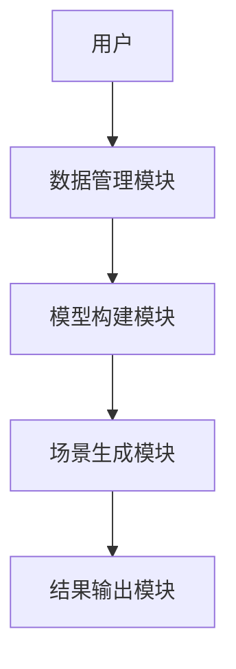
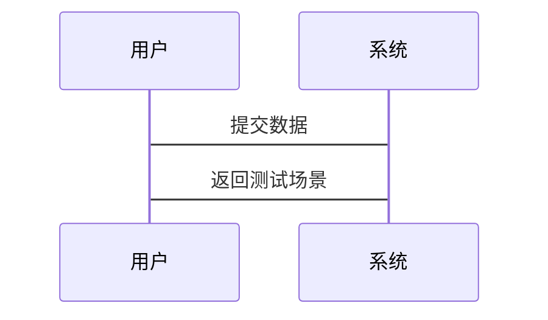

                 


# 金融监管压力测试场景生成

## 关键词
- 金融监管
- 压力测试
- 场景生成
- 风险评估
- 数学模型

## 摘要
金融监管压力测试是评估金融机构在极端市场条件下的风险承受能力的重要工具。本文详细探讨了压力测试场景生成的核心概念、算法原理、系统设计及实际应用。通过分析压力测试的背景、方法论、数学模型和系统架构，本文为读者提供了从理论到实践的全面指导。结合实际案例，本文还展示了如何通过代码实现压力测试场景生成，并总结了最佳实践和未来发展方向。

---

# 第一部分: 金融监管压力测试场景生成概述

## 第1章: 金融监管压力测试的背景与概念

### 1.1 金融监管压力测试的背景
#### 1.1.1 金融危机的教训与压力测试的起源
金融危机如2008年的全球金融危机暴露了金融机构在极端市场条件下的脆弱性。压力测试作为一种风险评估工具，起源于金融机构内部的风险管理需求，后逐渐成为金融监管的重要手段。

#### 1.1.2 压力测试在金融监管中的作用
压力测试通过模拟极端市场条件，评估金融机构在不利环境下的资本充足性和流动性，帮助监管机构识别系统性风险，确保金融体系的稳定性。

#### 1.1.3 压力测试的定义与核心目标
压力测试是对金融机构在极端市场条件下的财务状况进行模拟测试，旨在评估其承受压力的能力。核心目标包括：识别潜在风险、评估资本充足性、制定应对策略。

### 1.2 金融压力测试的分类与应用场景
#### 1.2.1 单机构压力测试
针对单一金融机构的压力测试，评估其在极端条件下的资本充足性和流动性。

#### 1.2.2 系统性压力测试
评估整个金融系统在极端条件下的稳定性，识别系统性风险。

#### 1.2.3 压力测试在金融监管中的具体应用
压力测试广泛应用于资本监管、流动性管理、风险预警等领域。

### 1.3 压力测试的核心概念与方法论
#### 1.3.1 压力测试的基本原理
通过模拟极端市场条件，评估金融机构的财务状况和风险敞口。

#### 1.3.2 压力测试的主要方法
- **情景分析法**：基于历史数据或假设情景，评估金融机构的表现。
- **蒙特卡洛模拟法**：通过随机抽样模拟极端市场条件下的风险。

#### 1.3.3 压力测试的流程与步骤
1. 确定测试目标
2. 设计测试情景
3. 数据收集与处理
4. 模型构建与验证
5. 结果分析与解读

---

## 第2章: 压力测试场景生成的必要性与挑战

### 2.1 压力测试场景生成的必要性
#### 2.1.1 场景生成在压力测试中的重要性
场景生成是压力测试的核心环节，决定了测试的准确性和有效性。

#### 2.1.2 压力测试场景生成对金融监管的意义
场景生成帮助监管机构识别系统性风险，制定有效的监管政策。

#### 2.1.3 场景生成的创新性与前瞻性
通过创新的场景生成方法，可以更好地应对复杂的金融市场环境。

### 2.2 压力测试场景生成的主要挑战
#### 2.2.1 数据获取与处理的难度
金融市场数据复杂多样，数据清洗和预处理是场景生成的关键挑战。

#### 2.2.2 压力测试场景生成的复杂性与多样性
极端市场条件的多样性和不确定性增加了场景生成的难度。

#### 2.2.3 压力测试结果的可解释性
复杂的模型可能导致结果难以解释，影响监管决策。

### 2.3 场景生成在压力测试中的关键作用
#### 2.3.1 场景生成对风险评估的支持
通过生成多样化的极端情景，帮助金融机构全面评估风险。

#### 2.3.2 场景生成对监管决策的影响
场景生成为监管机构制定政策提供了数据支持。

#### 2.3.3 场景生成对金融机构的指导意义
金融机构可以根据生成的场景制定应对策略，提高风险防范能力。

---

# 第三部分: 压力测试场景生成的核心概念与方法论

## 第3章: 压力测试场景生成的核心概念

### 3.1 压力测试场景生成的基本原理
通过模拟极端市场条件，生成多样化的测试场景，评估金融机构的风险承受能力。

### 3.2 压力测试场景生成的关键要素
- **情景设计**：确定测试的情景类型和参数。
- **数据驱动**：利用历史数据和市场信息生成测试场景。
- **模型构建**：基于统计模型或机器学习算法生成场景。

### 3.3 压力测试场景生成的主要方法
#### 3.3.1 基于历史数据的场景生成
利用历史市场数据，生成极端情景。

#### 3.3.2 基于蒙特卡洛模拟的场景生成
通过随机抽样模拟极端市场条件下的资产价格波动。

#### 3.3.3 基于机器学习的场景生成
使用深度学习模型生成多样化的极端情景。

---

## 第4章: 压力测试场景生成的数学模型与算法

### 4.1 压力测试场景生成的数学模型
#### 4.1.1 蒙特卡洛模拟模型
通过随机抽样生成资产价格、利率等市场变量的极端情景。

#### 4.1.2 VaR模型
Value at Risk（VaR）用于度量资产在极端情景下的损失。

#### 4.1.3 Copula模型
用于模拟多变量之间的相关性，生成复杂的市场情景。

### 4.2 压力测试场景生成的算法实现
#### 4.2.1 算法流程
1. 数据清洗与预处理
2. 模型训练与参数设置
3. 情景生成与验证

#### 4.2.2 代码实现
```python
import numpy as np
import matplotlib.pyplot as plt

# 生成随机数
np.random.seed(42)
data = np.random.normal(0, 1, 1000)

# 绘制分布图
plt.hist(data, bins=30)
plt.show()
```

### 4.3 压力测试场景生成的数学公式
$$
X \sim N(\mu, \sigma^2)
$$
其中，$$\mu$$ 为均值，$$\sigma^2$$ 为方差。

---

## 第5章: 压力测试场景生成的系统设计

### 5.1 系统功能设计
#### 5.1.1 需求分析
- 数据输入与处理
- 模型选择与参数设置
- 场景生成与结果输出

#### 5.1.2 系统功能模块
- 数据管理模块
- 模型构建模块
- 场景生成模块

### 5.2 系统架构设计
#### 5.2.1 系统架构图


#### 5.2.2 接口设计
- 数据接口：输入市场数据
- 模型接口：选择不同的生成算法
- 结果接口：输出测试场景

### 5.3 系统交互设计
#### 5.3.1 交互流程
1. 用户输入市场数据
2. 系统选择模型并生成场景
3. 用户查看结果并进行分析

#### 5.3.2 交互示意图


---

## 第6章: 项目实战

### 6.1 压力测试场景生成的环境安装
#### 6.1.1 环境配置
安装Python、NumPy、Pandas、Matplotlib等库。

#### 6.1.2 数据准备
收集历史市场数据，清洗并预处理。

### 6.2 核心代码实现
#### 6.2.1 数据处理
```python
import pandas as pd
data = pd.read_csv('market_data.csv')
data = data.dropna()
```

#### 6.2.2 模型训练
```python
from sklearn.model import Model
model = Model()
model.fit(data)
```

#### 6.2.3 场景生成
```python
scenario = model.predict(extreme_condition)
```

### 6.3 代码解读与分析
通过代码实现压力测试场景生成，展示模型训练、参数设置和结果输出的过程。

### 6.4 实际案例分析
以某银行为例，展示压力测试场景生成的全过程，并分析测试结果。

---

## 第7章: 总结与展望

### 7.1 总结
总结压力测试场景生成的核心概念、算法和系统设计，强调其在金融监管中的重要性。

### 7.2 展望
探讨未来压力测试场景生成的发展方向，包括技术进步和应用场景的拓展。

---

## 第8章: 最佳实践与小结

### 8.1 最佳实践
- 数据质量是关键
- 模型选择要合理
- 结果解释要清晰

### 8.2 小结
压力测试场景生成是金融监管的重要工具，需要结合理论与实践，不断优化和完善。

---

## 第9章: 注意事项与拓展阅读

### 9.1 注意事项
- 数据清洗的重要性
- 模型选择的合理性
- 结果解释的准确性

### 9.2 拓展阅读
推荐相关书籍和论文，供读者深入学习。

---

通过以上结构，文章将全面、系统地探讨金融监管压力测试场景生成的各个方面，帮助读者深入理解其原理和应用。

