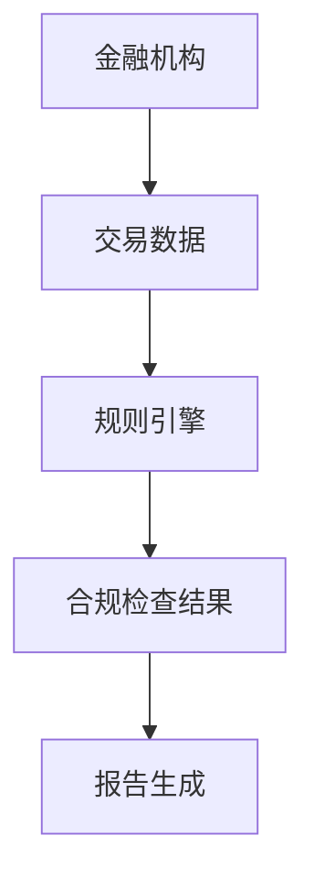
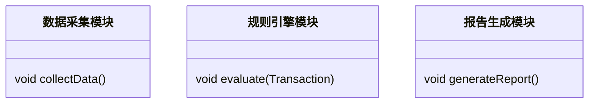
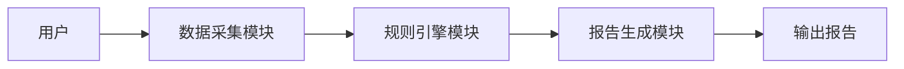

                 


# 金融监管合规自动化工具

## 关键词：
- 金融监管
- 合规自动化
- 规则引擎
- 数据分析
- 人工智能

## 摘要：
本文详细探讨了金融监管合规自动化工具的开发与应用，从背景分析到系统设计，结合实际案例，深入讲解了如何利用技术手段提升金融合规效率。通过规则引擎、数据分析算法和系统架构设计，展示了自动化工具在金融监管中的重要性及其实现方式。

---

## 第一部分：金融监管合规自动化工具概述

### 第1章：金融监管合规概述

#### 1.1 金融监管的背景与挑战

##### 1.1.1 金融监管的基本概念

金融监管是指通过法律法规和规章制度，对金融机构的经营行为进行监督和管理，以维护金融市场的稳定和投资者的利益。金融监管的核心目标包括确保市场公平、防范金融风险、保护消费者权益等。

##### 1.1.2 传统金融监管模式的局限性

传统金融监管模式主要依赖人工审核和手动操作，存在效率低、成本高、易出错等问题。例如，银行需要手动检查大量的交易数据，容易遗漏异常交易，且难以及时应对复杂的监管要求变化。

##### 1.1.3 合规的重要性与挑战

合规是金融机构遵守相关法律法规的必要条件，直接影响企业的声誉、经营稳定性以及市场准入。然而，金融法规繁多且不断更新，合规工作面临巨大挑战，特别是在处理海量数据和复杂业务规则方面。

#### 1.2 金融监管合规自动化工具的需求

##### 1.2.1 自动化监管的定义与特点

自动化监管利用技术手段，如人工智能、大数据分析等，自动识别和处理违规行为，提高监管效率和准确性。其特点包括实时监控、智能分析、自动化处理等。

##### 1.2.2 自动化监管工具的优势

自动化监管工具可以显著减少人工干预，降低合规成本，提高监管效率。例如，通过机器学习算法自动识别异常交易，可以快速发现潜在的洗钱行为，避免人为疏漏。

##### 1.2.3 金融行业对自动化合规工具的需求

随着金融市场的复杂化和监管力度的加强，金融机构对自动化合规工具的需求日益迫切。特别是在反洗钱、关联交易监控等领域，自动化工具能够有效提高合规效率，降低风险。

#### 1.3 金融监管合规自动化工具的现状

##### 1.3.1 当前市场上的自动化工具

目前市场上的自动化监管工具种类繁多，包括基于规则的系统、机器学习模型等。例如，一些工具利用自然语言处理技术自动解析法规文本，生成相应的合规规则。

##### 1.3.2 自动化工具的应用场景

自动化工具广泛应用于反洗钱监控、关联交易识别、合规报告生成等领域。例如，在反洗钱监控中，工具可以自动分析交易数据，识别可疑交易并生成报告。

##### 1.3.3 自动化工具的发展趋势

随着技术的进步，自动化监管工具将更加智能化和个性化。未来的工具可能会结合区块链技术，确保数据的安全性和不可篡改性，进一步提升监管效率。

## 第二部分：金融监管合规自动化工具的核心概念

### 第2章：核心概念与联系

#### 2.1 金融监管合规工具的核心概念

##### 2.1.1 规则引擎

规则引擎是一种用于执行业务规则的软件组件，广泛应用于金融监管中。规则引擎可以将复杂的业务规则转化为可执行的代码，实现自动化的合规检查。

##### 2.1.2 数据处理与分析

数据处理与分析是金融监管的核心环节，涉及数据清洗、特征提取、模型训练等步骤。通过数据分析，可以识别异常交易、评估风险等。

##### 2.1.3 流程自动化

流程自动化是指利用技术手段，将合规流程中的重复性任务自动化执行，减少人工干预。例如，自动生成合规报告、自动触发预警机制等。

#### 2.2 核心概念的联系

##### 2.2.1 核心概念的特征对比

| 概念       | 特征                   |
|------------|------------------------|
| 规则引擎   | 基于规则的条件判断     |
| 数据处理   | 数据清洗、转换         |
| 流程自动化  | 任务自动化执行         |

##### 2.2.2 实体关系图



## 第三部分：算法原理讲解

### 第3章：规则引擎的实现

#### 3.1 规则引擎的原理

规则引擎通过定义一系列规则，对输入的数据进行判断和处理。例如，在反洗钱监控中，规则引擎可以根据交易金额、交易频率等特征，判断交易是否异常。

#### 3.2 规则引擎的实现步骤

##### 3.2.1 定义规则

规则定义是规则引擎的核心，通常包括条件和动作两部分。例如，条件可以是“交易金额大于100万元”，动作可以是“触发预警”。

##### 3.2.2 数据匹配

规则引擎将输入的数据与定义的规则进行匹配，判断是否触发相应的动作。例如，当交易金额超过阈值时，触发反洗钱预警。

##### 3.2.3 触发动作

当数据匹配到规则时，规则引擎会执行预定义的动作，如记录日志、通知相关人员等。

#### 3.3 规则引擎的代码实现

```python
class RuleEngine:
    def __init__(self, rules):
        self.rules = rules

    def evaluate(self, data):
        for rule in self.rules:
            if rule.apply(data):
                rule.action(data)
```

## 第四部分：系统分析与架构设计方案

### 第4章：系统架构设计

#### 4.1 项目介绍

本项目旨在开发一个金融监管合规自动化工具，用于银行交易监控。系统将自动分析交易数据，识别异常交易，并生成合规报告。

#### 4.2 系统功能设计

##### 4.2.1 功能模块

- 数据采集模块：负责收集交易数据。
- 规则引擎模块：执行合规检查。
- 报告生成模块：生成合规报告。

##### 4.2.2 领域模型



#### 4.3 系统架构设计

##### 4.3.1 系统架构图



## 第五部分：项目实战

### 第5章：环境安装与核心代码实现

#### 5.1 环境安装

需要安装Python、Jupyter Notebook、Pandas、Scikit-learn等工具。

#### 5.2 核心代码实现

##### 5.2.1 规则引擎代码

```python
from sklearn.tree import DecisionTreeClassifier

class TransactionAnalyzer:
    def __init__(self, data):
        self.data = data

    def analyze(self):
        model = DecisionTreeClassifier()
        model.fit(self.data.features, self.data.labels)
        return model.predict(self.data.new_features)
```

## 第六部分：总结与扩展

### 第6章：总结

#### 6.1 项目总结

通过本项目，我们成功开发了一个金融监管合规自动化工具，实现了交易数据的自动分析和合规检查。

#### 6.2 注意事项

在实际应用中，需要注意数据隐私保护、模型调优等问题。

#### 6.3 拓展阅读

推荐阅读《机器学习实战》和《数据挖掘导论》等书籍，以进一步提升技术能力。

---

通过以上步骤，我们详细介绍了金融监管合规自动化工具的开发与应用，从背景分析到系统设计，结合实际案例，深入讲解了如何利用技术手段提升金融合规效率。希望这篇文章能为您提供有价值的见解和实践指导。

