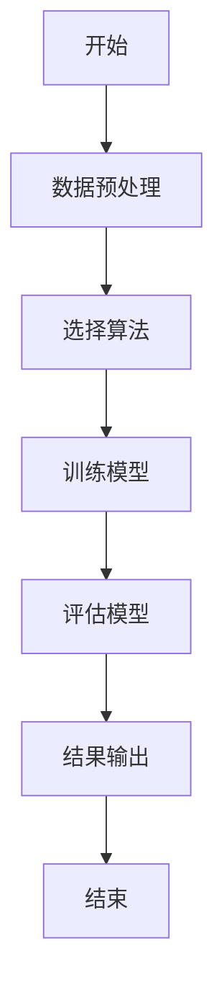
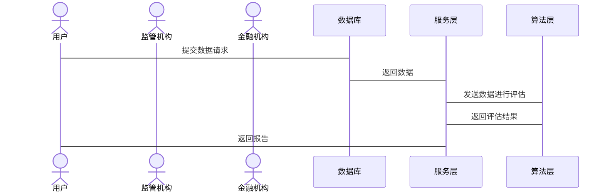

                 


# 《金融监管合规风险评估自动化平台》

## 关键词：金融监管, 合规风险评估, 自动化平台, 系统架构, 机器学习

## 摘要：  
金融监管合规风险评估自动化平台旨在通过技术手段提升金融监管效率和准确性。本文从背景出发，详细阐述了合规风险评估的核心概念、算法原理、系统架构，并通过项目实战展示了平台的实现过程。通过本篇文章，读者可以全面了解如何构建一个高效、智能的金融监管合规风险评估自动化平台。

---

# 第一章: 金融监管合规风险评估概述

## 1.1 金融监管的背景与重要性

### 1.1.1 金融监管的基本概念
金融监管是指通过法律法规和规章制度，对金融机构的经营行为进行监督和管理，以维护金融市场的稳定和健康发展。金融监管的核心目标包括防范系统性风险、保护投资者利益、促进公平竞争等。

### 1.1.2 金融监管的核心目标
- 维护金融体系的稳定性和安全性。
- 防范系统性金融风险。
- 保护投资者、消费者和中小企业的合法权益。
- 促进金融机构之间的公平竞争。

### 1.1.3 金融监管的现状与挑战
随着金融市场的快速发展，传统的金融监管方式逐渐暴露出效率低、覆盖面有限等问题。监管对象复杂化、金融创新加速、跨境金融活动增加等因素使得传统监管手段难以应对日益复杂的监管需求。

## 1.2 合规风险评估的定义与特点

### 1.2.1 合规风险的基本概念
合规风险是指金融机构在经营活动中，因未能遵守相关法律法规、行业标准或内部规章制度而导致法律制裁、监管处罚、财务损失或声誉损害的可能性。

### 1.2.2 合规风险评估的关键特征
- **全面性**：覆盖金融机构的所有业务领域和操作环节。
- **动态性**：随着法律法规和市场环境的变化而不断更新。
- **专业性**：需要专业的知识和技能来识别和评估风险。
- **预防性**：通过风险评估提前制定应对措施，降低风险发生概率。

### 1.2.3 合规风险与金融监管的关系
合规风险是金融监管的重要组成部分。金融监管机构通过评估金融机构的合规性，确保其经营活动符合相关法律法规，从而降低系统性风险。

## 1.3 自动化平台的必要性与优势

### 1.3.1 传统合规风险评估的局限性
- 人工评估效率低，耗时长。
- 易受主观因素影响，结果可能不准确。
- 难以覆盖所有业务领域和操作环节。

### 1.3.2 自动化平台的引入动机
- 提高合规风险评估的效率和准确性。
- 降低人工成本，节省资源。
- 实现对海量数据的快速处理和分析。

### 1.3.3 自动化平台的核心优势
- **高效性**：自动化平台可以快速处理大量数据，显著提高评估效率。
- **准确性**：通过算法和规则引擎，减少人为误差，提高评估结果的准确性。
- **实时性**：可以实时监控金融机构的经营活动，及时发现和处理风险。

## 1.4 平台的边界与外延

### 1.4.1 平台的功能边界
- 数据采集与处理。
- 风险评估与分析。
- 结果展示与报告生成。

### 1.4.2 平台的业务外延
- 与监管机构的数据对接。
- 为金融机构提供合规咨询服务。
- 支持政策制定和监管决策。

### 1.4.3 平台与相关系统的接口关系
自动化平台需要与金融机构的业务系统、监管机构的数据系统以及其他第三方服务（如数据供应商、云服务提供商）进行接口对接，确保数据的流畅传递和系统的协同工作。

## 1.5 本章小结
本章从金融监管的背景出发，介绍了合规风险评估的定义和特点，分析了自动化平台的必要性和优势，并明确了平台的功能边界和外延。通过这些内容，读者可以全面了解金融监管合规风险评估自动化平台的建设背景和目标。

---

# 第二章: 金融监管合规风险评估的核心概念

## 2.1 核心概念的定义与属性

### 2.1.1 金融监管的核心要素
- **法律法规**：包括国家的金融法规、行业标准等。
- **监管机构**：如央行、证监会、银保监会等。
- **金融机构**：银行、证券公司、保险公司等。

### 2.1.2 合规风险的关键属性
- **法律风险**：因违反法律法规而产生的风险。
- **操作风险**：因内部操作不当而产生的风险。
- **市场风险**：因市场波动而产生的风险。

### 2.1.3 自动化平台的功能模块
- 数据采集模块：负责收集金融机构的业务数据。
- 风险评估模块：对数据进行分析，识别潜在风险。
- 报告生成模块：生成风险评估报告，供监管机构参考。

## 2.2 核心概念之间的关系

### 2.2.1 金融监管与合规风险的关系
金融监管是手段，合规风险评估是目标。通过有效的金融监管，可以降低金融机构的合规风险，维护金融市场的稳定。

### 2.2.2 合规风险与自动化平台的关联
自动化平台是实现合规风险评估的重要工具。通过平台，可以高效、准确地识别和评估风险，为监管机构提供决策支持。

### 2.2.3 平台功能模块之间的相互作用
- 数据采集模块为风险评估模块提供基础数据。
- 风险评估模块的结果为报告生成模块提供依据。
- 报告生成模块将评估结果以可视化形式呈现给监管机构。

## 2.3 核心概念的ER实体关系图

```mermaid
erDiagram
    actor 监管机构 {
        +id : 整数
        +name : 字符串
        +region : 字符串
    }
    actor 金融机构 {
        +id : 整数
        +name : 字符串
        +type : 字符串
    }
    actor 用户 {
        +id : 整数
        +name : 字符串
        +role : 字符串
    }
    database 金融机构数据 {
        +id : 整数
        +name : 字符串
        +value : 字符串
    }
    database 监管规则 {
        +id : 整数
        +name : 字符串
        +description : 字符串
    }
    监管机构 --> 金融机构 : 监管
    金融机构 --> 用户 : 提供服务
    用户 --> 监管机构 : 投诉和反馈
    金融机构 --> 金融机构数据 : 存储数据
    监管机构 --> 监管规则 : 执行规则
```

---

# 第三章: 金融监管合规风险评估的算法原理

## 3.1 算法原理概述

### 3.1.1 基于规则的匹配算法
基于规则的匹配算法通过预定义的规则，对金融机构的行为进行判断，识别是否存在违规行为。

### 3.1.2 机器学习模型
机器学习模型通过训练数据，学习合规风险的特征，实现对风险的自动识别和预测。

## 3.2 算法流程图



## 3.3 算法实现的数学模型

### 3.3.1 基于规则的匹配算法
$$
\text{规则匹配} = \sum_{i=1}^{n} (r_i \text{是否满足规则})
$$
其中，$r_i$表示第$i$个规则，规则匹配的结果为1表示满足规则，0表示不满足。

### 3.3.2 机器学习模型
使用逻辑回归模型进行风险预测：
$$
P(y=1|x) = \frac{1}{1 + e^{-(\beta_0 + \beta_1 x_1 + \cdots + \beta_k x_k)}}
$$
其中，$x_i$表示输入特征，$\beta_i$表示模型参数。

## 3.4 算法实现的代码示例

```python
# 基于规则的匹配算法
def rule_based_matching(data, rules):
    for rule in rules:
        if rule.check(data):
            return rule.result
    return "no match"

# 机器学习模型
from sklearn.linear_model import LogisticRegression

model = LogisticRegression()
model.fit(X_train, y_train)
y_pred = model.predict(X_test)
```

---

# 第四章: 金融监管合规风险评估系统架构设计

## 4.1 系统架构概述

### 4.1.1 系统功能模块
- 数据采集模块：负责采集金融机构的业务数据。
- 数据处理模块：对数据进行清洗和预处理。
- 风险评估模块：对数据进行分析，识别潜在风险。
- 报告生成模块：生成风险评估报告，供监管机构参考。

### 4.1.2 系统架构图

```mermaid
client -> server: 金融机构数据
server -> database: 存储数据
database -> service: 提供数据
service -> algorithm: 进行风险评估
algorithm -> report: 生成报告
report -> client: 返回报告
```

### 4.1.3 系统接口设计
- 数据接口：与金融机构的业务系统对接，获取数据。
- 报告接口：与监管机构的系统对接，发送风险评估报告。
- 用户接口：提供用户友好的操作界面，方便用户使用。

### 4.1.4 系统交互流程



---

# 第五章: 金融监管合规风险评估自动化平台的项目实战

## 5.1 环境安装

### 5.1.1 安装Python
```bash
# 安装Python
python --version
pip install --upgrade pip
```

### 5.1.2 安装依赖库
```bash
pip install numpy
pip install pandas
pip install scikit-learn
```

## 5.2 核心代码实现

### 5.2.1 数据采集模块
```python
import pandas as pd

def collect_data():
    # 从数据库读取数据
    data = pd.read_csv('data.csv')
    return data
```

### 5.2.2 数据处理模块
```python
def preprocess_data(data):
    # 数据清洗和预处理
    data = data.dropna()
    return data
```

### 5.2.3 风险评估模块
```python
from sklearn.model_selection import train_test_split
from sklearn.linear_model import LogisticRegression

def assess_risk(data):
    # 数据分割
    X_train, X_test, y_train, y_test = train_test_split(data.drop('label', axis=1), data['label'], test_size=0.2)
    # 训练模型
    model = LogisticRegression()
    model.fit(X_train, y_train)
    # 预测结果
    y_pred = model.predict(X_test)
    return y_pred
```

### 5.2.4 报告生成模块
```python
def generate_report(y_pred, y_test):
    # 生成报告
    report = classification_report(y_test, y_pred)
    print(report)
```

## 5.3 项目小结
通过本项目的实战，读者可以了解如何从数据采集、数据处理、风险评估到报告生成的完整流程。同时，也可以根据实际需求对代码进行扩展和优化，以适应不同的业务场景。

---

# 第六章: 总结与展望

## 6.1 本章总结
本文详细介绍了金融监管合规风险评估自动化平台的背景、核心概念、算法原理和系统架构，并通过项目实战展示了平台的实现过程。通过自动化平台，可以显著提高金融监管的效率和准确性，降低合规风险。

## 6.2 未来展望
随着人工智能和大数据技术的不断发展，金融监管合规风险评估自动化平台将更加智能化和高效。未来的研究方向包括：
- 引入更复杂的机器学习模型，如深度学习和强化学习，提高风险评估的准确性。
- 推动平台的标准化和模块化，便于不同金融机构和监管机构的接入和使用。
- 加强数据隐私保护，确保平台的数据安全性和合规性。

## 6.3 最佳实践 Tips
- 在实施自动化平台之前，建议先进行充分的需求分析和风险评估。
- 数据的质量和完整性是平台运行的关键，需要确保数据来源可靠。
- 定期更新平台的规则和模型，以适应法律法规和市场环境的变化。

## 6.4 注意事项
- 平台的建设和维护需要专业的技术和人员支持。
- 在使用自动化平台时，应遵守相关法律法规，确保数据的合法性和合规性。

## 6.5 拓展阅读
- 《金融监管的理论与实践》
- 《大数据与人工智能在金融领域的应用》
- 《系统架构设计的实践指南》

---

# 结语
金融监管合规风险评估自动化平台是金融监管的重要工具，通过技术手段可以显著提高监管效率和准确性。希望本文能够为读者提供有价值的参考和启发，帮助他们在金融监管领域取得更大的成功。

