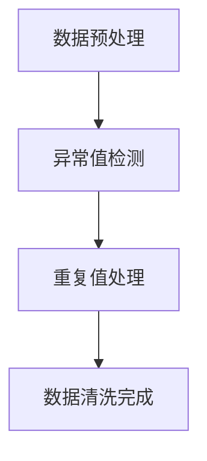

                 


# 《金融监管报告数据一致性自动校验》

> **关键词**：金融监管、数据一致性、自动校验、算法、系统设计  
> **摘要**：本文详细探讨了金融监管报告数据一致性自动校验的核心概念、算法实现和系统设计。通过分析数据一致性的定义、校验方法和系统架构，结合实际案例，展示了如何利用算法和系统设计实现数据一致性校验，确保金融监管数据的准确性和可靠性。

---

## 第一部分：背景介绍

### 第1章：金融监管报告数据一致性校验的背景与问题

#### 1.1 问题背景
- **1.1.1 金融监管的重要性**  
  金融监管是维护金融市场稳定、保护投资者利益的重要手段。监管机构需要确保金融机构的报告数据真实、准确、一致。

- **1.1.2 数据一致性问题的现状**  
  由于金融机构内部系统复杂、数据来源多样，数据不一致问题普遍存在，可能导致监管失准。

- **1.1.3 数据一致性问题的根源**  
  数据不一致可能源于系统错误、人为失误或数据传递过程中的问题。

#### 1.2 问题描述
- **1.2.1 数据不一致的具体表现**  
  数据字段值不一致、时间戳不一致、来源标识不一致等。

- **1.2.2 数据不一致带来的风险**  
  影响监管决策的准确性，可能导致监管失灵或处罚错误。

- **1.2.3 数据一致性校验的必要性**  
  确保监管数据的准确性和可靠性，是金融监管的基础。

#### 1.3 问题解决
- **1.3.1 数据一致性校验的目标**  
  发现并纠正数据不一致，确保数据准确性和一致性。

- **1.3.2 数据一致性校验的方法**  
  基于规则的校验、基于统计的校验、基于模型的校验。

- **1.3.3 数据一致性校验的实现路径**  
  数据清洗、特征提取、模型训练与预测。

#### 1.4 边界与外延
- **1.4.1 数据一致性校验的边界**  
  仅关注数据一致性问题，不涉及数据生成过程。

- **1.4.2 数据一致性校验的外延**  
  可扩展至数据质量管理、数据治理等领域。

- **1.4.3 数据一致性校验与其他问题的关系**  
  数据一致性校验是数据质量管理的重要组成部分，与其他数据问题相互关联。

#### 1.5 概念结构与核心要素
- **1.5.1 数据一致性校验的核心概念**  
  数据一致性、数据校验、数据清洗。

- **1.5.2 核心要素的定义与特征**  
  数据源、数据字段、数据值、时间戳、校验规则。

- **1.5.3 核心要素之间的关系**  
  数据源提供数据，数据字段定义结构，数据值是核心，时间戳记录变化，校验规则定义校验逻辑。

---

## 第二部分：核心概念与联系

### 第2章：数据一致性校验的核心概念

#### 2.1 数据一致性校验的定义与特征
- **2.1.1 数据一致性的定义**  
  数据一致性是指在不同数据源或系统中，同一数据字段的值保持一致。

- **2.1.2 数据一致性的特征**  
  - 独立性：数据一致性不依赖于数据源。
  - 完整性：数据一致性要求所有相关数据都一致。
  - 及时性：数据一致性需要在规定时间内完成校验。

#### 2.2 数据校验方法对比
- **2.2.1 基于规则的校验方法**  
  使用预定义规则检查数据一致性。

- **2.2.2 基于统计的校验方法**  
  通过统计分析发现数据异常。

- **2.2.3 基于模型的校验方法**  
  使用机器学习模型预测数据一致性。

#### 2.3 数据一致性校验的ER实体关系图

```mermaid
erd
    entity 数据一致性校验 {
        id 数据校验ID
        string 数据源
        string 数据字段
        string 数据值
        datetime 时间戳
        status 校验状态
    }
    entity 校验规则 {
        id 校验规则ID
        string 规则名称
        string 规则描述
        string 校验逻辑
    }
    数据一致性校验 --> 校验规则 : 使用规则
```

---

## 第三部分：算法原理

### 第3章：数据一致性校验的算法实现

#### 3.1 数据清洗算法
- **3.1.1 数据清洗流程**  
  数据预处理、异常值检测、重复值处理。



#### 3.2 特征提取算法
- **3.2.1 特征提取方法**  
  使用主成分分析（PCA）提取关键特征。

#### 3.3 模型训练与预测
- **3.3.1 分类模型训练**  
  使用逻辑回归或随机森林模型训练数据一致性分类器。

```python
from sklearn.linear_model import LogisticRegression

# 训练数据
X = df[['feature1', 'feature2', 'feature3']]
y = df['label']

# 创建模型
model = LogisticRegression()
model.fit(X, y)
```

#### 3.4 数据一致性预测
- **3.4.1 预测流程**  
  输入数据特征，模型输出一致性状态。

---

## 第四部分：数学模型与公式

### 第4章：数据一致性校验的数学模型

#### 4.1 数据相似度计算公式
- **4.1.1 欧几里得距离公式**  
  $$d(x, y) = \sqrt{(x_1 - y_1)^2 + (x_2 - y_2)^2}$$

#### 4.2 数据分类模型公式
- **4.2.1 逻辑回归模型**  
  $$P(y=1|x) = \frac{1}{1 + e^{-w x - b}}$$

---

## 第五部分：系统分析与架构设计

### 第5章：数据一致性校验系统的分析与设计

#### 5.1 问题场景介绍
- 数据一致性校验系统需要处理多个数据源，确保数据一致。

#### 5.2 系统功能设计
- **5.2.1 领域模型**  
  ```mermaid
  classDiagram
      class 数据一致性校验系统 {
          数据源
          数据字段
          数据值
          时间戳
          校验规则
          校验结果
      }
      数据一致性校验系统 --> 数据源 : 获取数据
      数据一致性校验系统 --> 校验规则 : 应用规则
  ```

#### 5.3 系统架构设计
- **5.3.1 系统架构图**  
  ```mermaid
  architecture
      Client
      Server
      Database
      API Gateway
  ```

#### 5.4 接口设计与交互
- **5.4.1 系统交互流程**  
  ```mermaid
  sequenceDiagram
      Client ->> Server: 发送数据请求
      Server ->> Database: 查询数据
      Database --> Server: 返回数据
      Server ->> Client: 返回校验结果
  ```

---

## 第六部分：项目实战

### 第6章：数据一致性校验系统的实现

#### 6.1 环境安装
- 安装Python、Pandas、Scikit-learn等工具。

#### 6.2 核心代码实现
```python
import pandas as pd
from sklearn import preprocessing

# 数据清洗
def data_cleaning(df):
    df.dropna(inplace=True)
    df = df[df.duplicated()]
    return df

# 特征提取
def feature_extraction(df):
    features = df[['feature1', 'feature2', 'feature3']]
    return features

# 模型训练
def train_model(X, y):
    model = LogisticRegression()
    model.fit(X, y)
    return model
```

#### 6.3 代码解读与分析
- 数据清洗：删除缺失值，去除重复数据。
- 特征提取：提取关键特征用于模型训练。
- 模型训练：使用逻辑回归模型训练数据一致性分类器。

#### 6.4 实际案例分析
- 使用实际金融数据进行校验，展示校验结果。

#### 6.5 项目小结
- 总结项目实现过程，提出改进建议。

---

## 第七部分：总结与展望

### 第7章：总结与展望

#### 7.1 最佳实践
- 数据清洗是关键，特征提取影响模型性能。

#### 7.2 小结
- 数据一致性校验是金融监管的重要环节，算法和系统设计是核心。

#### 7.3 注意事项
- 数据清洗需谨慎，避免误删有用数据。
- 模型选择需根据实际数据特性。

#### 7.4 拓展阅读
- 《数据质量管理实战》、《金融监管技术前沿》。

---

**全文总结**  
本文从背景、核心概念、算法原理、系统设计和项目实战等方面，全面探讨了金融监管报告数据一致性自动校验的关键技术。通过详细讲解，帮助读者理解如何利用算法和系统设计实现数据一致性校验，确保金融监管数据的准确性和可靠性。

--- 

希望这篇文章能够为读者提供清晰的思路和技术指导，帮助他们在金融监管领域实现高效的数据一致性校验。

