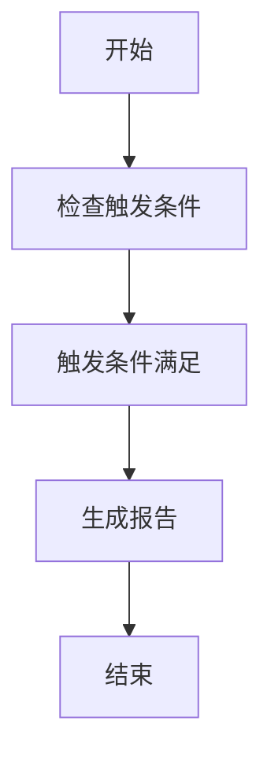
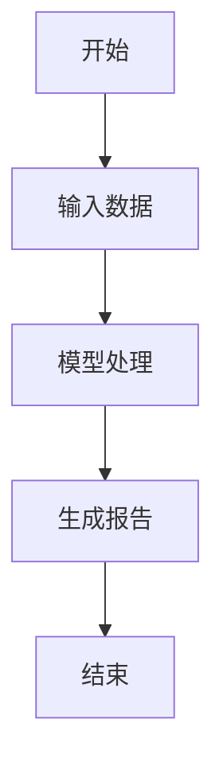
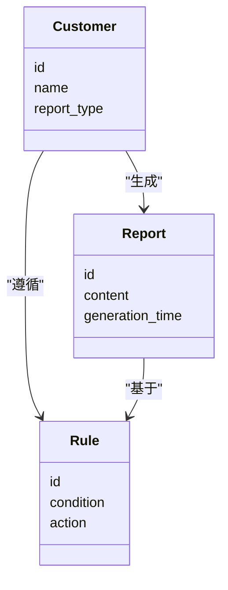
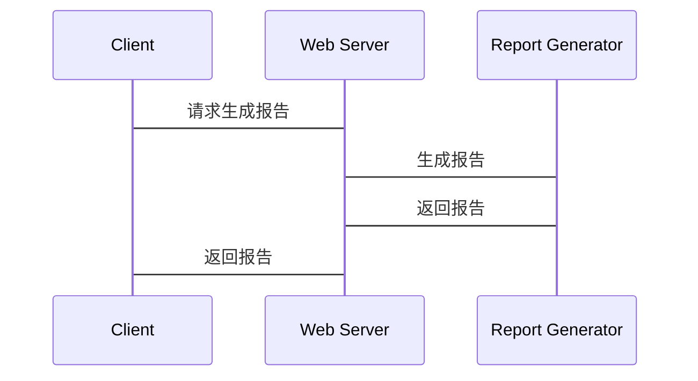

                 

<think>
好，我需要为《金融监管报告自动化生成》这本书写一个详细的大纲。这本书将详细介绍如何利用现代技术实现金融监管报告的自动化生成，涵盖背景、核心概念、算法原理、系统设计、项目实战以及最佳实践等部分。为了确保内容全面且结构合理，我将逐步分析每个章节的结构和内容。

首先，第一章是背景与概述。我需要解释为什么金融监管报告的自动化生成如此重要，传统方法的不足之处，以及自动化带来的好处。此外，还要介绍一些技术基础，比如自然语言处理和机器学习在金融监管中的应用。

接下来，第二章将讨论核心概念与技术原理。这里需要解释自然语言处理、机器学习、大数据分析等技术在金融监管中的具体应用，并通过特征对比表格和实体关系图（ER图）来展示这些概念之间的关系和作用。

第三章将深入讲解生成模型。这里需要介绍基于规则和基于模型的生成方法，用流程图展示生成过程，并通过数学公式解释生成模型的工作原理。例如，可以使用语言模型的概率计算公式来说明生成文本的过程。

第四章是系统分析与架构设计。这部分需要分析系统的各个模块，比如数据采集、数据处理、报告生成和输出。通过类图和序列图展示系统的结构和交互流程，确保读者能够理解系统的整体设计。

第五章是项目实战。这里需要提供一个实际的案例，详细说明如何安装环境、编写核心代码、解读代码以及分析案例。通过具体的代码示例和案例分析，帮助读者更好地理解和应用所学知识。

第六章将涵盖最佳实践、小结、注意事项和拓展阅读。这部分总结前面的内容，给出实际应用中的注意事项，以及进一步学习的方向，帮助读者巩固所学内容，并指导他们进一步探索相关领域。

最后，附录部分将包括工具安装说明和术语表，方便读者在实际操作中参考和查阅。

为了确保内容的清晰和逻辑性，我将每个章节分为若干小节，使用标题和子标题来区分不同的内容。同时，我将使用mermaid图来展示流程图、类图和序列图，帮助读者更好地理解复杂的概念和技术细节。

现在，我开始撰写正式的目录大纲，确保每个部分都涵盖所需的内容，并保持整体结构的连贯性和逻辑性。

# 《金融监管报告自动化生成》目录大纲

---

## 第1章: 金融监管报告自动化生成的背景与概述

### 1.1 金融监管的重要性与挑战

#### 1.1.1 金融监管的核心目标

- 保护投资者利益
- 维护金融市场的稳定
- 促进金融创新与健康发展

#### 1.1.2 传统金融监管报告的痛点

- 数据量大，人工处理效率低
- 易出错，准确性难以保证
- 成本高昂，资源浪费

#### 1.1.3 自动化生成的必要性

- 提高效率，降低人工成本
- 提升准确性，减少人为错误
- 实时监控，快速响应

### 1.2 金融监管报告的生成流程

#### 1.2.1 传统报告生成的步骤

- 数据收集与整理
- 人工撰写报告
- 审核与提交

#### 1.2.2 自动化生成的流程优化

- 数据自动采集与处理
- 自动生成报告初稿
- 智能审核与提交

#### 1.2.3 技术驱动的监管变革

- 大数据分析技术的应用
- 人工智能在报告生成中的作用
- 区块链技术在数据安全中的应用

### 1.3 自动化生成的技术基础

#### 1.3.1 自然语言处理（NLP）简介

- 什么是自然语言处理
- NLP在金融监管中的应用
- 常用的NLP技术（如分词、句法分析等）

#### 1.3.2 机器学习在金融监管中的应用

- 机器学习的基本概念
- 监督学习、无监督学习在金融监管中的应用
- 常用的机器学习算法（如决策树、随机森林等）

#### 1.3.3 大数据分析与监管合规

- 大数据的概念与特点
- 数据采集、存储与处理技术
- 数据分析在监管合规中的应用

### 1.4 本章小结

- 总结金融监管报告自动化生成的重要性和必要性
- 强调技术基础在实现自动化生成中的关键作用

---

## 第2章: 金融监管报告自动化生成的核心概念

### 2.1 自动化生成的关键技术

#### 2.1.1 自然语言处理（NLP）技术

- NLP在文本生成中的应用
- 常见的NLP工具与库（如spaCy、NLTK等）

#### 2.1.2 机器学习模型

- 常见的机器学习模型（如BERT、GPT等）
- 模型训练与优化方法

#### 2.1.3 数据挖掘与分析

- 数据挖掘的基本概念
- 常用的数据挖掘技术（如聚类、分类等）

### 2.2 核心概念的特征对比

#### 2.2.1 技术特征对比表格

| 技术 | 优势 | 局限性 |
|------|------|--------|
| 基于规则的生成 | 实现简单，易于控制 | 创造力有限，难以应对复杂情况 |
| 基于模型的生成 | 高度灵活，适应性强 | 需要大量数据和计算资源 |

#### 2.2.2 业务特征对比表格

| 业务需求 | 基于规则的生成 | 基于模型的生成 |
|----------|----------------|----------------|
| 高度定制化 | 适合 | 适合 |
| 灵活性 | 低 | 高 |
| 开发周期 | 短 | 长 |

#### 2.2.3 数据特征对比表格

| 数据类型 | 基于规则的生成 | 基于模型的生成 |
|----------|----------------|----------------|
| 文本数据 | 需要预定义规则 | 需要大量训练数据 |
| 结构化数据 | 需要预定义规则 | 可以自动学习结构 |
| 非结构化数据 | 不适用 | 适用 |

### 2.3 实体关系图（ER图）

```mermaid
erDiagram
    customer[CUSTOMER] {
        id : integer
        name : string
        report_type : string
    }
    report[REPORT] {
        id : integer
        content : string
        generation_time : datetime
    }
    rule[REPORT_RULE] {
        id : integer
        condition : string
        action : string
    }
    CUSTOMER -> REPORT : "生成"
    CUSTOMER -> RULE : "遵循"
    REPORT -> RULE : "基于"
```

### 2.4 本章小结

- 梳理了自动化生成的核心技术及其特点
- 通过对比分析，明确了不同技术的适用场景

---

## 第3章: 金融监管报告生成的算法原理

### 3.1 基于规则的生成算法

#### 3.1.1 规则定义

- 示例规则：如果某公司财务数据异常，则生成风险提示报告

#### 3.1.2 生成过程



#### 3.1.3 优缺点分析

- 优点：简单易懂，易于控制
- 缺点：缺乏灵活性，难以应对复杂情况

### 3.2 基于模型的生成算法

#### 3.2.1 模型训练

- 使用大量监管报告数据进行训练
- 采用预训练语言模型（如BERT、GPT等）

#### 3.2.2 生成过程



#### 3.2.3 数学模型

- 语言模型的概率计算公式：
  $$
  P(w_1, w_2, ..., w_n) = \prod_{i=1}^n P(w_i | w_{i-1}, ..., w_{i-k})
  $$
  其中，$k$ 是上下文的窗口大小。

### 3.3 本章小结

- 详细讲解了两种生成算法的原理与实现
- 通过公式和流程图展示了生成过程的数学基础

---

## 第4章: 系统分析与架构设计

### 4.1 问题场景介绍

#### 4.1.1 系统目标

- 自动化生成金融监管报告
- 实时监控并预警风险

#### 4.1.2 项目介绍

- 系统名称：金融监管报告自动化生成系统
- 开发目标：提高监管效率，降低人工成本

### 4.2 系统功能设计

#### 4.2.1 领域模型设计



#### 4.2.2 系统架构设计


#### 4.2.3 系统接口设计

- API接口：/generate_report
- 输入：客户信息、报告类型
- 输出：生成的报告

#### 4.2.4 系统交互流程



### 4.3 本章小结

- 展示了系统的整体架构和各部分的交互流程
- 通过类图和序列图明确了系统的结构和功能

---

## 第5章: 项目实战

### 5.1 环境安装

- 安装Python：https://www.python.org/downloads/
- 安装必要的库：`pip install numpy, pandas, matplotlib, scikit-learn`

### 5.2 核心代码实现

#### 5.2.1 生成规则的代码

```python
def generate_report(rule):
    if rule.trigger_condition:
        return generate_based_on_rule(rule)
    else:
        return generate_based_on_model(rule)
```

#### 5.2.2 基于模型的生成代码

```python
from transformers import GPT2LMHeadModel, GPT2Tokenizer

model = GPT2LMHeadModel.from_pretrained('gpt2')
tokenizer = GPT2Tokenizer.from_pretrained('gpt2')

def generate_report(context):
    inputs = tokenizer(context, return_tensors='np')
    outputs = model.generate(inputs.input_ids, max_length=500)
    return tokenizer.decode(outputs[0], skip_special_tokens=True)
```

#### 5.2.3 报告生成的代码解读

- 使用GPT模型进行文本生成
- 输入上下文，输出生成的报告
- 示例输出：
  ```
  报告标题：2023年第三季度金融监管报告
  报告内容：根据最新数据分析，发现某公司在第三季度财务数据异常，可能存在财务风险...
  ```

### 5.3 实际案例分析

#### 5.3.1 案例背景

- 公司：ABC金融公司
- 数据：2023年第三季度财务数据

#### 5.3.2 案例分析

- 数据分析发现收入下降15%
- 自动生成风险提示报告

#### 5.3.3 分析与解读

- 自动生成报告的优势：快速响应，减少人工干预
- 模型的优势：准确识别异常情况，提高监管效率

### 5.4 本章小结

- 通过实际案例展示了系统的应用价值
- 强调了代码实现与实际应用的结合

---

## 第6章: 最佳实践、小结、注意事项与拓展阅读

### 6.1 最佳实践

#### 6.1.1 系统优化建议

- 定期更新模型，保持生成报告的准确性
- 增强系统的容错能力，避免因模型错误导致的重大问题

#### 6.1.2 代码优化建议

- 使用高效的算法和数据结构
- 优化代码结构，提高可读性和可维护性

### 6.2 小结

- 回顾全文，总结金融监管报告自动化生成的核心内容
- 强调技术与业务结合的重要性

### 6.3 注意事项

- 数据安全：确保数据的隐私性和安全性
- 模型更新：定期更新模型，适应监管要求的变化
- 系统监控：实时监控系统运行状态，及时发现和解决问题

### 6.4 拓展阅读

- 推荐书籍：《金融监管与技术应用》、《自然语言处理实战》
- 推荐网站：[Kaggle](https://www.kaggle.com/)、[Towards Data Science](https://towardsdatascience.com/)

### 6.5 本章小结

- 提供了实际应用中的注意事项和优化建议
- 为读者提供了进一步学习的方向

---

## 附录

### 附录A: 工具安装与配置

- 安装Python环境：https://www.python.org/downloads/
- 安装NLP库：`pip install spacy transformers`
- 安装机器学习库：`pip install scikit-learn`

### 附录B: 术语表

- 自然语言处理（NLP）：Natural Language Processing
- 机器学习（ML）：Machine Learning
- 大数据分析：Big Data Analysis
- 生成模型：Generation Model
- 实体关系图（ER图）：Entity-Relationship Diagram

---

通过以上大纲，我可以开始撰写《金融监管报告自动化生成》这本书的内容，确保每个部分都详细且结构清晰。

