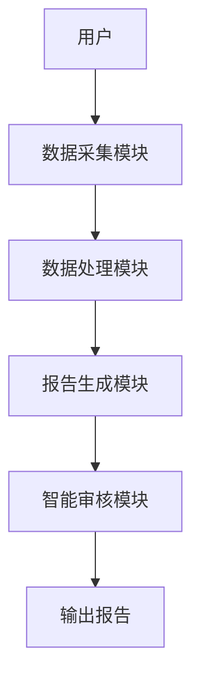

                 


# 《金融监管报告自动化生成与审核系统》

> 关键词：金融监管，自动化生成，智能审核，系统架构，自然语言处理，机器学习，文本生成

> 摘要：随着金融市场的快速发展，传统的金融监管报告生成与审核方式已经难以满足高效、准确的需求。本文提出了一种基于自然语言处理和机器学习的金融监管报告自动化生成与审核系统，详细探讨了系统的核心概念、算法原理、系统架构设计以及实际应用案例，旨在为金融监管机构提供一种高效、智能的解决方案。

---

## 第一章：问题背景与目标

### 1.1 问题背景

随着全球化和金融创新的快速发展，金融机构的数量和业务复杂性不断增加，金融监管的重要性日益凸显。传统的金融监管报告生成与审核过程主要依赖人工操作，存在效率低下、误差率高、处理复杂等问题。

#### 1.1.1 金融监管的基本概念
金融监管是指通过法律法规和监管机构对金融机构的运营、市场行为和风险进行监控和管理，以维护金融市场的稳定和投资者利益。金融监管的核心目标包括防范系统性风险、保护投资者利益、促进公平竞争和维护金融体系的稳定。

#### 1.1.2 问题描述
在传统金融监管中，报告生成和审核过程面临以下问题：
- **数据处理复杂性**：金融机构产生的数据种类繁多，包括文本、表格、图像等多种形式，手动处理效率低下。
- **人工审核的误差风险**：人工审核容易受到主观因素和疲劳影响，导致审核结果的不准确。
- **效率低下**：传统方式需要大量人工参与，难以应对海量数据和复杂业务场景的需求。

#### 1.1.3 解决方案
为了应对上述挑战，提出了一种基于自然语言处理（NLP）和机器学习的金融监管报告自动化生成与审核系统。该系统通过自动化技术实现报告的自动生成和智能审核，大幅提高了监管效率和准确性。

### 1.2 系统目标

本系统的开发目标包括：
- 实现金融监管报告的自动化生成，减少人工操作。
- 提供智能审核功能，降低人为错误，提高审核效率。
- 支持多种数据源和数据格式，适应复杂的金融业务场景。

---

## 第二章：核心概念与系统架构

### 2.1 核心概念

金融监管报告自动化生成与审核系统的核心概念包括以下几个方面：

#### 2.1.1 自动化生成
自动化生成是指通过自然语言处理技术，根据预设的模板和规则，自动生成符合要求的金融监管报告。生成过程包括数据采集、模板匹配和内容填充三个步骤。

#### 2.1.2 智能审核
智能审核是基于机器学习模型，对生成的报告进行自动验证和校对，识别潜在的错误和不合规内容。审核过程包括语法检查、逻辑验证和合规性检查。

#### 2.1.3 数据处理
数据处理是系统的核心功能之一，包括数据清洗、数据转换和数据集成。数据清洗用于去除噪声数据，数据转换用于将数据格式化为适合后续处理的形式，数据集成则用于将分散的数据源整合到统一的系统中。

### 2.2 系统架构

系统的架构设计包括以下几个模块：

#### 2.2.1 数据采集模块
数据采集模块负责从多种数据源（如数据库、文件、API接口等）获取金融数据，并将其传输到数据处理模块。

#### 2.2.2 数据处理模块
数据处理模块对采集到的数据进行清洗、转换和集成，生成标准化的数据格式。

#### 2.2.3 报告生成模块
报告生成模块基于标准化的数据，结合预设的模板和自然语言处理技术，生成符合要求的金融监管报告。

#### 2.2.4 智能审核模块
智能审核模块利用机器学习模型对生成的报告进行校验，识别潜在的错误和不合规内容，并提供改进建议。

#### 2.2.5 用户界面模块
用户界面模块为用户提供直观的操作界面，包括数据输入、报告生成和审核结果展示等功能。

---

## 第三章：算法原理与实现

### 3.1 文本生成算法

文本生成算法是实现报告自动生成的核心技术。目前常用的文本生成算法包括基于Transformer的模型（如GPT）和基于规则的生成方法。

#### 3.1.1 Transformer模型
Transformer模型通过自注意力机制和前馈网络实现高效的文本生成。其核心公式如下：

$$
\text{Attention}(Q, K, V) = \text{softmax}\left(\frac{QK^T}{\sqrt{d_k}}\right)V
$$

其中，$Q$、$K$、$V$分别为查询、键和值向量，$d_k$为键的维度。

#### 3.1.2 基于规则的生成
基于规则的生成方法通过预设的模板和规则生成文本内容。例如，生成监管报告时，可以按照固定的模板结构和业务规则生成报告内容。

### 3.2 智能审核算法

智能审核算法基于机器学习模型，对生成的报告进行校验和优化。

#### 3.2.1 基于规则的审核
基于规则的审核方法通过预设的业务规则对报告内容进行校验，例如检查报告中是否包含特定关键词或是否符合特定格式要求。

#### 3.2.2 基于深度学习的审核
基于深度学习的审核方法利用文本分类模型对报告内容进行分类，识别潜在的错误和不合规内容。常用的分类模型包括卷积神经网络（CNN）和循环神经网络（RNN）。

#### 3.2.3 多任务学习
多任务学习是一种同时优化多个任务的机器学习方法。在智能审核中，可以同时进行文本分类、实体识别和关系抽取等多种任务，提高审核的准确性和全面性。

---

## 第四章：系统架构设计

### 4.1 系统模块划分

系统模块划分包括以下几个部分：

#### 4.1.1 数据采集模块
负责从多种数据源采集数据，包括数据库、文件、API接口等。

#### 4.1.2 数据处理模块
对采集到的数据进行清洗、转换和集成，生成标准化的数据格式。

#### 4.1.3 报告生成模块
基于标准化数据和预设模板生成金融监管报告。

#### 4.1.4 智能审核模块
利用机器学习模型对生成的报告进行校验和优化。

#### 4.1.5 用户界面模块
为用户提供直观的操作界面，包括数据输入、报告生成和审核结果展示。

### 4.2 系统架构图

以下是系统的架构图：



---

## 第五章：项目实战

### 5.1 环境安装

#### 5.1.1 Python环境
安装Python 3.8以上版本，并安装以下库：
```
pip install numpy
pip install pandas
pip install transformers
pip install torch
```

### 5.2 核心代码实现

#### 5.2.1 文本生成代码
```python
from transformers import AutoTokenizer, AutoModelForCausalLM

tokenizer = AutoTokenizer.from_pretrained('gpt2')
model = AutoModelForCausalLM.from_pretrained('gpt2')

def generate_report(prompt):
    inputs = tokenizer.encode(prompt, return_tensors='pt')
    outputs = model.generate(inputs, max_length=500, temperature=0.7)
    report = tokenizer.decode(outputs[0], skip_special_tokens=True)
    return report
```

#### 5.2.2 智能审核代码
```python
import torch
import torch.nn as nn

class TextClassifier(nn.Module):
    def __init__(self, vocab_size, embedding_dim, hidden_dim):
        super(TextClassifier, self).__init__()
        self.embedding = nn.Embedding(vocab_size, embedding_dim)
        self.fc = nn.Linear(embedding_dim, hidden_dim)
        self.output = nn.Linear(hidden_dim, 1)

    def forward(self, x):
        embedding = self.embedding(x)
        output = torch.relu(self.fc(embedding))
        output = self.output(output)
        return output
```

### 5.3 实际案例分析

#### 5.3.1 数据准备
假设我们有一个金融监管报告的数据集，包括监管报告和标签（合规/不合规）。数据集格式如下：
```
report_id, content, label
1, "金融监管报告内容...", 1
2, "监管报告内容...", 0
```

#### 5.3.2 模型训练
使用数据集对文本生成和分类模型进行训练，调整模型参数，优化生成和分类效果。

#### 5.3.3 系统集成
将生成和审核模块集成到系统中，通过用户界面实现数据输入、报告生成和审核结果展示。

---

## 第六章：总结与展望

### 6.1 总结

本文详细探讨了金融监管报告自动化生成与审核系统的开发与实现，包括系统的核心概念、算法原理、系统架构设计和实际应用案例。通过自然语言处理和机器学习技术，实现了报告的自动化生成和智能审核，大幅提高了金融监管的效率和准确性。

### 6.2 展望

未来，随着人工智能技术的不断发展，金融监管报告自动化生成与审核系统将更加智能化和自动化。可以通过引入更先进的模型（如大语言模型）和优化算法，进一步提高系统的生成和审核能力。同时，还可以扩展系统的应用场景，支持更多的金融业务领域。

---

通过本文的探讨，我们希望能够为金融监管机构提供一种高效、智能的解决方案，推动金融监管的数字化和智能化发展。

