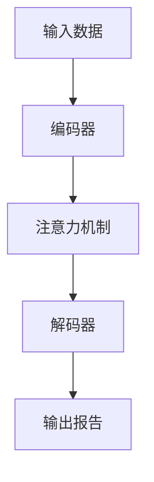

                 


# 《金融监管报告自动化生成工具》

---

## 关键词：
- 金融监管
- 自动化生成
- 自然语言处理
- 大数据分析
- 机器学习
- 合规报告

---

## 摘要：
金融监管报告的自动化生成是当前金融行业的一项重要任务。随着金融市场的复杂化和监管要求的日益严格，传统的手动报告生成方式已难以满足需求。本文探讨了如何利用自然语言处理、大数据分析和机器学习等技术，构建一个高效的金融监管报告自动化生成工具。文章从背景、核心概念、算法原理、系统架构、项目实战到最佳实践，全面分析了该工具的实现过程和应用价值，为金融机构提供了高效的解决方案。

---

## 正文：

### 第一部分：背景介绍

#### 第1章：金融监管报告自动化生成的背景与问题

##### 1.1 问题背景
- **1.1.1 金融监管的重要性与复杂性**
  - 金融市场的发展离不开有效的监管，监管机构需要实时监控市场动态，确保合规性。
  - 传统监管手段依赖人工审核，效率低下且容易出错，难以应对海量数据的挑战。

- **1.1.2 传统监管报告生成的痛点**
  - 手工收集和整理数据耗时耗力，且容易出现人为错误。
  - 不同机构的报告格式和内容要求不一，增加了统一生成的难度。
  - 监管要求的频繁变化使得人工调整报告内容的成本高昂。

- **1.1.3 自动化监管报告的必要性**
  - 提高报告生成效率，减少人为错误，确保数据的准确性和一致性。
  - 实现快速响应，适应监管要求的变化，提升金融机构的合规能力。

##### 1.2 问题描述
- **1.2.1 监管数据的多样性与复杂性**
  - 数据来源广泛，包括交易数据、市场报告、财务报表等，数据类型多样。
  - 数据格式和结构差异大，增加了整合和处理的难度。

- **1.2.2 人工报告生成的效率低下**
  - 需要大量人工操作，效率低，难以应对大规模数据处理需求。
  - 人工审核耗时长，无法及时发现问题，影响监管效果。

- **1.2.3 数据准确性与合规性的挑战**
  - 人工处理容易出错，影响报告的准确性和合规性。
  - 不同监管机构的要求不同，增加了报告生成的复杂性。

##### 1.3 问题解决
- **1.3.1 自动化工具的核心目标**
  - 实现数据的自动采集、处理和报告生成，减少人工干预。
  - 提高报告生成效率，确保数据的准确性和合规性。

- **1.3.2 技术手段如何解决监管报告问题**
  - 利用大数据分析技术，高效处理海量数据。
  - 采用自然语言处理技术，自动生成符合要求的报告内容。
  - 应用机器学习算法，预测潜在风险，辅助监管决策。

- **1.3.3 自动化工具的预期效果**
  - 提高监管效率，降低人工成本。
  - 实现快速响应，适应监管要求的变化。
  - 增强监管的准确性和全面性，提升金融机构的合规能力。

##### 1.4 边界与外延
- **1.4.1 自动化工具的适用范围**
  - 适用于需要生成标准化监管报告的金融机构。
  - 适用于监管数据来源多样、格式复杂的场景。

- **1.4.2 工具的局限性与边界条件**
  - 依赖高质量的数据输入，数据缺失或错误会影响报告准确性。
  - 对于非结构化数据的处理能力有限，可能需要人工辅助。

- **1.4.3 与其他金融系统的交互关系**
  - 与金融机构的交易系统、财务系统等无缝对接，确保数据来源的准确性和及时性。
  - 与监管机构的系统对接，实现报告的自动提交和共享。

##### 1.5 核心要素组成
- **1.5.1 数据源的多样性**
  - 包括交易数据、市场数据、财务报表、新闻舆情等。
  - 数据来源广泛，需要进行有效的整合和处理。

- **1.5.2 自然语言处理技术的作用**
  - 用于报告内容的自动生成和优化，确保语言的准确性和规范性。
  - 通过语义分析，识别潜在的风险信号，辅助监管决策。

- **1.5.3 生成报告的格式与内容规范**
  - 确保报告格式的统一性和规范性。
  - 根据监管要求，动态调整报告内容和结构。

---

### 第二部分：核心概念与联系

#### 第2章：核心概念与系统架构

##### 2.1 核心概念原理
- **2.1.1 数据采集与处理的原理**
  - 数据采集：从多种数据源获取监管相关数据，包括API接口、数据库查询等。
  - 数据清洗：对采集到的数据进行去噪、补全和格式统一，确保数据质量。
  - 数据分析：利用大数据分析技术，提取关键信息，生成监管所需的指标和结论。

- **2.1.2 自然语言生成的机制**
  - 基于预训练的语言模型（如BERT、GPT），生成符合监管要求的报告内容。
  - 通过模板匹配和关键词提取，确保报告的结构和内容符合规范。
  - 支持多种语言和格式，满足不同监管机构的需求。

- **2.1.3 报告生成的逻辑流程**
  - 数据采集与处理 → 数据分析 → 自然语言生成 → 报告输出。
  - 每个步骤都需要高度协调，确保生成的报告准确、合规且格式统一。

##### 2.2 概念属性对比
- 以下表格对比了传统监管报告与自动化监管报告的核心属性：

| 属性                | 传统监管报告                | 自动化监管报告                |
|---------------------|-----------------------------|-----------------------------|
| 生成效率            | 低，依赖人工操作            | 高，自动化生成                |
| 准确性              | 易出错，依赖人工审核        | 高，基于数据分析和模型生成    |
| 灵活性              | 低，难以快速调整格式和内容  | 高，支持动态调整和定制化输出    |
| 成本                | 高，人工成本高昂            | 低，自动化减少人工成本        |

##### 2.3 ER实体关系图架构
- 以下使用Mermaid绘制了金融监管报告自动化生成工具的ER实体关系图：

```mermaid
erDiagram
    customer[Cust] {
        id : int
        name : string
        report_type : string
        status : string
    }
    report[Report] {
        id : int
        content : string
        generate_time : datetime
        cust_id : int
    }
    data_source[DataSource] {
        id : int
        name : string
        type : string
    }
    customer --> report : 生成
    report --> data_source : 来自
```

---

### 第三部分：算法原理讲解

#### 第3章：算法原理与实现

##### 3.1 算法原理
- **3.1.1 算法选择**
  - 使用序列到序列（Sequence-to-Sequence）模型，结合注意力机制（Attention）进行自然语言生成。
  - 模型结构包括编码器和解码器，分别用于将输入数据编码为向量，再解码为自然语言文本。

##### 3.2 算法流程图
- 以下使用Mermaid绘制了算法的流程图：



##### 3.3 算法实现
- **Python代码实现**
  ```python
  import torch
  import torch.nn as nn
  import torch.optim as optim

  # 定义编码器
  class Encoder(nn.Module):
      def __init__(self, input_size, hidden_size):
          super(Encoder, self).__init__()
          self.embedding = nn.Embedding(input_size, hidden_size)
          self.gru = nn.GRU(hidden_size, hidden_size)

      def forward(self, input):
          embedded = self.embedding(input)
          output, _ = self.gru(embedded)
          return output

  # 定义解码器
  class Decoder(nn.Module):
      def __init__(self, hidden_size, output_size):
          super(Decoder, self).__init__()
          self.embedding = nn.Embedding(output_size, hidden_size)
          self.gru = nn.GRU(hidden_size, hidden_size)
          self.linear = nn.Linear(hidden_size, output_size)

      def forward(self, input, hidden):
          embedded = self.embedding(input)
          output, _ = self.gru(embedded, hidden)
          output = self.linear(output)
          return output

  # 定义模型
  class Seq2Seq(nn.Module):
      def __init__(self, encoder, decoder):
          super(Seq2Seq, self).__init__()
          self.encoder = encoder
          self.decoder = decoder

      def forward(self, input, target_length):
          enc_output = self.encoder(input)
          decoder_input = torch.zeros((input.size(1), 1), dtype=torch.long)
          outputs = []
          for i in range(target_length):
              dec_output = self.decoder(decoder_input, enc_output)
              outputs.append(dec_output)
              decoder_input = dec_output
          return outputs

  # 初始化模型和优化器
  input_size = 100
  hidden_size = 50
  output_size = 50
  encoder = Encoder(input_size, hidden_size)
  decoder = Decoder(hidden_size, output_size)
  model = Seq2Seq(encoder, decoder)
  optimizer = optim.Adam(model.parameters(), lr=0.001)
  criterion = nn.CrossEntropyLoss()
  ```

##### 3.4 数学模型与公式
- **损失函数**
  $$ \text{Loss} = -\sum_{t=1}^{T} \sum_{y=1}^{Y} \text{log}(p(y_t|y_{<t})) $$
- **优化器**
  使用Adam优化器，参数更新公式为：
  $$ \theta_{i+1} = \theta_i - \eta \cdot \frac{\partial L}{\partial \theta_i} $$

##### 3.5 举例说明
- **输入数据**
  假设输入是一组财务指标，如：
  - 营业收入：1000万元
  - 净利润：200万元
  - 净资产收益率：15%
- **生成报告**
  自动生成一段符合监管要求的财务分析报告，如：
  "本季度公司实现营业收入1000万元，净利润200万元，净资产收益率为15%，整体表现良好。"

---

### 第四部分：系统分析与架构设计

#### 第4章：系统分析与架构设计

##### 4.1 问题场景介绍
- 以某大型商业银行为例，监管机构需要每天生成监管报告，涵盖财务数据、交易数据和风险评估等内容。
- 现有系统依赖人工录入和审核，效率低且容易出错。

##### 4.2 系统功能设计
- **功能模块**
  - 数据采集模块：从交易系统、财务系统等数据源获取数据。
  - 数据处理模块：清洗、整合和分析数据，提取关键指标。
  - 报告生成模块：基于预训练模型，生成符合监管要求的报告内容。
  - 报告输出模块：生成PDF、Excel等格式的报告，并自动提交给监管机构。

- **领域模型**
  ```mermaid
  classDiagram
      class DataSource {
          id
          name
          type
      }
      class Report {
          id
          content
          generate_time
      }
      class Customer {
          id
          name
          report_type
      }
      DataSource --> Report : 属于
      Customer --> Report : 生成
  ```

##### 4.3 系统架构设计
- **分层架构**
  - 数据层：负责数据的存储和管理。
  - 业务逻辑层：处理数据，生成报告内容。
  - 用户界面层：提供友好的操作界面，展示报告内容。

  ```mermaid
  architecture
      客户端 --> 中间件：HTTP 请求
      中间件 --> 数据层：数据库访问
      中间件 --> 业务逻辑层：报告生成
      业务逻辑层 --> 数据层：数据存储
      中间件 --> 用户界面层：展示报告
  ```

##### 4.4 系统接口设计
- **API接口**
  - 数据采集接口：`/api/data_source`
  - 报告生成接口：`/api/generate_report`
  - 报告查询接口：`/api/get_report`

- **交互流程图**
  ```mermaid
  sequenceDiagram
      客户端 -> 中间件: 发送生成报告请求
      中间件 -> 数据层: 查询数据源
      数据层 -> 中间件: 返回数据
      中间件 -> 业务逻辑层: 处理数据
      业务逻辑层 -> 中间件: 返回报告内容
      中间件 -> 用户界面层: 展示报告
  ```

---

### 第五部分：项目实战

#### 第5章：项目实战与实现

##### 5.1 环境安装
- **Python 3.8及以上版本**
- 安装必要的库：
  ```bash
  pip install numpy pandas torch transformers
  ```

##### 5.2 核心代码实现
- **数据处理代码**
  ```python
  import pandas as pd

  def load_data(file_path):
      df = pd.read_csv(file_path)
      return df

  def preprocess_data(df):
      df.dropna(inplace=True)
      df['date'] = pd.to_datetime(df['date'])
      return df

  # 示例数据
  data = load_data('financial_data.csv')
  processed_data = preprocess_data(data)
  ```

- **报告生成代码**
  ```python
  from transformers import AutoTokenizer, AutoModelForSeq2Seq

  tokenizer = AutoTokenizer.from_pretrained('t5-base')
  model = AutoModelForSeq2Seq.from_pretrained('t5-base')

  def generate_report(input_text):
      inputs = tokenizer(input_text, return_tensors='np')
      outputs = model.generate(inputs.input_ids)
      report = tokenizer.decode(outputs[0], skip_special_tokens=True)
      return report

  # 示例输入
  input_data = "营业收入：1000万元，净利润：200万元"
  report = generate_report(input_data)
  print(report)  # 输出生成的报告内容
  ```

##### 5.3 实际案例分析
- **案例背景**
  某银行需要生成月度财务报告，涵盖收入、支出、利润等指标。
- **数据准备**
  - 数据源：财务报表、交易记录。
  - 数据清洗：处理缺失值和异常值。
- **报告生成**
  使用预训练的模型，自动生成结构化的财务分析报告。
- **结果展示**
  自动生成的报告包括关键指标分析、趋势预测等内容，格式统一，内容准确。

##### 5.4 项目小结
- 通过自动化生成工具，显著提高了报告生成的效率和准确性。
- 系统具备良好的扩展性和灵活性，能够适应不同监管要求的变化。
- 在实际应用中，需要注意数据质量和模型的持续优化，以确保生成报告的准确性和合规性。

---

### 第六部分：最佳实践

#### 第6章：最佳实践与总结

##### 6.1 小结
- 金融监管报告的自动化生成是未来监管发展的趋势。
- 通过大数据分析和自然语言处理技术，能够显著提升监管效率和准确性。

##### 6.2 注意事项
- 数据质量是关键，需确保数据的完整性和准确性。
- 模型的持续优化和更新是保持生成报告准确性的必要条件。
- 在实际应用中，需结合具体业务需求，灵活调整系统功能和架构。

##### 6.3 拓展阅读
- 《机器学习实战》
- 《自然语言处理入门》
- 《金融监管科技发展报告》

---

## 结语：
金融监管报告的自动化生成是技术与金融相结合的典范。通过本文的详细分析，读者可以深入了解该工具的核心原理、系统架构和实现方法。未来，随着技术的不断进步，金融监管报告的自动化生成将更加智能化和高效化，为金融机构和监管机构提供更有力的支持。

