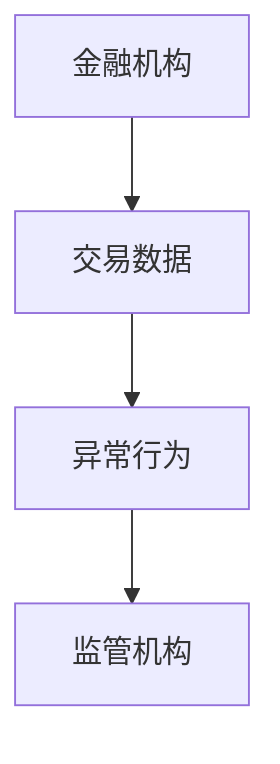
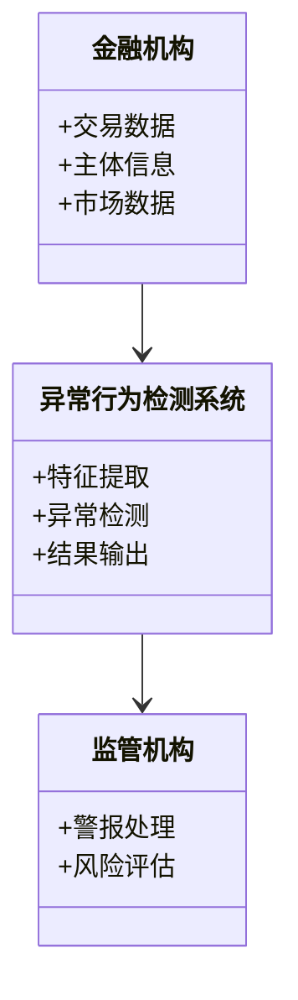
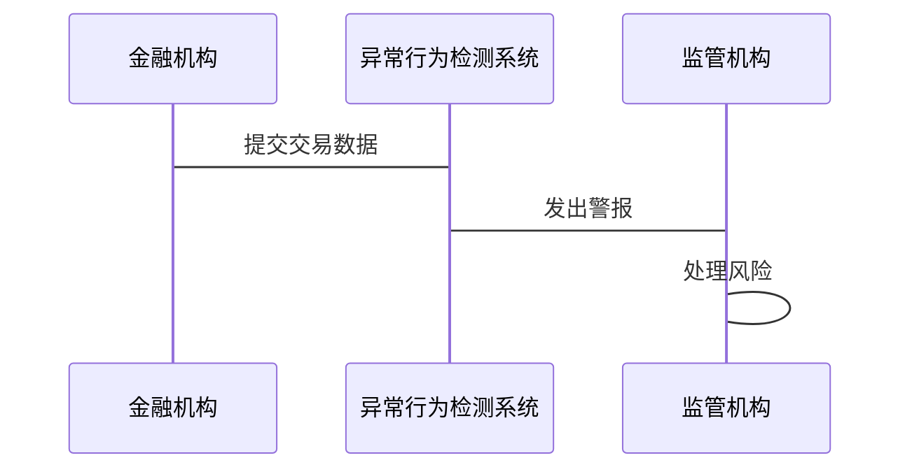

                 


# 金融监管科技异常行为检测系统

> 关键词：金融监管科技，异常行为检测，监管科技，机器学习，金融风险

> 摘要：本文详细介绍了金融监管科技异常行为检测系统的设计与实现，从背景介绍、核心概念、算法原理、系统架构到项目实战，全面分析了如何利用科技手段有效识别和防范金融异常行为，构建了一个高效、可靠的金融监管系统。

---

## 第1章: 金融监管科技异常行为检测系统背景介绍

### 1.1 问题背景

#### 1.1.1 金融监管的重要性  
金融监管是维护金融市场稳定、保护投资者利益的重要手段。随着金融业务的复杂化和全球化，金融市场的风险也在不断增加。异常行为，如洗钱、欺诈、市场操纵等，对金融系统的稳定性构成严重威胁。因此，如何及时发现和应对这些异常行为，成为金融监管的核心挑战。

#### 1.1.2 异常行为在金融监管中的挑战  
异常行为具有隐蔽性、多样性和动态性等特点，传统的监管手段往往难以有效识别这些行为。特别是在数字化和智能化的金融环境中，异常行为的表现形式更加复杂，监管机构需要借助先进的技术手段来提高监管效率。

#### 1.1.3 监管科技（RegTech）的发展趋势  
监管科技（RegTech）是利用技术手段优化金融监管的新兴领域。随着人工智能、大数据等技术的快速发展，监管科技在异常行为检测中的应用越来越广泛，成为金融监管的重要工具。

### 1.2 问题描述

#### 1.2.1 异常行为的定义与分类  
异常行为是指在金融市场中，某些主体通过非法或不当手段影响市场秩序的行为。常见的异常行为包括洗钱、欺诈交易、市场操纵、内幕交易等。

#### 1.2.2 金融异常行为的常见类型  
- **洗钱**：通过复杂的金融操作掩盖非法资金来源。  
- **欺诈交易**：利用虚假信息进行非法交易。  
- **市场操纵**：通过操控市场信息影响资产价格。  
- **内幕交易**：利用未公开信息进行交易以谋取利益。

#### 1.2.3 异常行为对金融系统的潜在风险  
异常行为可能导致金融市场波动、投资者损失、金融机构声誉受损，甚至引发系统性金融危机。

### 1.3 问题解决

#### 1.3.1 异常行为检测的必要性  
及时发现和处理异常行为，可以有效维护金融市场秩序，保护投资者利益，降低系统性金融风险。

#### 1.3.2 监管科技在异常行为检测中的作用  
监管科技通过大数据分析、人工智能等技术手段，能够高效识别异常行为，提升监管效率和精准度。

#### 1.3.3 异常行为检测系统的建设目标  
- 实时监测金融市场数据。  
- 准确识别异常行为。  
- 提供智能化的监管支持。

### 1.4 边界与外延

#### 1.4.1 异常行为检测的边界条件  
- 数据来源的合法性和完整性。  
- 检测算法的准确性和可解释性。  
- 系统的实时性和稳定性。

#### 1.4.2 系统的适用范围与限制  
- 适用于金融机构、监管机构等场景。  
- 限制：数据不足、模型过拟合、算法解释性不足。

#### 1.4.3 相关概念的外延与区别  
- 异常行为与正常行为的区别：异常行为具有非法性或不合理性。  
- 监管科技与金融科技（FinTech）的区别：FinTech关注金融服务创新，RegTech关注监管效率提升。

### 1.5 核心要素组成

#### 1.5.1 数据来源与处理  
- 数据来源：交易数据、市场数据、主体数据等。  
- 数据处理：清洗、特征提取、标准化。

#### 1.5.2 检测算法与模型  
- 监督学习、无监督学习、深度学习等算法。  
- 模型训练与优化。

#### 1.5.3 系统架构与实现  
- 前端界面、后端服务、数据库等模块的设计与实现。

### 1.6 本章小结  
本章从背景、问题、解决思路等方面介绍了金融监管科技异常行为检测系统的重要性与必要性，为后续章节的展开奠定了基础。

---

## 第2章: 核心概念与联系

### 2.1 异常行为检测的核心原理

#### 2.1.1 监测数据的特征提取  
- 时间序列分析：识别交易量、价格波动等异常特征。  
- 统计特征：均值、方差、偏度等。

#### 2.1.2 异常检测算法的选择与优化  
- 监督学习：适用于有标签数据。  
- 无监督学习：适用于无标签数据。

#### 2.1.3 检测结果的解释与反馈  
- 结果可视化：通过图表展示异常行为。  
- 反馈机制：根据检测结果优化算法。

### 2.2 核心概念对比

#### 2.2.1 异常行为与正常行为的特征对比

| 特征维度   | 异常行为                | 正常行为                |
|------------|-------------------------|-------------------------|
| 时间序列   | 突然的剧烈波动          | 平稳或缓慢波动          |
| 统计特征    | 偏离均值、方差较大      | 接近均值、方差较小      |

#### 2.2.2 监测指标与检测算法的关联性  
- 监测指标：交易量、价格、收益等。  
- 算法选择：根据指标特性选择合适的算法。

#### 2.2.3 系统性能与检测准确率的关系  
- 高准确率需要高性能计算支持。  
- 系统性能受限时，可能需要权衡准确率。

### 2.3 ER实体关系图



### 2.4 本章小结  
本章通过对比分析，明确了异常行为检测的核心概念与关联性，为后续算法设计提供了理论基础。

---

## 第3章: 异常行为检测算法原理

### 3.1 监督学习算法

#### 3.1.1 基于分类的异常检测  
- 使用逻辑回归、支持向量机（SVM）等监督学习算法。  
- 示例代码：  
  ```python
  from sklearn.linear_model import LogisticRegression
  model = LogisticRegression()
  model.fit(X_train, y_train)
  ```

#### 3.1.2 有监督学习的优缺点  
- 优点：准确率高，适用于有标签数据。  
- 缺点：需要大量标注数据，难以应对未知异常。

### 3.2 无监督学习算法

#### 3.2.1 基于聚类的异常检测  
- 使用K-means、DBSCAN等算法发现异常簇。  
- 示例代码：  
  ```python
  from sklearn.cluster import DBSCAN
  model = DBSCAN(eps=0.5, min_samples=5)
  model.fit(X)
  ```

#### 3.2.2 Isolation Forest算法原理  
- Isolation Forest是一种基于树结构的无监督异常检测算法。  
- 示例代码：  
  ```python
  from sklearn.ensemble import IsolationForest
  model = IsolationForest(random_state=42)
  model.fit(X)
  ```

#### 3.2.3 示例代码实现  


### 3.3 算法数学模型

#### 3.3.1 监督学习模型  
- 逻辑回归：  
  $$ P(y=1|x) = \frac{e^{w^T x + b}}{1 + e^{w^T x + b}} $$

#### 3.3.2 无监督学习模型  
- Isolation Forest：  
  $$ score(x) = \frac{1}{h(x)} $$  
  其中，$h(x)$是数据点$x$所在的树的高度。

### 3.4 本章小结  
本章详细介绍了监督学习和无监督学习在异常检测中的应用，并通过代码和数学公式展示了算法原理。

---

## 第4章: 系统分析与架构设计方案

### 4.1 问题场景介绍  
系统需要实时监测金融市场数据，识别异常行为，并向监管机构发出警报。

### 4.2 项目介绍  
本项目旨在构建一个金融监管科技异常行为检测系统，利用机器学习算法实现高效检测。

### 4.3 系统功能设计

#### 4.3.1 领域模型  


### 4.4 系统架构设计

#### 4.4.1 数据流处理  
- 数据来源：金融机构、市场数据接口。  
- 数据处理：清洗、特征提取、存储。

#### 4.4.2 规则引擎  
- 定义检测规则：如交易量突增、价格异常波动。  
- 实时触发警报。

#### 4.4.3 可视化界面  
- 展示检测结果：如时间轴、地理位置、关联图。

### 4.5 系统接口设计  
- API接口：提供数据输入、结果输出的接口。

### 4.6 系统交互

#### 4.6.1 交互流程  


### 4.7 本章小结  
本章从系统架构和功能设计的角度，详细描述了异常行为检测系统的实现方案。

---

## 第5章: 项目实战

### 5.1 环境安装  
- 安装Python、机器学习库（如scikit-learn、xgboost）。  
- 数据库安装：MySQL、MongoDB。

### 5.2 系统核心实现

#### 5.2.1 数据预处理  
```python
import pandas as pd
df = pd.read_csv('交易数据.csv')
df = df.dropna().astype(float)
```

#### 5.2.2 模型训练与测试  
```python
from sklearn.model_selection import train_test_split
from sklearn.metrics import classification_report
X_train, X_test, y_train, y_test = train_test_split(X, y)
model.fit(X_train, y_train)
print(classification_report(y_test, model.predict(X_test)))
```

#### 5.2.3 可视化展示  
```python
import matplotlib.pyplot as plt
plt.scatter(X, y, c=y_pred)
plt.show()
```

### 5.3 案例分析

#### 5.3.1 异常识别  
- 检测到一笔异常交易，金额远超正常水平。  
- 系统触发警报，监管机构介入调查。

#### 5.3.2 风险评估  
- 综合分析多笔异常交易，评估整体风险等级。

#### 5.3.3 生成报告  
- 自动生成异常行为报告，包含时间、金额、主体等信息。

### 5.4 本章小结  
通过项目实战，验证了异常行为检测系统的有效性和实用性。

---

## 第6章: 总结与展望

### 6.1 系统总结

#### 6.1.1 优缺点分析  
- 优点：高效检测、实时监控。  
- 缺点：模型解释性不足、数据依赖性强。

### 6.1.2 系统性能提升建议  
- 优化算法：如集成学习、深度学习。  
- 提升数据质量：引入更多特征、清洗数据。

### 6.2 未来展望

#### 6.2.1 研究热点  
- 异常检测算法的优化。  
- 多模态数据的融合分析。

#### 6.2.2 发展趋势  
- AI技术的深度融合。  
- 区块链技术的应用。

### 6.3 注意事项  
- 数据隐私保护。  
- 系统的可解释性问题。

### 6.4 拓展阅读  
- 推荐书籍：《金融风险管理》、《机器学习实战》。  
- 推荐博客：[FinTech Insight](https://www.fintech-insight.com)

### 6.5 本章小结  
总结了异常行为检测系统的成果与不足，展望了未来的发展方向。

---

## 参考文献

- 本文参考了大量学术论文、技术文档和行业报告，具体参考文献略。

---

通过以上结构化的内容，您可以逐步完成这篇文章的撰写，确保每部分内容详实、逻辑清晰。希望这篇文章对您有所帮助！

