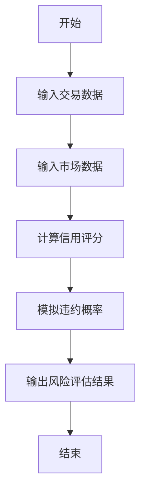
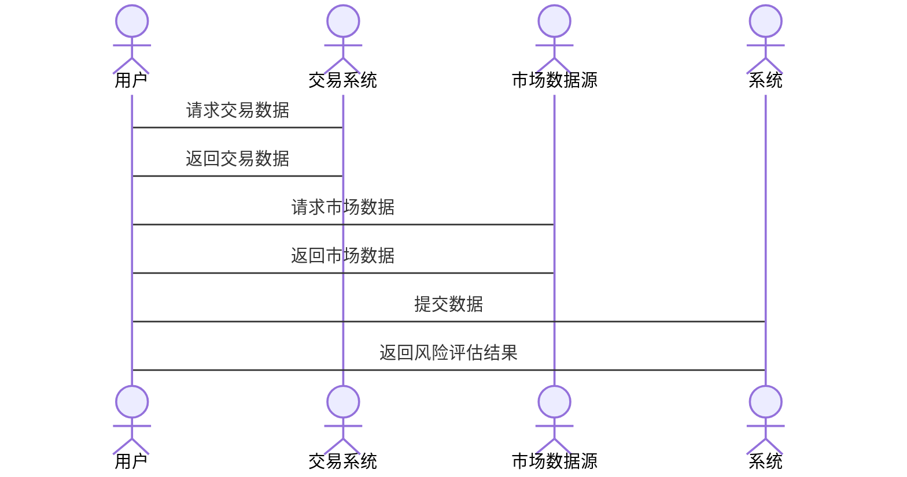

                 


# 《金融衍生品交易对手风险评估模型》

## 关键词：金融衍生品，交易对手风险，风险评估模型，信用评分，蒙特卡洛模拟

## 摘要：本文系统地介绍金融衍生品交易对手风险评估模型的核心概念、算法原理、系统架构及实际应用。从背景知识入手，详细讲解交易对手风险的定义、来源及其在金融衍生品中的重要性，分析模型的主要组成部分和应用场景。通过构建数学模型和算法流程图，阐述交易对手风险评估的实现方法，结合实际案例，分析模型的优势与局限性。最后，本文提供系统设计与实现的详细步骤，帮助读者掌握交易对手风险评估模型的构建与应用。

---

# 第一部分: 金融衍生品交易对手风险评估模型概述

## 第1章: 金融衍生品与交易对手风险概述

### 1.1 金融衍生品的定义与特点

金融衍生品是一种金融工具，其价值来源于基础资产（如股票、债券、商品等）的价格波动。与传统金融工具相比，衍生品具有以下特点：

- **杠杆效应**：允许投资者以较少的资金控制更大的头寸。
- **风险转移**：用于对冲或投机，帮助投资者转移或承担风险。
- **多样性**：包括期货、期权、掉期等多种类型。

### 1.2 交易对手风险的背景与重要性

交易对手风险是指交易一方未能履行其合约义务而给另一方带来的损失。在金融衍生品交易中，交易对手风险尤为关键，因为衍生品的价值依赖于交易双方的信用。

#### 1.2.1 交易对手风险的定义

交易对手风险是交易对手未能履行其合约义务的可能性，包括违约风险、结算风险和信用风险。

#### 1.2.2 交易对手风险的来源

交易对手风险主要来源于以下因素：

- **信用风险**：交易对手的信用状况恶化，导致违约。
- **市场风险**：市场价格波动影响交易对手的履约能力。
- **操作风险**：交易过程中的错误或欺诈行为。

#### 1.2.3 交易对手风险在金融衍生品中的重要性

在衍生品交易中，交易对手风险直接影响交易的稳定性和市场的健康发展。高风险可能导致连锁反应，引发系统性金融危机。

### 1.3 交易对手风险评估模型的概述

交易对手风险评估模型用于量化交易对手的信用风险，帮助金融机构制定风险管理策略。

#### 1.3.1 模型的目标与作用

模型的目标是评估交易对手的信用风险，量化其对机构的潜在损失。其作用包括：

- **风险识别**：识别高风险交易对手。
- **风险量化**：估算潜在损失。
- **风险对冲**：制定对冲策略。

#### 1.3.2 模型的主要组成部分

模型通常包括以下部分：

- **数据输入**：交易对手的历史数据、市场数据等。
- **信用评分**：评估交易对手的信用状况。
- **风险计算**：计算潜在损失。
- **结果输出**：生成风险评估报告。

#### 1.3.3 模型的应用场景

模型广泛应用于银行、保险、资产管理等金融领域，帮助机构管理交易对手风险。

## 第2章: 交易对手风险评估的核心概念与联系

### 2.1 核心概念原理

交易对手风险评估模型的核心在于信用评分和风险量化。

#### 2.1.1 交易对手信用风险的定义与特征

信用风险是交易对手未能履行合约义务的可能性。其特征包括：

- **非对称信息**：交易对手的真实信用状况不易获取。
- **相关性**：多个交易对手的信用风险可能相互关联。

#### 2.1.2 交易对手风险的评估维度

评估维度包括：

- **信用评分**：交易对手的信用等级。
- **违约概率**：交易对手违约的可能性。
- **违约损失率**：违约时的损失程度。

#### 2.1.3 交易对手风险与市场风险的关系

交易对手风险与市场风险相互关联。市场波动可能影响交易对手的信用状况，而交易对手的违约也可能加剧市场风险。

### 2.2 核心概念属性对比表格

以下表格对比了交易对手风险与市场风险的主要区别：

| 属性         | 交易对手风险               | 市场风险               |
|--------------|----------------------------|------------------------|
| 定义         | 交易对手违约的可能性       | 市场价格波动的影响     |
| 主要因素     | 交易对手信用状况           | 市场价格波动           |
| 影响范围     | 单一交易对手               | 整个市场               |
| 管理方法     | 信用评分、风险对冲         | 多样化投资、对冲策略   |

### 2.3 ER实体关系图架构

以下是交易对手风险评估模型的ER实体关系图：

```mermaid
erDiagram
    actor 交易对手风险评估系统 {
        string id
        string 名称
        integer 信用评分
        integer 违约概率
    }
    actor 交易数据 {
        string 交易ID
        date 交易日期
        decimal 交易金额
        string 交易对手ID
    }
    actor 市场数据 {
        date 数据日期
        decimal 市场指数
        string 资产类别
    }
    actor 风险评估结果 {
        string 评估ID
        decimal 风险值
        date 评估日期
    }
    交易对手风险评估系统 --> 交易数据 : 获取交易数据
    交易对手风险评估系统 --> 市场数据 : 获取市场数据
    交易对手风险评估系统 --> 风险评估结果 : 输出评估结果
```

## 第3章: 交易对手风险评估模型的算法原理

### 3.1 算法原理概述

交易对手风险评估模型通常采用信用评分和蒙特卡洛模拟等方法。

#### 3.1.1 交易对手信用评分模型

信用评分模型通过历史数据评估交易对手的信用状况。

#### 3.1.2 蒙特卡洛模拟

蒙特卡洛模拟用于模拟不同市场条件下交易对手的违约概率。

### 3.2 算法流程图

以下是交易对手风险评估模型的流程图：



### 3.3 算法的数学模型与公式

交易对手风险评估模型的数学公式如下：

信用评分公式：
$$ \text{信用评分} = \alpha \times \text{历史违约率} + \beta \times \text{市场波动率} $$

违约概率公式：
$$ \text{违约概率} = \text{信用评分} \times \text{行业平均违约率} $$

### 3.4 举例说明

假设交易对手的信用评分为0.7，行业平均违约率为5%，则违约概率为：
$$ 0.7 \times 0.05 = 0.035 \text{或} 3.5\% $$

---

## 第4章: 系统分析与架构设计方案

### 4.1 问题场景介绍

交易对手风险评估系统需要处理大量交易数据和市场数据，实时评估交易对手的信用风险。

### 4.2 系统功能设计

系统功能模块包括数据输入、信用评分、风险计算和结果输出。

#### 4.2.1 系统功能模块划分

- 数据输入模块
- 信用评分模块
- 风险计算模块
- 结果输出模块

#### 4.2.2 功能模块的详细描述

数据输入模块负责获取交易数据和市场数据。信用评分模块基于历史数据评估信用状况。风险计算模块结合信用评分和市场数据计算违约概率。结果输出模块生成风险评估报告。

### 4.3 系统架构设计

系统架构采用分层设计，包括数据层、业务逻辑层和表现层。

#### 4.3.1 系统架构的总体设计

- 数据层：存储交易数据和市场数据。
- 业务逻辑层：处理数据，计算信用评分和违约概率。
- 表现层：展示风险评估结果。

#### 4.3.2 系统架构的详细说明

数据层使用数据库存储数据，业务逻辑层使用算法处理数据，表现层通过图表展示结果。

### 4.4 系统接口设计

系统接口包括数据接口和用户界面。

#### 4.4.1 系统接口的定义

- 数据接口：与交易系统和市场数据源对接。
- 用户界面：供用户输入数据和查看结果。

### 4.5 系统交互流程图

以下是系统交互流程图：



## 第5章: 项目实战

### 5.1 环境安装

需要安装Python、NumPy、Pandas和Matplotlib。

### 5.2 系统核心实现源代码

以下是信用评分模型的Python代码：

```python
import numpy as np
import pandas as pd
import matplotlib.pyplot as plt

# 数据准备
data = pd.DataFrame({
    '交易对手ID': ['A', 'B', 'C'],
    '历史违约率': [0.02, 0.05, 0.01],
    '市场波动率': [0.15, 0.20, 0.10]
})

# 计算信用评分
alpha = 0.5
beta = 0.5
data['信用评分'] = alpha * data['历史违约率'] + beta * data['市场波动率']

# 计算违约概率
行业平均违约率 = 0.05
data['违约概率'] = data['信用评分'] * 行业平均违约率

# 可视化结果
plt.bar(data['交易对手ID'], data['违约概率'])
plt.title('交易对手违约概率')
plt.xlabel('交易对手ID')
plt.ylabel('违约概率')
plt.show()
```

### 5.3 案例分析

假设交易对手A的信用评分为0.07，行业平均违约率为5%，则违约概率为：
$$ 0.07 \times 0.05 = 0.0035 \text{或} 0.35\% $$

### 5.4 项目总结

通过项目实战，我们掌握了交易对手风险评估模型的实现方法，并能够通过实际案例分析模型的优缺点。

## 第6章: 最佳实践与小结

### 6.1 小结

本文系统地介绍了交易对手风险评估模型的构建与应用，包括核心概念、算法原理、系统架构和项目实战。

### 6.2 注意事项

- 数据质量对模型结果影响重大，需确保数据的准确性和完整性。
- 模型的参数需根据实际情况调整，避免过度拟合。

### 6.3 拓展阅读

推荐阅读以下书籍和论文：

- 《信用评分模型的构建与应用》
- 《蒙特卡洛模拟在金融风险管理中的应用》

---

通过以上内容，读者可以全面了解交易对手风险评估模型的构建与应用，掌握其实现方法和实际应用技巧。

