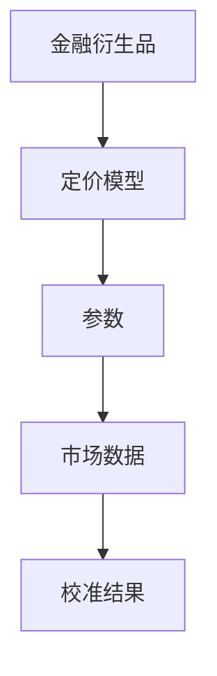
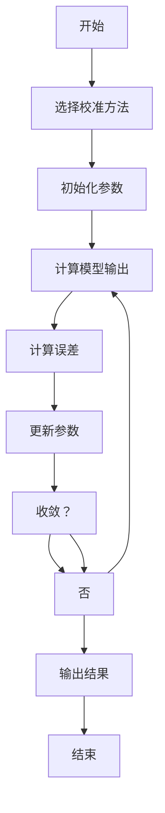
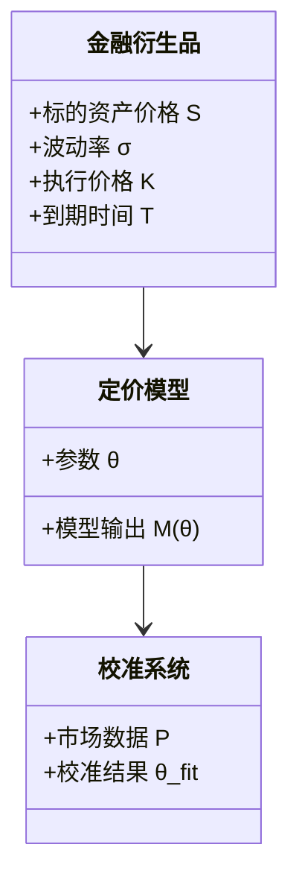
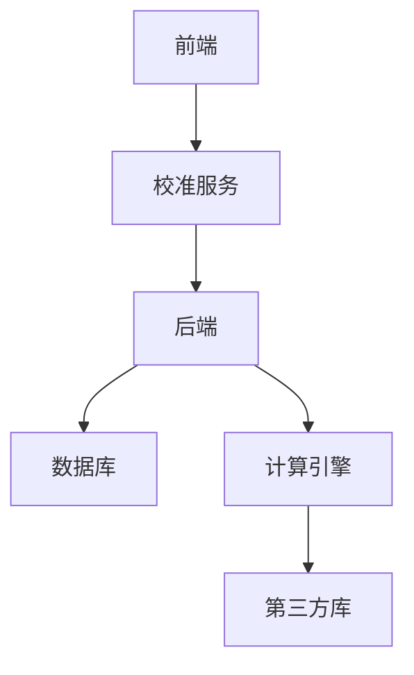

                 


# 金融衍生品定价模型校准

> 关键词：金融衍生品，定价模型，校准，数值优化，蒙特卡洛方法

> 摘要：本文系统地介绍金融衍生品定价模型校准的核心概念、算法原理、系统架构及实际应用。通过深入分析定价模型的数学基础，结合数值优化算法和蒙特卡洛方法，详细阐述模型校准的实现过程。同时，本文通过实际案例分析，探讨如何在金融衍生品定价中应用校准技术，并提供完整的代码实现和系统架构设计方案。

---

# 第一部分: 金融衍生品定价模型校准基础

---

# 第1章: 金融衍生品与定价模型概述

## 1.1 金融衍生品的基本概念

### 1.1.1 金融衍生品的定义与分类

金融衍生品（Financial Derivatives）是一种以基础资产（如股票、债券、商品等）为基础，通过复杂的数学模型定价的金融工具。常见的衍生品包括期权、期货、掉期和互换等。

- **定义**：衍生品的价值依赖于其标的资产的价格波动。
- **分类**：
  - 按标的资产：股票期权、外汇期权、利率期权等。
  - 按执行方式：欧式期权、美式期权。
  - 按市场结构：场内交易与场外交易。

### 1.1.2 金融衍生品的基本特性

- **杠杆效应**：用少量资金控制较大价值的资产。
- **风险对冲**：用于对冲市场风险或信用风险。
- **复杂性**：定价依赖复杂的数学模型。

### 1.1.3 金融衍生品的市场现状

- 全球衍生品市场规模庞大，交易活跃。
- 场外市场（OTC）交易量远超场内市场。
- 衍生品在风险管理中的作用日益重要。

---

## 1.2 定价模型的发展历程

### 1.2.1 早期定价模型的局限性

- **Black-Scholes模型**：1973年提出，适用于欧式期权定价。
- **局限性**：假设标的资产价格服从几何布朗运动，且波动率和无风险利率恒定。

### 1.2.2 现代定价模型的兴起

- **随机过程模型**：引入跳跃过程、跳跃扩散过程等。
- **数值方法**：有限差分法、蒙特卡洛模拟等。
- **局部波动率模型**：克服Black-Scholes模型的波动率恒定假设。

### 1.2.3 数值方法在定价中的应用

- **数值解法**：如有限差分法、蒙特卡洛模拟和二叉树模型。
- **适用性**：适用于高维问题和复杂衍生品。

---

## 1.3 模型校准的重要性

### 1.3.1 校准的定义与目标

- **定义**：通过实际市场数据调整模型参数，使模型输出与市场价格一致。
- **目标**：
  - 确保模型定价准确。
  - 提高模型的市场适应性。

### 1.3.2 校准在定价中的作用

- **参数估计**：如波动率、相关系数等。
- **模型验证**：检验模型的有效性。
- **风险对冲**：校准后的模型可用于风险管理和对冲策略。

### 1.3.3 校准的挑战与解决方案

- **挑战**：
  - 数据噪声大。
  - 参数多重依赖。
  - 计算复杂度高。
- **解决方案**：
  - 使用数值优化算法。
  - 引入正则化方法。
  - 结合市场数据和模型假设。

---

## 1.4 本章小结

本章介绍了金融衍生品的基本概念、定价模型的发展历程以及模型校准的重要性。通过对比不同定价模型的特点，为后续校准方法的讨论奠定基础。

---

# 第2章: 定价模型与校准的原理

## 2.1 定价模型的核心原理

### 2.1.1 随机过程与金融建模

- **布朗运动**：描述资产价格的随机波动。
- **跳跃过程**：资产价格可能突然跳变。
- **随机微分方程（SDE）**：描述资产价格的动态。

### 2.1.2 无套利定价原理

- **无套利原则**：在无摩擦市场中，套利机会不存在。
- **风险中性测度**：在无风险测度下，资产的期望回报率为无风险利率。

### 2.1.3 金融工具的定价公式

- **Black-Scholes公式**：
  $$ C = S_0 \Phi(d_1) - K e^{-rT} \Phi(d_2) $$
  其中：
  $$ d_1 = \frac{\ln(S_0/K) + (r + \sigma^2/2)T}{\sigma \sqrt{T}} $$
  $$ d_2 = d_1 - \sigma \sqrt{T} $$

---

## 2.2 校准的基本原理

### 2.2.1 参数估计的数学基础

- **参数估计**：通过最小二乘法或最大似然估计。
- **目标函数**：使模型输出与市场价格的残差平方和最小。

### 2.2.2 最小二乘法与最大似然估计

- **最小二乘法**：$$ \min_{\theta} \sum_{i=1}^n (P_i - M_i(\theta))^2 $$
- **最大似然估计**：$$ \max_{\theta} \prod_{i=1}^n f(P_i | \theta) $$

### 2.2.3 校准的目标函数与约束条件

- **目标函数**：$$ J(\theta) = \sum_{i=1}^n (P_i - M_i(\theta))^2 $$
- **约束条件**：
  - 参数非负性。
  - 参数合理性。

---

## 2.3 校准与模型选择的关系

### 2.3.1 模型选择的准则

- **AIC准则**：$$ AIC = n \ln(\text{RSS}) + 2k $$
- **BIC准则**：$$ BIC = n \ln(\text{RSS}) + k \ln(n) $$

### 2.3.2 校准对模型选择的影响

- **模型复杂性**：复杂模型可能过拟合。
- **模型稳定性**：校准结果的稳定性影响模型选择。

### 2.3.3 如何平衡模型复杂性与准确性

- **正则化方法**：Lasso、Ridge回归。
- **交叉验证**：使用部分数据校准，剩余数据验证。

---

## 2.4 核心概念对比分析

### 2.4.1 不同定价模型的属性对比

| 模型类型       | 参数数量 | 校准难度 | 计算复杂度 |
|----------------|----------|----------|------------|
| Black-Scholes  | 2        | 低       | 低          |
| Hull-White     | 3        | 中       | 中          |
| Heston         | 5        | 高       | 高          |

### 2.4.2 参数估计方法的优缺点

| 方法          | 优点           | 缺点           |
|---------------|----------------|----------------|
| 最小二乘法      | 简单高效       | 易受异常值影响   |
| 最大似然估计    | 理论性质优良     | 计算复杂        |

### 2.4.3 校准误差的来源与影响

- **来源**：
  - 数据噪声。
  - 模型假设偏差。
  - 计算误差。
- **影响**：
  - 定价误差。
  - 风险管理误差。

---

## 2.5 ER实体关系图



---

## 2.6 本章小结

本章详细阐述了定价模型和校准的基本原理，对比了不同模型和校准方法的特点，为后续的算法实现奠定了理论基础。

---

# 第3章: 定价模型校准的算法原理

## 3.1 校准算法概述

### 3.1.1 常见的校准方法

- **数值优化法**：如梯度下降、牛顿法。
- **蒙特卡洛方法**：适用于高维问题。
- **局部敏感性分析**：通过敏感性指标调整参数。

---

## 3.2 最小二乘法校准

### 3.2.1 算法流程

1. 初始化参数。
2. 计算模型输出。
3. 计算残差平方和。
4. 更新参数，优化目标函数。

### 3.2.2 代码实现

```python
import numpy as np

def calibration():
    # 初始化参数
    theta = np.array([1.0, 0.5, 0.2])
    # 校准函数
    def objective(theta):
        # 计算模型输出
        M = model_output(theta)
        # 计算残差平方和
        return np.sum((P - M) ** 2)
    # 最小二乘法优化
    result = scipy.optimize.minimize(objective, theta)
    return result.x

# 示例：Black-Scholes模型校准
def model_output(theta):
    S0, r, sigma = theta
    K = 100
    T = 1
    d1 = (np.log(S0/K) + (r + sigma**2/2)*T) / (sigma * np.sqrt(T))
    d2 = d1 - sigma * np.sqrt(T)
    C = S0 * norm.cdf(d1) - K * np.exp(-r*T) * norm.cdf(d2)
    return C
```

### 3.2.3 案例分析

假设我们有市场价和模型输出，通过最小二乘法调整波动率σ，使模型输出接近市场价格。

---

## 3.3 非参数校准方法

### 3.3.1 核密度估计的基本原理

- **核密度估计**：$$ \hat{f}(x) = \frac{1}{n h} \sum_{i=1}^n K\left(\frac{x - x_i}{h}\right) $$
- **带宽h**：控制估计的光滑程度。

### 3.3.2 代码实现

```python
from sklearn.neighbors import KernelDensity

def nonparametric_calibration(X_train, X_test):
    # 初始化模型
    kd = KernelDensity(bandwidth=0.1)
    # 训练
    kd.fit(X_train)
    # 预测
    log_prob = kd.score_samples(X_test)
    return log_prob
```

---

## 3.4 算法流程图



---

## 3.5 本章小结

本章通过具体算法实现，详细阐述了最小二乘法和非参数校准方法的原理和应用，为后续的系统架构设计奠定基础。

---

# 第四部分: 定价模型校准的数学模型

---

# 第4章: 定价模型的数学推导

## 4.1 Black-Scholes模型推导

### 4.1.1 无风险测度下的期望

$$ \mathbb{E}^Q [S_T] = S_0 e^{rT} $$

### 4.1.2 风险中性测度

$$ \mathbb{E}^Q [f(S_T)] = e^{rT} \mathbb{E}^P [f(S_T)] $$

### 4.1.3 期权定价公式

$$ C = S_0 \Phi(d_1) - K e^{-rT} \Phi(d_2) $$

---

## 4.2 校准的数学模型

### 4.2.1 参数估计的数学表达

$$ \hat{\theta} = \arg \min_{\theta} \sum_{i=1}^n (P_i - M_i(\theta))^2 $$

### 4.2.2 常见的校准误差函数

- **均方误差（MSE）**：
  $$ \text{MSE} = \frac{1}{n} \sum_{i=1}^n (P_i - \hat{P}_i)^2 $$
- **平均绝对误差（MAE）**：
  $$ \text{MAE} = \frac{1}{n} \sum_{i=1}^n |P_i - \hat{P}_i| $$

---

## 4.3 数值解法与校准

### 4.3.1 随机微分方程的数值解法

$$ dS_t = \mu S_t dt + \sigma S_t dW_t $$

### 4.3.2 有限差分法

$$ S_{t+1} = S_t + \mu S_t \Delta t + \sigma S_t \sqrt{\Delta t} Z $$

---

## 4.4 本章小结

本章通过数学推导，详细分析了Black-Scholes模型的定价公式及其校准的数学表达，为实际应用提供了理论依据。

---

# 第五部分: 系统分析与架构设计方案

---

# 第5章: 系统分析与架构设计

## 5.1 问题场景介绍

### 5.1.1 金融衍生品定价系统的需求分析

- **需求**：支持多种衍生品定价、参数校准和风险评估。
- **用户角色**：交易员、风险管理人员。

### 5.1.2 校准系统的功能需求

- **参数估计**：支持多种校准方法。
- **模型验证**：提供误差分析和可视化工具。

---

## 5.2 系统功能设计

### 5.2.1 领域模型设计



### 5.2.2 系统架构设计



### 5.2.3 系统接口设计

- **输入接口**：市场数据、模型参数。
- **输出接口**：校准结果、误差分析。

---

## 5.3 系统交互设计

### 5.3.1 校准流程


---

## 5.4 本章小结

本章通过系统分析与架构设计，展示了如何将定价模型校准技术应用于实际金融系统中。

---

# 第六部分: 项目实战

---

# 第6章: 项目实战与案例分析

## 6.1 环境安装与配置

### 6.1.1 安装Python环境

```bash
python -m pip install numpy scipy matplotlib
```

### 6.1.2 安装金融分析库

```bash
python -m pip install pandas yfinance
```

---

## 6.2 系统核心实现

### 6.2.1 校准函数实现

```python
def calibrate_model(option_data):
    # 定义目标函数
    def objective(theta):
        # 计算模型输出
        price = black_scholes(theta)
        # 计算残差平方和
        return np.sum((option_data['market_price'] - price) ** 2)
    # 使用数值优化算法
    result = scipy.optimize.minimize(objective, [1.0, 0.02, 0.2])
    return result.x
```

### 6.2.2 金融数据获取与处理

```python
import pandas as pd
import yfinance as yf

# 获取历史数据
data = yf.download(tickers='AAPL', start='2023-01-01', end='2023-12-31')
# 计算技术指标
data['MA'] = data['Close'].rolling(5).mean()
```

---

## 6.3 案例分析

### 6.3.1 校准过程

1. **数据准备**：收集期权市场数据。
2. **模型选择**：选择合适的定价模型。
3. **参数初始化**：设置初始参数值。
4. **校准执行**：运行校准算法。
5. **结果分析**：分析校准误差。

### 6.3.2 结果展示

- **收敛性分析**：检查校准结果是否收敛。
- **误差分析**：计算均方误差（MSE）和平均绝对误差（MAE）。

---

## 6.4 项目小结

本章通过具体项目实战，展示了如何在实际中应用定价模型校准技术，通过代码实现和案例分析，帮助读者更好地理解校准技术的实际应用。

---

# 第七部分: 总结与展望

---

# 第7章: 总结与展望

## 7.1 全文总结

本文系统地介绍了金融衍生品定价模型校准的核心概念、算法原理、系统架构及实际应用。通过深入分析定价模型的数学基础，结合数值优化算法和蒙特卡洛方法，详细阐述了模型校准的实现过程。

---

## 7.2 未来展望

### 7.2.1 机器学习在金融建模中的应用

- **深度学习**：用于复杂金融模型的参数估计。
- **强化学习**：应用于动态市场环境下的风险对冲。

### 7.2.2 校准技术的进一步发展

- **多因子模型**：引入更多市场因子。
- **实时校准**：动态调整模型参数。

---

## 7.3 本章小结

本文总结了金融衍生品定价模型校准的核心内容，并展望了未来的发展方向。

---

# 第八部分: 附录

---

# 附录A: 工具安装与使用指南

## A.1 Python环境配置

```bash
python -m pip install numpy scipy matplotlib pandas yfinance
```

## A.2 常用库的使用

```python
import numpy as np
import pandas as pd
import yfinance as yf
from scipy.optimize import minimize
```

---

# 附录B: 参考文献

1. Black, F., & Scholes, M. (1973). The Pricing of Options and Corporate Liabilities.
2. Hull, J. C. (2006). Options, Futures, and Other Derivatives.
3. Shreve, S. E. (2004). Stochastic Calculus for Finance I: The Binomial Asset Pricing Model.

---

# 结束语

金融衍生品定价模型校准是一项复杂而重要的技术，通过本文的系统介绍，读者可以全面掌握其核心原理和实际应用。未来，随着人工智能和大数据技术的发展，校准技术将更加精准和高效。

---

