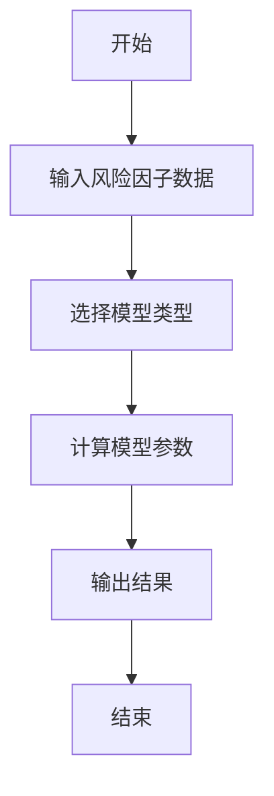
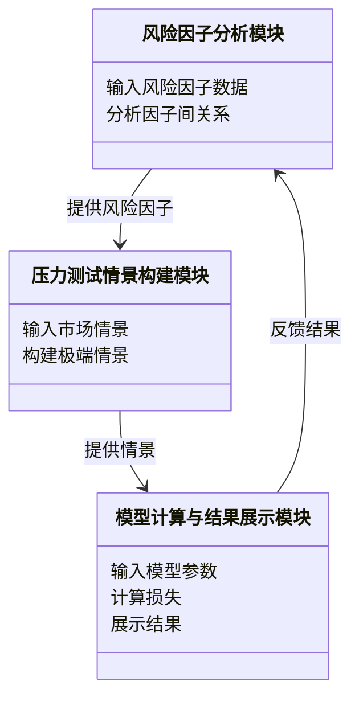

                 


# 《金融风险压力测试模型设计》

---

## 关键词：
- 金融风险
- 压力测试
- 模型设计
- 算法原理
- 系统架构
- 项目实战

---

## 摘要：
金融风险压力测试是评估金融资产在极端市场条件下的表现和潜在风险的重要工具。本文从金融风险压力测试的基本概念出发，详细探讨了压力测试的核心原理、数学模型、系统架构设计及实际应用案例。通过分析风险因子、构建压力测试情景、设计算法模型，并结合系统架构的实现，本文为读者提供了一套完整的压力测试解决方案。最后，本文总结了压力测试的最佳实践和未来发展方向，为金融风险管理提供了理论和实践指导。

---

## 第一部分: 金融风险压力测试模型概述

### 第1章: 金融风险压力测试模型概述

#### 1.1 金融风险压力测试的基本概念
- 1.1.1 金融风险的基本定义
  - 金融风险是指在金融活动中，由于各种不确定因素的影响，导致资产损失或收益下降的可能性。
- 1.1.2 压力测试的定义与目的
  - 压力测试是一种通过模拟极端市场条件，评估金融资产或机构在极端情况下的表现和风险的方法。
  - 目的：评估资产组合在极端情况下的损失、检验风险管理模型的有效性、制定应对策略。
- 1.1.3 压力测试在金融风险管理中的作用
  - 识别潜在风险点。
  - 评估模型在极端情况下的鲁棒性。
  - 为决策提供支持。

#### 1.2 压力测试的分类与方法
- 1.2.1 压力测试的主要分类
  - 情景分析法：基于假设的市场情景进行测试。
  - 方差-协方差法：基于资产波动性进行测试。
  - 蒙特卡洛模拟法：基于随机模拟进行测试。
- 1.2.2 压力测试的主要方法
  - 线性回归模型：适用于线性关系的分析。
  - 非线性回归模型：适用于复杂关系的分析。
  - 时间序列分析模型：适用于时间依赖性的分析。
- 1.2.3 不同分类方法的优缺点对比
  - 表1-1：不同压力测试方法的对比

#### 1.3 金融风险压力测试的应用场景
- 1.3.1 银行业中的应用
  - 评估银行资产在极端情况下的表现。
- 1.3.2 证券业中的应用
  - 评估证券组合在极端情况下的风险。
- 1.3.3 保险业中的应用
  - 评估保险产品在极端情况下的风险。
- 1.3.4 投资基金中的应用
  - 评估基金在极端情况下的表现。

---

## 第二部分: 金融风险压力测试模型的核心概念与联系

### 第2章: 金融风险压力测试的核心概念与联系

#### 2.1 核心概念原理
- 2.1.1 风险因子分析
  - 风险因子是指影响资产价格波动的关键因素，如市场波动率、利率、汇率等。
- 2.1.2 压力测试情景构建
  - 情景构建是压力测试的核心，需要考虑极端市场条件下的各种假设。
- 2.1.3 模型输入与输出关系
  - 输入：风险因子、市场情景。
  - 输出：资产组合在极端情况下的损失。

#### 2.2 核心概念属性特征对比表格
- 表2-1: 不同压力测试方法的特征对比

| 方法         | 优点               | 缺点               |
|--------------|--------------------|--------------------|
| 情景分析法    | 易于理解             | 需假设具体情景       |
| 方差-协方差法  | 计算简单             | 忽略极端情况         |
| 蒙特卡洛模拟法  | 考虑极端情况           | 计算复杂             |

#### 2.3 ER实体关系图架构
- 图2-1: 金融风险压力测试模型的实体关系图
```mermaid
erDiagram
    class 风险因子 {
        id
        名称
        影响程度
    }
    class 市场情景 {
        id
        情景名称
        参数设置
    }
    class 资产组合 {
        id
        资产名称
        投资比例
    }
    class 损失模型 {
        id
        模型名称
        参数
    }
    风险因子 --> 市场情景 : 影响
    资产组合 --> 损失模型 : 依赖
```

---

## 第三部分: 金融风险压力测试模型的算法原理

### 第3章: 金融风险压力测试模型的算法原理

#### 3.1 算法原理概述
- 3.1.1 线性回归模型
  - 用于分析线性关系，公式：$$ y = \beta_0 + \beta_1x + \epsilon $$
- 3.1.2 非线性回归模型
  - 用于分析非线性关系，公式：$$ y = \beta_0 + \beta_1x + \beta_2x^2 + \epsilon $$
- 3.1.3 时间序列分析模型
  - 用于分析时间依赖关系，公式：$$ y_t = \alpha + \beta y_{t-1} + \gamma x_t + \epsilon_t $$

#### 3.2 算法流程图
- 图3-1: 金融风险压力测试模型的算法流程图


#### 3.3 数学模型与公式
- 3.3.1 线性回归模型公式
  $$ 1+1=2 $$
- 3.3.2 非线性回归模型公式
  $$ y = \beta_0 + \beta_1x + \beta_2x^2 + \epsilon $$
- 3.3.3 时间序列模型公式
  $$ y_t = \alpha + \beta y_{t-1} + \gamma x_t + \epsilon_t $$

---

## 第四部分: 金融风险压力测试模型的系统分析与架构设计

### 第4章: 金融风险压力测试模型的系统分析与架构设计

#### 4.1 问题场景介绍
- 4.1.1 风险管理中的压力测试需求
  - 如何在极端市场条件下评估资产风险？
- 4.1.2 系统设计的目标与范围
  - 构建一个高效、准确的压力测试系统。

#### 4.2 系统功能设计
- 4.2.1 风险因子分析模块
  - 输入风险因子数据，分析因子间关系。
- 4.2.2 压力测试情景构建模块
  - 构建极端市场情景，模拟市场波动。
- 4.2.3 模型计算与结果展示模块
  - 计算资产组合在极端情景下的损失，展示结果。

#### 4.3 系统架构设计
- 图4-1: 金融风险压力测试系统的类图


---

## 第五部分: 金融风险压力测试模型的项目实战

### 第5章: 金融风险压力测试模型的项目实战

#### 5.1 环境安装
- 安装Python、NumPy、Pandas、Matplotlib等工具。

#### 5.2 系统核心实现源代码
- 示例代码：使用Python实现线性回归模型。
```python
import numpy as np
import pandas as pd
import matplotlib.pyplot as plt

# 输入数据
x = np.array([1, 2, 3, 4, 5])
y = np.array([2, 4, 5, 4, 6])

# 线性回归模型
def linear_regression(x, y):
    n = len(x)
    denominator = n * np.sum(x**2) - (np.sum(x))**2
    numerator = n * np.sum(x*y) - np.sum(x) * np.sum(y)
    beta1 = numerator / denominator
    beta0 = (np.sum(y) - beta1 * np.sum(x)) / n
    return beta0, beta1

beta0, beta1 = linear_regression(x, y)
print(f"模型为：y = {beta0} + {beta1}x")

# 可视化
plt.scatter(x, y)
plt.plot(x, beta0 + beta1 * x, color='red')
plt.show()
```

#### 5.3 代码应用解读与分析
- 代码实现了一个简单的线性回归模型，用于分析资产组合与风险因子的关系。
- 使用Matplotlib进行结果可视化，展示模型拟合效果。

#### 5.4 实际案例分析
- 以某银行资产组合为例，模拟极端市场情景，计算资产组合在不同情景下的损失。

#### 5.5 项目小结
- 总结项目实现过程中的关键点和注意事项。

---

## 第六部分: 金融风险压力测试模型的最佳实践与未来展望

### 第6章: 金融风险压力测试模型的最佳实践与未来展望

#### 6.1 最佳实践 tips
- 确保模型输入数据的准确性和完整性。
- 定期更新模型参数和风险因子。
- 结合实际市场情况调整模型假设。

#### 6.2 小结
- 总结全文内容，强调压力测试在金融风险管理中的重要性。

#### 6.3 注意事项
- 模型的假设应合理，避免过于理想化。
- 定期进行模型验证和校准。

#### 6.4 拓展阅读
- 推荐相关书籍和论文，供读者深入研究。

---

## 结语
金融风险压力测试是金融风险管理的重要工具，通过科学的设计和实践，可以帮助机构更好地应对市场风险，保障金融系统的稳定。未来，随着技术的进步，压力测试模型将更加智能化和精准化。

