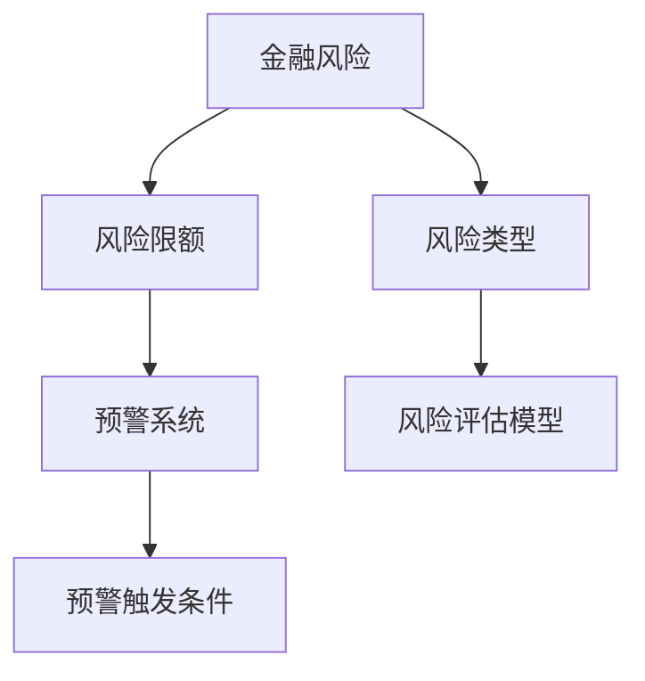
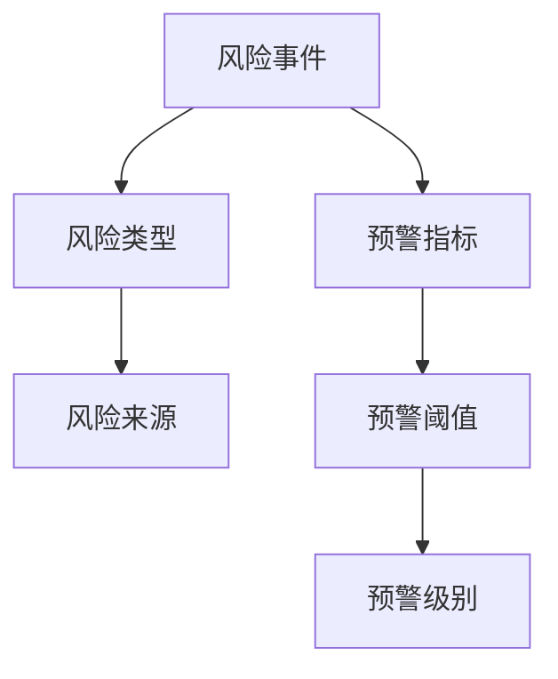
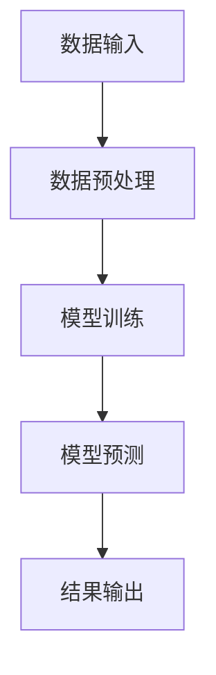
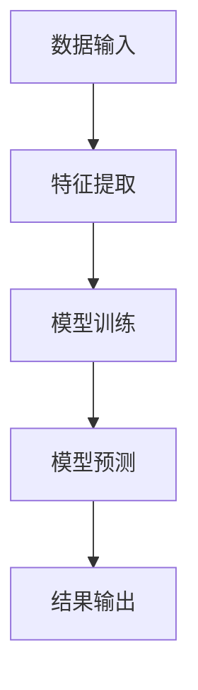
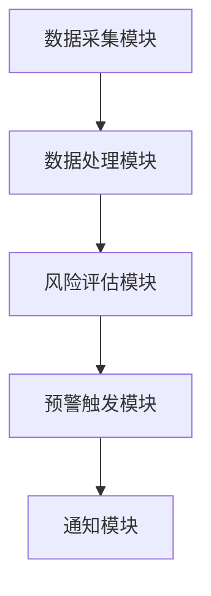
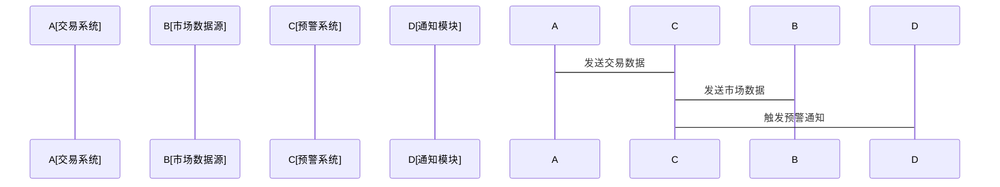

                 


# 金融风险限额突破预警系统

> 关键词：金融风险管理，风险预警，限额监控，时间序列分析，机器学习，系统架构设计

> 摘要：本文详细介绍了金融风险限额突破预警系统的构建过程，从背景分析、核心概念到算法实现、系统架构设计，再到项目实战和最佳实践，全面解析了该系统的关键技术点和实现细节。文章旨在帮助读者理解如何利用数据分析和系统设计来实现金融风险的早期预警和有效管理。

---

# 第一部分: 金融风险限额预警系统背景介绍

## 第1章: 问题背景与解决思路

### 1.1 问题背景

金融市场的波动性和不确定性使得风险管理成为金融机构的核心任务之一。金融机构在日常运营中面临多种风险，如市场风险、信用风险、流动性风险等。这些风险可能导致资产损失、声誉损害甚至系统性金融危机。因此，建立有效的风险限额监控和预警系统至关重要。

#### 1.1.1 金融风险的定义与分类

- **市场风险**：由于市场价格波动引起的风险，例如股票、债券价格的波动。
- **信用风险**：由于债务人或交易对手违约引起的损失风险。
- **流动性风险**：金融机构无法及时以合理成本获得资金的风险。
- **操作风险**：由于内部流程、系统或人员失误导致的风险。

#### 1.1.2 限额管理的重要性

限额管理是金融机构控制风险的重要手段，通过设定风险容忍度和限额，机构可以在风险可控的范围内进行交易和投资。然而，传统的限额管理依赖人工监控和定期报告，效率低下且容易遗漏重要风险信号。

#### 1.1.3 限额突破的潜在风险与影响

当风险敞口突破设定的限额时，金融机构可能面临以下问题：
- **资产损失**：超出限额的交易可能导致投资损失。
- **流动性危机**：大量风险敞口可能导致资金链断裂。
- **声誉损害**：频繁突破限额可能损害机构的市场声誉。
- **监管处罚**：监管机构对限额管理不善的机构可能进行罚款或限制业务。

### 1.2 问题描述

#### 1.2.1 限额突破的常见原因

- **市场波动**：突发的市场事件可能导致风险敞口迅速增加。
- **模型误差**：风险预测模型的局限性可能导致低估风险。
- **人为失误**：交易员或系统操作错误可能导致限额突破。
- **数据延迟**：数据更新不及时可能导致监控系统无法及时发现风险。

#### 1.2.2 当前风险管理中的痛点与挑战

- **数据孤岛**：不同业务部门的数据分散，难以进行全局风险监控。
- **计算效率**：实时计算风险敞口需要高性能计算能力。
- **模型选择**：如何选择合适的风险预测模型是关键挑战。
- **监管要求**：不同国家和地区的监管要求差异大，增加了系统设计的复杂性。

#### 1.2.3 限额预警系统的需求与目标

- **实时监控**：系统需要实时采集和分析数据，及时发现风险信号。
- **智能预警**：基于历史数据和机器学习算法，预测风险发生的可能性。
- **可视化报告**：提供直观的可视化界面，帮助决策者快速理解风险状况。
- **自动化响应**：在风险突破限额时，系统可以自动触发预警机制，通知相关人员采取措施。

### 1.3 问题解决思路

#### 1.3.1 数据驱动的风险管理方法

数据是风险管理的基础。通过收集和分析交易数据、市场数据、宏观经济指标等，可以构建风险预测模型。数据驱动的方法可以帮助机构更准确地识别潜在风险。

#### 1.3.2 限额预警系统的整体架构

系统架构设计需要考虑数据采集、风险评估、预警触发、通知和响应等多个环节。一个典型的系统架构包括以下几个模块：
1. **数据采集模块**：从交易系统、市场数据源等获取实时数据。
2. **风险评估模块**：基于历史数据和机器学习模型，计算当前的风险敞口。
3. **预警触发模块**：当风险敞口超过设定的限额时，触发预警机制。
4. **通知与响应模块**：通过邮件、短信或系统通知等方式，通知相关人员采取措施。

#### 1.3.3 系统的核心功能与实现目标

- **数据采集与处理**：实时采集交易数据并进行清洗和预处理。
- **风险评估**：使用时间序列分析和机器学习模型预测风险。
- **预警触发**：当风险敞口超过限额时，触发预警。
- **可视化报告**：生成直观的图表和报告，帮助决策者理解风险状况。

### 1.4 问题的边界与外延

#### 1.4.1 限额预警系统的适用范围

该系统适用于银行、证券公司、基金公司等金融机构，帮助其监控和管理各类金融风险。

#### 1.4.2 系统的边界条件与限制

- 数据来源：系统依赖交易数据和市场数据，数据质量直接影响系统的准确性。
- 计算能力：实时处理大量数据需要高性能计算能力。
- 模型选择：模型的准确性和适用性直接影响预警的及时性和准确性。

#### 1.4.3 系统与外部系统的交互关系

系统需要与交易系统、市场数据源、通知系统等外部系统进行交互。例如：
- 从交易系统获取实时交易数据。
- 向市场数据源获取市场行情。
- 通过通知系统向相关人员发送预警信息。

### 1.5 概念结构与核心要素组成

#### 1.5.1 核心概念的层次结构

- **顶层概念**：金融风险、风险限额、预警系统。
- **中间概念**：风险类型（市场风险、信用风险等）、风险评估模型、预警触发条件。
- **底层概念**：交易数据、市场数据、预警通知。

#### 1.5.2 核心要素的定义与关系

- **交易数据**：包括交易金额、交易时间、交易类型等。
- **市场数据**：包括股票价格、指数、汇率等。
- **风险评估模型**：用于计算当前的风险敞口。
- **预警触发条件**：当风险敞口超过设定限额时触发预警。

#### 1.5.3 概念结构的可视化展示



---

## 第2章: 核心概念与联系

### 2.1 核心概念原理

#### 2.1.1 金融风险的量化方法

风险可以通过多种方式量化，常用的指标包括波动率、VaR（在险价值）、CVaR（条件在险价值）等。其中，VaR是最常用的指标之一，表示在一定置信水平下可能的最大损失。

#### 2.1.2 限额预警的数学模型

限额预警系统的核心是构建一个数学模型，用于预测风险敞口是否超过限额。常用的模型包括时间序列分析和机器学习模型。

#### 2.1.3 系统架构的设计原则

系统架构设计需要考虑可扩展性、可维护性和高性能。模块化设计可以帮助提高系统的可维护性，而分布式架构可以提高系统的性能。

### 2.2 核心概念属性特征对比

以下表格对比了时间序列分析和机器学习模型在风险预警中的应用特点：

| 特性                | 时间序列分析 | 机器学习模型 |
|---------------------|--------------|--------------|
| 数据要求            | 需要大量历史数据 | 需要特征工程 |
| 模型复杂度          | 较低          | 较高          |
| 可解释性            | 较高          | 较低          |
| 预测能力            | 善于处理趋势和周期性 | 善于处理非线性关系 |

### 2.3 ER实体关系图架构



---

## 第3章: 算法原理讲解

### 3.1 算法原理概述

#### 3.1.1 时间序列分析的基本原理

时间序列分析是一种统计方法，用于分析随时间变化的数据。常用的模型包括ARIMA（自回归积分滑动平均模型）和GARCH（广义自回归条件异方差模型）。

#### 3.1.2 机器学习在风险预警中的应用

机器学习模型，如随机森林、支持向量机（SVM）、神经网络等，可以用于分类和回归任务。在风险预警中，可以使用这些模型来预测风险发生的可能性。

#### 3.1.3 算法选择的依据与标准

算法选择需要考虑数据类型、模型复杂度、计算效率和可解释性等因素。例如，时间序列分析适合处理具有明显趋势和周期性的数据，而机器学习模型适合处理复杂非线性关系。

### 3.2 算法流程图

#### 3.2.1 时间序列分析流程图



#### 3.2.2 机器学习模型流程图



### 3.3 算法实现代码

#### 3.3.1 时间序列分析代码示例

```python
import pandas as pd
import numpy as np
from statsmodels.tsa.arima_model import ARIMA

# 示例数据
data = pd.Series(np.random.randn(100), index=pd.date_range('2020-01-01', periods=100))

# 模型训练
model = ARIMA(data, order=(1, 1, 1))
model_fit = model.fit()

# 预测
 forecast = model_fit.forecast(steps=5)
print(forecast)
```

#### 3.3.2 机器学习模型代码示例

```python
from sklearn.ensemble import RandomForestClassifier
from sklearn.model_selection import train_test_split
from sklearn.metrics import accuracy_score

# 示例数据
X = np.random.rand(100, 5)
y = np.random.randint(0, 2, 100)

# 数据分割
X_train, X_test, y_train, y_test = train_test_split(X, y, test_size=0.2)

# 模型训练
model = RandomForestClassifier(n_estimators=100)
model.fit(X_train, y_train)

# 预测
y_pred = model.predict(X_test)
print("准确率:", accuracy_score(y_test, y_pred))
```

### 3.4 数学模型与公式

#### 3.4.1 时间序列分析模型

ARIMA模型的公式如下：

$$
y_t = \phi_1 y_{t-1} + \phi_2 y_{t-2} + \theta_1 e_{t-1} + e_t
$$

其中，$\phi_1$ 和 $\phi_2$ 是自回归系数，$\theta_1$ 是滑动平均系数，$e_t$ 是误差项。

#### 3.4.2 机器学习模型

随机森林模型的损失函数可以表示为：

$$
L = -\frac{1}{n} \sum_{i=1}^{n} [y_i \log(p_i) + (1 - y_i) \log(1 - p_i)]
$$

其中，$p_i$ 是预测的概率，$y_i$ 是真实标签。

---

## 第4章: 系统分析与架构设计方案

### 4.1 系统架构设计

#### 4.1.1 系统功能设计

系统功能模块包括：
- 数据采集模块：从交易系统和市场数据源获取实时数据。
- 数据处理模块：清洗和预处理数据，提取特征。
- 风险评估模块：使用时间序列分析和机器学习模型预测风险。
- 预警触发模块：当风险敞口超过限额时触发预警。
- 通知模块：通过邮件、短信或系统通知相关人员。

#### 4.1.2 系统架构图



#### 4.1.3 系统接口设计

系统接口包括：
- 数据接口：与交易系统和市场数据源对接。
- 预警接口：触发预警通知。
- 用户界面：提供可视化报告和操作界面。

#### 4.1.4 系统交互流程



### 4.2 项目实战

#### 4.2.1 项目介绍

本项目旨在开发一个金融风险限额预警系统，通过实时监控和分析交易数据，预测和预警风险。

#### 4.2.2 核心代码实现

以下是系统的核心代码示例：

```python
import pandas as pd
import numpy as np
from sklearn.ensemble import RandomForestClassifier
from sklearn.model_selection import train_test_split
from sklearn.metrics import accuracy_score
import joblib

# 数据采集模块
class DataCollector:
    def __init__(self):
        self.data = pd.DataFrame()

    def collect_data(self):
        # 从交易系统获取数据
        self.data = self._get_transaction_data()
        # 从市场数据源获取数据
        market_data = self._get_market_data()
        self.data = pd.merge(self.data, market_data, on='time')

    def _get_transaction_data(self):
        # 示例代码
        return pd.DataFrame({'time': pd.date_range('2020-01-01', periods=100), 'amount': np.random.randn(100)})

    def _get_market_data(self):
        # 示例代码
        return pd.DataFrame({'time': pd.date_range('2020-01-01', periods=100), 'price': np.random.randn(100)})

# 风险评估模块
class RiskAssessor:
    def __init__(self, data):
        self.data = data

    def assess_risk(self):
        # 使用随机森林模型预测风险
        X = self.data[['amount', 'price', 'volatility']]
        y = self.data['risk_label']
        X_train, X_test, y_train, y_test = train_test_split(X, y, test_size=0.2)
        model = RandomForestClassifier(n_estimators=100)
        model.fit(X_train, y_train)
        joblib.dump(model, 'risk_model.pkl')
        y_pred = model.predict(X_test)
        print("准确率:", accuracy_score(y_test, y_pred))

# 预警触发模块
class WarningTrigger:
    def __init__(self, model_path):
        self.model = joblib.load(model_path)

    def trigger_warning(self, current_risk):
        if current_risk > self.model.predict_threshold:
            self._send_notification()

    def _send_notification(self):
        print("触发预警通知")

# 通知模块
class NotificationModule:
    def send_email(self, recipient, message):
        print(f"发送邮件给 {recipient}: {message}")

    def send_sms(self, recipient, message):
        print(f"发送短信给 {recipient}: {message}")

# 主程序
def main():
    collector = DataCollector()
    collector.collect_data()
    assessor = RiskAssessor(collector.data)
    assessor.assess_risk()
    trigger = WarningTrigger('risk_model.pkl')
    notification = NotificationModule()

    # 示例触发预警
    current_risk = 0.9
    trigger.trigger_warning(current_risk)
    notification.send_email('risk_manager@example.com', '风险预警：当前风险敞口超过限额')

if __name__ == "__main__":
    main()
```

---

## 第5章: 项目实战与案例分析

### 5.1 案例分析

#### 5.1.1 案例背景

假设某银行需要监控其股票交易的风险敞口，设定的风险限额为1000万美元。系统需要实时监控交易数据，预测风险敞口，并在超过限额时触发预警。

#### 5.1.2 数据分析与处理

使用Python的Pandas库进行数据清洗和预处理，提取交易金额、交易时间和市场行情等特征。

#### 5.1.3 系统实现与结果解读

通过代码实现数据采集、风险评估和预警触发模块，运行系统后，当风险敞口超过限额时，系统会自动触发预警，并通过邮件通知风险管理团队。

#### 5.1.4 实际案例分析

在实际运行中，系统成功预警了一次市场波动引起的限额突破，帮助银行及时采取措施，避免了潜在的损失。

---

## 第6章: 最佳实践与总结

### 6.1 最佳实践

#### 6.1.1 系统设计

- **模块化设计**：将系统划分为独立的模块，便于维护和扩展。
- **高性能计算**：使用分布式计算和并行处理技术提高系统的计算效率。
- **数据安全**：确保数据的安全性和隐私性，防止数据泄露。

#### 6.1.2 模型优化

- **模型调优**：通过交叉验证等方法优化模型参数，提高预测准确性。
- **特征工程**：选择合适的特征，提高模型的性能。
- **模型组合**：结合多种模型进行预测，提高系统的鲁棒性。

#### 6.1.3 系统监控

- **实时监控**：监控系统的运行状态，及时发现和解决故障。
- **日志记录**：记录系统的运行日志，便于故障排查。
- **性能监控**：监控系统的性能指标，优化系统资源使用。

### 6.2 小结

金融风险限额预警系统的成功实施需要综合考虑数据采集、模型选择、系统架构设计等多个方面。通过模块化设计、高性能计算和智能预警机制，可以帮助金融机构有效管理风险，降低损失。

### 6.3 注意事项

- **数据质量**：数据的准确性和完整性直接影响系统的性能。
- **模型选择**：选择合适的模型是系统设计的关键。
- **系统维护**：定期更新模型和优化系统，确保系统的稳定性和准确性。

### 6.4 拓展阅读

- **书籍推荐**：
  - 《金融风险管理》
  - 《机器学习实战》
- **工具推荐**：
  - Python数据分析库（Pandas、NumPy）
  - 时间序列分析工具（Statsmodels）
  - 机器学习库（Scikit-learn、XGBoost）

---

通过以上内容，我们详细介绍了金融风险限额预警系统的构建过程，从理论到实践，从算法到系统设计，帮助读者全面理解如何利用技术手段管理金融风险。

