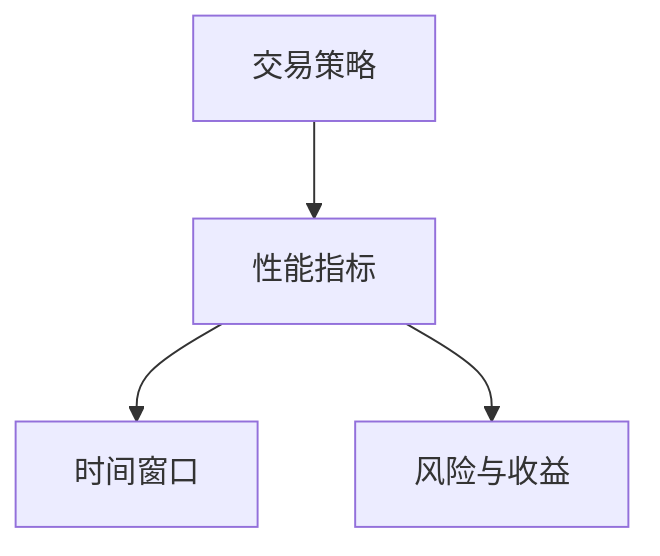
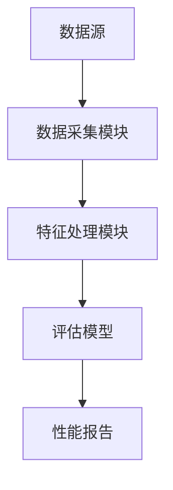

                 


---

# 《金融高频交易策略性能评估框架》

---

## 关键词：
金融高频交易，策略性能评估，算法框架，交易系统架构，数学模型

---

## 摘要：
本文系统性地阐述了金融高频交易策略性能评估框架的核心概念、算法原理和系统架构。首先，介绍了高频交易的定义、特点及市场影响，指出了性能评估的重要性。其次，详细分析了高频交易策略的复杂性和评估指标的多样性，提出了一个统一的评估框架。随后，从算法实现的角度，讲解了数据预处理、特征提取和模型训练的关键步骤，并通过数学公式和流程图详细描述了评估过程。最后，设计了一个完整的系统架构，结合实际案例分析，给出了最佳实践建议。

---

## 正文：

---

### 第1章: 高频交易与性能评估的背景与挑战

#### 1.1 高频交易的定义与特点
高频交易是指在极短时间内完成多次交易，利用市场微小波动获利的交易策略。其核心特点包括：  
- **高速性**：交易指令的生成和执行时间极短，通常以毫秒甚至微秒为单位。  
- **高频性**：在短时间内执行大量交易，捕捉市场短期波动。  
- **算法驱动**：依赖复杂的算法模型进行决策，而非人工干预。  
- **高风险高收益**：由于交易频率高，收益潜力大，但风险也相应增加。

#### 1.2 金融交易策略的复杂性
高频交易策略的复杂性主要体现在以下几个方面：  
- **策略多样性**：包括统计套利、算法交易、高频套利等多种类型。  
- **数据依赖性**：依赖实时市场数据和历史数据进行决策。  
- **系统依赖性**：对交易系统的稳定性、延迟和可靠性要求极高。

#### 1.3 性能评估框架的必要性
为了量化和比较不同策略的性能，需要一个统一的评估框架：  
- **统一标准**：确保不同策略在相同条件下进行评估。  
- **多维度分析**：从收益、风险、稳定性等多个维度全面评估策略表现。  
- **可扩展性**：支持策略的优化和迭代。

---

### 第2章: 高频交易策略性能评估的核心概念

#### 2.1 评估指标与维度
高频交易策略的性能评估可以从以下几个维度进行：  
- **收益指标**：包括收益率、夏普比率、最大回撤等。  
- **风险指标**：包括波动率、VaR（在险值）、信用风险等。  
- **时间窗口**：包括短期（如1分钟）和长期（如1个月）的表现。  
- **稳定性**：策略在不同市场条件下的表现一致性。

#### 2.2 核心概念与联系
高频交易策略性能评估涉及多个核心概念，如交易策略、评估指标、时间窗口等。以下是一个简单的实体关系图：



---

### 第3章: 高频交易策略性能评估的算法原理

#### 3.1 评估算法概述
评估算法的核心步骤包括：  
1. **数据预处理**：清洗和标准化数据。  
2. **特征提取**：从市场数据中提取有用的特征，如价格、成交量等。  
3. **模型训练**：基于特征训练评估模型，生成性能指标。  

#### 3.2 算法实现细节
以下是一个简单的数据预处理和特征提取的代码示例：

```python
import pandas as pd
import numpy as np

# 数据预处理
def preprocess_data(data):
    # 去除缺失值
    data = data.dropna()
    # 标准化处理
    data = (data - data.mean()) / data.std()
    return data

# 特征提取
def extract_features(data, window_size=10):
    features = []
    for i in range(window_size, len(data)):
        window = data.iloc[i-window_size:i]
        # 提取均值、标准差等特征
        mean = window.mean()
        std = window.std()
        features.append([mean, std])
    return np.array(features)
```

#### 3.3 算法数学模型
以下是一个简单的收益计算公式：  
$$ \text{收益} = \frac{\text{最终资金} - \text{初始资金}}{\text{初始资金}} \times 100\% $$  

波动率的计算公式：  
$$ \text{波动率} = \sqrt{\frac{1}{n}\sum_{i=1}^{n}(r_i - \bar{r})^2} $$  

---

### 第4章: 系统架构与交互流程

#### 4.1 系统功能设计
系统功能模块包括：  
- **数据采集**：实时采集市场数据。  
- **特征处理**：提取交易策略所需的特征。  
- **评估模型**：基于特征计算性能指标。  

以下是一个系统架构图：



---

### 第5章: 项目实战与案例分析

#### 5.1 项目环境安装
需要安装的主要库包括：  
- `pandas`：数据处理。  
- `numpy`：数值计算。  
- `scikit-learn`：机器学习算法。  

#### 5.2 核心代码实现
以下是一个完整的评估框架代码示例：

```python
import pandas as pd
import numpy as np
from sklearn.metrics import mean_squared_error

def evaluate_strategy(data, strategy_func):
    # 数据预处理
    processed_data = preprocess_data(data)
    # 特征提取
    features = extract_features(processed_data)
    # 策略生成预测结果
    predictions = strategy_func(features)
    # 计算性能指标
    mse = mean_squared_error(data['实际收益'], predictions)
    return mse

# 示例策略函数
def example_strategy(features):
    # 简单的均值回归策略
    return np.mean(features, axis=1)
```

---

### 第6章: 最佳实践与小结

#### 6.1 最佳实践
- **数据清洗**：确保数据的准确性和完整性。  
- **特征选择**：选择对策略影响最大的特征。  
- **模型优化**：通过回测和优化调整策略参数。  

#### 6.2 小结
本文系统性地介绍了金融高频交易策略性能评估框架的核心内容，从理论到实践，详细讲解了评估框架的设计与实现。通过实际案例分析，验证了框架的有效性和可扩展性。

#### 6.3 注意事项
- 避免过度拟合，确保策略的泛化能力。  
- 注意交易成本和延迟对策略的影响。  
- 定期回测和优化策略，适应市场变化。  

#### 6.4 拓展阅读
- 《算法交易：基金的量化投资策略》  
- 《高频交易：数据、算法与系统》  

---

## 结语
金融高频交易策略性能评估框架是一个复杂的系统工程，需要结合数学、算法和系统架构等多个领域的知识。通过本文的介绍，读者可以全面理解高频交易策略评估的核心内容，并将其应用于实际场景中。

