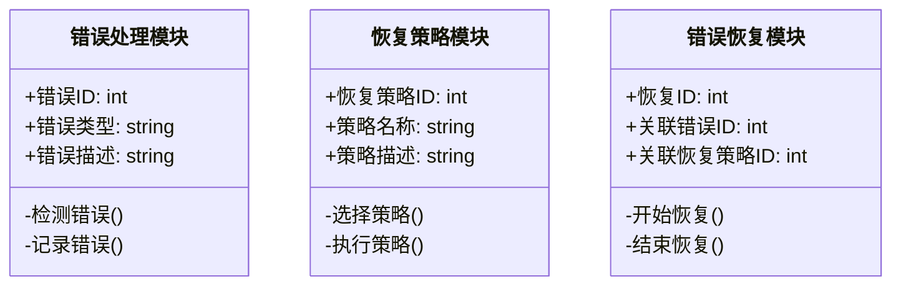

                 


# 错误处理与恢复：提高AI Agent的鲁棒性

> 关键词：错误处理，AI Agent，鲁棒性，恢复策略，算法原理

> 摘要：AI Agent在实际应用中经常会遇到各种错误，这些错误可能会影响任务的执行和系统的稳定性。本文从错误处理与恢复的基本原理出发，详细探讨了AI Agent在错误处理与恢复中的核心概念、算法原理、系统架构设计以及项目实战等内容，最后提出了提高AI Agent鲁棒性的最佳实践方法。

---

# 第一部分: 错误处理与恢复的背景与核心概念

## 第1章: 错误处理与恢复的背景介绍

### 1.1 问题背景

#### 1.1.1 错误处理与恢复的定义

错误处理是指在AI Agent运行过程中，检测和识别系统或任务中出现的异常情况，并采取相应的措施来修复这些问题的过程。恢复策略则是指在错误发生后，系统采取的一系列行动，以恢复正常运行状态或重新启动任务。

#### 1.1.2 错误处理在AI Agent中的重要性

AI Agent的设计目标是高效、稳定地完成任务。然而，在实际运行中，由于外部环境的不确定性、算法的局限性或系统故障等原因，错误是不可避免的。错误处理与恢复能力直接决定了AI Agent的鲁棒性，即系统在面对错误时保持正常运行的能力。

#### 1.1.3 错误处理与恢复的边界与外延

错误处理与恢复的边界包括：  
- 错误检测的范围：仅限于AI Agent自身的运行环境。  
- 恢复策略的范围：仅针对可恢复的错误类型。  
- 错误处理的粒度：从单个任务到整个系统的恢复。  

错误处理与恢复的外延包括：  
- 错误预测：基于历史数据预测可能发生的错误。  
- 故障容错：通过冗余设计降低错误的影响。  

### 1.2 问题描述

#### 1.2.1 AI Agent在运行中的常见错误类型

- **逻辑错误**：算法设计或执行中的错误。  
- **运行时错误**：内存泄漏、资源不足等。  
- **输入输出错误**：与外部系统交互时的错误。  
- **网络错误**：网络连接中断或超时。  

#### 1.2.2 错误处理与恢复的必要性

- 确保任务的连续性和稳定性。  
- 最小化错误对系统和任务的影响。  
- 提高系统的可用性和用户体验。  

#### 1.2.3 错误处理与恢复的实现挑战

- 错误检测的准确性：如何准确识别错误类型和严重程度。  
- 恢复策略的选择：如何在多种恢复策略中选择最优方案。  
- 复杂环境下的恢复：在动态和不确定环境中实现恢复的难度。  

### 1.3 问题解决

#### 1.3.1 错误处理的基本原则

1. **早发现，早处理**：通过实时监控和日志分析，快速发现错误。  
2. **最小化干扰**：在处理错误时，尽量减少对系统其他部分的影响。  
3. **可恢复性**：确保错误发生后，系统能够恢复到正常状态。  

#### 1.3.2 错误恢复的策略选择

1. **自动恢复**：无需人工干预，系统自动检测并修复错误。  
2. **手动恢复**：需要人工干预的错误，适用于严重或复杂的错误。  
3. **组合恢复**：结合自动和手动恢复策略，灵活应对不同类型的错误。  

#### 1.3.3 错误处理与恢复的实现步骤

1. **错误检测**：通过监控和日志分析发现错误。  
2. **错误分类**：根据错误的类型和严重程度进行分类。  
3. **选择恢复策略**：根据错误类型选择合适的恢复方法。  
4. **执行恢复**：实施恢复策略并监控恢复过程。  
5. **验证恢复结果**：确保错误已解决，系统恢复正常。  

### 1.4 核心概念与联系

#### 1.4.1 错误处理与恢复的核心要素

- **错误检测机制**：通过日志、监控等手段发现错误。  
- **错误分类与优先级**：根据错误的影响范围和严重程度进行分类。  
- **恢复策略**：针对不同错误采取不同的恢复方法。  
- **日志与记录**：记录错误和恢复过程，便于后续分析。  

#### 1.4.2 错误处理与恢复的ER实体关系图

```mermaid
er
    entity 错误处理 {
        id: 错误ID
        type: 错误类型
        description: 错误描述
        timestamp: 时间戳
    }
    entity 恢复策略 {
        id: 恢复策略ID
        name: 策略名称
        description: 策略描述
        success: 是否成功
    }
    entity 错误恢复 {
        id: 恢复ID
        错误ID: 错误处理.id
        恢复策略ID: 恢复策略.id
        timestamp: 时间戳
    }
```

---

## 第2章: 错误处理与恢复的核心概念

### 2.1 错误处理的原理

#### 2.1.1 错误检测机制

- **基于规则的检测**：通过预定义的规则发现错误。  
- **基于概率的检测**：利用概率模型预测错误。  
- **基于机器学习的检测**：通过训练模型识别异常情况。  

#### 2.1.2 错误分类与优先级

- **错误分类**：根据错误的来源、类型和影响范围进行分类。  
- **优先级设定**：根据错误的严重性和影响范围确定优先级。  

#### 2.1.3 错误报告与日志记录

- **错误报告**：记录错误的详细信息，包括时间、类型、位置等。  
- **日志记录**：通过日志系统跟踪错误的发生和处理过程。  

### 2.2 错误恢复的策略

#### 2.2.1 自动恢复策略

- **自动重试**：在发生暂时性错误时，系统自动重试操作。  
- **回滚机制**：将系统状态回滚到错误发生之前的状态。  

#### 2.2.2 手动恢复策略

- **人工干预**：需要人工介入处理的错误，适用于严重或复杂的错误。  
- **专家系统**：利用专家系统提供恢复建议。  

#### 2.2.3 组合恢复策略

- **混合恢复**：结合自动和手动恢复策略，灵活应对不同类型的错误。  

### 2.3 错误处理与恢复的数学模型

#### 2.3.1 错误概率模型

- **贝叶斯定理**：用于预测错误发生的概率。  
  $$ P(错误|证据) = \frac{P(证据|错误) \cdot P(错误)}{P(证据)} $$  

- **马尔可夫链模型**：用于分析错误状态的转移概率。  

#### 2.3.2 恢复成功率模型

- **恢复成功率公式**：  
  $$ 成功率 = \frac{恢复成功的次数}{总恢复尝试次数} \times 100\% $$  

- **恢复时间模型**：  
  $$ 恢复时间 = \sum_{i=1}^{n} t_i $$  
  其中，$t_i$ 是恢复过程中的每个步骤所需的时间。  

---

## 第3章: 错误处理与恢复的算法原理

### 3.1 错误检测算法

#### 3.1.1 基于概率的错误检测

- **概率模型**：利用概率论分析错误的发生概率。  
  $$ P(错误) = \sum_{i=1}^{n} P(错误|事件i) \cdot P(事件i) $$  

- **异常检测**：通过统计方法识别异常值。  

#### 3.1.2 基于规则的错误检测

- **规则引擎**：通过预定义的规则匹配错误。  
- **正则表达式**：用于检测特定格式的错误。  

#### 3.1.3 基于机器学习的错误检测

- **监督学习**：利用标记数据训练分类器识别错误。  
- **无监督学习**：通过聚类分析发现异常情况。  

### 3.2 错误恢复算法

#### 3.2.1 基于决策树的恢复策略

- **决策树构建**：根据错误类型和优先级构建决策树。  
  ```mermaid
  graph TD
      A[开始] --> B[检测错误类型]
      B --> C[选择恢复策略]
      C --> D[执行恢复]
      D --> E[验证恢复结果]
  ```

- **决策树算法**：ID3、C4.5、C5.0等。  

#### 3.2.2 基于马尔可夫链的恢复过程

- **状态转移模型**：描述恢复过程中的状态转移。  
  $$ P(状态i \rightarrow 状态j) = \frac{N(i,j)}{\sum_{k} N(i,k)} $$  

- **恢复过程**：  
  1. 检测错误状态。  
  2. 根据转移概率选择下一个状态。  
  3. 重复直到达到正常状态。  

#### 3.2.3 组合恢复策略

- **混合算法**：结合多种恢复策略，提高恢复成功率。  

---

## 第4章: 错误处理与恢复的系统架构设计

### 4.1 问题场景介绍

- **系统架构**：AI Agent运行在分布式系统中，可能涉及多个服务和组件。  
- **错误类型**：逻辑错误、网络错误、资源错误等。  

### 4.2 系统功能设计

#### 4.2.1 领域模型设计



#### 4.2.2 系统架构设计


#### 4.2.3 系统接口设计

- **错误检测接口**：提供错误类型、严重性和位置。  
- **恢复策略接口**：选择和执行恢复策略。  
- **日志接口**：记录错误和恢复过程。  

---

## 第5章: 错误处理与恢复的项目实战

### 5.1 环境安装

- **工具安装**：安装Python、日志库（如logging）、监控工具（如Prometheus）。  
- **依赖安装**：安装机器学习库（如scikit-learn）、概率计算库（如numpy）。  

### 5.2 核心代码实现

#### 5.2.1 错误检测代码

```python
import logging
from sklearn import tree

# 初始化日志
logging.basicConfig(level=logging.INFO)

# 错误检测逻辑
def detect_error(data):
    try:
        # 业务逻辑处理
        result = process(data)
        return result, None
    except Exception as e:
        logging.error(f"检测到错误：{str(e)}")
        return None, e
```

#### 5.2.2 恢复策略代码

```python
# 恢复策略选择
def choose_recovery_strategy(error_type):
    if error_type == "network":
        return "reconnect"
    elif error_type == "database":
        return "retry"
    else:
        return "manual"

# 执行恢复策略
def execute_recovery(strategy):
    if strategy == "reconnect":
        reconnect()
    elif strategy == "retry":
        retry()
    else:
        handle_manual()
```

#### 5.2.3 错误恢复代码

```python
# 错误恢复过程
def recover(error, strategy):
    try:
        execute_recovery(strategy)
        logging.info(f"恢复成功，错误类型：{error.type}")
        return True
    except Exception as e:
        logging.error(f"恢复失败，错误类型：{error.type}")
        return False
```

### 5.3 代码解读与分析

- **错误检测**：通过日志记录和异常捕获发现错误。  
- **恢复策略选择**：根据错误类型选择合适的恢复策略。  
- **恢复执行**：调用相应的恢复方法并监控恢复结果。  

### 5.4 实际案例分析

- **案例背景**：网络连接中断导致AI Agent无法与后端服务通信。  
- **错误检测**：检测到网络错误。  
- **恢复策略**：选择重新连接策略。  
- **恢复执行**：尝试重新建立连接，成功恢复通信。  

### 5.5 项目小结

- **成功经验**：通过组合恢复策略提高了系统的恢复能力。  
- **经验教训**：需要加强错误预测能力，减少恢复时间。  

---

## 第6章: 提高AI Agent鲁棒性的最佳实践

### 6.1 最佳实践

1. **日志记录**：详细记录错误和恢复过程，便于后续分析。  
2. **监控系统**：实时监控系统状态，快速发现错误。  
3. **恢复策略优化**：根据实际运行情况优化恢复策略。  
4. **冗余设计**：通过冗余设计降低错误的影响。  

### 6.2 小结

错误处理与恢复是提高AI Agent鲁棒性的关键环节。通过合理的错误检测、分类和恢复策略，可以有效降低错误对系统的影响，确保任务的顺利完成。

### 6.3 注意事项

- **错误分类的准确性**：错误分类不准确可能导致恢复策略选择错误。  
- **恢复策略的灵活性**：需要根据实际情况灵活调整恢复策略。  
- **日志的完整性**：确保日志记录的完整性和可追溯性。  

### 6.4 拓展阅读

- **相关书籍**：《容错计算》、《分布式系统：原理与设计》  
- **技术博客**：技术博客推荐，深入探讨错误处理与恢复的实现细节。  

---

# 附录

## 附录A: 术语表

- **错误处理**：检测和修复系统中的错误。  
- **恢复策略**：应对错误的策略和方法。  
- **鲁棒性**：系统在面对错误时的稳定性和恢复能力。  

## 附录B: 参考文献

1. Smith, J. (2020). 《容错计算》. Cambridge University Press.  
2. Tanenbaum, A. S. (2003). 《现代操作系统》. 清华大学出版社.  

---

通过以上内容，我们可以全面了解错误处理与恢复在提高AI Agent鲁棒性中的重要性，并掌握其实现方法和最佳实践。

