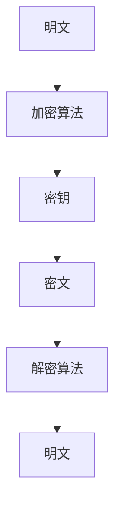
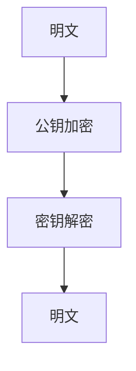
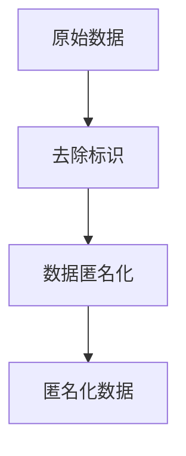
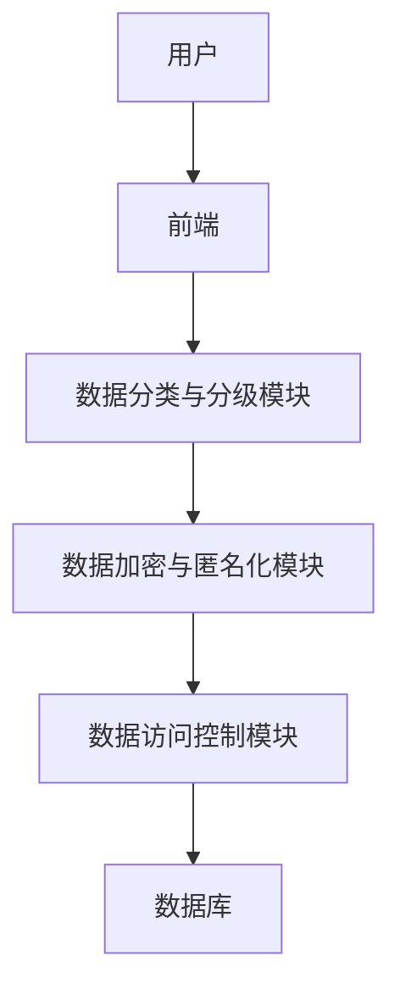
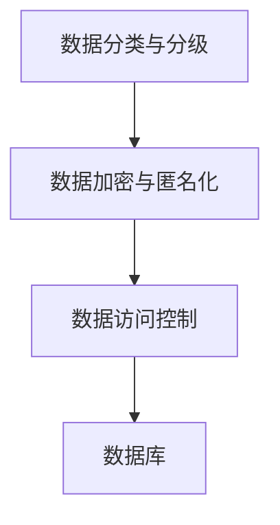
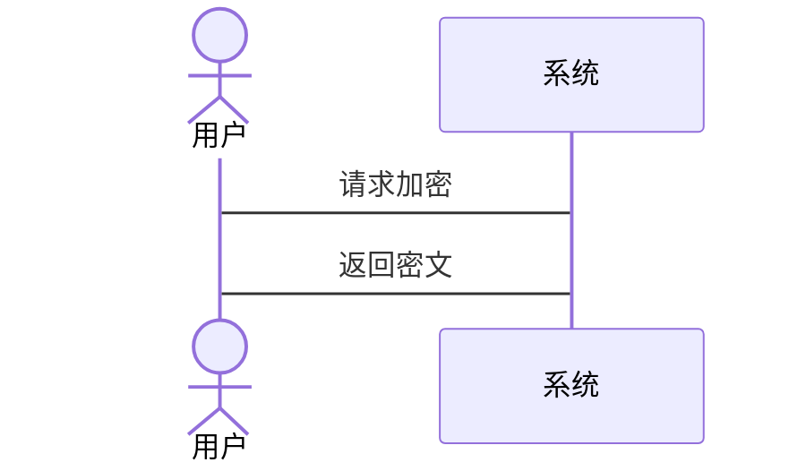
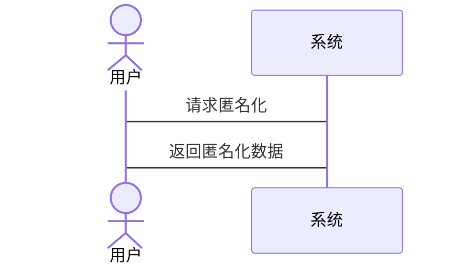

                 


# 隐私保护：确保用户数据安全

## 关键词：隐私保护、数据安全、数据加密、匿名化、系统架构

## 摘要：  
随着数字化时代的快速发展，隐私保护已成为企业和个人面临的重要挑战。本文从隐私保护的核心概念、技术原理、系统架构设计到实际项目实现，全面剖析如何确保用户数据安全。通过深入探讨数据分类分级、加密技术、匿名化处理等关键技术，结合实际案例分析，为读者提供切实可行的隐私保护解决方案。

---

# 第一部分：隐私保护背景与核心概念

## 第1章：隐私保护的背景与问题背景

### 1.1 数据泄露的现状与挑战  
#### 1.1.1 数据泄露的现状分析  
近年来，数据泄露事件频发，据统计，2022年全球数据泄露事件超过1000起，影响超过10亿用户。数据泄露不仅导致经济损失，还可能引发严重的声誉损失和法律纠纷。  

#### 1.1.2 数据泄露对企业的影响  
数据泄露对企业的影响包括：  
1. **经济损失**：企业可能面临巨额罚款、赔偿和修复成本。  
2. **声誉损失**：用户信任度下降，可能导致客户流失。  
3. **法律责任**：根据《数据保护条例》（如GDPR），企业需承担法律责任。  

#### 1.1.3 用户隐私保护的重要性  
用户隐私保护是企业履行社会责任的重要体现，也是用户对企业的基本信任需求。保护用户隐私不仅是法律要求，更是企业持续发展的基石。  

### 1.2 隐私保护的核心问题  
#### 1.2.1 数据隐私的核心概念  
数据隐私是指对个人数据的控制权和使用权的保护，确保数据仅被授权方访问和使用。  

#### 1.2.2 隐私保护的边界与外延  
隐私保护的边界包括：  
1. 数据分类与分级：根据数据敏感程度进行分类管理。  
2. 数据最小化原则：仅收集实现目标所需的最小数据集。  
3. 数据匿名化：通过技术手段去除数据中的个人身份信息。  

#### 1.2.3 隐私保护与数据安全的关系  
隐私保护是数据安全的重要组成部分，数据安全是隐私保护的实现手段。隐私保护关注数据的使用权限，而数据安全关注数据的存储和传输安全。  

## 第2章：隐私保护的核心概念与联系

### 2.1 隐私保护的核心概念  
#### 2.1.1 数据分类与分级  
数据分类是根据数据类型（如个人信息、业务数据）进行分类管理，数据分级是根据数据敏感程度（如低、中、高）进行分级保护。  

#### 2.1.2 数据最小化原则  
数据最小化原则要求企业在收集数据时，仅收集实现目标所需的最小数据集，避免过度收集。  

#### 2.1.3 数据加密与匿名化  
数据加密通过技术手段保护数据 confidentiality，匿名化通过技术手段去除数据中的个人身份信息，确保数据的匿名性。  

### 2.2 核心概念的属性对比  
#### 2.2.1 数据分类与分级的对比表格  

| 比较维度 | 数据分类 | 数据分级 |
|----------|----------|----------|
| 定义     | 数据类型分组 | 数据敏感程度分组 |
| 目的     | 方便数据管理 | 确保数据安全 |
| 示例     | 用户信息、业务数据 | 公开数据、敏感数据、机密数据 |

#### 2.2.2 数据最小化与数据加密的对比分析  
- 数据最小化关注数据的收集范围，数据加密关注数据的存储和传输安全。  
- 数据最小化是预防数据泄露的第一道防线，数据加密是保护数据的核心手段。  

### 2.3 ER实体关系图  
#### 2.3.1 数据分类与分级的ER关系图  

```mermaid
erdiagram
actor 数据分类 {
  分类ID
  分类名称
}
actor 数据分级 {
  分级ID
  分级名称
}
数据分类 --> 数据分级 : 关联关系
```

#### 2.3.2 数据加密与匿名化的ER关系图  

```mermaid
erdiagram
actor 数据加密 {
  加密ID
  加密算法
}
actor 数据匿名化 {
  匿名化ID
  匿名化方法
}
数据加密 --> 数据匿名化 : 关联关系
```

---

# 第二部分：隐私保护技术与算法原理

## 第3章：数据加密技术原理

### 3.1 数据加密的核心原理  
#### 3.1.1 对称加密算法  
对称加密算法是一种使用相同密钥进行加密和解密的算法，常见的算法包括AES、DES等。  

#### 3.1.2 非对称加密算法  
非对称加密算法使用公钥和私钥进行加密和解密，常见的算法包括RSA、椭圆曲线加密等。  

#### 3.1.3 加密算法的数学模型  
对称加密算法的数学模型可以用以下公式表示：  
$$ C = E(K, P) $$  
$$ P = D(K, C) $$  
其中，\( C \) 是密文，\( P \) 是明文，\( K \) 是密钥，\( E \) 是加密函数，\( D \) 是解密函数。  

### 3.2 加密算法的实现流程  
#### 3.2.1 对称加密流程图  



#### 3.2.2 非对称加密流程图  



#### 3.2.3 加密算法的Python代码实现  
以下是AES对称加密的Python代码示例：  

```python
from cryptography.fernet import Fernet

# 生成密钥
key = Fernet.generate_key()
cipher = Fernet(key)

# 加密
plaintext = "Hello, World!"
cipher_text = cipher.encrypt(plaintext.encode())
print("加密后的文本:", cipher_text)

# 解密
decrypted_text = cipher.decrypt(cipher_text).decode()
print("解密后的文本:", decrypted_text)
```

### 3.3 数据加密技术的优缺点对比  
以下是对称加密和非对称加密的优缺点对比：  

| 比较维度 | 对称加密 | 非对称加密 |
|----------|----------|------------|
| 加密速度 | 快 | 慢 |
| 密钥管理 | 简单 | 复杂 |
| 适用场景 | 适合大规模数据加密 | 适合数字签名、公钥交换 |

---

## 第4章：数据匿名化技术

### 4.1 数据匿名化的原理  
数据匿名化是通过技术手段去除数据中的个人身份信息，确保数据无法被关联到具体个人。  

### 4.2 数据匿名化的实现流程  
#### 4.2.1 数据匿名化流程图  



#### 4.2.2 数据匿名化的Python代码实现  
以下是使用Python实现的简单数据匿名化代码示例：  

```python
import pandas as pd

# 读取数据
data = pd.DataFrame({
    '用户ID': [1, 2, 3, 4],
    '姓名': ['Alice', 'Bob', 'Charlie', 'David'],
    '年龄': [25, 30, 22, 28]
})

# 数据匿名化处理
data_anon = data.drop(columns=['用户ID', '姓名'])

print("匿名化数据:")
print(data_anon)
```

### 4.3 数据匿名化的应用场景  
数据匿名化广泛应用于医疗、金融等领域，例如：  
- 医疗领域：保护患者隐私，支持医学研究。  
- 金融领域：保护客户数据，防止金融欺诈。  

---

# 第三部分：隐私保护系统架构与设计

## 第5章：隐私保护系统的架构设计

### 5.1 系统功能设计  
#### 5.1.1 数据分类与分级功能  
数据分类与分级功能用于对数据进行分类和分级管理，确保数据的安全性和合规性。  

#### 5.1.2 数据加密与匿名化功能  
数据加密与匿名化功能用于对敏感数据进行加密和匿名化处理，确保数据的安全性和隐私性。  

#### 5.1.3 数据访问控制功能  
数据访问控制功能用于对数据访问权限进行管理，确保只有授权用户可以访问特定数据。  

### 5.2 系统架构设计  
#### 5.2.1 系统架构图  



#### 5.2.2 系统功能模块图  



### 5.3 系统接口设计  
#### 5.3.1 数据加密接口设计  


#### 5.3.2 数据匿名化接口设计  


---

## 第6章：隐私保护系统的实现

### 6.1 环境安装  
在实现隐私保护系统之前，需要安装以下工具和库：  
- Python 3.8+  
- Pandas、Cryptography库  

### 6.2 系统核心实现源代码  
以下是隐私保护系统的Python实现代码示例：  

```python
# 数据分类与分级模块
def classify_data(data):
    # 示例：根据数据敏感程度进行分类
    sensitive_data = data[data['分类'] == '高敏感']
    return sensitive_data

# 数据加密模块
def encrypt_data(data, key):
    cipher = Fernet(key)
    encrypted_data = cipher.encrypt(data.encode())
    return encrypted_data

# 数据匿名化模块
def anonymize_data(data):
    anonymous_data = data.drop(columns=['用户ID', '姓名'])
    return anonymous_data
```

### 6.3 实际案例分析  
以下是一个实际案例分析：  

#### 案例背景  
某企业需要保护其用户的个人信息，包括姓名、地址、电话等。  

#### 实施方案  
1. 数据分类与分级：将数据分为高敏感（如姓名、地址）和低敏感（如电话）。  
2. 数据加密：使用AES算法对高敏感数据进行加密。  
3. 数据匿名化：去除低敏感数据中的用户ID和姓名。  

#### 实施效果  
通过实施隐私保护方案，企业成功降低了数据泄露风险，确保了用户隐私安全。  

---

## 第7章：隐私保护的最佳实践与小结

### 7.1 最佳实践  
1. 数据分类与分级：根据数据敏感程度进行分类管理。  
2. 数据最小化原则：仅收集实现目标所需的最小数据集。  
3. 数据加密与匿名化：使用加密和匿名化技术保护数据。  
4. 访问控制：确保数据仅被授权方访问。  

### 7.2 小结  
隐私保护是企业和个人共同面临的挑战，通过合理的技术手段和管理措施，可以有效保护用户数据安全。  

### 7.3 注意事项  
1. 数据分类与分级需结合企业实际情况制定。  
2. 数据加密算法的选择需根据数据敏感程度和应用场景决定。  
3. 数据匿名化需确保数据无法被还原关联到具体个人。  

### 7.4 拓展阅读  
- 《数据保护条例》（GDPR）解读  
- 隐私保护技术的最新研究与应用  

---

通过本文的详细讲解，读者可以全面理解隐私保护的核心概念、技术原理和系统实现方法，为实际应用提供有力支持。

