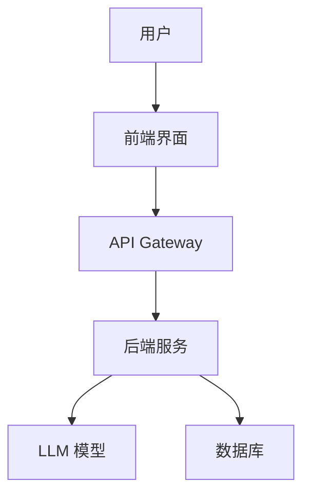

                 


# AI Agent 在教育领域的应用：LLM 驱动的智能导师

---

## 关键词：
AI Agent, 大语言模型, 智能导师, 教育技术, 个性化学习, 自适应学习

---

## 摘要：
随着人工智能技术的快速发展，AI Agent 和大语言模型（LLM）在教育领域的应用日益广泛。本文探讨了如何利用 LLM 驱动的 AI Agent 构建智能导师系统，分析其技术原理、系统架构，并通过项目实战展示其在教育中的实际应用。文章从背景介绍、核心概念、算法原理、系统设计、项目实现到最佳实践，全面解析 LLM 驱动的智能导师系统，为教育技术的创新提供了新的视角和解决方案。

---

# 第1章: AI Agent 和 LLM 的基本概念

## 1.1 AI Agent 的基本概念

### 1.1.1 AI Agent 的定义与特点
AI Agent 是一种智能体，能够感知环境、执行任务并做出决策。在教育领域，AI Agent 可以作为学习助手，帮助学生解决问题、提供反馈和推荐资源。

### 1.1.2 AI Agent 的分类与应用场景
AI Agent 可分为简单反应式 Agent 和基于模型的规划 Agent。在教育中，简单反应式 Agent 用于实时回答问题，而基于模型的规划 Agent 则用于制定学习计划。

### 1.1.3 教育领域中的 AI Agent 特性
教育领域的 AI Agent 需要具备自然语言处理能力、个性化推荐功能和实时互动能力，以满足学生的多样化需求。

## 1.2 大语言模型（LLM）的基本概念

### 1.2.1 LLM 的定义与特点
大语言模型是基于深度学习的自然语言处理模型，具有强大的文本生成和理解能力。LLM 的特点包括高准确率、多任务处理和可扩展性。

### 1.2.2 LLM 的技术优势与局限性
优势：强大的自然语言处理能力、支持多语言、可扩展性。局限性：计算资源消耗大、需要大量数据训练、存在生成错误信息的风险。

### 1.2.3 LLM 在教育中的潜力
LLM 可以用于个性化学习推荐、智能对话和自适应学习路径规划，显著提升学习效率和体验。

## 1.3 本章小结
本章介绍了 AI Agent 和 LLM 的基本概念，分析了它们在教育中的潜力和应用场景，为后续章节奠定了基础。

---

# 第2章: 教育领域的 AI Agent 应用场景

## 2.1 教育领域的现状与挑战

### 2.1.1 当前教育中的主要问题
传统教育模式存在个性化不足、师生互动有限、学习资源分散等问题，限制了学习效果的提升。

### 2.1.2 AI Agent 在教育中的角色定位
AI Agent 可以作为学习助手，帮助学生解决问题、提供反馈，并优化学习路径。

### 2.1.3 LLM 驱动的智能导师的优势
LLM 的自然语言处理能力使其能够理解学生的需求，提供个性化的学习建议和资源推荐。

## 2.2 AI Agent 在教育中的具体应用场景

### 2.2.1 个性化学习助手
智能导师可以根据学生的学习情况，推荐适合的学习材料和练习题，帮助学生快速掌握知识点。

### 2.2.2 智能教学辅助系统
教师可以利用 AI Agent 进行课程设计、作业批改和学生评估，减轻工作负担并提高效率。

### 2.2.3 自适应学习路径规划
AI Agent 可以根据学生的学习进度和兴趣，动态调整学习计划，优化学习路径。

## 2.3 本章小结
本章探讨了 AI Agent 在教育中的应用场景，展示了其在个性化学习、教学辅助和自适应学习路径规划中的潜力。

---

# 第3章: LLM 驱动的 AI Agent 技术原理

## 3.1 LLM 的核心算法

### 3.1.1 变压器（Transformer）模型
Transformer 是一种基于自注意力机制的深度学习模型，由编码器和解码器组成，广泛应用于自然语言处理任务。

### 3.1.2 注意力机制（Attention）
注意力机制通过计算输入序列中每个位置的重要性，帮助模型聚焦于关键信息，提升处理效率。

### 3.1.3 解码器（Decoder）结构
解码器负责生成输出序列，通过自注意力机制和前一个时间步的输出进行预测。

## 3.2 AI Agent 的决策机制

### 3.2.1 状态空间与动作空间
状态空间表示环境中的所有可能状态，动作空间表示 Agent 可以执行的所有动作。

### 3.2.2 基于 LLM 的决策模型
AI Agent 使用 LLM 进行上下文理解和意图识别，生成最优的决策动作。

### 3.2.3 多轮对话中的上下文处理
通过维护对话历史，AI Agent 能够在多轮对话中保持上下文一致性和连贯性。

## 3.3 本章小结
本章详细讲解了 LLM 的核心算法和 AI Agent 的决策机制，分析了其在教育中的技术优势。

---

# 第4章: 系统架构与功能设计

## 4.1 系统架构设计

### 4.1.1 系统整体架构图


### 4.1.2 前端与后端交互设计
前端负责接收用户输入并展示结果，后端处理业务逻辑并调用 LLM 模型进行推理。

### 4.1.3 数据存储与管理
系统需要存储用户信息、学习记录和模型参数，确保数据安全和可扩展性。

## 4.2 功能模块设计

### 4.2.1 用户身份认证
通过 OAuth 或 JWT 实现用户登录和权限管理，确保系统安全。

### 4.2.2 个性化学习推荐
基于学生的学习数据，利用协同过滤或深度学习算法推荐学习资源。

### 4.2.3 智能对话系统
实现多轮对话功能，支持自然语言理解和生成，提供实时反馈和建议。

## 4.3 本章小结
本章通过系统架构图和功能模块设计，展示了智能导师系统的整体结构和关键组件。

---

# 第5章: 项目实战与实现

## 5.1 环境搭建与工具安装

### 5.1.1 开发环境配置
建议使用 Python 3.8+、TensorFlow 2.0+ 和 Hugging Face Transformers 库。

### 5.1.2 LLM 模型加载
使用预训练的 GPT-3 模型，通过 Hugging Face 的 AutoModelForCausalLM 加载模型。

### 5.1.3 依赖库安装
安装必要的库，如 `transformers`, `torch`, `flask`。

## 5.2 核心代码实现

### 5.2.1 对话系统实现
```python
from transformers import AutoTokenizer, AutoModelForCausalLM

class ChatAgent:
    def __init__(self, model_name):
        self.tokenizer = AutoTokenizer.from_pretrained(model_name)
        self.model = AutoModelForCausalLM.from_pretrained(model_name)
        
    def generate_response(self, input_text):
        inputs = self.tokenizer(input_text, return_tensors="pt")
        outputs = self.model.generate(inputs.input_ids, max_length=100)
        response = self.tokenizer.decode(outputs[0], skip_special_tokens=True)
        return response
```

### 5.2.2 个性化推荐算法
使用协同过滤算法，基于用户行为数据推荐学习资源。

### 5.2.3 系统交互逻辑
实现用户与智能导师的交互流程，包括输入处理、模型推理和结果展示。

## 5.3 实际案例分析

### 5.3.1 案例背景介绍
假设一名学生在学习数学，系统根据其学习情况推荐个性化练习题和学习资料。

### 5.3.2 系统实现细节
展示如何通过代码实现对话系统和推荐功能，确保系统的高效运行。

### 5.3.3 性能优化与测试
通过压力测试和性能调优，提升系统的响应速度和稳定性。

## 5.4 本章小结
本章通过项目实战，展示了如何从零开始构建一个智能导师系统，详细讲解了实现过程中的关键步骤和注意事项。

---

# 第6章: 最佳实践与总结

## 6.1 最佳实践 tips
- 使用预训练的 LLM 模型，减少从头训练的时间和资源消耗。
- 定期更新模型参数，确保系统的准确性和相关性。
- 重视用户隐私保护，确保数据安全。

## 6.2 小结
本文详细探讨了 AI Agent 和 LLM 在教育中的应用，分析了其技术原理和系统架构，并通过项目实战展示了其实现过程。AI Agent 驱动的智能导师系统能够显著提升学习效率和体验，为教育技术的发展提供了新的方向。

## 6.3 注意事项
在实际应用中，需要注意模型的泛化能力、数据质量和系统的可扩展性。

## 6.4 拓展阅读
推荐阅读《大语言模型在教育中的应用》和《AI Agent 的设计与实现》，深入学习相关知识。

---

# 结语
随着 AI 技术的不断进步，AI Agent 和 LLM 在教育中的应用前景广阔。通过本文的分析，读者可以深入了解如何利用这些技术构建智能导师系统，为未来的教育创新提供有力支持。

