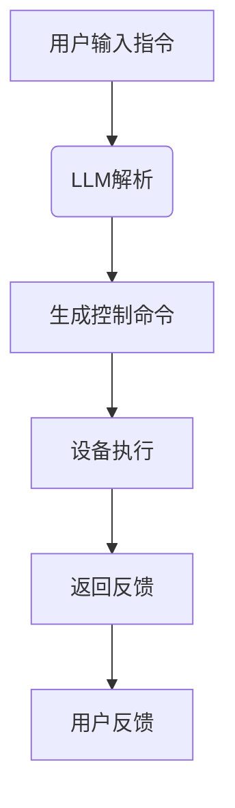
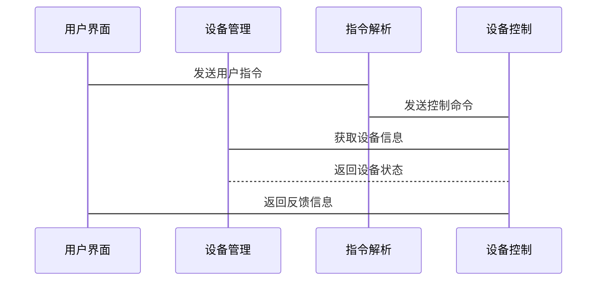

                 


# AI Agent 在智能家居中的应用：LLM 控制物联网设备

---

## 关键词：AI Agent, LLM, 智能家居, 物联网设备, 系统架构, 项目实战

---

## 摘要：

随着人工智能和物联网技术的快速发展，智能家居系统正在变得更加智能化和自动化。本文探讨了AI Agent在智能家居中的应用，特别是如何利用大语言模型（LLM）来控制物联网设备。通过分析AI Agent和LLM的核心原理，以及它们与物联网设备的结合方式，本文详细讲解了如何设计和实现一个基于LLM的智能家居控制系统。文章还提供了系统架构设计、项目实战和实际案例分析，帮助读者更好地理解和应用这些技术。

---

## 第1章: AI Agent与智能家居的背景介绍

### 1.1 AI Agent的基本概念

AI Agent（人工智能代理）是一种能够感知环境、自主决策并执行任务的智能实体。它可以分为简单反射型、基于模型的反应型、目标驱动型和效用驱动型四种类型。AI Agent的核心特征包括自主性、反应性、目标导向和学习能力。AI Agent在智能家居中的应用主要体现在智能音箱、智能家电和智能安防系统等领域。

### 1.2 智能家居的基本概念

智能家居是指通过物联网技术将家中的设备（如灯光、空调、电视等）连接起来，实现智能化控制和管理的系统。智能家居的主要组成部分包括智能设备、传感器、通信网络和控制中心。智能家居的发展经历了从简单遥控到全屋智能控制的历程。

### 1.3 LLM与物联网设备的结合

LLM（大语言模型）是一种基于深度学习的自然语言处理模型，具有强大的理解和生成文本的能力。物联网设备则是智能家居的核心组成部分，包括智能灯泡、智能门锁等。LLM与物联网设备的结合使得智能家居能够通过自然语言指令进行控制，极大地提升了用户体验。

### 1.4 本章小结

本章介绍了AI Agent和智能家居的基本概念，以及LLM与物联网设备的结合方式。AI Agent作为智能家居的核心控制模块，结合LLM的强大语言处理能力，为智能家居的智能化控制提供了新的可能性。

---

## 第2章: AI Agent的核心原理

### 2.1 AI Agent的工作原理

AI Agent的工作流程包括状态感知、目标设定和行动决策三个主要步骤。状态感知通过传感器获取环境信息，目标设定基于用户需求或预设目标，行动决策则通过算法选择最优动作。

### 2.2 LLM的基本原理

LLM通过多层神经网络结构对大量文本数据进行训练，形成对语言的理解和生成能力。其核心算法包括编码器-解码器结构和注意力机制。

### 2.3 AI Agent与LLM的结合原理

在智能家居中，LLM作为AI Agent的核心模块，负责解析用户的自然语言指令并生成相应的控制命令。AI Agent通过物联网协议将指令传递给目标设备，实现智能家居的智能化控制。

---

## 第3章: 物联网设备的基础知识

### 3.1 物联网设备的分类

物联网设备主要包括智能传感器、执行器和网关设备。智能传感器用于采集环境数据，执行器负责执行控制命令，网关设备用于数据的传输和协议转换。

### 3.2 物联网设备的通信协议

常见的物联网通信协议包括Wi-Fi、蓝牙、ZigBee和Z-Wave等。这些协议在智能家居中的选择取决于设备类型和网络环境。

### 3.3 物联网设备的数据处理方式

物联网设备的数据处理包括数据采集、数据传输和数据存储三个阶段。通过云计算和边缘计算技术，可以实现数据的高效处理和分析。

---

## 第4章: LLM控制物联网设备的实现

### 4.1 LLM控制物联网设备的设计原则

设计基于LLM的智能家居控制系统时，需要考虑设备兼容性、指令解析准确性和系统可扩展性。设备兼容性确保不同品牌和类型的设备能够协同工作，指令解析准确性保证用户指令的正确理解和执行，系统可扩展性支持未来新设备的接入。

### 4.2 LLM与物联网设备的交互流程

LLM与物联网设备的交互流程包括用户指令输入、指令解析、设备控制和反馈返回四个步骤。用户通过自然语言指令输入需求，LLM解析指令并生成控制命令，物联网设备执行命令后将反馈信息返回给用户。

### 4.3 基于LLM的智能家居控制算法

基于LLM的智能家居控制算法如下：

1. 用户输入自然语言指令。
2. LLM解析指令，生成对应的设备控制命令。
3. 通过物联网协议将命令发送给目标设备。
4. 设备执行命令并返回反馈信息。
5. LLM将反馈信息转化为用户可读的格式，提供给用户。

### 4.4 算法流程图



---

## 第5章: 智能家居系统的架构设计

### 5.1 系统功能设计

智能家居系统的功能模块包括用户界面、设备管理、指令解析、设备控制和反馈处理。用户界面用于用户与系统交互，设备管理负责设备的注册和配置，指令解析模块负责解析用户的自然语言指令，设备控制模块负责执行控制命令，反馈处理模块负责处理设备的反馈信息。

### 5.2 系统架构设计

```mermaid
classDiagram
    class 用户界面 {
        显示设备状态
        接收用户指令
    }
    class 设备管理 {
        设备注册
        设备配置
    }
    class 指令解析 {
        解析用户指令
        生成控制命令
    }
    class 设备控制 {
        发送控制命令
        处理设备反馈
    }
    用户界面 <---> 设备管理
    用户界面 <---> 指令解析
    指令解析 --> 设备控制
    设备控制 <---> 设备管理
```

### 5.3 接口设计与交互流程

智能家居系统的接口设计包括用户界面接口、设备管理接口和设备控制接口。交互流程如下：

1. 用户通过用户界面输入指令。
2. 用户界面将指令传递给指令解析模块。
3. 指令解析模块生成控制命令并传递给设备控制模块。
4. 设备控制模块通过物联网协议将命令发送给目标设备。
5. 设备执行命令并将反馈信息返回给设备控制模块。
6. 设备控制模块将反馈信息传递给用户界面，供用户查看。

### 5.4 交互流程图



---

## 第6章: 项目实战——基于LLM的智能家居控制系统

### 6.1 环境安装与配置

在开始开发之前，需要安装必要的开发环境和工具。推荐使用Python编程语言，并安装以下库：

- `pyyaml`：用于配置文件的读取和写入。
- `python-dotenv`：用于管理环境变量。
- `websockets`：用于 WebSocket 通信。
- `pyserial`：用于串口通信。

### 6.2 系统核心实现

以下是基于LLM的智能家居控制系统的核心实现代码：

```python
import yaml
from websocket import WebSocketClient
from serial import Serial

class DeviceManager:
    def __init__(self):
        self.devices = {}

    def register_device(self, device_id, device_info):
        self.devices[device_id] = device_info

    def get_device_info(self, device_id):
        return self.devices.get(device_id, None)

class LLMInterface:
    def __init__(self, model_path):
        self.model = self.load_model(model_path)

    def load_model(self, model_path):
        # 加载LLM模型
        pass

    def parse_command(self, command):
        # 解析用户指令并生成控制命令
        pass

class DeviceController:
    def __init__(self, device_manager, llm_interface):
        self.device_manager = device_manager
        self.llm_interface = llm_interface

    def control_device(self, device_id, command):
        device_info = self.device_manager.get_device_info(device_id)
        if not device_info:
            return "设备不存在"
        # 执行控制命令
        pass

    def get_feedback(self, device_id):
        # 获取设备反馈信息
        pass

# 示例用法
if __name__ == "__main__":
    device_manager = DeviceManager()
    device_manager.register_device("light_1", {"type": "light", "status": "off"})
    llm_interface = LLMInterface("llm_model.pth")
    controller = DeviceController(device_manager, llm_interface)
    controller.control_device("light_1", "打开")
```

### 6.3 代码应用解读与分析

上述代码实现了设备管理、LLM接口和设备控制三个核心模块。设备管理模块负责设备的注册和信息查询，LLM接口模块负责用户指令的解析和生成控制命令，设备控制模块负责执行控制命令并获取反馈信息。通过这些模块的协同工作，实现了基于LLM的智能家居控制系统。

### 6.4 实际案例分析

以智能灯泡为例，用户可以通过输入“打开客厅的灯”来控制灯泡。系统将解析用户的指令，生成相应的控制命令，并通过物联网协议将命令发送给智能灯泡。灯泡接收到命令后执行“打开”操作，并将反馈信息返回给系统，用户可以通过用户界面查看灯泡的状态。

### 6.5 项目小结

本章通过实际案例展示了如何基于LLM实现智能家居控制系统。通过设备管理、指令解析和设备控制三个核心模块的协同工作，系统能够理解和执行用户的自然语言指令，实现智能家居的智能化控制。

---

## 第7章: 总结与展望

### 7.1 总结

本文详细探讨了AI Agent在智能家居中的应用，特别是如何利用LLM控制物联网设备。通过分析AI Agent和LLM的核心原理，以及它们与物联网设备的结合方式，本文设计了一个基于LLM的智能家居控制系统，并提供了系统架构设计和项目实战的详细代码示例。

### 7.2 展望

随着AI技术的不断发展，智能家居系统将更加智能化和个性化。未来的智能家居系统将具备更强的自主学习能力和更丰富的功能，能够更好地满足用户的需求。

### 7.3 最佳实践 Tips

- 在设计智能家居系统时，需要充分考虑设备的兼容性和系统的可扩展性。
- 使用高效的物联网通信协议和可靠的云计算平台，确保系统的稳定性和安全性。
- 定期更新系统的软件和固件，以保持系统的安全性和性能。

### 7.4 注意事项

- 在实际应用中，需要确保系统的安全性，防止未经授权的访问和攻击。
- 在选择物联网设备时，需要考虑设备的兼容性和稳定性，确保系统的正常运行。
- 在设计用户界面时，需要注重用户体验，确保用户能够方便地与系统交互。

### 7.5 拓展阅读

- 《Deep Learning for Natural Language Processing》
- 《IoT in Action: Smart Homes and Beyond》
- 《Practical AI for IoT Developers》

---

通过本文的学习，读者可以深入了解AI Agent在智能家居中的应用，掌握基于LLM的智能家居控制系统的实现方法，并能够在实际项目中应用这些技术。

