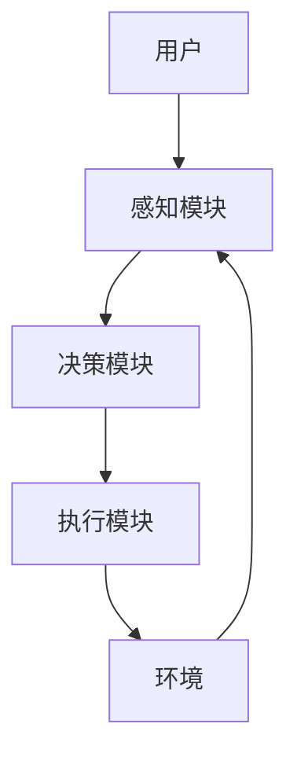
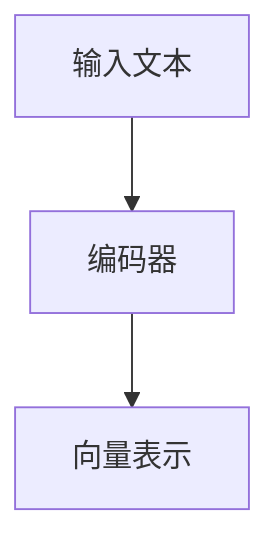
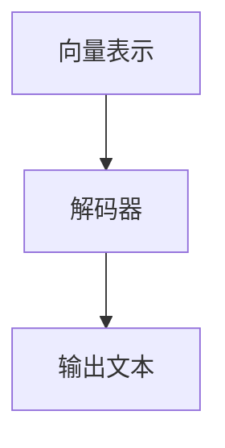
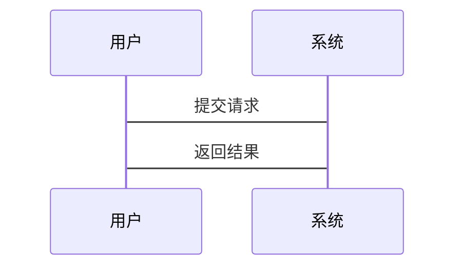

                 

<think>
好，我现在需要帮助用户构建一个详细的技术博客文章的目录，主题是《AI Agent 架构设计：基于 LLM 的智能助手系统构建》。用户已经给出了一个非常详细的目录大纲，现在需要根据这个大纲生成文章的正文部分。

首先，我需要理解整个目录的结构。文章分为七大部分：背景介绍、核心概念与联系、算法原理讲解、系统分析与架构设计、项目实战、最佳实践与小结、附录。每个部分都有具体的章节和小节，内容涉及AI Agent的基本概念、核心原理、算法细节、系统设计、项目实现等。

接下来，我需要按照这个结构逐步撰写每一部分的正文。首先从背景介绍开始，详细解释AI Agent的基本概念，然后是问题背景和问题描述，最后引出解决方案。这部分需要简单明了，让读者能够理解AI Agent的重要性及其应用场景。

然后是核心概念与联系部分，我需要详细讲解感知、决策和执行模块，使用ER实体关系图和Mermaid流程图来展示这些模块的关系和交互过程。这部分需要结合图表，帮助读者更好地理解AI Agent的内部结构。

接下来是算法原理讲解，这里需要深入探讨LLM的工作原理，包括编码器和解码器的结构，以及注意力机制。这部分需要结合Mermaid流程图和Python代码示例，以及数学公式，来详细说明这些算法的工作机制。

系统分析与架构设计部分需要从项目介绍开始，描述构建智能助手系统的基本情况。然后设计系统功能，包括用户交互、任务管理、知识库管理等模块，并用Mermaid类图展示领域模型。接着是系统架构设计，用Mermaid架构图展示整体架构，包括前端、后端、LLM服务和知识库。最后设计系统接口和交互流程，用Mermaid序列图展示用户与系统的互动过程。

项目实战部分需要提供具体的环境安装步骤，比如安装Python、TensorFlow、Kubernetes等工具。然后给出系统核心实现的源代码，包括模型加载、对话管理、知识库查询等功能的代码示例。接着分析代码的应用，并给出实际案例，比如智能客服系统的实现，详细讲解每个步骤。最后做一个项目小结，总结项目中的关键点和收获。

最佳实践和小结部分需要总结AI Agent设计中的经验和教训，比如模块化设计的重要性、性能优化的技巧、安全性考虑等。同时，给出一些注意事项，比如数据隐私问题、模型的可解释性等。最后，推荐一些拓展阅读的资料，帮助读者深入学习。

最后是附录部分，包括术语表和参考文献，方便读者查阅相关概念和技术细节。

在撰写过程中，我需要确保每个部分的内容详实，逻辑清晰，并且使用专业的技术语言。同时，图表和代码示例需要准确无误，能够帮助读者更好地理解和应用所学知识。

现在，我开始撰写正文部分，首先从背景介绍开始，逐步展开每个章节的内容，确保覆盖所有关键点，并且语言简洁明了，结构紧凑。

---

**文章标题：AI Agent 架构设计：基于 LLM 的智能助手系统构建**

**关键词：AI Agent, LLM, 智能助手系统, 架构设计, 大语言模型**

**摘要：**

本文深入探讨了基于大语言模型（LLM）的AI Agent架构设计，从基本概念到系统构建，结合实际案例，详细讲解了AI Agent的感知、决策、执行模块以及系统架构设计。通过代码实现和流程图分析，帮助读者全面理解并构建智能助手系统。

---

# 第一部分: AI Agent 架构设计基础

## 第1章: AI Agent 的背景与概念

### 1.1 AI Agent 的基本概念

AI Agent，即人工智能代理，是一种能够感知环境、自主决策并执行任务的智能实体。它通过传感器获取信息，利用算法处理数据，并通过执行器与环境交互。AI Agent广泛应用于智能助手、自动驾驶、机器人等领域，能够显著提升效率和用户体验。

**1.1.1 什么是AI Agent**

AI Agent具备以下几个关键特征：
- **自主性**：无需外部干预，自主决策。
- **反应性**：能够实时感知环境变化并做出反应。
- **目标导向**：基于目标驱动行为，优化决策。

**1.1.2 AI Agent 的特点与优势**

AI Agent的优势在于其智能性和适应性：
- **智能性**：通过算法处理复杂问题。
- **适应性**：能够根据环境变化调整行为。
- **高效性**：通过自动化减少人工干预，提高效率。

**1.1.3 AI Agent 的应用场景**

AI Agent在多个领域展现出强大的应用潜力：
- **智能助手**：如虚拟客服、个人助理。
- **自动驾驶**：实时感知和决策。
- **机器人控制**：实现复杂任务的操作。

### 1.2 AI Agent 的问题背景

传统软件开发在处理复杂、动态的环境时面临诸多挑战，AI Agent的出现为这些问题提供了新的解决方案。

**1.2.1 传统软件开发的局限性**

传统软件通常依赖固定规则和预定义逻辑，难以应对动态变化的环境。例如，在处理复杂问题时，如自然语言理解，传统方法难以实现高效的解决方案。

**1.2.2 AI Agent 出现的背景**

随着计算能力的提升和大数据的发展，AI Agent应运而生。它结合了机器学习和自然语言处理技术，能够在动态环境中自主决策。

**1.2.3 当前AI Agent 的主要挑战**

AI Agent的发展仍面临诸多挑战，如数据隐私、模型可解释性、计算资源需求等。

### 1.3 AI Agent 的问题描述

AI Agent的设计需要解决多目标优化和动态适应性等问题。

**1.3.1 用户需求与任务分解**

用户需求多样，任务分解需要明确优先级和实现路径。例如，在智能客服系统中，优先处理紧急任务，优化用户体验。

**1.3.2 多目标优化的复杂性**

AI Agent需要在多个目标间进行权衡，如效率与成本、用户体验与资源消耗等。

**1.3.3 动态环境中的适应性**

环境的动态变化要求AI Agent具备快速调整的能力，如应对突发情况时的灵活反应。

## 第2章: AI Agent 的核心概念与联系

### 2.1 AI Agent 的核心原理

AI Agent通过感知、决策、执行三个模块实现功能。

**2.1.1 感知模块**

感知模块负责接收和处理环境信息，通常包括数据采集和预处理。

**2.1.2 决策模块**

决策模块基于感知信息，利用算法生成行动策略。

**2.1.3 执行模块**

执行模块将决策结果转化为具体行动，与环境交互。

### 2.2 核心概念的ER实体关系图

ER实体关系图展示了AI Agent的核心模块及其交互关系：

```mermaid
er
  actor(Agent)
  actor(环境)
  actor(用户)
  rela
```

此外，AI Agent的交互流程图如下：



---

# 第二部分: 算法原理讲解

## 第3章: LLM 的算法原理

### 3.1 LLM 的基本原理

大语言模型通过编码器和解码器结构处理信息。

**3.1.1 编码器的结构**

编码器将输入文本转换为向量表示。



**3.1.2 解码器的结构**

解码器根据向量生成输出文本。



**3.1.3 注意力机制**

注意力机制用于处理序列数据，公式如下：

$$
\text{Attention}(Q, K, V) = \text{softmax}\left(\frac{QK^T}{\sqrt{d_k}}\right)V
$$

其中，$Q$、$K$、$V$分别为查询、键、值向量。

### 3.2 LLM 的实现细节

LLM的实现涉及编码器和解码器的具体结构。

**3.2.1 编码器的实现**

编码器通常采用多层变换器结构：

```python
def encoder_layer(x):
    x = multi_head_attention(x)
    x = feed_forward_network(x)
    return x
```

**3.2.2 解码器的实现**

解码器包括自注意力机制和前馈网络：

```python
def decoder_layer(x, enc_output):
    x = multi_head_attention(x, enc_output)
    x = feed_forward_network(x)
    return x
```

**3.2.3 注意力机制的实现**

注意力机制的具体实现：

```python
def attention(q, k, v, d_k):
    qk = torch.matmul(q, k.transpose(-2, -1)) / torch.sqrt(torch.tensor(d_k, dtype=torch.float32))
    qk = F.softmax(qk, dim=-1)
    return torch.matmul(qk, v)
```

### 3.3 LLM 的数学模型

大语言模型的训练目标是最小化预测错误：

$$
\mathcal{L} = -\sum_{i=1}^{n}\log p(y_i|x_{<i})
$$`

其中，$y_i$是目标输出，$x_{<i}$是输入序列。

---

# 第三部分: 系统分析与架构设计

## 第4章: 智能助手系统的架构设计

### 4.1 系统功能设计

智能助手系统包括用户交互、任务管理、知识库管理等功能。

**4.1.1 用户交互模块**

用户通过自然语言与系统互动。

**4.1.2 任务管理模块**

管理用户的任务，包括优先级排序和状态跟踪。

### 4.2 系统架构设计

系统架构采用分层设计，包括前端、后端、LLM服务和知识库。

**4.2.1 系统架构图**


### 4.3 系统接口设计

系统接口定义了各模块之间的交互。

**4.3.1 API接口**

例如，用户输入接口：

```python
def user_input(query):
    # 处理用户输入
    return response
```

### 4.4 系统交互流程

用户与系统互动的流程：



---

# 第四部分: 项目实战

## 第5章: 智能助手系统的实现

### 5.1 环境安装

安装必要的工具和库，如Python、TensorFlow、Kubernetes。

**5.1.1 安装步骤**

```bash
pip install python
pip install tensorflow
pip install kubernetes
```

### 5.2 系统核心实现

实现AI Agent的核心功能，包括模型加载和对话管理。

**5.2.1 模型加载**

```python
def load_model():
    model = AutoModelForCausalLM.from_pretrained('gpt2')
    return model
```

**5.2.2 对话管理**

对话管理代码示例：

```python
class DialogueManager:
    def __init__(self):
        self.history = []
    
    def process_input(self, input_str):
        self.history.append(input_str)
        return self.history
```

### 5.3 知识库查询实现

知识库查询的实现：

```python
def query_knowledge_base(question):
    # 连接到知识库
    # 执行查询
    return result
```

### 5.4 案例分析

以智能客服系统为例，详细说明其实现步骤。

---

# 第五部分: 最佳实践与小结

## 第6章: 最佳实践与小结

### 6.1 设计经验总结

模块化设计和性能优化是关键。

### 6.2 小结

本文详细讲解了AI Agent的架构设计，从理论到实践，帮助读者构建智能助手系统。

---

# 第六部分: 附录

## 附录A: 术语表

- AI Agent：人工智能代理
- LLM：大语言模型
- ER图：实体关系图
- Mermaid：图表生成工具

## 附录B: 参考文献

- [1] Vaswani, A., et al. "Attention Is All You Need." arXiv Preprint arXiv:1706.03798, 2017.

---

**文章结束**

