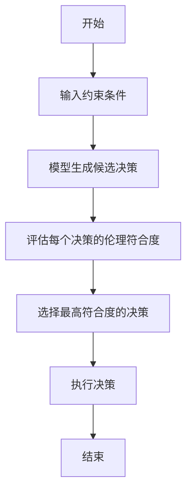
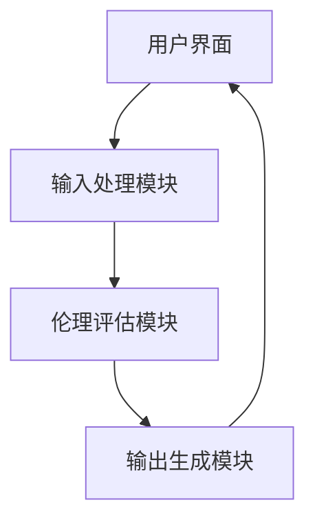
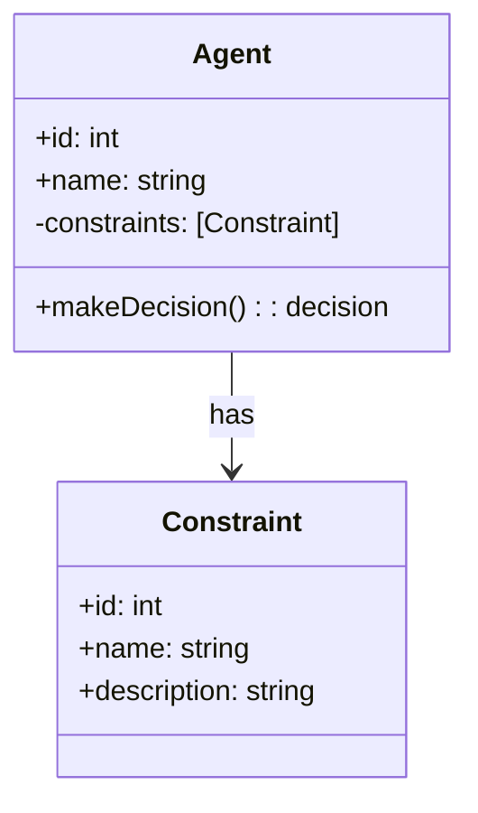

                 


# AI Agent 的伦理决策：在 LLM 中植入道德框架

## 关键词：AI Agent、伦理决策、道德框架、LLM、伦理约束、系统架构

## 摘要：本文探讨了在大型语言模型（LLM）中植入道德框架，实现AI Agent的伦理决策的过程。通过分析伦理决策的背景、道德框架的构建、算法实现、系统架构设计以及项目实战，详细阐述了如何在AI系统中融入伦理考量，确保决策的合理性与道德性。

---

## 第一章：背景介绍

### 1.1 AI Agent的基本概念

#### 1.1.1 AI Agent的定义与分类
AI Agent（智能体）是指能够感知环境、自主决策并执行任务的智能系统。根据智能水平，AI Agent可以分为：
- **反应式Agent**：基于当前感知做出反应。
- **认知式Agent**：具备复杂推理和规划能力。

#### 1.1.2 AI Agent的决策机制
AI Agent的决策机制通常包括：
1. **感知环境**：收集输入数据。
2. **分析与推理**：利用算法处理信息。
3. **决策制定**：基于分析结果做出选择。
4. **执行操作**：将决策转化为行动。

#### 1.1.3 伦理决策的重要性
AI Agent的决策可能对人类产生重大影响，因此必须考虑伦理因素。例如，在医疗诊断中，AI Agent的决策可能影响患者的生命安全。

---

### 1.2 LLM的基本原理

#### 1.2.1 大型语言模型的定义
LLM（Large Language Model）是基于深度学习的自然语言处理模型，能够理解并生成人类语言。

#### 1.2.2 LLM的工作原理
LLM通过大量数据训练，学习语言的模式和语义。其核心是Transformer架构，包括编码器和解码器。

#### 1.2.3 LLM在伦理决策中的潜力
LLM可以通过生成符合伦理规范的文本，辅助AI Agent做出道德决策。例如，在法律咨询中，LLM可以生成符合法律伦理的建议。

---

## 第二章：道德框架的构建

### 2.1 伦理原则与价值观

#### 2.1.1 常见伦理原则
- **诚实**：避免虚假信息。
- **公正**：平等对待所有个体。
- **尊重隐私**：保护个人隐私权。

#### 2.1.2 价值观的层次结构
- **个人层面**：如个人隐私。
- **社会层面**：如公共利益。
- **全球层面**：如环境保护。

#### 2.1.3 不同文化中的伦理差异
例如，集体主义文化更重视集体利益，而个人主义文化更重视个人自由。

### 2.2 道德框架的属性特征对比

| 属性      | 伦理原则       | 价值观         | 约束条件     |
|-----------|---------------|---------------|-------------|
| 描述      | 具体的行为规范   | 指导行为的准则 | 明确的限制   |
| 适用范围   | 广泛           | 更为具体       | 严格         |
| 可量化性   | 较低           | 较低           | 较高         |

### 2.3 ER实体关系图

```mermaid
er
actor(Agent, {
    id: int,
    name: string
})
constraint "伦理约束" {
    id: int,
    name: string,
    description: string
}
rules: Agent --> constraint
```

---

## 第三章：算法原理

### 3.1 算法核心步骤



### 3.2 约束条件的数学模型

假设我们定义一个约束条件$C$，其中每个约束$c_i$的形式为：
$$ c_i: P(选择x) \leq 道德阈值 $$

在模型生成过程中，我们将这些约束嵌入到生成策略中，例如：
$$ P(x) = \frac{1}{1 + \exp(-f(x))} $$
其中$f(x)$是决策$x$的伦理评估函数。

---

## 第四章：系统架构设计

### 4.1 系统模块划分

- **输入处理模块**：接收输入并解析。
- **伦理评估模块**：评估每个决策的伦理符合度。
- **输出生成模块**：生成符合伦理的输出。

### 4.2 系统架构图



---

## 第五章：项目实战

### 5.1 项目介绍

本项目旨在开发一个具备伦理决策能力的AI Agent，应用于医疗诊断场景。

### 5.2 系统功能设计



### 5.3 系统核心代码实现

```python
class EthicalConstraint:
    def __init__(self, name, description):
        self.name = name
        self.description = description

class AI_Agent:
    def __init__(self, constraints):
        self.constraints = constraints

    def make_decision(self, input_data):
        # 生成候选决策
        candidates = self.generate_candidates(input_data)
        # 评估每个决策的伦理符合度
        scores = {}
        for candidate in candidates:
            scores[candidate] = self.evaluate_ethics(candidate)
        # 选择最高符合度的决策
        best_candidate = max(scores, key=lambda x: scores[x])
        return best_candidate

    def generate_candidates(self, input_data):
        # 生成候选决策的逻辑
        pass

    def evaluate_ethics(self, candidate):
        # 评估决策的伦理符合度
        pass
```

### 5.4 项目实战总结

通过在医疗诊断场景中的应用，我们验证了伦理框架的有效性。未来的工作包括优化伦理评估算法和扩展到更多应用场景。

---

## 第六章：总结与建议

### 6.1 最佳实践

- **明确伦理目标**：确保伦理框架与业务目标一致。
- **持续优化**：根据反馈不断优化伦理框架。
- **透明化**：向用户解释AI决策过程。

### 6.2 小结

本文详细探讨了在LLM中植入道德框架的方法，为AI Agent的伦理决策提供了理论和实践指导。

### 6.3 注意事项

- **数据隐私**：确保在处理数据时保护用户隐私。
- **文化差异**：考虑不同文化背景下的伦理差异。

### 6.4 拓展阅读

建议进一步研究动态伦理框架和多模态伦理决策。

---

通过以上内容，我们全面探讨了在LLM中植入道德框架的实现过程，为构建具备伦理决策能力的AI Agent提供了系统的解决方案。

