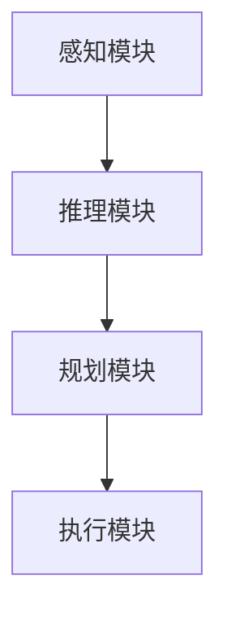

                 


# AI Agent 的决策系统：基于 LLM 的推理与规划

---

## 关键词：AI Agent，LLM，决策系统，推理，规划，人工智能，大语言模型

---

## 摘要：  
AI Agent（人工智能代理）通过与环境交互来实现目标，而基于大语言模型（LLM）的决策系统为AI Agent提供了强大的推理与规划能力。本文深入探讨了AI Agent的决策系统设计，分析了基于LLM的推理与规划算法，提供了系统的架构设计与实现方案，并通过实际案例展示了AI Agent决策系统的应用。

---

## 第一部分：AI Agent与大语言模型基础

### 第1章：AI Agent与大语言模型概述

#### 1.1 AI Agent的基本概念  
- **定义与特点**：AI Agent是一种能够感知环境、自主决策并采取行动的智能实体，具有主动性、目标导向性和社交性。  
- **核心要素**：感知、推理、规划、行动、学习。  
- **应用场景**：智能助手、自动驾驶、机器人、智能推荐系统。  

#### 1.2 大语言模型（LLM）的基本概念  
- **定义与特点**：大语言模型是一种基于深度学习的自然语言处理模型，具有强大的文本生成、理解和推理能力。  
- **LLM与AI Agent的关系**：LLM为AI Agent提供了强大的语言理解和生成能力，使其能够更好地与人类交互并完成复杂任务。  
- **LLM在决策系统中的作用**：通过自然语言处理和生成，辅助AI Agent进行信息获取、推理和决策。  

### 第2章：AI Agent决策系统的背景与需求

#### 2.1 决策系统的基本概念  
- **定义与分类**：决策系统是一种能够根据输入信息做出选择并采取行动的系统，分为基于规则、基于知识和基于学习的决策系统。  
- **基于LLM的决策系统的优缺点**：优势包括强大的自然语言处理能力和灵活性，但存在计算资源消耗大和推理准确性不足的问题。  

---

## 第二部分：基于LLM的决策系统核心算法

### 第3章：基于LLM的推理算法

#### 3.1 基于LLM的推理模型  
- **逻辑推理**：通过LLM生成逻辑规则，进行逻辑推理。  
- **类比推理**：利用LLM的类比推理能力，从已知案例中推导出新的结论。  
- **归纳推理**：基于LLM的归纳能力，从具体实例中总结出一般性规律。  

#### 3.2 基于LLM的推理算法实现  
- **推理流程**：输入问题 → 生成推理规则 → 执行推理 → 输出结果。  
- **优化方法**：结合上下文信息，优化LLM的推理过程。  
- **推理评估**：通过准确率、召回率等指标评估推理结果的质量。  

#### 3.3 推理算法的数学模型  
$$ P(h|e) = \frac{P(e|h)P(h)}{P(e)} $$
其中，$P(h|e)$ 表示在证据 $e$ 下假设 $h$ 的概率。  

### 第4章：基于LLM的规划算法

#### 4.1 基于LLM的规划模型  
- **目标规划**：根据目标生成可行的行动步骤。  
- **路径规划**：通过LLM生成最优路径。  
- **资源规划**：基于LLM进行资源分配和调度。  

#### 4.2 基于LLM的规划算法实现  
- **规划流程**：目标设定 → 生成可行方案 → 优化方案 → 输出规划结果。  
- **优化方法**：结合环境动态变化，动态调整规划方案。  
- **规划评估**：通过路径长度、资源利用率等指标评估规划质量。  

---

## 第三部分：系统架构设计

### 第5章：系统架构与交互流程

#### 5.1 系统功能设计  
- **领域模型**：定义系统的功能模块，包括感知、推理、规划和执行模块。  
- **系统架构**：展示各模块之间的交互关系。  

#### 5.2 系统架构图  


#### 5.3 系统交互流程  
- **用户输入**：用户通过自然语言输入需求。  
- **LLM处理**：LLM解析输入并生成响应。  
- **决策执行**：系统根据推理结果执行决策。  

---

## 第四部分：项目实战

### 第6章：基于LLM的决策系统实现

#### 6.1 环境配置  
- **工具安装**：安装Python、LLM框架（如Hugging Face）和相关库。  

#### 6.2 核心代码实现  
```python
def llm_reasoning(query):
    # 调用LLM进行推理
    response = llm_model(query)
    return response
```

#### 6.3 实际案例分析  
- **案例背景**：用户需要规划一条从A到B的最优路径。  
- **实现步骤**：调用LLM生成多个候选路径，并选择最优路径。  

#### 6.4 代码解读与分析  
- **代码功能**：通过LLM生成推理结果，并根据结果进行决策。  
- **优化建议**：结合实时数据优化路径规划。  

---

## 第五部分：总结与展望

### 第7章：总结与未来发展方向

#### 7.1 总结  
- **核心内容回顾**：AI Agent结合LLM的推理与规划能力，实现了智能决策。  
- **系统设计要点**：系统架构设计、算法优化、交互流程优化。  

#### 7.2 未来展望  
- **技术优化**：进一步提升LLM的推理精度和规划效率。  
- **应用拓展**：探索更多应用场景，如医疗、教育和金融领域。  

---

## 关键词总结：  
AI Agent，LLM，决策系统，推理，规划，人工智能，大语言模型  

---

通过以上思考过程，我们可以清晰地构建出一个基于LLM的AI Agent决策系统，并通过实际案例验证其可行性和有效性。

