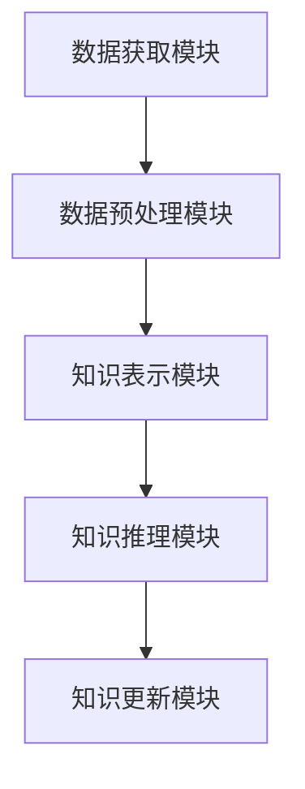

                 


```markdown
# AI Agent 的动态知识更新：保持 LLM 知识的实时性

> 关键词：AI Agent, 动态知识更新, LLM, 实时性, 知识图谱, 增量式训练, 知识蒸馏

> 摘要：本文探讨了AI Agent动态知识更新的核心机制，重点分析了如何保持大语言模型（LLM）知识的实时性。从背景介绍到算法原理，再到系统架构和项目实战，文章详细阐述了动态知识更新的实现方法和应用场景。

---

## 第1章: AI Agent 与动态知识更新概述

### 1.1 AI Agent 的基本概念
AI Agent（人工智能代理）是能够感知环境、自主决策并执行任务的智能实体。它通过与环境交互，利用感知信息进行推理和规划，最终实现目标。动态知识更新是AI Agent的一项核心能力，使其能够实时适应环境变化。

#### 1.1.1 AI Agent 的定义与特点
- **定义**：AI Agent是一个能够感知环境、自主决策并执行任务的智能系统。
- **特点**：
  - 自主性：无需外部干预，自主决策。
  - 反应性：实时感知环境变化并做出反应。
  - 学习能力：通过学习不断提升自身能力。

#### 1.1.2 动态知识更新的背景与意义
动态知识更新是指AI Agent能够实时获取、处理和整合新信息，保持知识库的最新状态。随着环境的动态变化，动态知识更新确保了AI Agent的知识始终准确、实用。

#### 1.1.3 LLM 知识实时性的需求与挑战
- **需求**：LLM需要实时更新知识，以应对快速变化的环境。
- **挑战**：
  - 数据源的多样性和实时性要求。
  - 知识表示与推理的动态性。

---

## 第2章: 动态知识更新的背景与挑战

### 2.1 知识更新的必要性
动态知识更新是AI Agent保持竞争力的关键。环境的快速变化要求AI Agent能够实时获取新信息，及时调整策略。

#### 2.1.1 数据源的多样性和实时性要求
- 数据源多样化：包括文本、图像、视频等多种形式。
- 实时性要求：需要快速处理和更新数据，确保知识的及时性。

#### 2.1.2 知识库的动态变化与维护
知识库需要动态调整，以反映环境的变化。动态维护需要高效的数据处理和存储机制。

#### 2.1.3 知识表示与推理的动态性
知识表示需要动态调整，推理过程需要根据新信息实时更新。

### 2.2 动态知识更新的技术挑战
实现动态知识更新需要解决多个技术难题。

#### 2.2.1 数据获取的实时性与准确性
- 数据获取的实时性：需要快速获取新数据。
- 数据的准确性：需要保证数据的质量，避免错误信息。

#### 2.2.2 知识表示与推理的动态性
- 知识表示的动态调整：需要根据新信息更新知识表示。
- 动态推理：需要实时推理，适应环境变化。

#### 2.2.3 系统性能的优化与平衡
- 系统性能的优化：需要提高处理效率，减少资源消耗。
- 系统性能的平衡：在实时性、准确性、资源消耗之间找到平衡点。

---

## 第3章: 动态知识更新的机制与原理

### 3.1 动态知识更新的机制
动态知识更新的机制包括数据获取、知识表示与存储、知识更新触发条件等方面。

#### 3.1.1 数据获取与预处理
- 数据获取：从多源数据中获取新信息。
- 数据预处理：对获取的数据进行清洗、转换和整合。

#### 3.1.2 知识表示与存储
- 知识表示：使用知识图谱等方法表示知识。
- 知识存储：将知识存储在数据库或知识库中。

#### 3.1.3 知识更新的触发条件
- 时间触发：定期更新知识。
- 事件触发：根据特定事件触发知识更新。

### 3.2 动态知识更新的实现流程
动态知识更新的实现流程包括数据流处理、知识图谱构建与更新、更新结果验证与评估。

#### 3.2.1 数据流的处理流程
- 数据获取：通过API、爬虫等方式获取新数据。
- 数据预处理：清洗、转换、整合数据。
- 数据存储：将处理后的数据存储在数据库中。

#### 3.2.2 知识图谱的构建与更新
- 知识图谱构建：基于数据构建知识图谱。
- 知识图谱更新：根据新数据动态更新知识图谱。

#### 3.2.3 更新结果的验证与评估
- 更新结果验证：验证知识更新的正确性。
- 更新效果评估：评估知识更新的效果。

---

## 第4章: 知识表示与推理的动态性

### 4.1 知识表示的多样性
知识表示的多样性包括知识图谱和向量表示。

#### 4.1.1 知识图谱的构建
- 知识图谱的构建：通过数据处理构建知识图谱。
- 知识图谱的更新：根据新数据动态更新知识图谱。

#### 4.1.2 向量表示的动态调整
- 向量表示的动态调整：根据新信息调整向量表示。

### 4.2 动态推理的实现
动态推理的实现包括基于规则、概率和深度学习的动态推理。

#### 4.2.1 基于规则的动态推理
- 基于规则的动态推理：通过预定义规则进行推理。

#### 4.2.2 基于概率的动态推理
- 基于概率的动态推理：通过概率模型进行推理。

#### 4.2.3 基于深度学习的动态推理
- 基于深度学习的动态推理：利用深度学习模型进行推理。

---

## 第5章: 增量式训练算法

### 5.1 增量式训练的原理
增量式训练是一种在线学习方法，适用于数据流场景。

#### 5.1.1 增量式训练的流程
- 数据获取：获取新数据。
- 模型更新：基于新数据更新模型。

#### 5.1.2 迁移学习与微调
- 迁移学习：利用已有的知识进行新任务学习。
- 微调：对模型进行微调以适应新数据。

#### 5.1.3 在线学习
- 在线学习：实时更新模型，适应数据流。

### 5.2 增量式训练的数学模型
增量式训练的数学模型包括增量更新规则和优化算法。

#### 5.2.1 增量更新规则
- 梯度下降：逐步更新模型参数。
- 随机优化：随机选择数据进行更新。

#### 5.2.2 增量式训练的优化算法
- 动量优化：加速训练过程。
- Adam优化：自适应学习率优化。

---

## 第6章: 知识蒸馏与模型压缩技术

### 6.1 知识蒸馏的基本原理
知识蒸馏通过教师模型指导学生模型学习知识。

#### 6.1.1 知识蒸馏的实现步骤
- 教师模型：生成伪标签。
- 学生模型：基于伪标签进行学习。

#### 6.1.2 知识蒸馏的优势
- 知识压缩：减少模型大小。
- 知识保留：保留教师模型的知识。

### 6.2 模型压缩技术
模型压缩技术包括参数剪枝和量化。

#### 6.2.1 参数剪枝
- 参数剪枝：去除冗余参数。
- 模型重建：重新构建模型。

#### 6.2.2 量化
- 量化：降低模型参数的精度，减少模型大小。

---

## 第7章: 系统架构与实现

### 7.1 系统架构设计
系统架构包括数据获取、知识处理和更新触发模块。

#### 7.1.1 数据获取模块
- 数据源管理：管理多个数据源。
- 数据预处理：清洗、转换数据。

#### 7.1.2 知识处理模块
- 知识表示：构建知识图谱。
- 知识推理：动态推理。

#### 7.1.3 更新触发模块
- 时间触发：定期更新知识。
- 事件触发：根据事件触发更新。

### 7.2 系统架构图


---

## 第8章: 项目实战

### 8.1 环境配置
- 环境：Python 3.8+
- 工具：TensorFlow、PyTorch、Numpy

### 8.2 核心实现
#### 8.2.1 数据获取与预处理
```python
def get_data():
    # 数据获取代码
    pass

def preprocess(data):
    # 数据预处理代码
    pass
```

#### 8.2.2 模型训练与更新
```python
def train_model(model, data):
    # 模型训练代码
    pass

def update_model(model, data):
    # 模型更新代码
    pass
```

### 8.3 实际案例分析
案例分析：金融领域的动态知识更新。

---

## 第9章: 总结与展望

### 9.1 总结
动态知识更新是保持AI Agent知识实时性的关键。通过增量式训练、知识蒸馏和模型压缩技术，可以有效实现知识的实时更新。

### 9.2 展望
未来，动态知识更新将更加智能化和自动化，支持更多复杂场景的应用。

---

通过以上内容，文章系统地介绍了AI Agent动态知识更新的核心机制和实现方法，为相关领域的研究和应用提供了参考。
```

