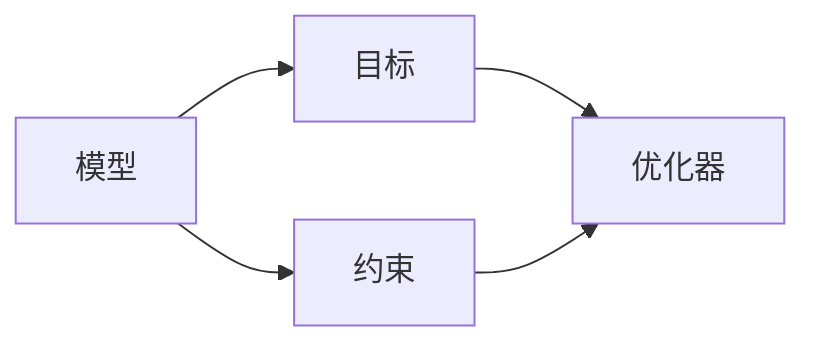
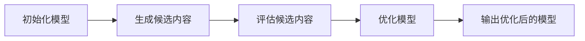
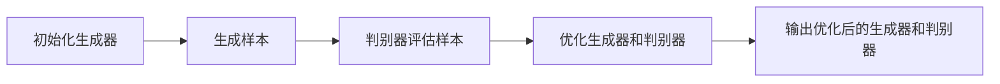
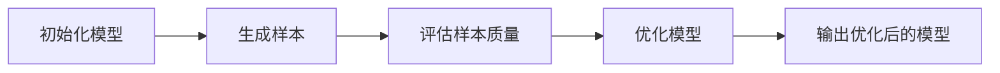
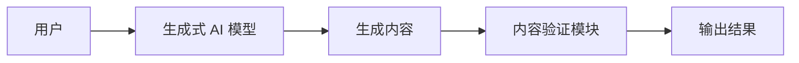
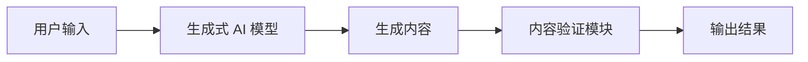

                 


# AI Agent 的可控生成：精确控制 LLM 的输出

> 关键词：生成式 AI、LLM、可控生成、风险控制、AI Agent、模型约束

> 摘要：本文深入探讨了AI Agent 可控生成的关键问题，从生成式 AI 的基本原理到精确控制 LLM 输出的实现方法，结合实际案例分析，系统性地介绍了可控生成的核心概念、算法原理和系统设计。通过详细的数学模型、流程图和代码示例，全面解析了如何在实际应用中实现对生成式 AI 的有效控制，确保生成内容的安全性和可靠性。

---

# 第1章: AI Agent 的背景与问题背景

## 1.1 AI Agent 的基本概念
### 1.1.1 AI Agent 的定义与特点
AI Agent 是一类能够感知环境、自主决策并执行任务的智能体。它通过传感器获取信息，利用算法进行分析和推理，最终做出决策并执行动作。AI Agent 的特点包括：
- **自主性**：无需外部干预，自主完成任务。
- **反应性**：能够实时感知环境变化并做出反应。
- **目标导向**：基于明确的目标进行决策和行动。

### 1.1.2 生成式 AI 的发展现状
生成式 AI，尤其是大语言模型（LLM），近年来取得了显著进展。从 GPT-3 到 ChatGPT，生成式 AI 已经在文本生成、对话系统、内容创作等领域展现出强大的能力。然而，随着生成能力的增强，对生成内容的控制也变得越来越重要。

### 1.1.3 可控生成的核心问题
可控生成是指在生成式 AI 的输出过程中，通过对模型的参数或输入进行干预，使其生成的内容符合特定的目标或约束。核心问题包括：
- 如何设计有效的约束机制。
- 如何确保生成内容的可解释性和一致性。
- 如何平衡生成的多样性和可控性。

## 1.2 可控生成的背景与问题描述
### 1.2.1 生成式 AI 的潜在风险
生成式 AI 的潜在风险主要体现在以下方面：
- **内容偏差**：模型可能生成带有偏见或不准确的信息。
- **滥用风险**：恶意用户可能利用生成式 AI 进行虚假信息传播或欺诈。
- **法律风险**：生成内容可能涉及版权问题或违反法律法规。

### 1.2.2 可控生成的必要性
为了应对上述风险，可控生成技术显得尤为重要。通过精确控制生成式 AI 的输出，可以确保生成内容的安全性和合规性，同时提升用户体验。

### 1.2.3 问题的边界与外延
可控生成的问题边界包括：
- **生成内容的范围**：限定生成内容的主题、语气、风格等。
- **生成过程的干预**：在生成过程中实时调整模型参数或输入。
- **生成结果的验证**：对生成内容进行事后检查和修正。

## 1.3 可控生成的应用场景
### 1.3.1 生成式 AI 的典型应用
- **智能客服**：通过生成式 AI 提供实时对话支持。
- **内容创作**：生成新闻稿、广告文案等。
- **教育辅助**：帮助学生完成作业或提供学习建议。

### 1.3.2 可控生成的实际需求
- **企业级应用**：在企业内部系统中，生成内容需要符合特定的风格和合规要求。
- **用户定制化服务**：根据用户需求生成个性化内容。
- **风险管理**：防止生成内容引发法律或伦理问题。

### 1.3.3 应用中的挑战与解决方案
- **挑战**：生成内容的多样性和可控性之间存在矛盾。
- **解决方案**：通过引入约束机制和事后验证技术，平衡生成内容的多样性和可控性。

## 1.4 本章小结
本章从 AI Agent 的基本概念出发，探讨了生成式 AI 的发展现状和可控生成的核心问题。通过分析生成式 AI 的潜在风险，强调了可控生成的必要性，并结合实际应用场景，提出了实现可控生成的关键挑战和解决方案。

---

# 第2章: 可控生成的核心概念与联系

## 2.1 可控生成的核心原理
### 2.1.1 生成式 AI 的基本原理
生成式 AI 的核心是通过深度学习模型（如Transformer）生成高质量的文本内容。模型通过大量数据训练，学习语言的分布规律，并基于上下文预测下一步可能的字符或词语。

### 2.1.2 可控生成的实现机制
可控生成通过在生成过程中引入约束条件，使模型生成的内容符合特定的目标或风格。常见的实现机制包括：
- **温度参数调整**：通过调整生成过程中的温度参数，控制生成内容的多样性和确定性。
- **惩罚机制**：对生成内容中的敏感词汇或短语进行惩罚，降低其出现的概率。
- **引导词优化**：通过设计引导词（prompt），引导模型生成符合预期的内容。

### 2.1.3 模型、目标与约束的关系
模型的可控生成能力取决于目标函数的设计和约束条件的引入。目标函数决定了生成内容的方向，而约束条件则限定了生成内容的范围。两者的结合使得生成式 AI 的输出既符合预期，又具有多样性。

## 2.2 可控生成的核心要素
### 2.2.1 模型的可控制性
模型的可控制性是指通过调整模型参数或输入条件，使其生成的内容符合特定目标的能力。常见的模型控制方法包括：
- **基于奖励的微调**：通过引入奖励机制，优化模型生成内容的质量。
- **基于对抗训练的约束**：通过引入对抗网络，增强模型对约束条件的敏感性。

### 2.2.2 目标函数的设计
目标函数是生成式 AI 的核心，决定了生成内容的方向和质量。常见的目标函数包括：
- **交叉熵损失**：用于衡量生成内容与真实数据的差异。
- **奖励函数**：用于评估生成内容的质量和相关性。

### 2.2.3 约束条件的实现
约束条件的实现是可控生成的关键。常见的约束条件包括：
- **主题约束**：限定生成内容的主题。
- **语气约束**：限定生成内容的语气（如正式、口语等）。
- **风格约束**：限定生成内容的风格（如文学性、技术性等）。

## 2.3 核心概念的ER实体关系图


## 2.4 本章小结
本章从可控生成的核心原理出发，探讨了模型、目标与约束之间的关系。通过分析可控生成的核心要素，提出了实现可控生成的关键技术，并通过ER实体关系图展示了各要素之间的联系。

---

# 第3章: 可控生成的算法原理

## 3.1 基于奖励的微调算法
### 3.1.1 算法原理
基于奖励的微调算法通过引入奖励机制，优化生成内容的质量。具体步骤如下：
1. **初始化模型**：加载预训练的生成式 AI 模型。
2. **生成候选内容**：模型生成多条候选内容。
3. **评估候选内容**：人工或自动评估生成内容的质量，给出奖励分数。
4. **优化模型**：根据奖励分数，调整模型参数，优化生成内容的质量。

### 3.1.2 算法流程


### 3.1.3 算法的数学模型
基于奖励的微调算法的数学模型如下：
$$ L = \lambda_1 L_{\text{cls}} + \lambda_2 L_{\text{adv}} $$
其中，$L_{\text{cls}}$ 是分类损失，$L_{\text{adv}}$ 是对抗损失，$\lambda_1$ 和 $\lambda_2$ 是调节系数。

## 3.2 对抗训练算法
### 3.2.1 算法原理
对抗训练算法通过引入对抗网络，增强模型对约束条件的敏感性。具体步骤如下：
1. **初始化生成器和判别器**：分别加载生成式 AI 模型和判别器模型。
2. **生成样本**：生成器生成样本内容。
3. **判别器评估样本**：判别器判断样本是否符合约束条件。
4. **优化生成器和判别器**：根据判别器的输出，优化生成器和判别器的参数。

### 3.2.2 算法流程


### 3.2.3 算法的数学模型
对抗训练算法的数学模型如下：
$$ \min_{\theta} \max_{\phi} \mathbb{E}_{x \sim P(x)}[\text{D}(x)] $$$
其中，$\theta$ 是生成器的参数，$\phi$ 是判别器的参数，$\text{D}(x)$ 是判别器的输出。

## 3.3 基于策略梯度的优化算法
### 3.3.1 算法原理
基于策略梯度的优化算法通过引入策略梯度，优化生成内容的质量。具体步骤如下：
1. **初始化模型**：加载预训练的生成式 AI 模型。
2. **生成样本**：模型生成样本内容。
3. **评估样本质量**：根据策略梯度，评估生成内容的质量。
4. **优化模型**：根据策略梯度，调整模型参数，优化生成内容的质量。

### 3.3.2 算法流程


### 3.3.3 算法的数学模型
基于策略梯度的优化算法的数学模型如下：
$$ \nabla_{\theta} \mathbb{E}_{x \sim P_\theta(x)}[\text{R}(x)] $$
其中，$\theta$ 是模型的参数，$\text{R}(x)$ 是奖励函数。

## 3.4 本章小结
本章从算法原理出发，详细介绍了几种常用的可控生成算法，包括基于奖励的微调算法、对抗训练算法和基于策略梯度的优化算法。通过数学模型和算法流程图，展示了各算法的实现步骤和技术细节。

---

# 第4章: 可控生成的系统分析与架构设计

## 4.1 系统分析
### 4.1.1 问题场景介绍
可控生成系统需要在生成式 AI 的基础上，实现对生成内容的精确控制。常见的应用场景包括智能客服、内容创作和教育辅助等。

### 4.1.2 系统功能设计
可控生成系统的功能设计包括：
- **生成内容管理**：生成符合特定目标或约束的内容。
- **内容验证**：对生成内容进行事后检查和验证。
- **用户反馈处理**：根据用户反馈，优化生成内容的质量。

## 4.2 系统架构设计
### 4.2.1 领域模型类图


### 4.2.2 系统架构图


### 4.2.3 系统接口设计
系统接口设计包括：
- **输入接口**：接收用户的输入和约束条件。
- **输出接口**：输出生成内容和验证结果。

### 4.2.4 系统交互序列图


## 4.3 本章小结
本章从系统分析和架构设计的角度，探讨了可控生成系统的实现方案。通过领域模型类图和系统架构图，展示了系统的整体结构和实现步骤。

---

# 第5章: 可控生成的项目实战

## 5.1 环境安装
### 5.1.1 安装 Python 和必要的库
```bash
pip install numpy torch transformers
```

### 5.1.2 安装生成式 AI 模型
```bash
pip install transformers
```

## 5.2 核心代码实现
### 5.2.1 基于奖励的微调算法实现
```python
import torch
import torch.nn as nn
import torch.optim as optim

class Generator(nn.Module):
    def __init__(self, ...):
        super(Generator, self).__init__()
        # 模型定义

    def forward(self, x):
        # 前向传播

class Discriminator(nn.Module):
    def __init__(self, ...):
        super(Discriminator, self).__init__()
        # 模型定义

    def forward(self, x):
        # 前向传播

def train_generator(generator, discriminator, ...):
    # 训练过程
```

### 5.2.2 对抗训练算法实现
```python
def train_generator(generator, discriminator, ...):
    # 生成器训练
def train_discriminator(discriminator, generator, ...):
    # 判别器训练
```

### 5.2.3 基于策略梯度的优化算法实现
```python
def policy_gradient_optimization(model, ...):
    # 策略梯度优化
```

## 5.3 实际案例分析
### 5.3.1 案例背景
- **案例名称**：智能客服对话系统
- **案例目标**：生成符合用户需求的对话内容

### 5.3.2 案例实现
```python
def generate_response(prompt, model, ...):
    # 生成响应
```

### 5.3.3 案例分析
- **生成内容**：生成符合用户需求的对话内容。
- **验证结果**：对生成内容进行验证，确保符合预期。

## 5.4 本章小结
本章通过实际案例，展示了可控生成技术在智能客服对话系统中的应用。通过环境安装和代码实现，详细讲解了如何在实际项目中实现对生成式 AI 的精确控制。

---

# 第6章: 总结与展望

## 6.1 总结
本章对全文进行了总结，回顾了可控生成技术的核心概念、算法原理和系统设计。通过实际案例分析，展示了可控生成技术在实际应用中的重要性和实现方法。

## 6.2 未来展望
随着生成式 AI 技术的不断发展，可控生成技术也将面临新的挑战和机遇。未来的研究方向包括：
- **更复杂的约束条件**：实现对生成内容的多维度控制。
- **更高效的优化算法**：开发更高效的优化算法，提升生成内容的质量和速度。
- **更广泛的应用场景**：探索可控生成技术在更多领域的应用，如医疗、法律等。

## 6.3 最佳实践 tips
- **合理设计约束条件**：根据具体应用场景，合理设计约束条件，确保生成内容的安全性和合规性。
- **结合多种控制方法**：结合多种控制方法，平衡生成内容的多样性和可控性。
- **持续优化模型**：通过持续优化模型参数和算法设计，提升生成内容的质量和效率。

## 6.4 本章小结
本章通过对全文的总结，提出了未来的研究方向和最佳实践 tips，为读者提供了进一步学习和实践的指导。

---

# 结语

本文从 AI Agent 的可控生成技术出发，系统性地探讨了生成式 AI 的核心概念、算法原理和系统设计。通过实际案例分析，展示了可控生成技术在实际应用中的重要性和实现方法。未来，随着生成式 AI 技术的不断发展，可控生成技术也将面临新的挑战和机遇，需要我们不断探索和创新。

