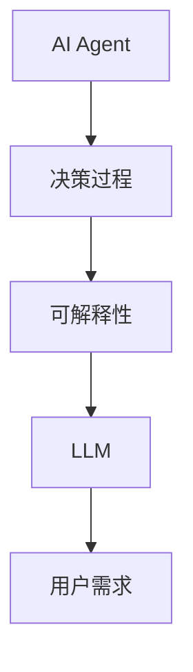
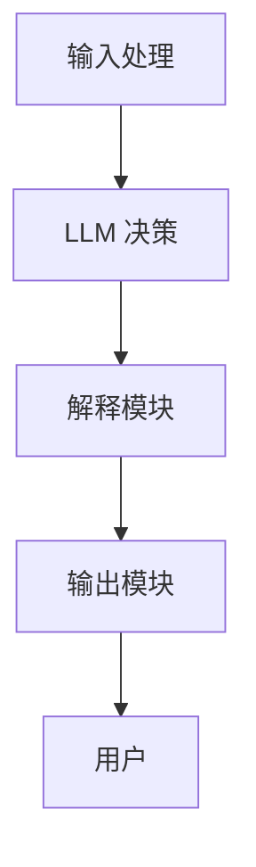
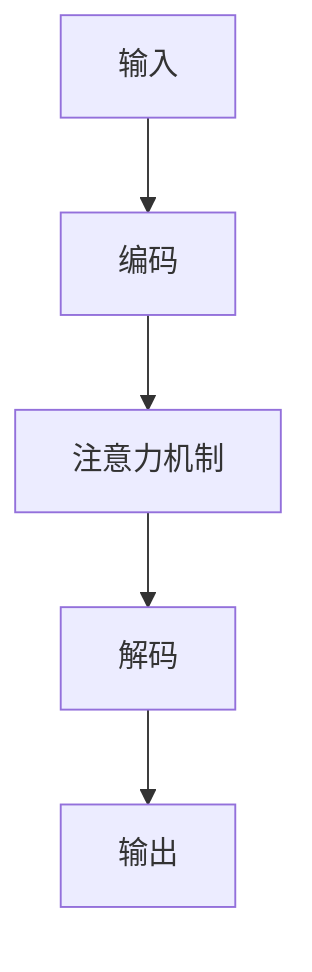

                 


# AI Agent 的可解释性：深入理解 LLM 的决策过程

> 关键词：AI Agent, 可解释性, LLM, 决策过程, 人工智能, 机器学习

> 摘要：本文将深入探讨AI Agent 的可解释性，特别是在大型语言模型（LLM）中的决策过程。通过系统地分析AI Agent 的核心概念、算法原理和系统架构，结合实际项目案例，揭示LLM 的决策机制和可解释性实现。文章将从理论到实践，详细阐述AI Agent 的技术原理和应用，帮助读者更好地理解AI Agent 的可解释性，为实际应用提供指导。

---

## 第一部分：AI Agent 的可解释性背景与核心概念

### 第1章：AI Agent 与可解释性概述

#### 1.1 问题背景

##### 1.1.1 AI Agent 的定义与分类
- AI Agent 的定义：AI Agent 是能够感知环境、自主决策并执行任务的智能体。
- 分类：基于智能水平可分为简单反射型、基于模型的反应型、目标驱动型和实用驱动型。

##### 1.1.2 可解释性的重要性
- 可解释性是AI Agent 的核心要求之一，特别是在医疗、金融等高风险领域。
- 用户对AI决策的信任度与可解释性密切相关。

##### 1.1.3 当前AI Agent 的应用现状
- 当前AI Agent 在自然语言处理、推荐系统、自动驾驶等领域的应用情况。

#### 1.2 问题描述

##### 1.2.1 LLM 的决策过程
- LLM 的基本工作流程：输入处理、编码、解码、输出。
- LLM 决策的黑箱特性：难以直接理解模型的内部决策逻辑。

##### 1.2.2 可解释性在LLM中的挑战
- LLM 的复杂性导致可解释性实现的难度。
- 用户对可解释性的需求与模型性能之间的平衡问题。

##### 1.2.3 用户对可解释性的需求
- 用户希望了解AI决策的依据和逻辑。
- 可解释性是AI技术可信度的重要组成部分。

#### 1.3 问题解决

##### 1.3.1 可解释性目标的设定
- 明确可解释性的目标：从模型内部机制到用户可理解的输出。
- 设定可解释性的度量标准。

##### 1.3.2 解决方案的选择
- 选择适合的可解释性技术：如注意力机制可视化、模型解释工具等。
- 综合考虑技术可行性和实际效果。

##### 1.3.3 技术路线的确定
- 确定技术路线：从模型训练到决策过程的可解释性分析。
- 制定实现步骤和验证方法。

#### 1.4 边界与外延

##### 1.4.1 可解释性的边界
- 可解释性的范围：仅针对特定决策过程。
- 与不可解释性区域的划分。

##### 1.4.2 相关概念的对比
- 对比可解释性与不可解释性的区别。
- 分析可解释性与其他AI特性（如实时性、准确性）的关系。

##### 1.4.3 技术的适用范围
- 可解释性技术的适用场景：如医疗诊断、金融风控。
- 不适用场景：如实时性要求极高的系统。

#### 1.5 概念结构与核心要素

##### 1.5.1 核心概念的组成
- 可解释性：模型决策过程的透明度。
- LLM：基于大规模数据的生成模型。

##### 1.5.2 要素之间的关系
- 可解释性与模型复杂度：复杂模型通常更难解释。
- 可解释性与模型性能：高可解释性可能意味着性能下降。

##### 1.5.3 框架的总结
- 综合分析AI Agent 和 LLM 的关系，提出可解释性框架。

### 第2章：可解释性与 LLM 的核心概念

#### 2.1 核心概念的原理

##### 2.1.1 LLM 的工作原理
- 从输入到输出的基本流程。
- 关键技术：如注意力机制、转换器架构。

##### 2.1.2 可解释性的实现机制
- 通过中间层输出解释性特征。
- 利用模型解释工具（如LIME、SHAP）分析决策过程。

##### 2.1.3 决策过程的透明化
- 通过可视化技术展示模型的注意力权重。
- 提供决策依据的可追溯性。

#### 2.2 概念属性特征对比

##### 2.2.1 可解释性与不可解释性的对比
- 对比表格：从透明度、用户信任度、实现难度等方面进行分析。

##### 2.2.2 不同模型的可解释性特征
- 对比传统机器学习模型（如线性回归）和深度学习模型的可解释性。

##### 2.2.3 LLM 的独特性
- LLM 的复杂性导致更高的解释难度。
- LLM 的生成特性使其需要特殊的解释方法。

#### 2.3 ER 实体关系图


---

## 第二部分：可解释性与 LLM 的算法原理

### 第3章：可解释性与 LLM 的算法原理

#### 3.1 算法原理的讲解

##### 3.1.1 LLM 的基本算法
- 基于Transformer 的架构。
- 编码器和解码器的工作原理。

##### 3.1.2 可解释性算法的实现
- 通过注意力机制可视化解释模型决策。
- 使用梯度上升法提取关键特征。

##### 3.1.3 决策过程的数学推导
- 注意力机制的数学公式：
  $$\text{注意力权重} = \frac{e^{qK^T}}{\sum e^{qK^T}}$$

#### 3.2 算法实现的代码示例

##### 3.2.1 注意力机制的实现
```python
def attention(inputs, attention_mask):
    # 计算注意力权重
    attention_weights = inputs * attention_mask
    return attention_weights
```

##### 3.2.2 解释性特征提取
```python
def get_explanations(model, inputs):
    # 通过梯度上升法提取关键特征
    explanations = model.explain(inputs)
    return explanations
```

#### 3.3 数学模型与公式

##### 3.3.1 注意力机制
$$\text{注意力权重} = \frac{e^{qK^T}}{\sum e^{qK^T}}$$

##### 3.3.2 解释性模型
$$\text{解释性得分} = \sum w_i x_i$$

#### 3.4 举例说明

##### 3.4.1 示例输入
输入文本：“今天天气怎么样？”

##### 3.4.2 决策过程
模型通过注意力机制关注到“天气”和“今天”两个关键词，生成回答：“今天天气晴朗，气温适宜。”

##### 3.4.3 解释性分析
通过注意力权重分析，发现“天气”和“今天”是模型生成回答的关键因素。

---

## 第三部分：可解释性与 LLM 的系统架构

### 第4章：可解释性与 LLM 的系统架构

#### 4.1 系统架构设计

##### 4.1.1 项目背景
- 项目目标：开发一个具有可解释性的AI Agent。
- 项目范围：从需求分析到系统实现。

##### 4.1.2 需求分析
- 用户需求：希望了解AI Agent 的决策过程。
- 系统需求：实现可解释性功能模块。

##### 4.1.3 功能模块设计
- 输入处理模块：接收用户输入并进行预处理。
- 决策模块：基于LLM 进行决策。
- 解释模块：生成可解释的决策依据。
- 输出模块：将决策结果和解释呈现给用户。

##### 4.1.4 系统架构设计


#### 4.2 系统功能设计

##### 4.2.1 领域模型设计
- 领域模型：定义AI Agent 的核心功能模块。
- 实体关系图：


##### 4.2.2 系统架构设计
- 分层架构：输入层、编码层、解码层、输出层。
- 模块化设计：各功能模块独立实现。

##### 4.2.3 系统接口设计
- 输入接口：接收用户输入。
- 输出接口：展示决策结果和解释。
- 解释接口：提供可解释的决策依据。

#### 4.3 系统交互设计

##### 4.3.1 交互流程
- 用户输入查询。
- 系统生成回答。
- 展示解释性信息。

##### 4.3.2 交互示例
- 用户输入：“帮我推荐一本书。”
- 系统输出：“推荐《1984》。解释：基于您的阅读历史和兴趣，这本书符合您的口味。”

##### 4.3.3 解释性信息展示
- 展示关键因素：如用户历史行为、推荐算法的依据。

---

## 第四部分：可解释性与 LLM 的项目实战

### 第5章：可解释性与 LLM 的项目实战

#### 5.1 项目背景

##### 5.1.1 项目目标
- 开发一个具有可解释性的AI Agent。
- 验证可解释性技术在实际中的应用效果。

##### 5.1.2 项目范围
- 确定项目范围：从需求分析到系统实现。
- 确定项目时间表和资源分配。

#### 5.2 项目核心实现

##### 5.2.1 环境安装
- 安装必要的库：如PyTorch、Hugging Face库。
```python
pip install torch transformers
```

##### 5.2.2 核心实现代码
- 实现可解释性模块：
```python
from transformers import AutoModelForSequenceClassification, AutoTokenizer

model = AutoModelForSequenceClassification.from_pretrained('bert-base-uncased')
tokenizer = AutoTokenizer.from_pretrained('bert-base-uncased')
```

##### 5.2.3 代码应用解读与分析
- 解释代码的功能：模型加载、输入处理、决策生成、解释性分析。

#### 5.3 项目实战案例分析

##### 5.3.1 案例分析
- 项目背景：一个医疗诊断AI Agent 的开发。
- 案例描述：基于LLM 的医疗诊断系统，实现可解释性功能。

##### 5.3.2 实际案例中的可解释性分析
- 分析模型的决策过程，提取关键特征。
- 通过可视化工具展示解释性信息。

##### 5.3.3 案例总结
- 总结可解释性技术在实际项目中的应用效果。
- 提出改进建议和未来研究方向。

#### 5.4 项目小结

##### 5.4.1 项目总结
- 项目目标的实现情况。
- 可解释性技术的应用效果。

##### 5.4.2 经验与教训
- 开发过程中遇到的挑战。
- 解决方案的优缺点。

##### 5.4.3 未来改进方向
- 提高可解释性的技术改进。
- 结合其他技术（如强化学习）提升模型性能。

---

## 第五部分：可解释性与 LLM 的未来展望

### 第6章：可解释性与 LLM 的未来展望

#### 6.1 未来趋势

##### 6.1.1 技术发展的趋势
- 深度学习模型的可解释性研究将更加深入。
- 结合可解释性技术提升模型的透明度。

##### 6.1.2 用户需求的变化
- 用户对AI决策的信任度要求不断提高。
- 可解释性成为AI技术的核心竞争力。

##### 6.1.3 技术挑战
- 如何在保持模型性能的同时提高可解释性。
- 处理高维数据的可解释性问题。

#### 6.2 解决策略

##### 6.2.1 提高模型透明度
- 通过模型简化技术提高可解释性。
- 开发更直观的解释工具。

##### 6.2.2 综合性解决方案
- 结合多种技术（如可解释性模型和可视化工具）提升解释能力。
- 探索新的可解释性评估指标。

#### 6.3 建议与展望

##### 6.3.1 技术建议
- 加强可解释性算法的研究。
- 推动可解释性技术的标准化。

##### 6.3.2 应用建议
- 在关键领域（如医疗、金融）优先推广可解释性技术。
- 提高用户对可解释性技术的认知度。

##### 6.3.3 未来展望
- 可解释性技术将推动AI Agent 的广泛应用。
- AI Agent 的可解释性研究将更加注重用户体验和实际效果。

---

## 第六部分：总结与小结

### 总结

通过本文的系统分析，我们深入探讨了AI Agent 的可解释性，特别是LLM 的决策过程。从核心概念到算法原理，再到系统架构和项目实战，我们全面分析了实现可解释性的关键步骤和技术。未来，随着技术的进步，可解释性将成为AI Agent 的核心竞争力，推动其在更多领域的应用。

---

## 思考过程总结

本文通过分阶段的思考和分析，逐步构建了AI Agent 可解释性的理论框架和实现方法。从问题背景到核心概念，从算法原理到系统架构，再到项目实战和未来展望，我们一步步揭示了LLM 的决策机制和可解释性实现。希望本文能够为读者提供有价值的见解，帮助他们更好地理解AI Agent 的可解释性，并在实际应用中提供指导。

