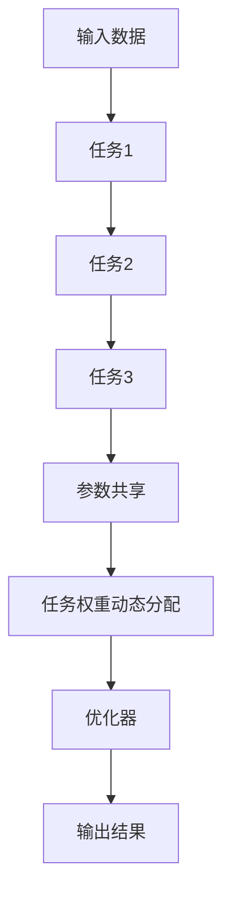
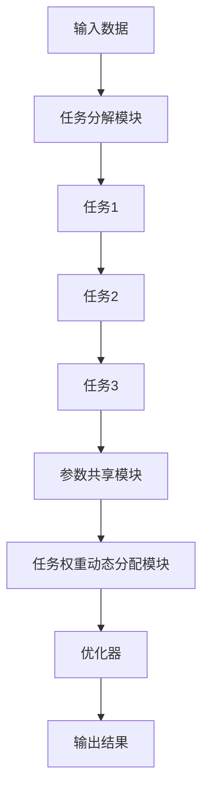

                 


# AI Agent 的多任务学习：增强 LLM 的泛化能力

> 关键词：AI Agent, 多任务学习, 大语言模型, 泛化能力, 参数共享, 联合学习, 任务分解

> 摘要：本文深入探讨了AI Agent在多任务学习中的应用，分析了多任务学习如何增强大语言模型（LLM）的泛化能力。通过详细讲解多任务学习的核心概念、算法原理、系统架构以及实际案例，本文为读者提供了从理论到实践的全面指导。

---

# 第一部分: AI Agent 的多任务学习基础

## 第1章: AI Agent 的基本概念

### 1.1 AI Agent 的定义与特点

AI Agent（人工智能代理）是指能够感知环境并采取行动以实现目标的智能体。它具备以下特点：

- **自主性**：能够在没有外部干预的情况下自主决策。
- **反应性**：能够实时感知环境并做出反应。
- **目标导向性**：所有行为都以实现特定目标为导向。
- **学习能力**：通过与环境的交互不断学习和优化自身行为。

AI Agent与传统AI的区别在于，传统AI通常专注于单一任务，而AI Agent能够处理多种任务，并在动态环境中灵活调整策略。

### 1.2 多任务学习的定义与特点

多任务学习（Multi-Task Learning, MTL）是一种机器学习方法，旨在通过同时学习多个任务来提高模型的泛化能力。其特点包括：

- **共享参数**：多个任务共享模型参数，减少参数数量并提高学习效率。
- **任务互补性**：不同任务之间存在一定的关联性，通过联合学习可以提升整体性能。
- **动态权重分配**：根据任务的重要性动态调整权重，以优化整体性能。

### 1.3 AI Agent 与多任务学习的关系

AI Agent可以通过多任务学习来提升其处理多种任务的能力。具体表现为：

- **任务分解方法**：将复杂任务分解为多个子任务，每个子任务由AI Agent的不同模块负责。
- **联合学习**：通过多任务学习，AI Agent能够同时优化多个任务的性能，从而提高整体任务完成效率。
- **参数共享机制**：多个任务之间共享参数，减少模型复杂度，同时提高泛化能力。

---

## 第2章: 大语言模型（LLM）的泛化能力

### 2.1 大语言模型的定义与特点

大语言模型（Large Language Model, LLM）是指基于大规模数据训练的深度学习模型，如GPT系列。其特点包括：

- **大规模参数**：通常拥有 billions级别的参数，能够捕捉复杂的语言模式。
- **预训练与微调**：通过大量未标注数据预训练，然后在特定任务上进行微调。
- **通用性**：能够处理多种语言任务，如翻译、问答、文本生成等。

### 2.2 LLM 的泛化能力

泛化能力是指模型在未见数据上的表现能力。LLM由于其庞大的参数规模和复杂架构，具备较强的泛化能力。然而，LLM在处理特定领域任务时仍存在以下挑战：

- **领域适应性**：LLM在特定领域任务上可能不够精细，需要通过微调或提示工程技术进行优化。
- **任务多样性**：LLM需要处理多种任务，如何平衡不同任务的性能是一个难题。

### 2.3 多任务学习对 LLM 泛化能力的提升

通过多任务学习，LLM可以在训练阶段同时学习多种任务，从而提升其泛化能力。具体表现为：

- **参数共享**：多个任务共享模型参数，减少模型复杂度，同时提高对多种任务的适应能力。
- **任务权重动态分配**：根据任务的重要性动态调整权重，优化整体性能。
- **联合学习**：通过同时优化多个任务，模型能够更好地捕捉跨任务的特征，从而提升泛化能力。

---

## 第3章: 多任务学习的核心概念与原理

### 3.1 多任务学习的核心概念

多任务学习的核心概念包括任务分解方法、任务关系以及参数共享机制。任务分解方法可以通过以下方式实现：

| 任务分解方法 | 描述 | 优点 | 缺点 |
|--------------|------|------|------|
| 并行分解     | 同时处理多个任务 | 提高效率 | 可能导致任务间竞争 |
| 串行分解     | 依次处理多个任务 | 任务间依赖性低 | 效率较低 |

### 3.2 多任务学习的原理

多任务学习的原理主要包括参数共享和任务权重动态分配。以下是多任务学习的流程图：



### 3.3 多任务学习的数学模型

多任务学习的目标函数可以表示为：

$$ L = \sum_{i=1}^{n} \lambda_i L_i $$

其中，$\lambda_i$ 是任务 $i$ 的权重，$L_i$ 是任务 $i$ 的损失函数。优化目标是通过调整参数 $\theta$ 最小化 $L$。

### 3.4 多任务学习的优化算法

多任务学习的优化算法主要包括基于梯度的优化方法和基于参数共享的优化方法。以下是一个简单的多任务学习优化流程：

1. **输入数据**：从多个任务中获取输入数据。
2. **计算损失**：分别计算每个任务的损失。
3. **计算总损失**：将所有任务的损失加权求和。
4. **反向传播**：计算梯度并更新模型参数。
5. **更新权重**：根据任务权重动态调整优化方向。

---

## 第4章: AI Agent 的多任务学习

### 4.1 多任务学习在AI Agent中的应用

AI Agent可以通过多任务学习来提升其处理多种任务的能力。以下是一个多任务学习的AI Agent系统架构图：



### 4.2 多任务学习的系统架构设计

多任务学习的系统架构设计包括以下几个部分：

1. **任务分解模块**：将复杂任务分解为多个子任务。
2. **参数共享模块**：实现多个任务之间的参数共享。
3. **任务权重动态分配模块**：根据任务的重要性动态调整权重。
4. **优化器**：通过反向传播优化模型参数。

### 4.3 多任务学习的项目实战

以下是一个多任务学习的Python代码示例：

```python
import torch
import torch.nn as nn

# 定义多任务学习模型
class MultiTaskModel(nn.Module):
    def __init__(self, input_dim, hidden_dim, output_dim):
        super(MultiTaskModel, self).__init__()
        self.shared = nn.Linear(input_dim, hidden_dim)
        self.task1_layer = nn.Linear(hidden_dim, output_dim)
        self.task2_layer = nn.Linear(hidden_dim, output_dim)

    def forward(self, x):
        x = torch.relu(self.shared(x))
        output1 = torch.relu(self.task1_layer(x))
        output2 = torch.relu(self.task2_layer(x))
        return output1, output2

# 定义损失函数和优化器
criterion = nn.MSELoss()
optimizer = torch.optim.Adam(model.parameters(), lr=0.001)

# 训练过程
for epoch in range(num_epochs):
    for inputs, (labels1, labels2) in dataloaders:
        # 前向传播
        outputs1, outputs2 = model(inputs)
        # 计算损失
        loss1 = criterion(outputs1, labels1)
        loss2 = criterion(outputs2, labels2)
        total_loss = loss1 + loss2
        # 反向传播和优化
        optimizer.zero_grad()
        total_loss.backward()
        optimizer.step()
```

---

## 第5章: 总结与展望

### 5.1 总结

本文详细探讨了AI Agent的多任务学习，分析了多任务学习如何增强大语言模型的泛化能力。通过理论分析和实际案例，展示了多任务学习在AI Agent中的应用价值。

### 5.2 未来展望

未来的研究方向包括：

1. **更高效的参数共享方法**：探索更高效的参数共享策略，进一步提升模型性能。
2. **动态任务权重分配**：研究如何根据任务的重要性动态调整权重，优化整体性能。
3. **跨模态多任务学习**：探索多模态数据的多任务学习，进一步提升AI Agent的综合能力。

### 5.3 最佳实践 Tips

- 在实际应用中，建议根据具体任务需求选择合适的多任务学习方法。
- 注意任务之间的关联性，避免任务间竞争影响模型性能。
- 定期监控和调整任务权重，以保持模型的平衡性能。

---

通过本文的详细讲解，读者可以全面理解AI Agent的多任务学习及其在增强LLM泛化能力中的重要作用。

