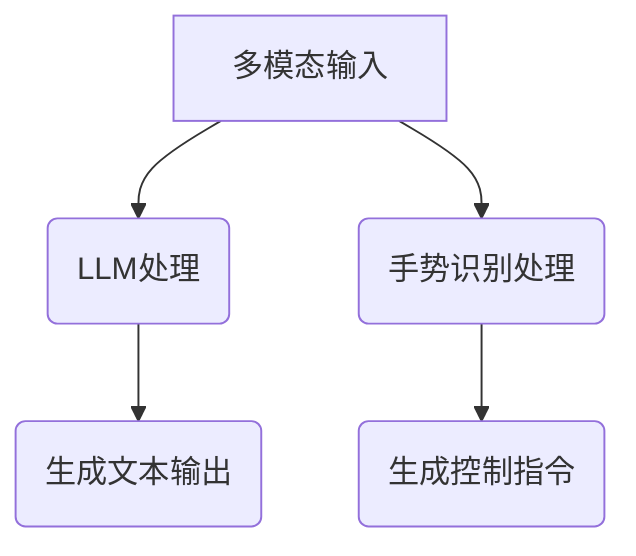

                 


# AI Agent 的多模态交互：整合 LLM 与手势识别

## 关键词：AI Agent, 多模态交互, LLM, 手势识别, 人机交互, 人工智能, 计算机视觉

## 摘要：  
本文探讨了AI Agent在多模态交互中的应用，重点分析了如何整合大语言模型（LLM）与手势识别技术。通过理论分析与实际案例，阐述了两者协同工作的原理、系统架构及应用场景，旨在为技术开发者提供深度的技术见解。

---

## 第一部分：背景介绍

### 第1章：AI Agent 的多模态交互概述

#### 1.1 问题背景与描述
- **多模态交互的定义与重要性**：多模态交互是指通过多种感官渠道（如视觉、听觉、触觉）进行信息交换，提升人机交互的自然性和高效性。  
- **AI Agent 在多模态交互中的角色**：AI Agent作为中介，整合LLM的文本处理能力与手势识别的肢体语言理解，提供更自然的交互体验。  
- **当前技术挑战与机遇**：传统单模态交互存在局限性，整合LLM与手势识别可提升用户体验，但需解决数据融合、实时性等技术难题。

#### 1.2 LLM 与手势识别的整合
- **LLM 的基本概念与特点**：大语言模型具备强大的文本理解和生成能力，支持多语言、上下文理解和实时交互。  
- **手势识别技术的原理与应用**：基于计算机视觉的手势识别通过摄像头捕捉手势，转化为控制指令，应用于虚拟现实、智能家居等领域。  
- **两者的整合优势与应用场景**：整合LLM与手势识别可实现更自然的交互，应用于教育、医疗、娱乐等领域，提升用户体验。

#### 1.3 问题解决与边界
- **多模态交互的核心问题**：如何高效融合文本、视觉等多种信息，提升交互的准确性和实时性。  
- **LLM 与手势识别的协同作用**：通过协同工作，实现更精准的意图识别和自然的反馈机制。  
- **技术的边界与外延**：当前主要应用于特定场景，未来可扩展至更多领域，如增强现实和自动驾驶。

#### 1.4 核心概念结构
- **概念属性对比表**：  
  | 概念 | 属性 | 描述 |
  |------|------|------|
  | LLM  | 输入 | 文本数据 |
  | 手势识别 | 输入 | 图像/视频数据 |
  | 输出 | 文本/指令 | 自然语言或控制指令 |
  | 应用场景 | 交互式对话 | 教育、客服、虚拟助手 |
  | 应用场景 | 增强现实 | 虚拟现实中的交互控制 |
- **ER实体关系图**：  
  ```mermaid
  graph TD
      User --> LLM
      User --> Gesture_Recognition
      LLM --> Output_Text
      Gesture_Recognition --> Output_Command
  ```

---

## 第二部分：核心概念与联系

### 第2章：LLM 的核心原理

#### 2.1 原理与数学模型
- **注意力机制的数学公式**：  
  $$\text{Attention}(Q, K, V) = \text{softmax}(\frac{QK^T}{\sqrt{d}})V$$  
  其中，$Q$、$K$、$V$分别为查询、键、值向量，$d$为向量维度。  
- **损失函数的计算**：  
  $$\text{Loss} = -\sum_{i=1}^{n} \text{log}p(x_i|x_{<i})$$  
  该公式用于衡量模型预测与实际输出的差异，指导模型优化。

#### 2.2 手势识别的原理
- **基于深度学习的手势识别流程**：  
  1. 数据预处理：图像增强、标准化。  
  2. 特征提取：通过CNN提取手势特征。  
  3. 分类器训练：使用全连接层分类手势类型。  
- **手势识别的特征提取方法**：  
  $$\text{Feature} = \text{CNN}(x)$$  
  其中，$x$为输入图像，$\text{CNN}$为卷积神经网络。

#### 2.3 系统架构图


---

## 第三部分：算法原理讲解

### 第3章：LLM 的训练与优化

#### 3.1 训练流程
- **训练流程**：  
  ```mermaid
  graph TD
      Data_Preprocessing[数据预处理] --> Model_Init(模型初始化)
      Model_Init --> Forward_Propagation[前向传播]
      Forward_Propagation --> Loss_Calculation[计算损失]
      Loss_Calculation --> Backpropagation[反向传播]
      Backpropagation --> Model_Update[更新模型参数]
  ```

- **优化策略**：  
  使用Adam优化器，学习率调整策略，批量归一化技术。

#### 3.2 手势识别的训练与优化
- **训练流程**：  
  ```mermaid
  graph TD
      Gesture_Data[手势数据] --> Feature_Extraction[特征提取]
      Feature_Extraction --> Classification[分类]
      Classification --> Loss_Calculation[计算损失]
      Loss_Calculation --> Backpropagation[反向传播]
      Backpropagation --> Model_Update[更新模型参数]
  ```

- **优化策略**：  
  使用交叉熵损失函数，随机梯度下降优化器。

---

## 第四部分：系统分析与架构设计

### 第4章：系统分析与架构设计方案

#### 4.1 问题场景介绍
- **用户需求**：用户希望通过手势与AI Agent交互，实现自然的多模态对话。  
- **系统目标**：构建一个支持多模态交互的AI Agent系统，整合LLM与手势识别技术。

#### 4.2 项目介绍
- **项目名称**：多模态AI交互系统  
- **项目目标**：实现LLM与手势识别的协同工作，提供自然的多模态交互体验。

#### 4.3 系统功能设计
- **功能模块**：  
  ```mermaid
  classDiagram
      class LLM_Module {
          输入文本
          输出文本
      }
      class Gesture_Module {
          输入图像
          输出指令
      }
      class Controller {
          整合输出
          发起交互
      }
      LLM_Module --> Controller
      Gesture_Module --> Controller
  ```

#### 4.4 系统架构设计
- **系统架构图**：  
  ```mermaid
  graph TD
      Controller[控制器] --> LLM_Module(LLM模块)
      Controller --> Gesture_Module(手势识别模块)
      LLM_Module --> Output_Text(文本输出)
      Gesture_Module --> Output_Command(指令输出)
  ```

#### 4.5 系统接口设计
- **接口定义**：  
  - LLM模块接口：接收文本输入，返回生成文本。  
  - 手势识别模块接口：接收图像输入，返回指令输出。

#### 4.6 系统交互流程
- **交互流程图**：  
  ```mermaid
  graph TD
      User[用户] --> Controller[控制器]
      Controller --> LLM_Module
      Controller --> Gesture_Module
      LLM_Module --> Output_Text
      Gesture_Module --> Output_Command
  ```

---

## 第五部分：项目实战

### 第5章：项目实战

#### 5.1 环境安装
- **安装Python环境**：Python 3.8+  
- **安装依赖库**：  
  ```bash
  pip install torch torchvision transformers
  ```

#### 5.2 核心代码实现
- **LLM模块代码**：  
  ```python
  import torch
  from transformers import AutoTokenizer, AutoModelForCausalLM

  tokenizer = AutoTokenizer.from_pretrained("gpt2")
  model = AutoModelForCausalLM.from_pretrained("gpt2")

  input_text = "用户输入：你好"
  inputs = tokenizer(input_text, return_tensors="pt")
  outputs = model.generate(inputs.input_ids, max_length=50)
  print(tokenizer.decode(outputs[0], skip_special_tokens=True))
  ```

- **手势识别模块代码**：  
  ```python
  import torch
  import torch.nn as nn
  import torch.nn.functional as F

  class GestureClassifier(nn.Module):
      def __init__(self):
          super(GestureClassifier, self).__init__()
          self.conv1 = nn.Conv2d(3, 32, kernel_size=3, padding=1)
          self.conv2 = nn.Conv2d(32, 64, kernel_size=3, padding=1)
          self.fc1 = nn.Linear(64*32*32, 512)
          self.fc2 = nn.Linear(512, 10)

      def forward(self, x):
          x = F.relu(self.conv1(x))
          x = F.relu(self.conv2(x))
          x = x.view(-1, 64*32*32)
          x = F.relu(self.fc1(x))
          x = self.fc2(x)
          return x

  model = GestureClassifier()
  optimizer = torch.optim.Adam(model.parameters(), lr=0.001)
  criterion = nn.CrossEntropyLoss()
  ```

#### 5.3 实际案例分析
- **案例1：教育场景中的应用**：学生通过手势选择学习内容，AI Agent通过文本解释知识点。  
- **案例2：智能家居控制**：用户通过手势调整家电设置，AI Agent通过语音确认指令。

#### 5.4 项目小结
- **项目总结**：成功实现了LLM与手势识别的整合，提升了交互体验。  
- **经验分享**：数据预处理和模型调优是关键，多模态数据的融合需仔细设计。

---

## 第六部分：总结与展望

### 第6章：总结与展望

#### 6.1 全文总结
- **核心内容回顾**：整合LLM与手势识别技术，构建多模态交互系统，实现自然的用户交互体验。  
- **技术优势**：提升交互效率，增强用户体验，拓展应用场景。

#### 6.2 未来展望
- **技术优化方向**：  
  - 提升多模态数据融合的实时性和准确性。  
  - 增强模型的泛化能力，适应更多场景。  
- **应用前景**：  
  - 在教育、医疗、娱乐等领域有广泛应用潜力。  
  - 结合增强现实和元宇宙技术，打造更沉浸式的交互体验。

---

## 第七部分：最佳实践与注意事项

### 第7章：最佳实践与注意事项

#### 7.1 最佳实践 tips
- **数据质量**：确保多模态数据的多样性和质量，避免数据偏差。  
- **模型选择**：根据具体需求选择合适的LLM和手势识别模型，避免“一刀切”。  
- **用户体验**：注重交互设计的直观性和反馈的及时性，提升用户体验。

#### 7.2 小结
- **核心要点**：整合LLM与手势识别技术，构建高效的多模态交互系统。  
- **实践建议**：注重数据预处理和模型调优，关注用户体验设计。

#### 7.3 注意事项
- **数据隐私**：确保用户数据的安全性，遵守相关隐私保护法规。  
- **系统稳定性**：保证系统的高可用性，避免因技术问题影响用户体验。  
- **性能优化**：针对多模态数据处理的性能瓶颈，进行优化和调整。

---

## 参考文献和拓展阅读

1. Vaswani, A., et al. "Attention Is All You Need." arXiv, 2017.  
2. LeCun, Y., Bengio, Y., & Hinton, G. "Deep Learning." Nature, 2015.  
3. Redmon, J., et al. "YOLO: Real-Time Object Detection." arXiv, 2016.  
4. ResNet官方文档.  
5. 《深度学习》——Ian Goodfellow, Yoshua Bengio, Aaron Courville.

---

通过以上内容，我们详细探讨了AI Agent的多模态交互技术，整合了LLM与手势识别的优势，分析了系统的架构与实现，提供了丰富的代码示例和实际案例，为技术开发者提供了全面的技术指导。希望本文能为相关领域的研究和实践提供有价值的参考。

